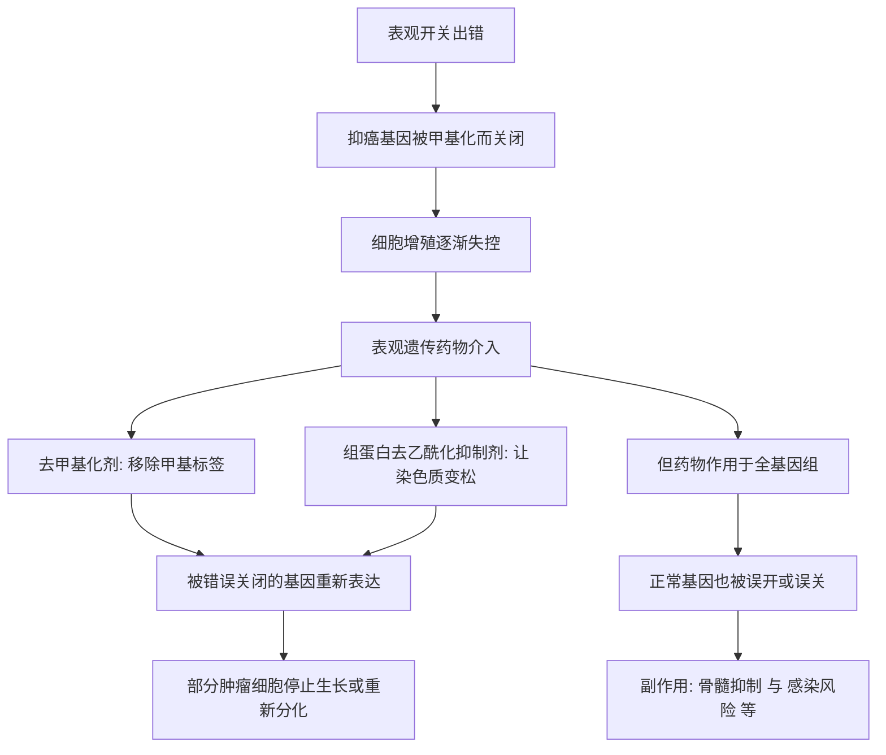

# 15｜表观遗传药物能治病吗？

> 既然基因开关会出错，我们能不能用药物把它调回来？

---

## 一、先说结论

凯里认为，表观遗传药物是一条真实存在、但远未成熟的路。它证明了“把出错的开关调回来”这件事在临床上可以做，但也暴露了最大的难题：**表观机制是全局性的，而药物很难只改你想改的那一处。**

研究表明，目前真正被批准用于临床的表观遗传药物，集中在少数几种血液系统的恶性肿瘤上，作用机制是抑制 DNA 甲基化，或抑制组蛋白去乙酰化，从而让被错误关闭的基因重新开启。它们能带来疗效，但副作用明显、选择性差，并不是可以广泛使用的“基因开关遥控器”。

所以答案是：能治一部分病，但代价不小，离“能治百病”还很远。

---

## 二、我们先理解一个问题

先接住前面留下的一条线索。

癌症并不只是“基因突变”的结果，它常常也是“开关出错”的结果：本该沉默的促癌基因被错误打开，本该工作的抑癌基因被异常甲基化而关闭。既然一部分错误是“关得太紧”造成的，那么一个很自然的想法就出现了——能不能找到一种药，专门去“松开”这些被错误关上的基因？

顺着这个想法追下去，会冒出两个必须回答的问题。第一，这种“松开”是可能的吗？第二，如果可能，我们能不能只松开出错的那一处，而不把整个基因组都搅乱？

这两个问题，正是这一篇要处理的核心。

---

## 三、作者到底提出了什么观点？

凯里认为，表观遗传药物是“表观机制可被干预”的临床证明。她的关注点大致有三层：

1. 既然癌症等疾病部分源于表观开关出错，那么针对开关本身就可能成为治疗策略，而不必只盯着基因突变；
2. 去甲基化剂与组蛋白去乙酰化抑制剂，正是顺着这条思路开发出来的；
3. 但这类药同时揭示了一个根本困难：表观修饰遍及全基因组，药物很难做到“精准”。

所以她的核心判断是：**表观药物证明方向可行，但“可干预”与“可精准干预”之间，隔着一条尚未跨越的鸿沟。**

---

## 四、把这个观点翻译成人话

把基因组想象成一座巨大的配电房，里面有成千上万个开关，各自管着一盏灯。疾病发生，常常是因为某个该亮的灯被误关了。

表观遗传药物不是“修某一个开关”的螺丝刀，它更像一只在整排开关上扫过去的手：它确实可能把那个该亮的灯重新点亮，但同时也会点亮许多本不该亮的灯，甚至把一些该亮的灯关掉。

这就解释了两件事：为什么它有效——因为它能唤醒被错误关闭的基因；又为什么它副作用大——因为它并不挑地方，整个配电房的电压都被它拨动了。

---

## 五、为什么会这样？

关键在 D 这个节点。

药物的设计初衷是“松开被锁死的基因”，但它的作用范围并不局限于病灶。甲基化与去乙酰化是全基因组通用的机制，任何一个细胞、任何一段染色质都可能被它波及。于是，疗效与副作用几乎是同一枚硬币的两面：**正因为它改的是“通用开关”，才既能治病，又难以精准。**

---

## 六、举一个现实生活中的例子

看这类药真正的临床用途。

研究表明，阿扎胞苷、地西他滨等去甲基化药物，被用于骨髓增生异常综合征以及某些急性髓系白血病；伏立诺他、罗米地辛等组蛋白去乙酰化抑制剂，则被用于皮肤 T 细胞淋巴瘤。这些是它们目前最确切的适应症范围。

它们的工作方式，和传统化疗不太一样。传统化疗更像“见到分裂快的细胞就打”，而表观药物试图做的是把被异常甲基化沉默的基因重新唤醒，让癌细胞“想起”自己本该分化、本该停止增殖。对一部分患者，这种思路确实能改善血象、延长生存，甚至带来缓解。

但代价也很直接。由于药物作用于全身，它常带来骨髓抑制、感染风险上升、疲乏以及其他脏器相关的不良反应；疗效也高度依赖病种和个体，并非人人有效。所以它是一类**能用的药，但绝不是一个精准、温和、可随意推广的解决方案。**

---

## 七、回到书中重新理解

现在再回看凯里为什么要专门讨论这个话题，就顺了。

前面讲“癌症是开关出错”，讲的是**问题**：表观层可以被破坏，被破坏后能致病。这一篇讲的是**应对**：既然破坏发生在表观层，能不能也在表观层上修补回来？

这正是全书的逻辑收口之一。如果表观遗传只是一套解释现象的理论，那它的医学价值有限；只有当“开关可被药物干预”被真正验证，表观遗传才从一门学问变成了可以治病的技术。而表观药物既有成功，也有明显局限——这个“一半成功”的状态，恰恰是对“表观遗传很重要，但别神化它”最诚实的注脚。

---

## 八、这个观点背后还有什么？

**第一，它打开了“表观治疗”这一整类思路。** 不再只针对突变蛋白，而是针对“基因怎么被读”。

**第二，它推动了联合治疗。** 表观药物常被尝试与传统治疗或免疫治疗联用，试图让耐药或沉睡的肿瘤重新变得“可对付”。

**第三，它带来“谁能获益”的问题。** 不是所有患者都对表观药物敏感，寻找合适的生物标志物成了一大研究方向。

**第四，它的疗效需要被准确描述。** 很多情况下是“改善”和“延长”，而不是“根治”，这一点在宣传中常被模糊。

---

## 九、这个观点有问题吗？

必须平衡地看。

**第一，它不是“精确遥控器”。** 这类药物的选择性差，无法只修你想修的那一处，这是它最本质的局限。

**第二，副作用真实且不小。** 骨髓抑制、感染、脏器负担都可能让患者难以承受，尤其是本身已经很虚弱的病人。

**第三，疗效常是“延长”而不是“治愈”。** 把它说成能逆转癌症，是对证据的过度拉伸。

**第四，早期研究里确实存在夸大与失败。** 有些设想在实验室里很漂亮，进入人体后并未兑现。

**但同时，也不能因此否定整条路。** 对特定血液肿瘤患者，这些药是真实有效的选择，它们的价值不应被副作用完全抹去。所以更准确的说法是：这是一条**有希望但仍然早期**的路——方向被证明了，精度和安全性还没被解决。

---

## 十、今天再看这个观点

以下部分是基于本书思想的现代延伸，不是凯里的原话。

近年来，表观遗传治疗的探索正从“广谱拨动开关”转向“针对特定靶点”。研究者开始关注那些本身就能改变表观状态的突变，并据此设计更精准的药物，用于特定类型的血液肿瘤和个别实体瘤。相比早期的去甲基化剂和去乙酰化抑制剂，这类新药的针对性更强，但适用人群也更窄。

与此同时，一个现实提醒始终存在：**“表观”这个词本身正在被商业话术大量借用。** 从检测到保健品，到处都能看到“调节你的基因开关”的说法，而其中很多并没有经得起检验的临床证据。区分“已被批准的适应症”与“被营销出来的想象”，在这个领域尤其重要。

---

## 十一、这一篇真正应该记住什么？

1. **表观开关出错，确实可以被药物干预。** 这不是空想，已有获批的药物。
2. **但“能干预”不等于“能精准干预”。** 选择性差是这类药的根本难题。
3. **适应症仍然很窄。** 主要集中在少数血液肿瘤。
4. **疗效常是改善与延长，而非治愈。** 描述上要克制。
5. **副作用是真实门槛。** 广谱作用带来了广谱代价。
6. **它证明了方向，但没有交出终点。** 这是一条早期但真实的路。

---

## 十二、留一个问题

> 如果连专门设计的药物，都很难只拨动那一个出错的开关，
> 那么靠饮食、运动、睡眠这些更“日常”的方式，
> 我们又凭什么以为自己能精确地改写基因？

---

**下一篇**：药物做不到的精准调控，换一种更温和的方式——日常的饮食、运动、睡眠——是不是就能做到？我们到底能在多大程度上改变自己的表观遗传？

下一篇我们就来拆开这个问题——**我们能改变自己的表观遗传吗？**
