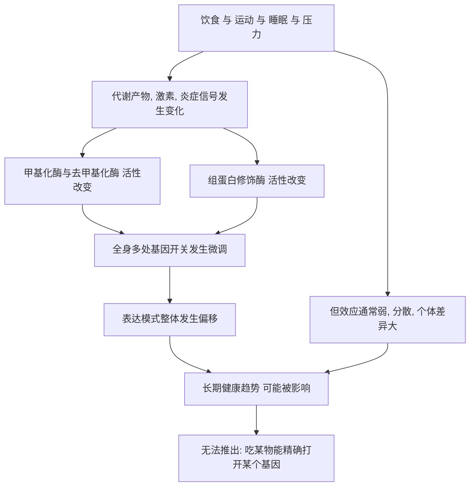

# 16｜我们能改变自己的表观遗传吗？

> 饮食、运动、睡眠、压力管理，真的能打开或关闭我们的基因吗？

---

## 一、先说结论

凯里认为，生活方式确实会影响表观遗传状态，但**“影响”不等于“能精准改写”**。

研究表明，饮食、运动、睡眠、压力等因素，与某些基因的甲基化或组蛋白修饰存在统计上的关联。但这些关联通常很弱、因人而异、难以归因，也远未到“吃某种食物就能打开或关闭某个基因”的程度。更常见的情形是：你改变了一大片开关的整体倾向，却说不清具体动了哪一个。

所以：你的确在日复一日地影响自己的基因开关，但你无法像调音师那样，精确拨动某一根弦。这一篇要格外强调的，正是证据的边界和科学上的谦逊。

---

## 二、我们先理解一个问题

先接住前面那条最容易让人兴奋的线索。

前面讲过，环境、经历、甚至饥荒，都可能改变基因的开关。于是就有了一个极其诱人的推论：如果环境能影响表观遗传，那我是不是可以通过控制饮食、运动、睡眠、心情，主动“优化”自己的表观遗传，从而变得更健康、更年轻？

诱惑背后藏着三个容易被混淆的跳跃：把“相关”当成“因果”，把“群体统计”当成“个人处方”，把“影响”当成“控制”。这三个跳跃，几乎构成了今天大部分“生活方式能改写基因”宣传的全部底气。

那么，真实的情况到底是什么？这正是这一篇要回答的核心问题。

---

## 三、作者到底提出了什么观点？

凯里认为，表观遗传让“生活方式影响健康”第一次有了机制层面的解释，但**机制解释不等于精确可控**。

她的态度可以拆成三点：

1. **影响是存在的。** 生活方式不会绕过生物学，它确实会落到表观层，改变一批基因的表达倾向；
2. **影响是网络化、双向、全身性的。** 不是“一个行为对应一个基因”，而是成千上万个开关同时被轻微牵动；
3. **把复杂网络简化成“某种饮食调控某个基因”，是对科学的误读。** 这种说法听起来精确，实际上丢掉了绝大部分真实信息。

所以她的核心判断是：**你可以影响自己的表观遗传，但你无法精确指挥它。可塑性是真的，精确控制是想象的。**

---

## 四、把这个观点翻译成人话

把表观遗传想象成一间巨大的调音台，上面有成千上万个旋钮。基因序列是固定的乐谱，旋钮决定每件乐器此刻的音量与音色。

你的生活方式，就像你站在整张台面前，用整个手掌去推这些旋钮：睡得好、动得多、吃得清淡，整体音量会往一个更协调的方向偏移；长期熬夜、久坐、高糖高脂，整体又会偏向另一个方向。你**确实**改变了声音。

但你不知道手掌具体压到了哪几个旋钮，也无法保证只动你想要的那一个。有时你以为是在调小提琴，实际连同鼓和低音一起被推了。**影响全局趋势是可能的，下达单点指令是做不到的。**

---

## 五、为什么会这样？

关键在 A → E 这一整段。

生活方式并不是直接去“拧”某个基因，而是先改变身体里的代谢、激素与炎症环境，再由这些环境去影响甲基化与组蛋白修饰的酶。换句话说，它作用的是**调控系统的上游**，而上游一动，下游就是一大片。这就解释了为什么影响真实存在，却总是分散、微弱、难以指认。

---

## 六、举一个现实生活中的例子

看饮食、运动、睡眠这几件日常小事，究竟改变了什么。

饮食方面，有一类经典研究很说明问题：叶酸、维生素 B12、胆碱等与甲基代谢相关的营养素，参与了甲基标签的生成。在动物实验中，仅仅改变孕期母体饮食里这些成分的含量，就会改变后代某些基因的甲基化水平，进而影响毛色深浅。这说明“吃进去的东西”确实能触及表观层——但请注意，这是严格控制的动物实验，不是人的日常。

到了人身上，证据就复杂得多。研究表明，规律运动者的某些基因甲基化水平与久坐者存在差异；睡眠不足与压力，也与一部分炎症、代谢相关基因的甲基化或组蛋白状态相关。但这些研究大多是观察性的：运动多的人可能本来就更健康、饮食更好、压力更小，很难把差异单独归功于“运动改写了某个基因”。真正能说明因果的干预试验数量有限，且效应往往很小、在不同研究中并不总是一致。

所以，这三件小事**确实在影响你的表观状态**，但影响是温和的、整体的、难以量化的。把它说成“每天这样吃就能修好某个基因”，是把一个模糊的趋势，包装成了并不存在的精确开关。

---

## 七、回到书中重新理解

现在再回看凯里这本书的整体走向，就能明白她为什么把这一篇放在最后。

整本书从“基因不是命运”出发，讲了分化、记忆、印记、X 失活、环境、疾病、跨代遗传、克隆与重编程。所有这些机制，最终都指向一个主题：**可塑性。** 生命不是一张写死的蓝图，它一直在被环境和经历重新读。

但凯里在讲可塑性时，始终保留着一份克制。她反复强调，表观标记既有可塑的一面，也有稳定的一面；大部分标记其实相当稳固，不会因为你今天多吃了一盘菜就翻转。把“可塑性”一路推到“命运由我随意改写”，恰恰背离了这本书的严谨立场。所以这一篇不是全书的高潮式的承诺，而是全书的**刹车**：跑得快之前，先看清路有多远。

---

## 八、这个观点背后还有什么？

**第一，可塑性与稳定性是一对张力。** 表观层能变，但多数时候变得很慢、很稳。没有稳定性，细胞身份根本无法维持；过分强调可塑，反而会忽视这份稳定。

**第二，存在“窗口期”。** 发育早期，尤其是胚胎和幼年阶段，表观层更易被环境影响；成年之后，同样的刺激往往效果更弱。这也是为什么早期经历格外受人关注。

**第三，研究本身有硬性困难。** 你很难反复取到人的脑或肝组织，血细胞的表观状态未必代表其他器官；时间尺度长、混杂因素多，都让因果链难以坐实。

**第四，商业利益在推波助澜。** 表观遗传检测、保健品、抗衰产品，都乐于借用“调节基因开关”的话术——因为这句话既听起来科学，又恰好无法被消费者当场验证。

---

## 九、这个观点有问题吗？

这里要格外小心，两边的过度都要避免。

**第一，不能宣称精准改写。** “吃 X 就能打开基因 Y”这类说法，目前没有可靠的证据支撑，属于典型的过度承诺。

**第二，相关不等于因果。** 大多数人类证据是观察性的，混杂因素无法排除，看到差异不等于证明了机制。

**第三，效应通常很小，且未必可重复。** 不同研究之间结果并不一致，说明我们对细节的理解还很有限。

**第四，检测结果的解释极其困难。** 一次表观遗传检测给出了“某种模式”，但它究竟意味着健康风险、还是只是暂时的波动，常常没有定论。

**但同样要避免反向的过度否定。** 影响因素真实存在，健康生活方式对身体的益处也有扎实证据——只是这些益处**不需要**靠“改写了基因”来辩护。所以更准确的说法是：你与自己的表观遗传之间存在真实的互动，但这种互动更像长期的、温和的、整体性的影响，而不是随时可以拨动的精准旋钮。

---

## 十、今天再看这个观点

以下部分是基于本书思想的现代延伸，不是凯里的原话。

当代研究里最引人注目的，是所谓“表观遗传时钟”：通过检测一批位点的甲基化水平，估计一个人的“生物学年龄”，看它比实际年龄走得快还是慢。一些研究显示，规律运动、良好睡眠、健康饮食等生活方式干预，可能与时钟的轻微变化相关。但“轻微”是关键词——这些变化常常很小、个体差异很大，而且“生物学年龄变慢”是否真的等同于“更健康、更长寿”，至今没有定论。

更现实的提醒是：**“表观遗传”正处在一个容易被过度包装的阶段。** 从检测服务到抗衰产品，到处都在暗示你的基因开关可以像仪表盘一样被随意调节。面对这类说法，最健康的态度不是全盘相信，也不是完全无视，而是问一句：这背后是经过检验的临床证据，还是一个好听的故事？

---

## 十一、这一篇真正应该记住什么？

1. **你会影响自己的表观遗传，但影响不等于精准控制。** 这是全篇的核心。
2. **相关不等于因果。** 大多数人类证据是观察性的，归因必须谨慎。
3. **效应通常很小、个体差异大、未必可重复。** 证据有明确的边界。
4. **可塑性与稳定性并存。** 大部分表观标记其实相当稳固。
5. **健康生活值得坚持，但不必靠“改写基因”来辩护。** 它的价值本身就是充分的。
6. **对过度承诺保持警惕，对科学保持谦逊。** 知道我们不知道什么，也是科学的一部分。

---

## 十二、留一个问题

> 如果同卵双胞胎拿到的是同一份基因“乐谱”，
> 却最终奏出了完全不同的音乐；
> 如果我们既无法精确指挥自己的开关，又确实在日复一日地影响着它们，
> 那么你今天的身体里，那些“正在被演奏的曲目”，
> 有多少是你自己一天天选出来的，又有多少仍是你尚未看清的？

---

这本书讲到这里，就回到了它最开始的那个画面：一对同卵双胞胎，拿着几乎一模一样的 DNA，却活成了两个人。

凯里用整整一本书告诉我们：他们之间的差异，不必全部交给基因去解释。在 DNA 序列之上，还有一整套可以被发育、环境、经历和生活方式重新书写的调控层。它让同一个基因组长出几百种细胞，让相同的乐谱奏出不同的音乐，也让“基因即命运”这句流行已久的直觉，第一次松开了一道口子。

但这本书真正想留下的，不是一个新的、更时髦的决定论——不是“环境决定一切”，也不是“你能随意改写自己的基因”。它想留下的，是一种更成熟的理解方式：**基因不决定命运，表观遗传也不决定命运；生命是在既定序列与不断变化的读法之间，持续书写的过程。**

读到哪里，答案并不统一。有人会更看重表观层的可塑性，有人会更强调它的稳定性与证据的边界。这都没关系。重要的不是接受某个结论，而是读完这些文字之后，你愿意带着一份谨慎与好奇，去形成属于你自己的理解——关于基因，关于环境，也关于那个仍在被一天天写下的、你自己。
