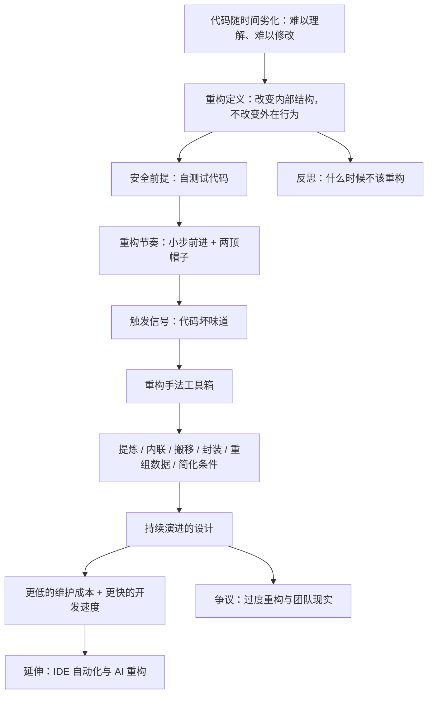

# 《重构：改善既有代码的设计》深度解读系列

## 系列简介

代码写出来不难，难的是它能在之后的几个月、几年里，持续被人读懂、被人修改、被人扩展。

马丁·福勒的《重构》讲的正是这件事。它给出的核心定义极其克制：**在不改变代码外在行为的前提下，调整代码的内部结构。** 听起来像一句废话，但正是这条铁律，让「改进代码」从一个靠经验、靠直觉的手艺，变成了一套可以拆解、可以重复、可以安全执行的方法。

它回答的不只是「怎么改」，更是三个更根本的问题：**什么样的代码算「坏」？为什么好代码更省钱？为什么绝大多数「重新写一遍」的尝试都以失败告终？** 福勒的答案是：不要重写，要用一次次极小的、可验证的改动，让系统始终保持可工作、可理解、可修改。

本系列不按原书章节复述（原书近三分之一是重构手法的目录），而是重建一条认知链：**先讲清「重构是什么、为什么、前提是什么」，再讲「如何识别坏味道」，最后讲「用什么手法、在什么节奏下动手」，并讨论它的边界与争议。**

读完这个系列，你应该能用自己的话解释：为什么重构不是「洁癖」，而是一种工程纪律；为什么它必须依赖测试；以及为什么「先跑起来，再改好，最后改快」是比「一次设计到位」更现实的路。

---

## 全书核心问题

| 层次 | 问题 |
|---|---|
| 定义问题 | 重构到底在改什么，又绝不能改什么？ |
| 动机问题 | 为什么花时间整理代码，最终反而更快？ |
| 安全问题 | 凭什么保证「改结构」不会「改坏功能」？ |
| 识别问题 | 什么样的代码信号，说明「这里该重构了」？ |
| 方法问题 | 用什么手法、按什么节奏去改？ |
| 边界问题 | 什么时候不该重构？它的争议在哪里？ |

一句话版本：

> **如何在不让功能出错的前提下，持续改善代码的结构？**

---

## 全书知识地图



再压缩成一句话：

```text
代码劣化 → 坏味道（信号） → 小步重构（有测试兜底）
        → 结构改善 → 持续设计 → 开发速度的复利
```

---

## 全系列目录

### 第一部分：重构到底是什么

#### 01｜重构究竟是什么？——一个被严重误解的词

核心问题：为什么「重构」这个词，被程序员用得如此频繁，却又如此混乱？

核心观点：福勒把重构定义为一句话——**在不改变代码外在行为的前提下，改善其内部结构。** 它是一个名词（一次具体的结构改动），也是一个动词（一连串这种改动的过程）。不是重写，不是加功能，也不是性能优化。

理解难度：★☆☆☆☆

关键词：行为不变、内部结构、名词与动词

---

#### 02｜为什么「不改变行为」是重构的铁律？

核心问题：如果重构不改变任何功能，那我们到底在改什么？这条铁律为什么不能破？

核心观点：因为一旦允许行为变化，「改进结构」就失去了可验证的标准——你无法区分「我改好了」和「我改坏了」。行为不变是重构可被安全执行的**唯一契约**，也是它与「随手改代码」的本质分界线。

理解难度：★★☆☆☆

关键词：可观察行为、契约、结构 vs 行为

---

#### 03｜为什么没有测试，就谈不上重构？

核心问题：测试看起来是在「浪费时间」，为什么福勒把它当成重构的前提？

核心观点：重构要频繁改动代码结构，如果没有一套能快速告诉你「功能是否还正常」的自动化测试，每次改动都只能靠手工验证，风险与成本高到无法承受。**测试不是重构的附属品，而是重构的安全网。** 没有安全网，就只能小修小补或干脆不动。

理解难度：★★★☆☆

关键词：自测试代码、安全网、回归测试、反馈速度

---

#### 04｜重构不是重写：为什么「大爆炸式重建」几乎总是失败？

核心问题：既然旧代码这么烂，为什么不干脆全部推倒重写？

核心观点：重写会同时丢掉旧系统里所有未被写下来、却真实存在的知识与边界情况。在重写完成前，业务不能停；两套系统并行维护，成本翻倍；最后往往因为赶工期而妥协，造出一个「更好的烂系统」。重构选择相反的路：**让系统始终可工作，用持续的改良替代一次性的豪赌。**

理解难度：★★★☆☆

关键词：重写陷阱、并行维护、渐进式改良、沉没知识

---

### 第二部分：重构的经济学

#### 05｜重构是在还「技术债」吗？

核心问题：「技术债」这个说法，到底准确描述了什么问题？

核心观点：把混乱代码比作债务有其洞见——它承认「先凑合、以后再还」是一种有意的借贷。但福勒更强调：bug 和混乱代码会持续**抬高每一次修改的成本**，利息是复利计算的。重构是主动还债，但真正的问题不是「有没有债」，而是「这笔债的利息是否已经高到拖垮你」。

理解难度：★★★☆☆

关键词：技术债、复利、维护成本、权衡

---

#### 06｜重构会拖慢开发速度吗？——被忽略的复利效应

核心问题：花时间整理「能跑的代码」，难道不是浪费开发进度？

核心观点：短期看是的，长期看恰恰相反。代码结构越差，每加一个功能就要付出越高的认知与改动成本；重构让后续每一次改动的成本下降。**它不是额外开销，而是对「未来开发速度」的投资。** 这也解释了为什么团队越到后期越慢，而重构是打断这个下滑曲线的手段。

理解难度：★★★☆☆

关键词：开发速度、复利、认知负担、长期主义

---

#### 07｜什么时候该重构？什么时候绝对不该？

核心问题：重构有没有「时机」？还是想改就改？

核心观点：福勒给出的经验法则是**三次法则**——第一次直接做，第二次重复时忍一忍，第三次再出现就该重构。添加功能前、修 bug 时、代码评审时都是重构的好时机。但有些时候不该重构：代码即将被废弃、没有测试且无法补、重构成本远高于收益、或者你正处在必须尽快交付的紧急状态。**重构是判断，不是教条。**

理解难度：★★★★☆

关键词：三次法则、时机、收益与成本、不该重构的情形

---

### 第三部分：识别问题——代码坏味道

#### 08｜什么是「代码坏味道」？为什么它是信号而不是罪名？

核心问题：坏味道是「代码写错了」吗？它和 bug 有什么区别？

核心观点：坏味道是「代码结构可能有问题」的**嗅觉信号**，它不一定是 bug，甚至不影响运行。它的价值在于：它是需要重构的触发器，并且给团队提供了一套共同语言。闻到味道不等于必须立刻动手，但意味着你需要停下来判断。

理解难度：★★☆☆☆

关键词：坏味道、启发式信号、共同语言、判断

---

#### 09｜重复代码为什么是头号敌人？

核心问题：复制粘贴一下明明最省事，为什么福勒把重复代码列为最该消灭的坏味道？

核心观点：重复的真正代价不是「多打了几行字」，而是**同一个规则散落在多个地方**。当规则变化时，你必须找到并修改每一处——漏掉一处，就是一个隐蔽的 bug。重复把「改一处」变成「改一片」，是维护成本最直接的放大器。

理解难度：★★★☆☆

关键词：重复代码、单一事实来源、散弹式修改、DRY

---

#### 10｜为什么函数应该短？——过长函数的真正代价

核心问题：函数长一点不是能一次看完所有逻辑吗？为什么福勒坚持函数要短？

核心观点：长函数的问题不在「长」，而在它**同时承担了太多语义层次**——高层意图和底层细节搅在一起，读者必须同时记住十件事才能理解一行代码。短函数是把一件事讲清楚，并用**名字**替代注释。函数短，不是因为行数崇拜，而是因为理解成本。

理解难度：★★★☆☆

关键词：长函数、语义层次、命名即文档、抽取

---

#### 11｜上帝类与过长参数列表：复杂度是怎么堆成山的？

核心问题：为什么类会越来越臃肿，函数的参数会越来越多？

核心观点：这两者都是「没有及时拆分」的结果。上帝类（过大的类）承担的职责太多，导致任何改动都要碰它；过长参数列表则说明一次调用需要同时知道太多信息，通常暗示这些参数本该组合成一个对象。它们的共同解药都是**识别出隐藏的边界，并把它提炼出去**。

理解难度：★★★☆☆

关键词：上帝类、过长参数列表、参数对象、职责划分

---

#### 12｜发散式变化与霰弹式修改：为什么改一处就崩一片？

核心问题：为什么有的代码改动总是「一发动全身」？

核心观点：**发散式变化**指一个类因为多个不相干的原因被反复修改；**霰弹式修改**指一个变化却要求你改十几个地方。二者看似相反，本质相同：**代码的边界和变化的边界没有对齐。** 重构的目标，就是让「一个变化只需要改一个地方」。

理解难度：★★★★☆

关键词：发散式变化、霰弹式修改、变化的边界、内聚

---

#### 13｜基本类型偏执与重复的 switch：什么时候该引入对象？

核心问题：用一个字符串表示状态、到处写 switch，不是最直接吗？为什么是坏味道？

核心观点：**基本类型偏执**是用字符串、数字硬编码本应有自己类型和行为的领域概念；**重复的 switch** 是同一个分类逻辑散落在多处，每加一种情况就要改所有 switch。二者共同指向一个解法：**用对象和多态，把「分散的判断」变成「集中的定义」。**

理解难度：★★★★☆

关键词：基本类型偏执、switch 语句、多态、领域类型

---

#### 14｜依恋情结、数据泥团与消息链：代码的「社交病」

核心问题：为什么福勒用「依恋」「泥团」「链条」这些奇怪的词来描述代码？

核心观点：这些坏味道都在描述**结构关系的不合理**：函数总是痴迷地访问另一个对象的数据（依恋情结）；几个数据总是成组出现，却从没被当成一个整体（数据泥团）；调用链像一条长长的消息传送带（消息链）。它们提醒我们：**代码的问题不只在单个片段，也在片段之间的关系。**

理解难度：★★★★☆

关键词：依恋情结、数据泥团、消息链、中间人、结构关系

---

#### 15｜「注释是坏味道」这句话，到底什么意思？

核心问题：注释不是好事吗？为什么福勒把「注释」也列进坏味道？

核心观点：福勒的意思不是「不要写注释」，而是：**当一段注释在解释「这段代码在干什么」时，它往往是在为一段表达不清的代码打掩护。** 如果能用更好的命名或结构让代码自解释，那比注释更可靠——因为注释会过期，代码不会。注释应该解释「为什么」，而不是「是什么」。

理解难度：★★★☆☆

关键词：注释、自解释代码、为什么与是什么、过期风险

---

### 第四部分：重构的方法论

#### 16｜「两顶帽子」：为什么不能一边加功能一边重构？

核心问题：重构和加功能不都是改代码吗，为什么非要分开？

核心观点：福勒引用了肯特·贝克提出的**两顶帽子**：一顶是「添加功能」，一顶是「重构」。同一时间只能戴一顶。戴着重构的帽子时，你只改结构，不越界加功能；戴着加功能的帽子时，你也别顺手大改结构。**把两种意图分开，才能保证每一类改动都可验证、可回滚。**

理解难度：★★★☆☆

关键词：两顶帽子、意图分离、肯特·贝克、可验证

---

#### 17｜小步前进：为什么重构必须一次只走一小步？

核心问题：既然要改，为什么不一次改到位，而要拆成许多小步？

核心观点：因为**每一小步都可以在测试通过后立刻确认「系统仍然正常」**。一旦改动过大，出错时你根本不知道是哪一步引入的，只能靠漫长调试。小步前进看起来慢，实际是最快的——它把「定位问题」的成本压到几乎为零，让整个改写过程始终处在可控状态。

理解难度：★★★☆☆

关键词：小步前进、可回滚、问题定位、持续验证

---

#### 18｜重构与性能：先让它跑对，还是先让它跑快？

核心问题：重构会不会让代码变慢？应该先优化性能，还是先重构？

核心观点：福勒建议遵循「**先让它运行，再让它正确，最后让它快**」。大多数情况下，清晰的结构带来的性能损失微乎其微，而糟糕结构带来的维护成本却是实实在在的。真正的性能问题应该靠**度量**去定位，而不是凭直觉在结构上乱堆优化——那样往往既没变快，又变得难改。

理解难度：★★★★☆

关键词：性能优化、度量、可维护性优先、过早优化

---

### 第五部分：重构的工具箱

#### 19｜重构手法全景：提炼、内联、搬移、封装、重组条件

核心问题：原书列了几十种重构手法，它们背后有没有统一的地图？

核心观点：有。这些手法可以归入几大类：**提炼（把东西抽出来）、内联（把东西塞回去）、搬移（把东西挪到该在的地方）、封装（藏起细节）、重组数据、简化条件逻辑。** 记住这张地图，比记住几十个名字更有用——因为大多数具体手法，都是这几个基本动作的组合。

理解难度：★★★★☆

关键词：手法目录、提炼、内联、搬移、封装、条件简化

---

#### 20｜最常用的三个动作：提炼函数、内联、改名字

核心问题：如果只练三个重构手法，应该选哪三个？

核心观点：**提炼函数**（Extract Function）是最基础、最高频的重构，几乎所有其他手法最终都会用到它；**内联**（Inline）是它的逆操作，用来消除过度抽象；**改名**（Rename）看似最简单，却是提升可读性性价比最高的动作。掌握这三者，就能解决日常开发中相当大一部分结构问题。

理解难度：★★★☆☆

关键词：Extract Function、Inline、Rename、高频手法

---

### 第六部分：反思与延伸

#### 21｜重构的隐藏前提：为什么它是一种团队工程？

核心问题：重构看起来是个人的技术习惯，为什么往往在真实团队里寸步难行？

核心观点：重构需要一整套工程土壤：**自动化测试、持续集成、代码集体所有、不把「改别人代码」当冒犯的协作文化。** 没有这些，个人再懂重构也只能小心翼翼。福勒的书表面在讲技术手法，底层其实在用一套团队实践为重构兜底——这也是它常被误读的地方。

理解难度：★★★★☆

关键词：集体代码所有权、持续集成、协作文化、工程土壤

---

#### 22｜重构被夸大了吗？——对福勒的几种批评

核心问题：既然重构这么好，为什么还有人不买账？

核心观点：合理的批评包括：**重构依赖测试，而测试本身要成本**；在遗留系统中常常「想测也无从下手」；存在为重构而重构、偏离业务价值的情况；部分收益难以量化，容易被当成不产出工作；以及「重构 vs 前期设计」的争论。问题的关键不是「重构对不对」，而是**在什么条件下、投入多少、由谁来做**。

理解难度：★★★★★

关键词：测试成本、遗留系统、过度重构、价值量化、设计之争

---

#### 23｜AI 时代还需要人工重构吗？

核心问题：IDE 和 AI 已经能一键重构，程序员还需要理解重构吗？

核心观点：（现代延伸，非福勒原文）工具能替你执行「怎么改」，但无法替你判断「该不该改」「改成什么结构更好」——这些恰恰是重构的核心。AI 能加速机械操作，却也让**糟糕的结构被更快地复制和放大**。越是能自动改代码，越需要人的判断力来决定方向。

理解难度：★★★★☆

关键词：IDE 自动化、AI 重构、判断力、结构决策

---

## 推荐阅读顺序

```text
第一板块｜先建立正确认知
  01 重构是什么
  02 行为不变铁律
  03 测试是前提
  04 为什么不要重写

第二板块｜理解动机
  05 技术债
  06 开发速度的复利
  07 何时该 / 不该重构

第三板块｜学会识别问题
  08 坏味道总论
  09 重复代码
  10 长函数
  11 上帝类与长参数
  12 变化的边界错位
  13 类型与多态
  14 结构关系
  15 注释

第四板块｜掌握方法
  16 两顶帽子
  17 小步前进
  18 重构与性能

第五板块｜工具
  19 手法全景
  20 三个高频动作

第六板块｜反思
  21 团队前提
  22 争议
  23 AI 时代
```

优先关系：

> 02、03 是理解后面一切的地基（行为不变 + 测试兜底）；
> 07「何时不该重构」依赖 05、06 建立的成本收益判断；
> 08～15 建立「识别问题」的能力，19、20 才是「解决问题」的手法，顺序不能倒；
> 21、22 属于反思层，需建立在完整理解方法之后。

---

## 与原书章节的对照

| 原书内容 | 对应文章 |
|---|---|
| 第 1 章 重构，第一个案例 | 01、02、17 |
| 第 2 章 重构的原则（定义/两顶帽子/何时重构） | 01、02、05、06、07、16 |
| 第 3 章 代码的坏味道 | 08～15 |
| 第 4 章 构筑测试体系 | 03 |
| 第 5～6 章 重构手法目录与代码示例 | 19、20 |
| 第 7 章 封装 / 搬移特性 / 重组数据 | 19、20 |
| 第 8 章 重构与设计 / 性能 | 18、21 |
| 第 9 章 重构的挑战与现代实践 | 04、21、22 |
| IDE/工具与 AI（书外延伸） | 23 |
