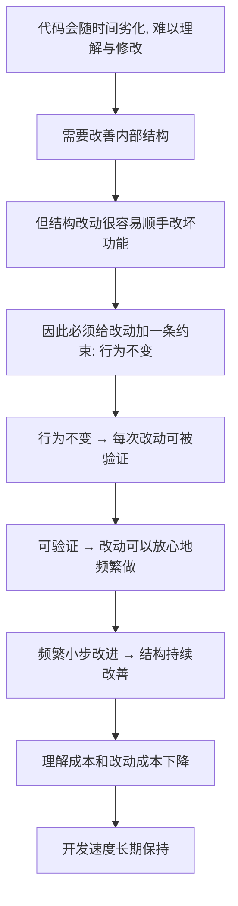

# 01｜重构究竟是什么？——一个被严重误解的词

> 一个开发者每天都在用、却很少能说清楚的词：当有人说「我重构了一下」，他到底做了什么，又绝对没做什么？

---

## 一、先说结论

福勒在书里给「重构」下了一个极其克制的定义：

> **在不改变代码外在行为的前提下，改善它的内部结构。**

就这么一句话。它既是名词，指一次具体的结构改动；也是动词，指一连串这种改动的过程。

它明确排除了三件事：**不是重写**（旧代码整体推倒）、**不是加功能**（外在行为会变）、**也不是性能优化**（目标不同，常常还要靠度量另做）。

所以「重构」听起来像一句废话——不改功能，那你改了啥？恰恰是这条「什么都不改」的约束，让「改进代码」变成可安全执行的工程动作，而不是一场冒险。

---

## 二、我们先理解一个问题

在日常开发里，「重构」这个词几乎被用滥了。

产品经理说：「这个页面重构一下，顺便加个分享按钮。」
工程师说：「这块代码太烂了，我周末重写一版。」
还有人说：「我重构了一下，把并发改成异步，快多了。」

这三句话里，可能没有一句是福勒意义上的重构。

问题就出在这里：**当同一个词同时指「整理结构」「重写」「加功能」「优化性能」时，它其实已经失去了表达力。** 你说「我要重构」，同事根本不知道接下来会发生什么——功能会不会变？要不要回归测试？上线风险大不大？

一个词的含义越模糊，围绕它的争论就越没有意义。所以我们得先把刀磨快：

> **如果「重构」不改变任何功能，那它到底在改什么？**

---

## 三、作者到底提出了什么观点？

福勒的观点，是把「重构」严格地拆成**动词**和**名词**两种用法，并且给它们各自的边界。

**作为名词**，重构是「对代码内部结构的一次小小调整，不改变外在行为」。比如把一个长函数里的一段逻辑抽成单独的函数，这一步动作本身，就叫做一次重构。

**作为动词**，重构是「在不改变外在行为的前提下，用一连串这样的微小改动，持续改善结构」的过程。它不是一个动作，而是一种节奏。

无论是名词还是动词，都共享同一条不可让步的前提：

> **外在行为不变。**

福勒反复强调，一旦行为变了，那件事就**不是**重构了。它可能是修 bug，可能是加功能，也可能是重写——但都不是重构。这句话看似苛刻，其实是整本书的基石。

---

## 四、把这个观点翻译成人话

用整理房间来理解最合适。

一个房间住久了会变乱：衣服堆在椅子上，书摞在桌上，充电线缠成一团。这时有两种做法。

第一种是**收拾**：把衣服挂回衣柜，把书放回书架，把线理顺收好。房间里的东西一件没少、一件没多，但你现在找东西快了，住着舒服了。这就是重构——**东西没变，摆放变了。**

第二种是**搬家换房**：把旧家具全扔了，重新买一套。这是重写。房间确实焕然一新，但那是一个全新的开始，也意味着全新的风险和成本。

还有一种是在收拾的同时，又给房间加了一个新柜子、装了盏新灯——那叫顺便加功能。虽然也在「整理」，但和纯粹的收拾是两回事。

> **重构 = 整理，不是搬家，不是添置。**

关键在于：你在整理时，**不需要担心哪件衣服会突然消失**。这正是它安全的来源。

---

## 五、为什么会这样？

福勒为什么要把「不改变行为」当成定义的一部分，而不是随口一提？推理链条是这样的：



这条链的关键在 D 到 F 这一步。

如果没有「行为不变」这条约束，那么每一次结构改动都同时是一次功能改动，你根本无法回答「我这次到底只是整理，还是把功能改坏了」。而一旦你能保证行为不变，**改动就变成了可验证、可回滚的**——这才是它能被反复执行的原因。

换句话说，「不改变行为」不是重构的附属说明，而是它之所以成立的前提。

---

## 六、举一个现实生活中的例子

看一段很常见的代码：

```text
if (user.level > 3 && user.age >= 18 && !user.banned && user.balance >= price) {
    // 允许购买
}
```

四个条件挤在一行里。三个月后有人要改规则，得先花半分钟弄明白这四个条件到底在表达什么。

一次很小的重构是这样做的——把这段判断提炼成一个有名字的函数：

```text
if (canPurchase(user, price)) {
    // 允许购买
}
```

然后单独定义：

```text
canPurchase(user, price) =
    user.level > 3 && user.age >= 18 && !user.banned && user.balance >= price
```

**注意：判断逻辑一个字没变，程序行为完全一样，四个条件还是那四个。** 变的只是：现在读代码的人一眼就知道这里在判断「能不能购买」，而不是被迫解析四个布尔表达式。

这就是重构的模样：动作很小，收益很实，风险几乎为零（前提是有测试兜底，这一点下一篇会展开）。

---

## 七、回到书中重新理解

理解了动词和名词这两种用法，再回看福勒的原始定义，你会发现它其实在防三种常见的「偷换概念」。

**第一种偷换**：把重构当成重写。福勒明确区分——重写是替换整个系统，重构是原地改善结构。前者赌一次翻盘，后者追求持续可工作。

**第二种偷换**：把重构当成加功能。如果一次改动带来了新的外在行为，那它就是功能开发，不是重构。福勒后来用「两顶帽子」来描述这种区分：同一时间只戴一顶帽子，加功能时就别顺手大改结构，重构时就别越界加功能。

**第三种偷换**：把重构当成性能优化。福勒提醒，重构通常让代码稍微清晰、也可能略微变慢；真正的性能问题要靠度量去定位，而不是把「整理结构」和「变快」混为一谈。

所以这个定义不是学究式的咬文嚼字，而是**在给一个被滥用的词重新装上边界**。边界清楚，讨论才有意义。

---

## 八、这个观点背后还有什么？

这个定义背后，藏着福勒一个更深的主张：**软件开发应该是可持续的，而不是靠一次次推倒重来维持的。**

大多数人默认「做大改动才有价值」：重构一块小代码，感觉没什么成就感；重写整个模块，才像是大事。但福勒的整个方法论都在反对这种直觉——**价值来自持续、可控的小改动累积，而不是一次性的豪赌。**

这也解释了他为什么把「行为不变」看得这么重。因为只有行为可预测，你才能把改动切得足够小；只有切得足够小，你才敢在正常工作节奏里持续做。

一句话：**重构的定义，其实是「可持续开发」这个理念的技术表达。**

---

## 九、这个观点有问题吗？

这个定义本身争议不大，但围绕它有几个值得警惕的地方。

第一，**「不改变行为」在实践中并不总是那么清晰。** 什么算「可观察行为」？一个函数内部日志的输出顺序变了，算不算行为改变？一个接口的响应变快了，算不算？福勒用的词是「可观察行为」，但边界在哪里，往往需要具体场景来判断。

第二，**「重构」这个词被行业用得太宽，福勒的定义反而和大众用法脱节。** 很多团队口中的「重构」，其实就是带功能改造的翻新。硬按福勒的标准去纠正，容易变成语义争论，反而不利于协作。软件工程界普遍认为，比起死抠词义，更重要的是**让团队对「这次改动会不会改变行为」有共识**。

第三，**纯粹的结构改善，价值难以量化。** 管理层看不到「今天多了一个有名字的函数」，只看到「今天没交付功能」。这也是福勒的方法论在真实团队里经常遇到阻力的原因——它的收益是真的，但确实不容易摆到台面上。

---

## 十、今天再看这个观点

（以下为现代延伸，非福勒原文）

福勒给出这个定义时，重构主要靠人手动完成；而今天的 IDE 已经内置了大量一键重构：重命名符号、抽取方法、内联变量、安全地移动文件。现代 IDE 能自动保证「只改结构、不改行为」，把福勒当年靠纪律维持的约束，变成了工具层面的机械保证。

这本来是好事，但也带来一个新问题：**当改结构变得毫不费力，判断「该不该改、改成什么样」就变得更加关键。** 工具能替你把一个函数抽出来，却不能替你判断「这个抽象是不是多余」「这个名字是不是表达错了意图」。

更值得警惕的是 AI 编程：它能在几秒钟内生成或改写大段代码，也能以同样的速度把糟糕的结构复制到十个地方。可以安全地说，**越是能自动改代码，越需要理解「重构」这个词的边界——因为「能改」和「该改」从来不是一回事。**

---

## 十一、这一篇真正应该记住什么？

1. **重构的核心定义只有一句**：在不改变代码外在行为的前提下，改善它的内部结构。行为不变是前提，不是补充。

2. **它是名词也是动词**：名词指一次具体的结构改动，动词指一连串这种改动组成的持续过程。

3. **三件事不是重构**：重写（替换整个系统）、加功能（行为会变）、性能优化（目标不同）。混用这些词，讨论就会失焦。

4. **定义的真正作用是把词用清楚**：只有先确定「这次改动会不会改变行为」，团队才能判断需要多少测试与验证。

5. **整理房间的类比**：东西没变，摆放变了——这是重构最朴素的样子。

---

## 十二、留一个问题

既然重构的全部功劳都建立在「不改变行为」之上，那么一个更尖锐的问题就来了：

> **如果行为一点都不许变，我们凭什么相信「改完的代码还是对的」？**

换句话说，「不改变行为」这条铁律，究竟靠什么来保证？它为什么不能破？

下一篇，我们就来看这条铁律到底意味着什么——**为什么「不改变行为」是重构不可动摇的底线，以及它与「随手改代码」的分界线究竟画在哪里。**
