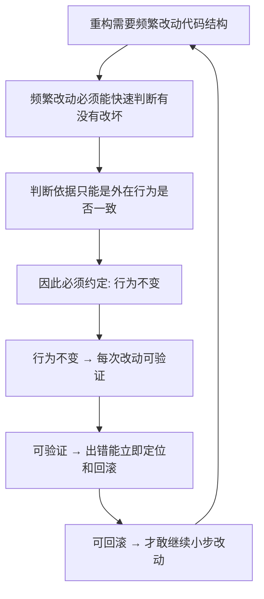

# 02｜为什么「不改变行为」是重构的铁律？

> 如果重构什么功能都没改，那它到底改了什么？以及一个更关键的问题：这条「什么都不改」的规矩，为什么一步都不能破？

---

## 一、先说结论

福勒的答案很直接：**因为「不改变行为」是重构唯一可靠的验收标准。**

一旦允许行为在重构过程中发生变化，你就再也分不清「我把结构改好了」和「我把功能改坏了」——因为你连「改没改坏」都无从判断。行为不变，才让每一次结构改动都变得可验证、可回滚、可放心地反复做。

所以这条铁律不是形式主义，它是重构与「随手改代码」之间**唯一清晰的分界线**。跨过这条线，做的还是别的事，只是借用了「重构」这个名字。

---

## 二、我们先理解一个问题

先看一个很常见的场景。

一个工程师对同事说：「我把订单模块重构了一遍。」同事问：「功能还和以前一样吗？」他说：「基本一样，就是把支付回调里的那个小逻辑顺便修了一下。」

这时，问题就来了。

「基本一样」到底是一样还是不一样？那个「顺便修的小逻辑」是有意为之，还是不小心碰到的？如果明天线上出了支付问题，谁能确定是这次重构引入的，还是本来就有的？

这个场景暴露的，是重构最核心也最容易被忽视的一环：

> **如果改动可以顺手改变行为，那我们凭什么说「结构变好了，功能没坏」？**

---

## 三、作者到底提出了什么观点？

福勒的观点可以拆成两层。

**第一层：重构只动结构，不动行为。** 他用的是「可观察行为」这个词——也就是说，从系统外部看，输入同样的数据、触发同样的动作，得到的反馈应当完全一致。内部怎么重排、怎么改名、怎么拆函数，都可以；但对外表现，必须原样不变。

**第二层：这不是建议，是前置条件。** 福勒认为，行为不变是重构能够安全进行的前提。少了这个前提，你做的每一次改动都同时押上了「结构」和「功能」两笔赌注，而你并没有办法分别检验它们。

换个说法：

> **行为不变 = 重构的契约。** 有了这份契约，你才敢频繁、小步、反复地改；没有它，每一步都是新的风险。

---

## 四、把这个观点翻译成人话

用装修房子来理解最清楚。

你住的房子旧了，想改造一下。有一类改动是可以放心做的：**换墙纸、刷油漆、换灯具、把沙发从东墙挪到西墙。** 房子的功能没变——还是能住、水电还是通，但你住得舒服多了。这就是重构。

还有一类改动是绝对要小心的：**拆承重墙。** 它看起来只是「把一堵碍事的墙打掉」，但承重墙一拆，楼板可能塌。这不是装修，这是结构工程，得报批、得算荷载、得有人负责。

区别在哪里？**换墙纸不改变房子的「可观察行为」（能不能住人），拆承重墙会。**

福勒说的「行为不变」，就是要求所有重构都停在「换墙纸」这一侧。**一旦你开始碰承重墙——也就是让外部能观察到功能变化——那就不再是重构了。**

---

## 五、为什么会这样？

把福勒的推理整理成链条：



这条链是一个闭环。**「行为不变」不是一个孤立的规矩，而是让整个重构循环能够转起来的轴心。**

反过来看，如果去掉 D 这一步会怎样：

- 每次改动都同时可能改结构、也可能改行为；
- 出了问题，你既不知道是结构问题还是功能问题；
- 想回滚，又不知道回滚到哪一步；
- 于是不敢频繁改，只能攒很久做一次大的——而大改动恰恰出错率最高。

**所以「行为不变」保护的其实不是功能，而是「改动的可验证性」。**

---

## 六、举一个现实生活中的例子

看一个典型的「越界」现场。

一段代码本来长这样：

```text
double total = price * count;
if (total > 100) total = total * 0.9;
```

工程师觉得这段逻辑写在一个大函数里不好，就把它抽成一个函数：

```text
applyDiscount(price, count)
```

抽出来之后，他顺手发现「满 100 打九折」的边界写得有点怪，于是改成了 `>=`，觉得「这样更合理」。

问题就出在这顺手一改上：

- 如果原来 `total == 100` 时 **不**打折，改完就变成打折了；
- 这是一个**可观察行为的变化**——用户看到的金额变了；
- 这一刻，这次改动就不再是重构，而是「重构 + 改需求」两件事混在一起。

**正确的做法是：这一次只抽函数，一个字符都不改逻辑；想改边界，另起一次改动，单独评审、单独测试。** 这就是福勒说的「不改变行为」在日常里最真实的样子。

---

## 七、回到书中重新理解

现在再回看福勒的定义，就能读出它的分量了。

他之所以把「不改变外在行为」写进定义的**第一句**，不是为了限定重构的范围，而是为了让重构**可被检验**。行为不变，意味着你可以拿同一组测试反复跑：跑之前通过，跑之后还通过，就能高度确信结构改动没有破坏功能。

这也解释了他为什么强调**区分意图**。行业里后来常引用的「两顶帽子」（这一提法的源头常被归于肯特·贝克）说的正是这件事：一顶是「加功能」，一顶是「重构」，同一时间只能戴一顶。

> **戴着重构的帽子，你只改结构；戴着加功能的帽子，你也别顺手大改结构。**

两顶帽子不能同时戴，本质就是「可观察行为」这条线不能同时跨越。

---

## 八、这个观点背后还有什么？

这条铁律背后，有一个容易被忽略的隐含前提：**「可观察行为」是可以被定义、被测量的。**

也就是说，你得先知道这个系统「对外承诺了什么」——它的接口、它的返回、它的副作用。只有这些边界清楚，你才能判断重构有没有越界。这其实意味着重构天然依赖两样东西：**清楚的接口边界，以及能验证这些边界的自动化测试。**

另一层更深的意思是：**行为不变，是一种「保守主义」。** 它承认开发者并不完全理解代码为什么写成这样——那些看似多余的判断，可能正好在处理某个罕见的历史 bug。所以它选择先不改变行为，只让结构更清晰，把「理解」和「改变」分成两步走。

**先把代码变得看得懂，再决定要不要改它的行为。** 这个顺序，比它看起来重要得多。

---

## 九、这个观点有问题吗？

有几点值得保持警惕。

第一，**「可观察行为」并不总是黑白分明。** 日志输出顺序、异常信息措辞、内部缓存的时序、接口响应速度……这些改动到底算不算「行为变化」？福勒用的是「可观察」这个限定词，但具体到某个系统，边界常常需要人来判断，而不是套公式。

第二，**「一点行为都不能变」在现实中有时过于理想。** 有些重构做到一半，会发现旧行为本身就是个 bug；如果不改，测试根本没法通过。这时通常的做法是先保留旧行为（哪怕它是错的），重构完成后再单独修 bug——但这需要纪律和团队共识，不是每个团队都能做到。

第三，**存在争议：测试是否真的能覆盖「所有可观察行为」。** 支持者认为，只要测试足够好，行为不变就能被有效验证；批评者则指出，测试永远只能覆盖你想到的情况，真正危险的往往是那些没人想到的边界。这个争论，会直接关系到下一篇的主题：**测试到底是不是重构的前提。**

---

## 十、今天再看这个观点

（以下为现代延伸，非福勒原文）

今天的工具，把「不改变行为」这件事做得越来越自动化。

现代 IDE 的重命名、抽取方法、移动成员等操作，在大多数情况下能保证只改结构、不改行为；一些代码分析工具甚至能在改动前后自动比对可观察行为。类型系统、契约测试、灰度发布、特性开关，也在从不同角度帮团队守住这条线。

但工具也带来了新的盲区：**能被工具保证的，往往只是「语法层面」的行为不变，而语义层面的行为——比如并发时序、外部依赖的调用次数、异常传播路径——仍然要靠人来判断。** 换句话说，工具把「手别抖」这件事解决了，但「这条线到底画在哪」仍然是人要负责的问题。

这也是为什么，越是自动化程度高的团队，越需要清楚地知道**自己对外的「行为承诺」到底是什么**。没有这份清单，再好的工具也保护不了你。

---

## 十一、这一篇真正应该记住什么？

1. **行为不变是重构的验收标准**：没有它，「改好了」和「改坏了」就无法区分，重构也就失去了可验证性。

2. **判断的依据是「可观察行为」**：从系统外部看，同样的输入、同样的动作，必须得到同样的结果。内部怎么重排不算数。

3. **过线了就不是重构**：行为变了，那是加功能或修 bug，只是借了重构的名字。区分清楚，才能决定用多少测试、多少评审。

4. **装修房子的类比**：换墙纸可以，拆承重墙不行。所有重构都停在「换墙纸」这一侧。

5. **它是为了保住「可回滚」**：行为不变 → 可验证 → 可回滚 → 才敢频繁小步地改。这条链是整个重构循环的轴心。

---

## 十二、留一个问题

到这里，我们接受了一个前提：**只要行为不变，就能证明「没改坏」。**

但这句话有个藏得很深的依赖——**「证明」这件事，究竟靠什么来完成？**

如果每次改完，系统能不能跑对，只能靠人工点一遍、看一眼、凭感觉判断，那「行为不变」就只是一句口号，而不是一道真的保险。

下一篇，我们就来看福勒把什么当成了重构的**前提**：**为什么没有测试，就根本谈不上重构？那张安全网到底长什么样？**
