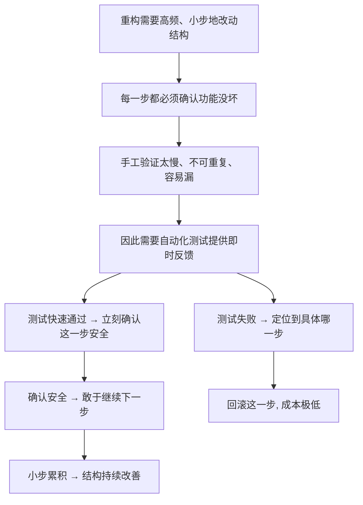

# 03｜为什么没有测试，就谈不上重构？

> 测试看起来不产出任何功能，为什么福勒偏偏把它当成重构的前提？没有它的那根安全绳，改代码到底是在做什么？

---

## 一、先说结论

福勒的观点非常明确：**重构要频繁改动代码结构，而每次改动都需要一个快速、可信的反馈告诉你「功能还正常」。这套反馈就是自动化测试。**

没有它，每一次结构调整都只能靠手工验证——点页面、造数据、看日志，慢而且不可靠。重构需要改动几十上百次，手工验证的成本会高到无法承受，于是你只能选择「不动」或者「大改一次」。

所以：

> **测试不是重构的附属品，而是重构的安全网。**

有安全网，才敢在上面翻跟头；没有安全网，连走一步都得提心吊胆。

---

## 二、我们先理解一个问题

先承认一个事实：重构会让代码不停地变。

今天把函数抽出来，明天把类拆开，后天把参数合并成对象。每一次改动，理论上都在「不改变行为」，但**理论上**三个字值不了多少钱——人总会犯错，工具也有边界。

于是问题就来了：

> **每改一步，你怎么知道功能还是好的？**

如果答案是「我改完自己点一遍看看」，那你可以算一笔账：一次重构可能要改动几十个小步骤，每一步都点一遍，一天下来时间全花在重复验证上；更糟的是，手工验证容易漏、不可复现、也无法交给机器反复跑。

所以问题的实质不是「测试有没有用」，而是：**当你必须高频、小步、反复地改代码时，靠什么来保证每次都没改坏？**

---

## 三、作者到底提出了什么观点？

福勒在书里用了一个专门的词：**自测试代码（Self-Testing Code）**。

它的意思不是「写代码的时候顺便写点测试」，而是：

> **一套能够自动运行、快速给出结果、可反复执行的测试，让「系统是否还正常」这个问题，随时都能被机器回答。**

福勒认为，这样的自测试代码是重构的前提，理由有三层。

**第一，重构是高频的。** 它要求你在一次工作里做很多次微小改动，每一次都要验证。手工验证无法支撑这个频率。

**第二，重构是「不该改变行为」的。** 而检验行为是否改变，最直接的办法就是：跑同一组测试，看结果是否依然通过。测试天然就是「行为不变」这条契约的执法者。

**第三，测试要快、要自动、要可重复。** 如果跑一次测试要半小时，还得手动准备环境，那它给不了「即时反馈」，也就撑不起小步重构的节奏。

一句话：**测试给了你「改动的底气」。**

---

## 四、把这个观点翻译成人话

用走钢丝来理解。

杂技演员在高空走钢丝，脚下有张安全网。这张网不参与表演——它不会帮演员走得更稳，甚至大部分时间观众都注意不到它。但正是因为它在那儿，演员才敢把动作做得更大、更舒展。

**测试就是重构的安全网。** 它不增加功能，但它决定了你敢走到哪一步。

再换一个更贴近工程的说法：**手术前的检查清单。**

外科医生做手术前会核对一整套清单：器械齐不齐、血型对不对、过敏史有没有确认。这些核对不治病，但它们让医生在真正动手时，不必一边操作一边担心「我是不是漏了什么」。清单的作用，是**把注意力从「会不会出错」里释放出来**，专注在操作本身。

自动化测试起到的正是这个作用。**有了它，你改代码时脑子里不用一直挂着「万一坏了呢」，可以专心判断结构该怎么改。**

---

## 五、为什么会这样？

把福勒的推理整理成链条：

这张图有两个出口。测试通过，就继续走；测试失败，就能立刻知道是哪一步出的问题，回滚这一步——**因为步子小，回滚代价几乎为零。**

这正是「小步前进」能成立的底层机制。而支撑这个机制的，就是那套能随时回答「还正常吗」的自动化测试。

反过来说，如果没有测试：

- 每一步都要手工验证 → 步子不敢小；
- 步子变大 → 出错时不知道是哪一步 → 只能大范围排查；
- 排查成本高 → 更不敢改 → 结构继续烂。

**没有安全网，重构就退化成「不敢动」。**

---

## 六、举一个现实生活中的例子

想象你要给一个电商系统的「下单」逻辑做重构。

改动涉及：优惠券计算、库存扣减、运费规则。你花了一个下午，把三个混在一起的方法拆成了清晰的几块。现在关键问题是：

> **拆完之后，下单到底还对不对？**

**没有测试时**，你得这样做：启动本地环境，手工注册一个账号，加购商品，挑一张优惠券，选地址，点提交，然后盯着订单金额和库存数字逐项核对；为了覆盖「满减」「整单折扣」「运费免邮」等组合，你至少得手工造七八种订单。第二天再改一处，这些动作得重来一遍。

**有测试时**，你只需要跑一次测试套件，几十秒后得到一句话：全部通过。

这就是差别。前者把工程师的时间消耗在重复劳动上，后者把人的精力释放出来，用在真正需要判断的地方——**结构该怎么设计、这段逻辑该不该拆。**

顺带说一句：测试还提供了一个隐含的好处——**它是「行为契约」的文字版本。** 测试里写下的每一条断言，其实都是在说「这个系统对外承诺了什么」。这恰好是上一篇「不改变行为」所需要的依据。

---

## 七、回到书中重新理解

现在再回看福勒为什么把测试放在全书很靠前的位置，就很好理解了。

他不是在讨论「测试驱动开发好不好」，也不是在推销某种测试流派。他讨论的是一个更基础的问题：**重构这套方法论，需要一个什么样的工程环境才能成立。** 而自动化测试，是其中最不可替代的一环。

这也解释了他的一个常被误解的立场：**当没有测试时，福勒并不主张硬着头皮重构。** 他的建议更务实——先为这块代码补上能保护它的测试，再开始动结构；而在遗留系统里，这往往是最难的一步，因为代码可能纠缠到「想测也无从下手」。

所以「没有测试就谈不上重构」这句话，与其说是禁令，不如说是一个**现实提醒**：它承认重构是有门槛的，而这个门槛不是勇气，是基础设施。

---

## 八、这个观点背后还有什么？

这里有一个容易被忽略的隐含前提：**测试的价值不在「数量」，而在「反馈速度」和「可信度」。**

一套跑两小时、还经常因为环境问题随机失败（业内常叫「flaky test」，即不稳定测试）的测试，其实帮不上重构什么忙——它给不了你「改一下、几十秒后知道结果」的即时反馈。福勒强调的「快」，正是为了让反馈能嵌进日常改动的节奏里。

另一层更深的意思是：**测试改变了开发的信心结构。**

没有测试时，工程师面对老代码的心态是「别碰，碰了就出事」；有测试时，心态变成「我可以试着改改，坏了会有人告诉我」。这不是技术差异，而是**心理差异**，而它直接决定了一个团队到底会不会去改善代码。

最后，测试还牵出一个更大的话题：**谁来维护测试？** 如果团队把测试当成「额外的负担」，那它迟早会荒废；只有当测试被当作代码的一部分来对待，安全网才真的存在。这也为后面「重构是一种团队工程」埋下了伏笔。

---

## 九、这个观点有问题吗？

有几处争议值得说明。

第一，**测试本身是有成本的。** 写测试要时间，维护测试也要时间；需求的每一次变化，都可能连带要调整一批测试。批评者的意见是：在测试上投入过多，可能挤压真正的功能交付。支持者的回应则是：**在需要持续改动结构的系统里，测试省下的调试和事故成本远高于它的投入**——但这确实是一个需要具体权衡的账。

第二，**在遗留系统里，「先补测试」常常是一句空话。** 老代码往往耦合严重、没有可测的边界，想加测试得先做重构——于是陷入「重构要先有测试，加测试要先重构」的循环。实践中，团队通常只能从最容易测的一小块开始，慢慢扩大。这并不轻松，也不是一句「先写测试」就能解决的。

第三，**测试覆盖率并不等于信心。** 覆盖率衡量的是「哪些代码被运行到了」，而不是「哪些行为被验证了」。一段被跑过一万次、却几乎没有断言的代码，覆盖率很好看，保护力却很有限。软件工程界普遍认为，与其追求覆盖率数字，不如关注**关键行为是否被真正断言**。

第四，**测试能验证的，只是你想到的。** 真正危险的 bug 往往来自没人想到的边界。所以测试是安全网，不是保险箱——它能兜住大部分坠落，但兜不住所有。

---

## 十、今天再看这个观点

（以下为现代延伸，非福勒原文）

福勒写这本书的年代，自动化测试还远不是行业标配。今天，情况已经大不相同。

持续集成让每次提交都自动跑一遍测试；测试框架、内存数据库、容器化环境让「起一套完整环境跑测试」变得廉价；契约测试、快照测试、端到端测试覆盖了不同的层次。**「测试是重构的前提」这句话，今天的行业接受度比当年高得多。**

但新的问题也出现了。系统的外部依赖越来越多，测试越来越慢、越来越不稳定；为追求速度，很多团队把大量精力放在「跑得快」的单元测试上，反而对真正的端到端行为覆盖不足。而在 AI 辅助编码的背景下，代码生成速度大幅提升，**如果测试跟不上，安全网就会变成整条流水线上最窄的那一段。**

从这个角度看，福勒的观点在今天不仅没有过时，反而更尖锐了：**越是可以快速生产代码，越需要一套能快速验证行为的东西。** 否则，速度带来的不是产出，而是更快的失控。

---

## 十一、这一篇真正应该记住什么？

1. **测试是重构的安全网**：它不增加功能，但决定了你敢把结构改到多深。没有网，就只能小修小补或干脆不动。

2. **自测试代码的三个要点**：自动化、快、可重复。慢的、要手工准备环境的测试，撑不起小步重构的节奏。

3. **测试是「行为不变」的执法者**：同一组测试改前改后都通过，就是行为没有改变的最直接证据。

4. **测试提供的其实是信心**：它把工程师的心态从「别碰老代码」变成「我可以试着改改，坏了会有人告诉我」。

5. **覆盖率不等于信心**：关键不是代码被跑了多少遍，而是关键行为有没有被真正断言。

---

## 十二、留一个问题

好，现在我们有了安全网：**重构可以安全地小步进行了。**

但接下来会撞上一个更诱人的想法。

既然老代码这么烂、维护这么累，为什么不干脆**把它整个推倒，重写一版新的**？新技术、新架构、干净的设计，听起来一次性解决所有问题。

这个想法为什么一次次吸引团队，又为什么一次次让团队付出惨痛代价？

下一篇，我们就来看这个几乎人人都动过、却极少成功的念头：**为什么「大爆炸式重建」几乎总是失败？**
