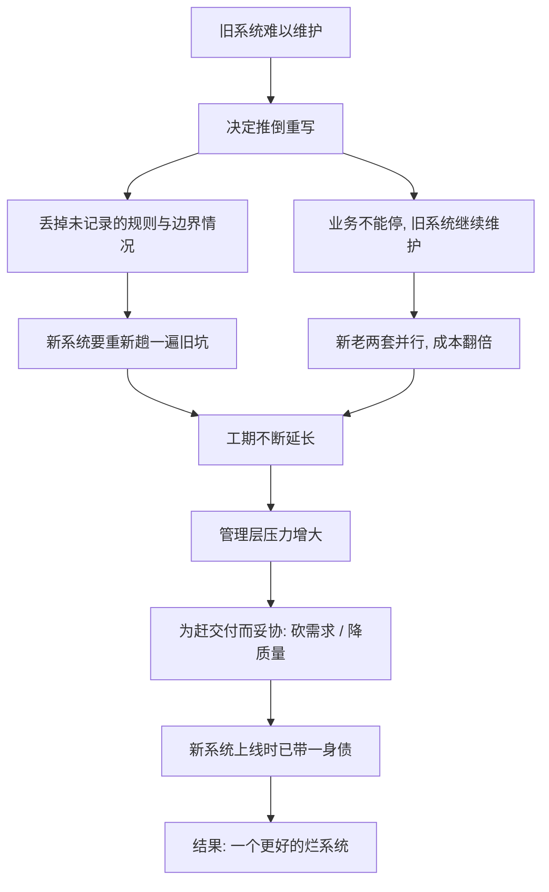

# 04｜重构不是重写：为什么「大爆炸式重建」几乎总是失败？

> 既然旧代码这么烂，为什么不干脆全部推倒重写？

---

## 一、先说结论

重写看上去很痛快：把烂代码一次清空，用新技术、干净设计重新实现。但它同时丢掉三样东西——旧系统里**没有被写下来、却真实存在**的知识与边界情况；业务**不能停下来等你写完**的时间；以及新老两套系统**并行维护**带来的翻倍成本。工期越拖越长，压力越滚越大，最后往往为了交付而妥协，造出一个「更漂亮、但一样烂」的新系统。福勒主张相反的路：**不推倒，让系统始终保持可工作，用持续的改良替代一次性的豪赌。**

---

## 二、我们先理解一个问题

几乎每个维护过老系统的人，都有过这样的瞬间：打开一个文件，看到三千行、变量叫 `a1`、`temp2`、层层嵌套，注释写着「不要动这里」。你会想：**不如全部重写。**

这个冲动很正常，而且看起来充满理性：旧代码之所以烂，是因为当时设计得差、技术过时、需求变化太快；我如今更懂业务、更有经验、技术也更新，重写一遍肯定又快又好。

问题是，这个看似理性的推论，在软件工程史上反复被证伪。于是真正的疑问是：

> **为什么一支技术更好、更了解业务的团队，重写一个已经跑了很多年的系统，反而常常失败？**

---

## 三、作者到底提出了什么观点？

福勒的立场是：**不要用一次性的重写去替换系统，而要用持续的重构去演进系统。**

他的理由是，旧系统里装着大量**看不见的资产**，重写会把它们一次性丢掉：

- **未被记录的规则**：那些「只有老代码里才写着」的业务特例、历史约定、口头承诺。
- **边界情况**：多年里被一个个 bug、一张张工单逼出来的特殊处理，很多没有文档。
- **已修复的坑**：无数条曾经踩过的坑、已经修好的线上问题，在重写时都会「重新踩一遍」。

福勒的核心主张，可以概括成一句话：**让系统在任何时刻都能工作是第一优先。** 与其「停机大改」，不如「边开边修」。

关于重写的风险，软件工程界还有一个流传很广的观察。有工程师曾撰文批评网景公司（Netscape）当年的重写决策——大意是：重写会让团队陷入一种错觉，以为新系统能一次做对所有事，结果在漫长的重写周期里，旧系统继续老化、新系统迟迟不能上线，最后两头受损。（这里只说这个被广泛引用的判断，不展开案例的具体细节。）

这也呼应了一句流传更广的说法：**重写是软件项目最常见的失败方式之一。** 无论具体案例如何，这个现象在业界被反复观察到。

---

## 四、把这个观点翻译成人话

把系统当成一栋住了几十年的老房子。

**重写，就是把它拆了，在旁边重新盖一栋。** 听上去很合理，新房子更结实、管线更新、格局更现代。但有两个致命问题：

1. **拆的期间，人住哪？** 业务不能停。你不能告诉用户「我们这半年不发货了，等新系统盖好」。
2. **老房子里藏着的东西，你未必都记得。** 那个总是有点松、但每年冬天都刚好能卡住窗户的插销；那根被前任屋主偷偷加固过的梁；那个只有老住户才知道的、下雨天要关的阀门。这些**从未被写进图纸**，却决定了房子的可用性。

更现实的是，很多老房子改造项目里，施工队会发现：**图纸和实际不符。** 拆开才知道有暗管、有承重结构、有历史遗留的奇怪走线。软件同理：**你以为重写是「照着旧代码抄一遍、写漂亮点」，实际上旧代码就是唯一完整的规格说明书，而它经常自相矛盾。**

**翻修，则是另一条路：** 不搬家，一个房间一个房间地改。今天换厨房的橱柜，明天重铺客厅的地板，每个阶段房子都能住。慢，但**始终能用**，而且随时可以停下来，不会出现「改到一半全家露宿街头」。

福勒主张的，就是后者。

---

## 五、为什么会这样？

把重写失败的机制拆开，是一条相当稳定的因果链：

这条链里，**E 和 F 是最被低估的一环。**

很多重写计划的隐含假设是：重写期间，旧系统「冰冻」，不需要再投入。但现实恰好相反——只要业务还在跑，用户就还会提需求、报 bug、要求新功能。于是团队里被迫分成两拨人：一拨维护老系统，一拨开发新系统。**维护成本不但没省，反而变成了双份。**

而 C 和 D 是最隐蔽的一环。老系统每多活一年，就多沉淀一批「只有它知道」的规则。重写不是把代码换成新的，而是**把多年积累的、分散在无数特殊处理里的知识，全部重新发现一遍**。这个过程要花多久，几乎没人能在项目开始时估准。

最难的是，**重写没有中途可用的状态**。重构每完成一小步，系统就更好一点，随时可以停；而重写只有在接近完成时才产生价值。这意味着重写承受不起任何延误，而工期延长几乎必然发生。

---

## 六、举一个现实生活中的例子

设想一个电商团队，维护着一套跑了六七年的下单系统。

代码很乱：优惠券、会员价、限购、区域运费、预售、退款，全塞在几个巨型函数里，没有测试。新来的工程师看一眼就想走。团队决定：**用新框架重写一遍。**

前三个月很顺利，新系统的骨架搭得漂亮，代码整洁，测试齐全。团队士气高涨。

第四个月，麻烦来了：

- 运营说：「预售商品的定金退款规则，新系统好像不对。」——这条规则当年是口头定的，只体现在老代码的一个 `if` 里，没人记得。
- 财务说：「某个地区的运费算法要区分节假日，新系统漏了。」——这是三年前为解决一个投诉加的特例。
- 技术负责人发现：新系统的下单成功率比老系统低。因为老系统里有一堆防御性代码，处理着各种脏数据，重写时被当成「历史包袱」删掉了，结果脏数据一来就挂。

同时，老系统还在一刻不停地接需求，因为业务不能停。团队被撕成两半，人力吃紧。到了预定的上线时间，新系统只完成了七成，管理层开始施压。

最后的结局，往往不是「新系统完美上线、老系统光荣退役」，而是：**为了赶上线，团队把「暂时先这样」的妥协代码塞进新系统，新系统带着缺口上线，老系统的一部分还要保留，两套系统长期并存、需要同步数据**——团队比原来更累了。

而如果当初选择重构呢？同样是这套系统，团队可以每周挑一个坏味道最大的函数，用提炼函数拆开、补上测试、再拆下一个。半年后，那些巨型函数变成了清晰的小模块，测试覆盖了关键路径，业务一天没停。**进度看起来慢，但每一步都是可交付、可回退的。**

---

## 七、回到书中重新理解

现在再回看福勒为什么强调「让系统始终可工作」，就能理解了。

他反对的其实不是「追求更好的设计」，而是「把希望全部押在一次性的重建上」。**重写的赌注太大**：赌团队不流失、赌需求不变、赌工期准确、赌旧知识能被完整迁移。任何一项赌输，项目都会出事。而重构把大赌注拆成无数个小赌注，每一个都可以独立验证、独立回退。

这也和前面两篇的观点连成一条线：**重构要求「行为不变」（第 02 篇），而「行为不变」要求有测试（第 03 篇）。** 正是这两个前提，才让「一边运行一边改造」成为可能。重写之所以危险，恰恰因为它同时放弃了行为不变（新代码是全新的）和测试兜底（新系统还没被验证过）。

---

## 八、这个观点背后还有什么？

这背后有一个关键概念，可以叫「**沉没知识**」——不是存在文档里的知识，而是**只活在代码和人的经验里**的知识。

它有几个特征：

- **无法被完整重述**。你问老工程师「系统里有哪些业务规则」，他答不全，因为很多规则他自己都忘了，只在遇到具体场景时才想起来。
- **以特殊处理的形式存在**。每个奇形怪状的 `if`，背后可能是一个真实的问题和一个真实的解决方案。
- **重写时最先被丢弃**。因为新系统追求「干净」，这些看起来丑陋的分支最容易被当成冗余删掉——然后旧问题重新出现。

还有一层是**风险结构**的差别：

| 维度 | 重写 | 重构 |
|---|---|---|
| 交付方式 | 一次性 | 持续小步 |
| 中途可用性 | 几乎为零 | 始终可用 |
| 失败代价 | 全局 | 局部 |
| 知识迁移 | 需要重新发现 | 原地保留 |
| 可回退性 | 难 | 容易 |

把这张表看清楚，就明白为什么福勒说重构是一种更保守、也更理性的选择——**它牺牲了「一步到位」的幻想，换来了对风险的持续控制。**

---

## 九、这个观点有问题吗？

福勒反对大爆炸重写，但这个立场也有边界，不能绝对化。

**第一，有些系统确实该重写。** 比如系统很小、生命周期本就快到尽头、技术栈已经彻底无法维护、或者业务本身要彻底改变。这时「重写」可能比「在废墟上修补」更划算。福勒反对的，主要是**大型、活跃、知识密集**系统的整体重写，而不是否定重写本身。

**第二，重构在极端糟糕的代码上也可能寸步难行。** 如果一个系统完全没有测试、结构高度混乱、连梳理都费劲，那「小步重构」的成本会非常之高。工程界普遍承认，这类遗留系统需要一些特别的过渡手段，比如先引入「接缝」、先做局部隔离，而不是硬套标准流程。

**第三，「重写 vs 重构」有时更像一个连续谱。** 实践中存在折中方案——不整体推倒，而是**逐块替换**：在新旧系统之间加一层路由，把功能一块块迁到新系统，直到旧系统自然退休（这类做法在业界常被称为「绞杀者模式」，属于福勒及后续实践者的讨论范围）。它既保留了新技术的收益，又避免了「一刀切」的风险。

所以更准确的说法是：**问题不在「重写」这个动作本身，而在「大爆炸式、不可回退、丢掉知识」的重写方式。** 福勒真正反对的，是那种把命运押在一次性成功的做法。

---

## 十、今天再看这个观点

（以下为现代延伸，非福勒原文）

福勒写作时，「渐进式改良」还主要靠人工小步重构。今天，这套思想已经演化出一批成熟的工程模式。

- **绞杀者模式（Strangler Fig）**：在旧系统外面套一层路由，新功能用新系统实现，旧功能一块块被替换，直到旧系统被彻底「勒死」。
- **并行运行与影子流量**：新旧系统同时处理请求，对比结果，用真实流量验证新系统，而不是等上线才知道行不行。
- **特性开关（Feature Flag）**：让新功能可以渐进放量，出问题一键回退。
- **AI 辅助迁移**：现代工具可以部分自动化「把旧代码翻译成新代码」的工作，降低迁移成本——但它依然无法自动迁移那些「只存在于老代码里的隐性规则」，那部分仍需要人去发现。

这些实践的共同点，正是福勒那句朴素的主张：**让系统始终可工作。** 新技术的出现没有改变这条原则，反而给了它更多实现手段。

---

## 十一、这一篇真正应该记住什么？

1. **重写最大的代价，是丢掉看不见的知识。** 老代码里的每个特殊处理，背后可能是一个真实问题和一次真实修复。

2. **重写没有中途可用的状态。** 而工期几乎必然延误，压力最终会转化为质量妥协。

3. **业务不能停，导致新旧并行、成本翻倍。** 这是重写预算最常被低估的部分。

4. **重构的风险结构完全不同。** 小步、可用、可回退、失败只影响局部，这是它比豪赌可靠的根本原因。

5. **不能把结论绝对化。** 小系统、死系统、要彻底换业务时，重写可能是对的；福勒反对的是大型活跃系统的「大爆炸式」推倒。

---

## 十二、留一个问题

无论是重构还是重写，背后都有一笔账要算：**改动到底值不值得。**

团队里常有人用一句话为混乱代码开脱：「先欠着，以后有时间再还。」——这句话借用了「技术债」的比喻。

可是，债务真的可以「以后再还」吗？利息是怎么算的？「先凑合」到底是一种聪明的借贷，还是一种慢性自杀？

下一篇，我们就来讨论那个流行又常被误用的概念：**技术债——重构是在还债吗？**
