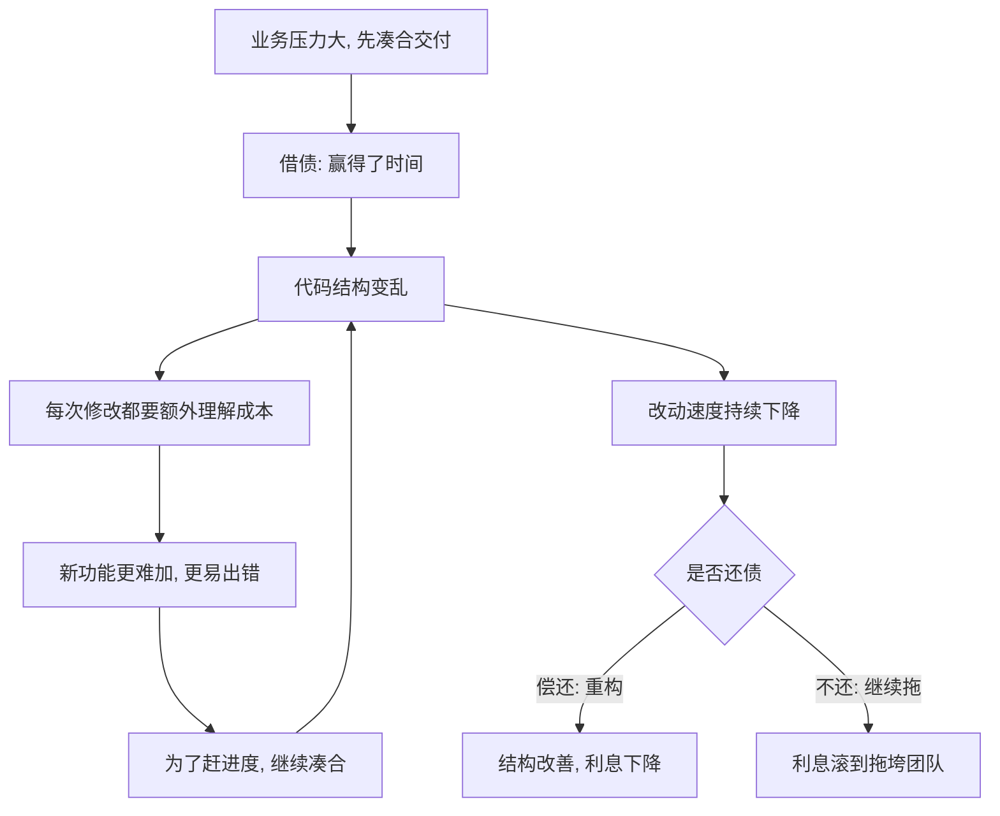

# 05｜重构是在还「技术债」吗？

> 「技术债」这个说法，到底准确描述了什么问题？

---

## 一、先说结论

「技术债」这个比喻有价值，因为它承认了一件事：**「先凑合、以后再改」不是免费的，而是一次有意的借贷。** 但福勒更强调被忽略的另一半——混乱代码会**持续抬高你每一次修改的成本**，而这笔利息是**复利**的，越拖越贵。重构，就是主动还债。所以真正该问的，不是「我们有没有技术债」（几乎任何活跃系统都有），而是「**这笔债的利息，是不是已经高到拖垮我们了**」。

---

## 二、我们先理解一个问题

先问一个基础问题：**技术债到底是什么意思？**

这个概念通常被认为源自沃德·坎宁安（Ward Cunningham）。他打过一个比方：如果你现在还没完全搞懂需求，就先写一版能用的代码交付出去，相当于**借了一笔债**——你赢得了时间，但代价是未来要为这版「不够好」的代码付出额外的修改成本。

这个比喻之所以流行，是因为它一下把「代码质量」从审美的、主观的话题，变成了**财务的、可权衡**的话题。你不再是说「这段代码丑」，而是说「我们欠了一笔钱，将来要还」。

但比喻一旦流行，就容易被用歪。于是真正的问题是：

> **「技术债」到底准确描述了什么？它是不是一个靠谱的决策工具？**

---

## 三、作者到底提出了什么观点？

福勒对技术债的态度，可以概括为：**承认这个比喻的洞见，但强调它的核心机制是「复利」，并提醒别把它用歪。**

他的几层意思：

**第一，债务是有意借的。** 「先凑合」很多时候是**理性的选择**：市场窗口只有几个月，先上线拿反馈，比追求完美设计更重要。这时的债，是主动借的，不是无能造成的。

**第二，债务的代价不是一次性的，而是持续的。** 这是福勒最强调的一点。混乱代码不会「静静地烂在那里」，它会**让每一次后续改动都变得更难、更慢、更容易出错**。每加一个功能、每修一个 bug，都要在这个混乱的结构上多付一笔「理解费」和「改动费」。

**第三，这笔代价是复利的。** 越是没人管，结构越乱；结构越乱，改动越慢；改动越慢，越没时间整理；越不整理，结构越乱——这是一个自我强化的下行循环。

**第四，重构是主动还债。** 与其等债滚到还不起，不如持续地、小笔小笔地还。

所以福勒真正想说的，其实不是「不要欠债」，而是：

> **真正的问题不是「有没有债」，而是「这笔债的利息，是否已经高到拖垮你」。**

---

## 四、把这个观点翻译成人话

想想信用卡分期。

你要买一台一万块的电脑，手头现金不够，于是办了分期。这个选择本身没错——**你立刻用上了电脑，用未来的钱解决了当下的需求。** 这就是「借债」的合理之处。

但分期不是免费的：

- 每期有手续费或利息。
- 如果你只还「最低还款额」，剩余部分继续计息。
- 更麻烦的是，一旦习惯了分期，你会不知不觉地把越来越多消费放到卡上。
- 到了某个月你会发现：**工资的一大块，还没花就已经被还款占掉了。**

这时你面对的，已经不是「这台电脑值不值」的问题，而是「**我的现金流还转得动吗**」的问题。

代码是同一个道理。那一版「先凑合」的代码帮你按时交付了，这是一次成功的借贷。但接下来：

- 每次改它，都要多花时间读懂它——**利息**。
- 因为难改，你倾向于继续往上堆补丁，让它更乱——**利滚利**。
- 有一天你发现，一个本来两天的需求要做两周，因为整个模块已经没人敢碰——**利息拖垮了现金流。**

重构，就是**每个月多还一点本金**，让利息不至于滚到失控。它不会让债瞬间清零，但能让利息始终保持在可承受范围。

关键在于：**信用卡的可怕之处不是欠了钱，而是利息的复利效应。** 代码债也一样。

---

## 五、为什么会这样？

把技术债的运转机制画成链条：



注意 **F → C 这条回环**。这是整个机制最危险的地方：**债务会自己产生新的债务。**

因为结构一乱，改动就慢；改动一慢，业务压力就大；压力一大，团队就倾向于「这次先凑合，下次再整理」；于是又往混乱上加了一笔。每一轮都在给下一轮挖更深的坑。

而 **G → H** 是唯一的出路：承认利息已经在侵蚀你，然后做一次「还债」的动作（重构）。还债的动作不需要很大，但必须**持续**——因为复利是双向的：不清偿，它涨；持续清偿，它降。

这解释了一个反直觉的现象：**很多团队不是被某个大 bug 拖垮的，而是被「速度的缓慢下降」拖垮的。** 起初每件事都只慢一点点，没人察觉；几年后，整个团队几乎所有时间都花在「理解旧代码」和「绕开旧代码」上。这种不断叠加的成本，工程界常称之为「变更成本的攀升」。

---

## 六、举一个现实生活中的例子

来看一个点餐系统。

第一版上线时，为了赶外卖平台的合作窗口，团队决定：**先用一个字符串表示订单状态。**

```python
order["status"] = "paid"   # "unpaid" / "paid" / "cooking" / "delivered" / "refunded"
```

当时这个决定很合理：状态不多，字符串最省事，两天就上线了。

半年后，问题开始显现：

- 状态判断散落在几十处 `if order["status"] == "paid"` 里。
- 每加一个状态（比如「待取餐」「部分退款」），就要**在几十个地方各改一次**，漏一处就是一个 bug。
- 有人把 `"Paid"` 写成了大写，线上出现了一批「已支付却显示未支付」的订单。
- 新人问「到底有哪些状态、它们之间怎么流转」，没人能完整回答。

这时，最初的「两天省事」，已经变成了一笔持续付息的债：**每一个跟订单有关的需求，都要先在这堆散落的字符串里绕一圈。**

如果团队选择重构——把这些状态**提炼成一个明确的类型或枚举，把流转规则集中到一处**——那么以后再改状态，只需要改一个地方。这就是在「还本金」：一次性投入，换来后续每一次改动的成本下降。

如果团队继续拖着不改呢？那么可以预见：每加一个状态要改的地方更多、出错概率更高、新人更难上手、老员工更不敢动。**利息在涨，而且涨得越来越快。**

---

## 七、回到书中重新理解

现在再回看福勒对技术债的讨论，就能理解他为什么把重点放在「利息」上，而不是「借不借」。

他不否认借债的必要性——真实世界里，从来没有哪个团队能在完全理解需求、完全设计好结构之后再动手。**先交付、后改善，是常态，也是理性的。**

他真正提醒的是：**债务本身不可怕，滚起来才可怕。** 借债的时候，你赢得了急迫需要的时间；但如果这笔债的利息长期无人过问，它会慢慢吃掉你后续所有的速度，直到你发现自己「连还债都来不及了」。

所以福勒的结论更接近：**重构不是一次性的「还清债务」，而是持续的「债务管理」。** 就像理财不是攒够一笔钱把房贷还了就完事，而是要持续关注现金流、控制负债率。

这也把下一篇要讲的观点提前埋下了：**重构看起来是「额外花时间」，实质上是在维护你的开发速度本身。**

---

## 八、这个观点背后还有什么？

「技术债」这个比喻，在工程界后来被进一步细分。一个常被引用的划分方式，是把债务按两个维度分类：

| | 有意的 | 疏忽的 |
|---|---|---|
| **审慎的** | 「我们知道这样不好，但为了赶上线先这么做」 | 「我们知道该写测试，这次先跳过」 |
| **草率的** | 「业务规则到底是什么？先随便写，以后再说」 | 「什么是分层？没听说过」 |

（这个细分在工程界被广泛讨论，属于对坎宁安比喻的延伸，不是坎宁安最初的表述。）

这个细分很有用，因为它指出：**四种债的性质完全不同。**

- 「审慎 + 有意的债」是**理性的杠杆**：团队清楚代价，也计划偿还。这正是比喻最有价值的场景。
- 「疏忽 + 草率的债」则是**管理失控**：不是权衡后的选择，而是能力或态度问题。

换句话说，**技术债这个比喻最有用的地方，是帮你分清「我在主动借贷」还是「我在失控」。** 如果两种都叫「技术债」，那这个词就失去了分辨力。

底层还有一层更根本的机制：**代码的价值绝大部分在「将来」，而债务的代价也绝大部分在「将来」。** 借贷的人和还债的人，常常不是同一批人——你今天借的债，可能是半年后另一个同事在还。这也是为什么技术债很容易被系统性地低估。

---

## 九、这个观点有问题吗？

债务隐喻很有启发，但它本身有几处被批评的地方。

**第一，债务可以精确计量，代码债不能。** 房贷欠多少、利息多少，一目了然；但「这段代码的债折合多少工时」，没人算得准。这意味着你不能真的靠这个比喻做财务决策，它更多是**一个沟通工具**，而非一个计算工具。

**第二，债务有明确的到期日和还款计划，代码债没有。** 你不还房贷，银行会来找你；你不还代码债，没人会催你，只有速度在悄悄下降。所以它比真实的债更容易被无限期拖延。

**第三，比喻容易被两边滥用。** 想赶进度的人会说「这只是技术债，先欠着」；想争取重构时间的人会说「我们债太多了，必须先还」。同一句话，可以为完全相反的行动辩护。这也是福勒提醒「别把隐喻用歪」的原因。

**第四，并非所有混乱都值得偿还。** 有些代码即将废弃、有些功能使用频率极低、有些债的利息低到微不足道。**无差别地「还债」本身也是一种浪费。** 关键是判断哪笔债的利息最高。

**第五，量化债务收益存在争议。** 有些团队试图用「缺陷率」「交付周期」「变更前置时间」等指标来间接衡量债务的影响，但这些指标受太多因素影响，很难单独归因给「技术债」。所以「还债值不值」这个问题，在管理层面常常没有一个干净的答案，更多依赖工程师的经验判断。

---

## 十、今天再看这个观点

（以下为现代延伸，非福勒原文）

如果福勒写作时技术债主要是「手写代码攒出来的」，那今天这个比喻面临一个新的加速器：**AI 生成代码。**

当代码可以被大规模、低成本地生成，技术债的形成速度也随之加快——大量看起来能跑、但没人真正理解的代码进入系统。工程界近年来讨论的一个焦点是：**AI 让「借债」变得太容易了。** 生成的代码不需要你写，因此你对它的结构、边界、隐含假设的了解可能更少，而利息照样要还。

这带来一个反直觉的结论：**工具越强，债务管理越重要。** 因为「快速产出」和「快速挖坑」往往是同一件事的两面。

与此同时，围绕「还债」也出现了更成熟的实践：把重构工作显式排进迭代计划、用自动化测试为重构兜底、用可观测指标来观察债务的影响。

对今天的团队来说，技术债这个词最大的价值，可能已经不再是「要不要还」，而是**它提供了一个共同语言**，让工程师能和业务方坐下来谈一件本来很难说清的事：**我们正在用未来的速度，换今天的时间。**

---

## 十一、这一篇真正应该记住什么？

1. **技术债承认「先凑合」是有意的借贷，而非免费。** 这个比喻把代码质量从审美话题，变成了可权衡的取舍。

2. **它的核心机制是复利。** 混乱代码持续抬高每一次修改的成本，而且会自己产生新的债务。

3. **重构是主动还债，而且应该是持续的。** 目标不是一次还清，而是把利息控制在可承受范围。

4. **真正该问的是「利息高不高」，不是「有没有债」。** 几乎所有活跃系统都有债，关键看它是否已经在拖垮你的速度。

5. **比喻有局限：无法精确计量，也容易被两边滥用。** 它更适合当沟通工具，而不是财务模型。

---

## 十二、留一个问题

如果债务的利息是在拖慢你的开发速度，那么还债（重构）看起来就是「花时间做没有产出的事」。

可福勒偏偏说，长期看它反而让开发变快——**这是一个反直觉的结论。**

花时间整理「能跑的代码」，怎么就变成了一种对未来的投资？这条「复利曲线」到底是怎么运作的？

下一篇，我们就来算清这笔账：**重构会拖慢开发速度吗？——被忽略的复利效应。**
