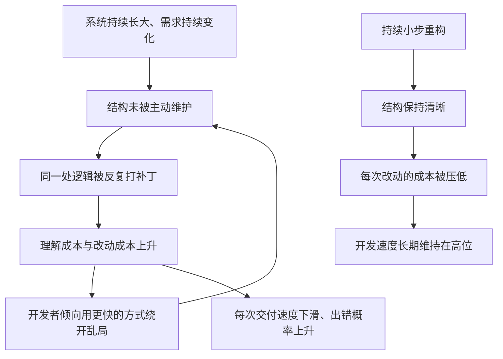

# 06｜重构会拖慢开发速度吗？——被忽略的复利效应

> 一个几乎每个开发团队都吵过的问题：花时间整理「已经能跑」的代码，到底是在节约，还是在浪费进度？

---

## 一、先说结论

福勒的观点很直接：**短期看，整理能跑的代码确实像是在浪费进度；长期看，恰恰相反。**

代码结构越差，你每加一个功能要付出的理解成本和改动成本就越高。重构不是在原有工作之外额外加上一笔开销，而是在压低「以后每一次改动」的价格。所以它更像一笔投向未来开发速度的投资，而不是一次性的消耗。

这一篇要讲清楚的，就是这条被大多数人忽略的账：**为什么今天少写一点功能、去整理结构，反而能让三个月后的团队跑得更快。**

---

## 二、我们先理解一个问题

假设你是一个团队的负责人，手上有一堆急着上线的需求。

有人跑来说：「我们应该花两天重构一下这块代码，它太乱了。」你脑子里第一反应大概是这样一句话：

> **代码能跑就行了，产品要的是功能。花两天整理代码，等于两天没产出，进度谁来背？**

这句话听起来非常有道理。它背后的假设是：**开发速度是一个固定的数**——今天花在重构上的时间，就是从功能里扣掉的时间，一比一交换，纯亏。

本文要检查的正是这个假设：开发速度真的恒定吗？今天省下的那两天，会不会在未来以十倍的代价还回来？

---

## 三、作者到底提出了什么观点？

福勒的观点可以拆成两半。

第一半是关于**代码劣化的机制**。福勒认为，随着系统不断长大，如果不主动维护内部结构，代码会自然地变得越来越难理解、越来越难修改。这不是因为谁写错了什么，而是因为需求在变、人员在换、时间在走。

第二半是关于**速度的曲线**。福勒用一个假说来描述这件事：**良好的内部设计，能让一个团队在很长时间里保持较高的开发速度；而不断累积的结构问题（也就是常说的技术债），会让开发速度持续下滑。** 这个假说常被概括为「设计耐久性假说」（Design Stamina Hypothesis）。

把两半合起来，结论就是本文的标题：**重构不是拖慢速度的元凶，恰恰是打断「速度下滑曲线」的手段。**

需要强调的是：福勒把它称为「假说」，本身就承认它不容易用精确数字证明。它是一种基于工程经验的判断，不是一条被严格实验验证的定理。

---

## 四、把这个观点翻译成人话

用一句话说：

> **代码的混乱，是会「收利息」的；重构，是在利率还低的时候提前还一部分本金。**

再换一个更贴近日常的说法。想象你家里有一条通勤路线。一开始路很空，怎么走都十分钟。后来车越来越多，路口越来越堵，同样十分钟的路，慢慢变成二十分钟、三十分钟。你每天多花的这十分钟，不是某一天突然出现的，而是**一天天累积、悄悄变贵的**。

代码也是一样。今天一个「先写死」的 if 判断，看起来只值五分钟；半年后，同一个判断在系统里长成了七处，改一次需求要同时照顾七处，还得担心漏掉哪一处。那时你付出的，远远不止当初省下的那五分钟。

**这就是为什么它叫「复利」：不是多花了一笔钱，而是让每一笔往后都变贵。**

---

## 五、为什么会这样？

把福勒的推理整理成链条，是这样：

图里有两条路。上面一条是**不重构的路**：结构变差 → 改动更贵 → 为了赶进度更不愿意整理结构 → 结构更差。这是一个自我强化的下降螺旋。下面一条是**持续重构的路**：结构清晰 → 改动便宜 → 有底气继续快 → 结构继续清晰。

关键在于：**这两条路的差距不是线性的，而是随时间放大的。** 所以只对比「今天要不要花两天」是没有意义的，应该对比的是「一年之后两边的速度分别是多少」。

---

## 六、举一个现实生活中的例子

用城市交通路网来打比方，会非常直观。

两座城市，人口和车辆增长的速度一模一样。

- **A 城**在建城时就规划了主干道、支路、环线和信号灯系统。它也会堵，但每次堵，管理者都有明确的抓手：是哪一段的容量不够、哪个路口的配时不合理。
- **B 城**没什么规划，谁家盖房子就从哪儿破一条路。它一开始看起来更「灵活」，想去哪儿都能见缝插针。但随着车辆增多，路网开始互相咬死：一个新小区开出来，整片区域跟着瘫痪。

十年后，两座城市的年均通勤时间差距可能是几倍。但请注意：**B 城并不是在第十年才变慢的，它是每一年都比前一年慢一点。** 每一年看，单次的差异都很小；放到十年尺度上，就变成了无法忽视的鸿沟。

开发速度也是这样。没有任何一个季度会突然「崩掉」，只是每个季度都慢一点、每个需求都多改一点。等到所有人都在抱怨「这个系统改不动了」的时候，其实那天只是长期累积之后，第一次被大家看见。

---

## 七、回到书中重新理解

现在再看福勒为什么会专门讨论「重构与开发速度」，就清楚了。

他并不是说「代码整洁使人心情好」，也不是号召大家做完美主义。他是在算一笔非常务实的账：**软件的成本主要不花在第一次写出来，而花在之后的每一次修改上。** 而结构，正是决定「每次修改要花多少钱」的那个变量。

所以福勒关心速度的方式，和项目经理关心速度的方式其实并不冲突——只是时间尺度不同。项目经理盯的是本迭代的交付；福勒盯的是这个系统在第 N 个迭代之后，还能不能继续交付。**重构，就是把这两个尺度重新对齐。**

---

## 八、这个观点背后还有什么？

第一个隐含前提是：**系统的寿命会比我们想象的长。** 如果一段代码写完就再也不会被改，那重构它确实毫无意义。福勒的整套论证，建立在一个经验事实上——大多数「临时」代码都会活得比预想久，都会被反复修改。

第二个隐含前提是：**重构的收益是「难以直接看见」的。** 加一个功能，你能看到界面上多了一个按钮；重构，你什么都看不见，只有「以后改起来更顺」。这造成了组织里的一个结构性困境：**收益越小步、越长期，越难在当下的绩效里被承认。**

第三个联系，是它和「技术债」的关系。把结构问题叫作「债」，本身就是在说它有利息；这一篇讲的复利效应，正是那笔利息的具体形态。

---

## 九、这个观点有问题吗？

有几个点需要保持诚实。

第一，**「重构一定划算」并不成立。** 福勒自己也承认，重构有成本，而且成本可能高于收益——比如这段代码马上就要废弃，或者它一年都不会再被碰。这一篇说的是「长期趋势」，不能简单套到每一段代码上。

第二，**「设计耐久性假说」很难被精确验证。** 开发速度受影响的因素太多：需求变化、人员流动、团队规模、外部压力。把速度的下滑单独归因于「没有重构」，在方法上是有风险的。所以更稳妥的说法是：**有经验证据与大量工程直觉支持这个方向，但它不是一个被严格量化的定律。**

第三，**存在一种被滥用的风险。** 有些团队会打着「重构投资未来」的旗号，长期不交付任何用户可见的价值。批评者的看法是：**如果重构不能提高之后的交付能力，那它就不是投资，而是消耗。** 换句话说，判断标准不在「改了多少结构」，而在「之后是不是真的更快了」。

第四，有工程师会反过来质疑：**很多时候真正拖慢速度的不是代码结构，而是需求本身在乱变。** 这个批评值得认真对待——结构只是变量之一，不是唯一变量。

---

## 十、今天再看这个观点

（以下为现代延伸，非福勒原文）

福勒写这本书时，组织里的「速度债」主要靠人来还。而在今天，又多了一个变量：**AI 参与写代码。**

一个值得注意的现象是，AI 生成代码的速度极快，但它对现有结构是否合理并不敏感。它能帮你在一堆纠缠的代码上，更快地再糊上一层。于是「结构劣化 → 改动更贵」这条链条可能被加速：**生成越快，补丁越多，结构越乱。** 这反而让福勒的复利逻辑变得更紧迫——因为在机器帮你加速生产的同时，只有人能负责判断「这个结构还能不能长期活下去」。

另一个现代延伸是度量。今天的团队有更多工具去观测「改动成本」，比如一段代码被修改的频率、每次改动的规模、评审耗时的变化。这些指标不能直接证明福勒的假说，但至少让「速度在悄悄变慢」这件事变得可观察，而不是只能靠人抱怨。

---

## 十一、这一篇真正应该记住什么？

1. **开发速度不是恒定的，它会被结构拖累而持续下滑。** 所以不能用「今天花了两天」来衡量重构的得失。

2. **重构是把未来的改动成本压低。** 它更像投资，而不是从功能预算里扣除的消耗。

3. **结构劣化是一个自我强化的螺旋。** 越乱越不敢改，越不改越乱，速度的下滑就发生在每一天。

4. **对比要拉长时间尺度。** 单个迭代看不出差别，一年之后差别无法忽视。

5. **不要把假说当成定律。** 「长期更划算」成立，但具体到某段代码，仍要算它值不值得。

---

## 十二、留一个问题

如果你接受了「长期看重构更划算」，马上就会遇到一个更棘手的问题：

**到底什么时候该动手？**

是每次看到不满意就改，还是攒到一定程度再改？更重要的是——**有没有一些时候，明明代码很乱，你也绝对不该动它？**

下一篇，我们就来看福勒那条非常具体的经验法则：**三次法则**，以及那份同样重要的「不该重构」清单。
