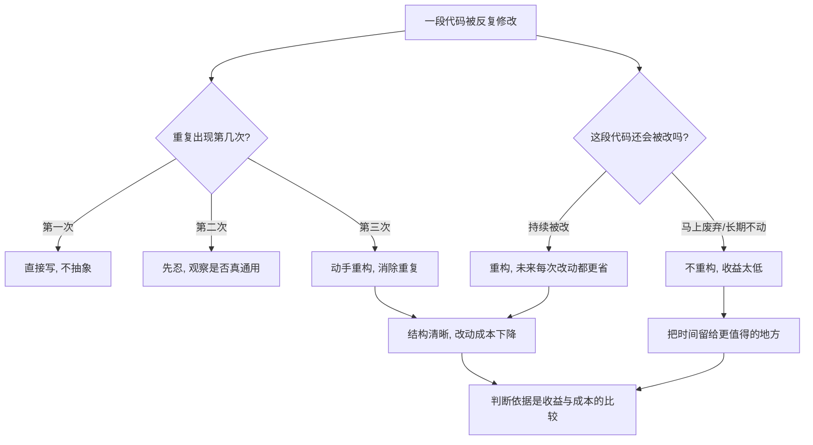

# 07｜什么时候该重构？什么时候绝对不该？

> 一个比「怎么重构」更难的问题：既然重构有利，那是不是只要看到不满意，就应该马上动手？

---

## 一、先说结论

福勒的态度非常明确：**重构有「时机」，不是想改就改。**

他引用了一条流传很广的经验法则——**三次法则**：第一次遇到某段逻辑，直接写出来；第二次遇到相似的情况，忍一忍，先复制；第三次再遇到，就该动手重构了。除了这个法则，福勒还指出几个好时机：**添加新功能之前、修 bug 的时候、做代码评审的时候。**

但同样重要的是另一半：有些时候**绝对不该**重构。比如这段代码马上就要废弃、没有测试又来不及补、重构的成本明显高于收益、或者团队正处在必须尽快交付的紧急状态。在这些情况下硬要重构，不是纪律，是任性。

一句话：**重构是判断，不是教条。**

---

## 二、我们先理解一个问题

把一个程序员放在两种极端里，他都会出问题。

第一种极端是**从不动手**。代码只要能跑，就绝不去碰。结果半年后，没人敢改这块逻辑，每加一个需求都像在拆炸弹。

第二种极端是**见到不顺眼就改**。今天觉得这个类名不好看，改一改；明天觉得那个函数太长，拆一拆。看起来很勤奋，但需求交付被一次次拖延，同事也搞不清他到底在干什么。

这两个极端背后其实是同一个问题：**如果重构是对的，那它为什么不能随时随地做？**

换句话说，我们真正要回答的是：

> **重构的边界在哪里？什么信号说明「现在正合适」，什么信号说明「现在别碰」？**

福勒给出的，不是一套死板的规则，而是一组需要你自己权衡的判断依据。这一篇，就是把这份判断依据摊开来看。

---

## 三、作者到底提出了什么观点？

福勒的观点可以拆成三层。

**第一层，是那条「三次法则」（Rule of Three）。** 福勒在书中提到，这条法则最早由 Don Roberts 提出。它的意思很直白：不要一看到重复就急着抽象，也不要放任重复一直长下去——**等到第三次出现，再动手。**

为什么是三次，而不是两次或五次？因为它是一个折中：两次时你还看不清「这到底是巧合，还是真的通用规律」；而如果一直拖到第十次，重复已经在系统里扎了根，改起来的代价就会大得多。

**第二层，是他列出的几个「好时机」。**

| 时机 | 为什么是重构的好时机 |
|---|---|
| 添加功能之前 | 先把结构理顺，新功能的接入点会更清晰，写起来更省力 |
| 修 bug 时 | 你已经在这段代码里了，顺手把结构问题处理掉，避免下次再来 |
| 代码评审时 | 多个人的眼睛一起看，最容易发现该改的地方，也最容易说服别人 |

**第三层，也是常被忽略的一层，是他列的「不该重构」的情形。**

- 这段代码**马上就要被废弃**，再整理它纯属浪费。
- 代码**没有测试，而且短期内补不上**——没有安全网的重构是赌博。
- **重构的成本明显高于收益**，比如这段逻辑一年都不会再被改。
- 你正处于**必须尽快交付**的紧急状态，此刻稳定压倒一切。

福勒想表达的核心是：**重构不是一种道德要求，而是一种工程决策。** 它该不该做，取决于账怎么算。

---

## 四、把这个观点翻译成人话

三次法则可以用一句话说清楚：

> **第一次，忍。第二次，再忍。第三次，动手。**

我们可以把它理解成一种「攒够证据再行动」的智慧。生活中很多决定都是这样：第一次出现可能是偶然，第二次还不能确定，第三次才暴露出规律。太早动手，你可能为一个根本不会重演的巧合，付出了抽象的成本；太晚动手，你就要面对一堆已经纠缠在一起的重复。

至于「什么时候不该重构」，可以套用一个更朴素的判断：

> **改动它，未来能省下的时间，能不能超过现在花掉的时间？**

如果这段代码明天就删，答案显然是不能。如果它一年没人碰，答案也大概率是不能。如果它每周都被改三次，那答案通常就是能。**重构不是「应不应该整洁」的问题，而是「这次投入划不划算」的问题。**

---

## 五、为什么会这样？

把福勒这套判断整理成一条推理链：

这张图里有两条并行的判断线。

一条是**频率线**：这段代码重复出现了几次？它以后还会不会被改？出现得越频繁、以后改动得越多，重构的收益就越大。

另一条是**成本线**：这次重构要花多少时间？有没有测试兜底？现在是不是紧急状态？成本越高、风险越大，就越该推迟或放弃。

**重构的时机，就是这两条线的交点。** 只看频率不看成本，会导致盲目重构；只看成本不看频率，会导致该改的地方一直拖着。福勒的经验法则之所以有价值，是因为它同时照顾了两边。

---

## 六、举一个现实生活中的例子

想象一个仓库的拣货区。

拣货员的日常任务，是照着订单把货从货架上取出来。货架的摆放方式，决定了他们每天能走多少冤枉路。

- **第一种堆法**：什么都不分类，来一批货就往空位塞。刚开始最省事，卸货快、上架快。可随着货越来越多，拣货员每接一张订单，都要在仓库里来回穿梭，找一个东西要绕半个场子。
- **第二种堆法**：花时间按品类、出货频率重新分区，畅销品放在最顺手的位置。重新整理的那几天，出货速度确实慢了下来，甚至要加班。

从单看那几天，第二种做法「拖慢了进度」。但几周之后，第二种仓库的拣货速度会稳定地快出一大截——**因为每一次拣货，都在享受那次整理带来的便利。**

关键在于：**这次整理值不值得做，取决于这个仓库还要不要每天出货。** 如果仓库下周就要关门，那整理货架就是白费力气。如果它要运营十年，那几天的整理成本可以忽略不计。

这正是福勒「时机判断」的核心：**同一个动作，放在不同的时间尺度上，结论可能完全相反。**

再看一个开发场景。你在修一个线上支付 bug 时，发现那段金额计算的逻辑被复制到了三个地方。这时候你有两个选择：只改出错的那一处，快速上线；或者顺手把三处合并成一个函数。

福勒的倾向是：**既然你已经在修 bug、已经理解了这段代码，顺手把它理顺是划算的。** 但如果你发现这个支付模块下个季度就要整体下线，那就只改那一处就好——**不是所有能改的地方，都值得现在改。**

---

## 七、回到书中重新理解

现在再看福勒那句「重构是判断，不是教条」，就更能体会他的克制了。

很多初学者会以为，福勒作为「重构」这个概念的推广者，一定主张「能重构就重构」。但事实恰恰相反——他在书里花了不少篇幅讲**什么时候不该重构**，甚至明确说：

> **有些时候，你最好把代码留在原地不动。**

这句话分量很重。它说明福勒并不是在推销一种技术洁癖，而是在教一种成本意识。三次法则本身就是这种意识的产物：它既反对「一见重复就抽象」，也反对「任凭重复堆积」，而是给你一个延迟判断的点。

所以这一篇真正要带走的，不是一个可以机械套用的公式，而是三个连续的提问：

1. 这段代码**还会被改吗**？
2. 它**改起来有多贵**？
3. 现在**动手的代价**我承受得起吗？

这三个问题答完，「该不该重构」的答案通常就浮出来了。

---

## 八、这个观点背后还有什么？

首先，福勒在第二版里把重构放进了一个**更广阔的开发流程**来看。他讨论的不只是「某段代码该不该改」，还包括：

- **重构与提交节奏**：一次提交里最好只包含一种意图，这样回滚和审查都更清晰。
- **重构与团队协作**：如果代码是集体所有的，那你重构别人写的代码，就不该被视为冒犯。
- **重构与数据库结构**：数据库的重构比代码难得多，因为数据是有状态的、要迁移的。「不改变外在行为」这条铁律，在数据库上会遇到现实的约束——这属于福勒讨论的边界情况。

其次，三次法则背后有一个隐含前提：**你得有能力判断「这三次是不是同一件事」。** 三次法则说的是「同一处重复出现三次」，而不是「随便看见三段相似的代码」。如果实际上是三种不同的业务规则，硬把它们抽象到一起，那不是重构，是灾难。这一点，下一篇讲坏味道时还会遇到。

最后，福勒的清单其实暗含一个排序：**收益先于时机。** 也就是说，先问「改了有没有用」，再问「现在方不方便改」。很多人反过来，先看自己有没有时间，再决定要不要重构——这容易让真正重要的结构问题一直排在队尾。

---

## 九、这个观点有问题吗？

有几个地方需要保持诚实。

第一，**「三次」这个数字本身是经验性的，不是推导出来的。** 为什么不是两次、四次？福勒引用的也是 Don Roberts 的经验，而不是实验结论。它更像一个提醒你「别太早、也别太晚」的锚点，而不是一条精确阈值。有工程师就认为，在高频改动的核心模块里，第二次重复就该处理；而在几乎不动的边缘模块，重复十次也未必值得动。

第二，**「没有测试就不该重构」这条，在遗留系统里常常变成死结。** 现实是：很多需要重构的代码，恰恰就是没有测试的代码。如果严格坚持这条，就等于永远无法开始。这就是为什么围绕「如何给遗留代码补测试」后来发展出了专门的方法——它不是对福勒的否定，而是对他这条约束的补充。

第三，**「紧急交付时不重构」也可能被滥用。** 任何一个团队都可以宣称「我们永远在紧急状态」，从而永远不重构，把结构问题一直往后推。所以这条约束真正的意思不是「着急就可以不改」，而是「**你现在必须清楚自己是在透支未来**」。透支本身不是错，忘记自己在透支才是。

第四，**收益和成本往往无法被精确估算。** 一段代码以后会被改多少次、每次会多花多少时间，事前都是猜的。所以这套判断在实践中很难做到「精确计算」，它更多是一种方向性的权衡，而不是一道有标准答案的算术题。

---

## 十、今天再看这个观点

（以下为现代延伸，非福勒原文）

福勒写下三次法则的年代，代码评审还主要靠人工，提交节奏也没有今天这么高频。到了今天，判断「该不该重构」的土壤变了。

一方面，**持续集成和自动化测试让「安全地重构」的门槛降低了**。过去因为「没有测试」而不敢动的地方，今天有了更多补测试的手段，福勒那条「没有安全网就别动」的约束，可执行性比当年更高了。

另一方面，**现代工具让「延迟判断」变得更容易。** 静态分析、重复代码检测、复杂度指标，都能替你观察「这段代码是不是正在变味」，而不必完全依赖人的直觉。这相当于给三次法则装了一个仪表盘：你依然要在第三次时做决定，但决定之前能看到更多证据。

再往前一步，**AI 编程助手带来了新的时机难题**。AI 可以在几秒钟内帮你把一段代码重构成另一种结构，成本看起来降低了——但「生成得快」不等于「选得对」。三次法则真正考验的从来不是动手能力，而是**判断力**：这是不是第三次、这三次是不是同一件事、这段代码值不值得。工具能替你更快地执行决定，却替不了你做决定。

---

## 十一、这一篇真正应该记住什么？

1. **三次法则：第一次直接做，第二次先忍，第三次再重构。** 它的作用是在「太早抽象」和「太晚动手」之间划一个经验平衡点。

2. **好时机通常是「你已经在代码里」的时候。** 加功能前、修 bug 时、代码评审时，都是顺手重构的天然入口。

3. **有些时候绝对不该动：代码将废弃、没测试兜底、成本高于收益、正在紧急交付。** 硬改不是纪律，是任性。

4. **重构的底层问题是成本收益，不是道德洁癖。** 先问「改了有没有用」，再问「现在方不方便改」。

5. **别把经验法则当定律。** 「三次」是参考值，判断力才是核心；紧迫时透支未来可以，但要记得自己在透支。

---

## 十二、留一个问题

如果我们接受了「不是所有代码都该重构」，那接下来就有一个更具体的问题：

> **面对一段代码，你怎么知道它「哪里」出了问题？**

代码不像人会喊疼，它不会主动告诉你「我这里结构不好」。那么，有没有一些可以被识别、被命名的信号，让你在动手之前就闻到问题的味道？

下一篇，我们就来认识福勒那套著名的诊断工具——**代码坏味道**。
