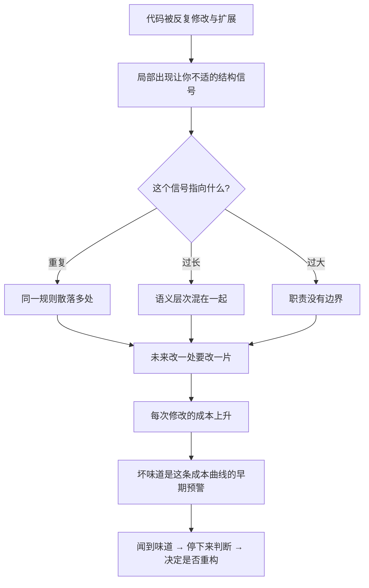

# 08｜什么是「代码坏味道」？为什么它是信号而不是罪名？

> 一个听起来像骂人的词：说一段代码有「坏味道」，到底是在说它错了，还是只是说它不对劲？

---

## 一、先说结论

福勒用的「代码坏味道」（code smell），**不是 bug，也不是罪名**。

坏味道指的是：代码里某种让你**隐约觉得不舒服**的结构信号。有坏味道的代码可能运行得完全正常，测试也全绿，功能没有任何问题。它不好闻的地方在于——**它可能指向一个更深的结构问题。**

福勒给坏味道定的角色，不是「判决书」，而是「提示灯」。闻到味道，不等于必须马上动手，而是意味着：**你该停下来看一眼，判断这里要不要处理。**

更重要的是，坏味道还给团队提供了一套**共同语言**。有了「这是重复代码」「这是过长参数列表」这样的词汇，大家讨论问题时，说的就是同一件事，而不是各凭感觉比划。

---

## 二、我们先理解一个问题

设想一段线上代码。它已经稳定运行两年，功能从来没出过问题，用户也满意。唯一的问题是：这个类有八百多行，一个方法里嵌套了四层 if，某个函数有八个参数。

现在问题来了：

> **它没坏，还要不要改？**

这正是坏味道这个概念要处理的核心难题。

如果我们把「坏味道」理解成「代码有问题」，那么就产生一个逻辑矛盾：既然它跑了两年都没事，为什么说它「有问题」？很多人正是在这里卡住，把坏味道当成一种吹毛求疵的洁癖。

但如果我们换一个角度——坏味道不描述「现在」，而描述「未来」——事情就顺了。它说的不是「你现在错了」，而是「**照这个方向走下去，你以后会更难受**」。

所以这一篇要解决的问题是：

> **坏味道究竟是什么？为什么它可以和 bug 完全分离，却依然值得被认真对待？**

---

## 三、作者到底提出了什么观点？

坏味道这个概念，并不是福勒一个人闭门造出来的。福勒在书里说明，它来自他和**肯特·贝克**的一次讨论——两人在聊「什么样的代码看着就不对劲」时，借用了一个很形象的说法：**smell（味道）**。

福勒的观点可以概括为三点。

**第一，坏味道是启发式的（heuristic），不是硬性规则。**

它不像「数组越界」那样有明确的判定标准，而更像一句「我闻到味儿了」。同一段代码，有经验的工程师会觉得刺鼻，新手可能毫无感觉。它依靠的是被训练过的直觉，而不是机械检查。

**第二，坏味道是重构的触发器。**

坏味道本身不是终点，它指向一个动作：**要么现在就处理，要么记下来以后处理。** 它把「我隐约觉得这里不好」这种模糊的感受，变成了一个可以讨论、可以决策的起点。

**第三，坏味道是一种共同语言。**

在书里，福勒列出了许多具体名字，比如重复代码、过长函数、过大的类、过长参数列表、发散式变化等等。（第二版列出了二十多种。）这些名字的价值，不只是分类，而是**让团队能用一套词说话**。当同事说「这里有个数据泥团」，其他人立刻知道他在说什么，而不需要先花五分钟描述现象。

---

## 四、把这个观点翻译成人话

把坏味道理解成**体检报告上的异常指标**，就非常贴切了。

你去做体检，报告上有一项指标标了箭头——偏高。这时候会发生什么？

它**不等于你生病了**。你可能一切正常，指标偏高只是因为昨晚没睡好，或者最近吃得太油。医生也不会只看这一项就给你下诊断。

但它**提示你要复查**。因为它是一个信号：这个方向可能值得留意。过一阵子再测一次，如果恢复正常，那就没事；如果持续偏高，甚至继续往上走，那就该认真查一查了。

代码坏味道完全一样：

- 它是**指标**，不是**诊断**。
- 单项异常**不能说明大问题**，需要结合上下文判断。
- 它最大的价值在于**让你别忽略它**——很多真正的结构问题，都是从「一点点不对劲」累积起来的。

反过来，一个健康的人也会有指标波动，一个正常的系统也总会有一些坏味道。**目标不是「零坏味道」，而是「不让坏味道悄悄长成结构病」。**

---

## 五、为什么会这样？

为什么坏味道能被用作信号，它背后到底在报警什么？可以这样理解整条推理链：



关键在最后两步。

坏味道**本身不是问题**，它是问题的**早期可见形态**。系统不会某天突然变得「改不动」；它是一天天累加的，而在过程中，早期其实一直有信号冒出来——只是没人理它。

所以坏味道的真正作用，是**把成本曲线拐弯之前的预警提前给你**。等到所有人都觉得「这系统动不了」时，预警早就响了无数遍了。福勒把这些信号命名、归类，就是为了让人在早期能看见它们。

---

## 六、举一个现实生活中的例子

用体检指标已经说过一遍，这里换一个开发现场的例子。

你接手一个订单系统，在读代码时发现这样一件事：

```java
if (order.getType().equals("NORMAL")) {
    // 普通订单打九折
} else if (order.getType().equals("VIP")) {
    // VIP 订单打八折
} else if (order.getType().equals("SUPER_VIP")) {
    // 超级 VIP 打七折
}
```

这个判断，你在下单、退款、结算三个地方都看到了。功能上一切正常，算出来的价格也是对的。

但你会不舒服。为什么？

因为你的直觉告诉你：**「订单类型及折扣」这条规则，现在被抄了三份。** 将来产品说「新增一个企业客户，打六五折」，你就得同时改三个地方。改对了没事，漏掉一个，就是一个极难发现的线上价格 bug。

这就是坏味道的典型体验：**你闻到的不是「现在错了」，而是「未来会出事的形状」。**

而如果换一个没经验的同事来看，他可能完全无感——因为代码确实能跑。这说明坏味道依赖的是经验，是一种被训练出来的敏感度。它不是代码的属性，而是**代码结构和「未来变化方式」之间的关系**。

---

## 七、回到书中重新理解

再回到福勒的原始论述，就能理解他为什么把一整章用来「列名字」了。

表面看，那一章像一份清单：重复代码、过长函数、过大的类、发散式变化、霰弹式修改……为什么要花这么大篇幅，给这些「感觉」一一命名？

因为**没有名字，就无法讨论。**

想象一个团队在代码评审。如果大家只能说「我觉得这段代码怪怪的」，那讨论很快就散掉了。但如果大家有一套共同词汇，评审就能变成具体的技术对话：

> 「这里有两种变化会被同一个类影响，是发散式变化。」
> 「这个参数列表太长了，考虑引入参数对象。」
> 「这四处判断其实是一件事，属于重复代码。」

福勒把坏味道命名、分类，本质上是在给团队**装一套诊断语言**。这也是这一章真正的价值所在——它是从「个人直觉」走向「团队能力」的关键一步。

同时也要注意福勒的分寸感：他列出坏味道，是为了让你**识别**，不是让你**一发现就改**。命名是诊断的第一步，接下来还有一步判断：这个味道严不严重、现在该不该处理。这两步不能合并。

---

## 八、这个观点背后还有什么？

第一，坏味道有一个隐含前提：**代码会继续变化。** 如果一个系统写完之后永远不再改动，那么重复也好、过长也好，都无关紧要。坏味道之所以成问题，本质上是因为「未来还会有人来改它」。这也解释了为什么坏味道和「变化」密不可分。

第二，坏味道背后其实藏着一个更深的判断标准：**代码结构，是否和变化的方式对齐。** 重复代码之所以危险，是因为一条规则的多个副本需要同时变；发散式变化之所以麻烦，是因为一个模块被多种变化拉扯。它们指向的是同一件事——**结构的边界，和变化的边界错位了。**

第三，坏味道和测试不同。测试告诉你「**现在**功能对不对」，坏味道提示你「**将来**改动贵不贵」。一个系统可以测试全绿、坏味道满身。这恰恰说明两者不可替代：测试守住正确性，坏味道守住可维护性。

第四，坏味道的识别能力是**可以被培养的**。新手看代码没有反应，不代表代码干净，只代表嗅觉还没练出来。这也意味着，坏味道既是一个技术概念，也是一种需要刻意练习的经验。

---

## 九、这个观点有问题吗？

有几个地方值得保持警惕。

第一，**坏味道的判定标准是主观的。** 同样是八百行的类，有人觉得无法忍受，有人觉得还行。它没有「行数超过多少就是坏味道」这样的硬指标。这意味着不同的人、不同的团队，对同一段代码的结论可能完全不同。**这是它的灵活之处，也是它的软肋。**

第二，**它非常容易被滥用成一种指责。** 「你这代码有坏味道」在有些团队里会变成一种居高临下的评价，让对方感到被冒犯。福勒的本意是提示，不是定罪；但现实中，术语一旦带上「坏」字，就难免被当成批评。**这也是为什么这一篇要强调：它是信号，不是罪名。**

第三，**闻到味道不等于该动手。** 这是新手最容易犯的错：学会了坏味道的名字之后，开始到处「除味」，把大量时间花在对业务毫无影响的代码上。前一篇讲的时机判断，在这里同样适用——**坏味道只负责提示，不负责决定。**

第四，**有些坏味道是权衡后的合理选择。** 为了性能、为了兼容旧系统、为了赶一个截止日期，团队有时会**故意**保留某种坏味道。承认这一点很重要：坏味道是一个需要被**知情地接受或处理**的信号，而不是一个必须消灭的敌人。

---

## 十、今天再看这个观点

（以下为现代延伸，非福勒原文）

坏味道概念诞生于人工阅读代码的年代。今天，它正在被工具「半自动化」。

- **静态分析工具**可以自动报告重复代码、过大的类、圈复杂度过高的函数。过去靠鼻子闻的东西，现在可以靠仪表读。
- **代码评审平台**能长期追踪一个文件的改动频率和复杂度变化，让「这段代码正在变味」变得可观察，而不只是靠某个人的印象。
- **持续集成**把坏味道的检查变成了流水线里的一环：允许存在，但超过阈值就亮红灯。

这带来一个微妙的变化：坏味道从「**人的嗅觉**」变成了「**系统的指标**」。好处是更客观、更不容易被忽视；风险是，指标会替代判断——团队开始只盯着分数，而忘记了「这个味道在这段代码里到底要不要紧」。

更进一步，**AI 编程助手也带来了新形态的坏味道**。AI 能快速生成大量看起来正确的代码，但这些代码可能结构松散、重复隐蔽。传统坏味道强调人要有嗅觉；而在 AI 大量产出的时代，人的嗅觉反而更关键了——因为**没有判断力的人，会把有味道的代码原样接收下来，并让它更快地扩散。**

所以福勒这个概念的现代价值，可能不在于「识别」，而在于「判断」：工具能帮你闻到，但决定要不要处理的，还是你。

---

## 十一、这一篇真正应该记住什么？

1. **坏味道是信号，不是罪名。** 它不代表代码错了，甚至不影响运行，只提示结构可能有问题。

2. **它是启发式，不是硬规则。** 依赖经验判断，没有精确阈值，同一个人不同阶段、不同团队结论可能不同。

3. **它是重构的触发器。** 闻到味道不等于马上动手，而是提醒你停下来看一眼，再决定处理还是记录。

4. **它是团队共同语言。** 有了「重复代码」「过长函数」这些词，代码评审才能从模糊感受变成具体讨论。

5. **目标是信号被看见，不是消灭所有味道。** 有些坏味道是权衡后的合理选择，知情的接受比盲目的清理更重要。

---

## 十二、留一个问题

坏味道有很多种，福勒列了二十多个名字。但如果你只能先记住一个，应该记住哪一个？

福勒自己的答案似乎很清楚：**重复代码排在头号。**

这有点反直觉——复制粘贴明明是最省事的做法，为什么反而成了最该被消灭的那个？多打几行字，真的有这么严重吗？

下一篇，我们就专门来看这个问题：**重复代码的真正代价，到底是什么。**
