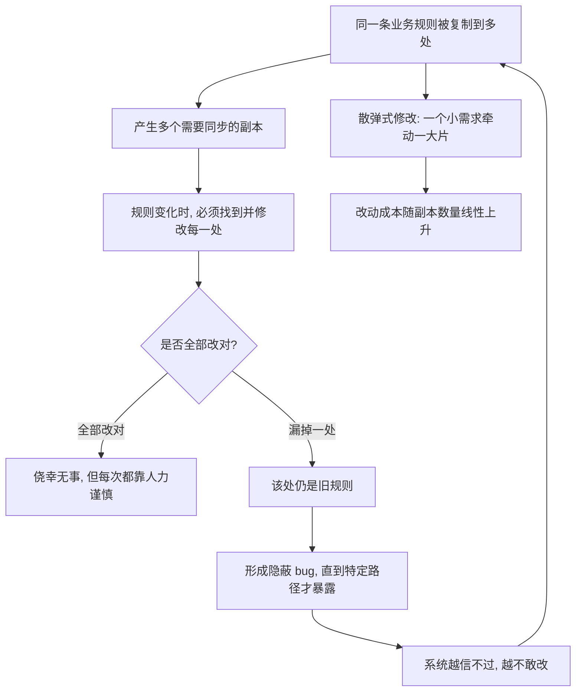

# 09｜重复代码为什么是头号敌人？

> 复制粘贴明明是程序员最顺手的动作，为什么福勒偏偏把它列为最该消灭的坏味道？

---

## 一、先说结论

福勒把重复代码排在坏味道的第一位，**不是因为它多打了几行字，而是因为同一套规则被抄到了多个地方。**

真正的问题在于：当这套规则需要变化时，你**必须找到每一处副本，并且全部改对**。漏掉任何一处，就是一个隐蔽的 bug——而且是最难发现的那种，因为代码看起来「明明是对的」，只是某一条规则在某一个角落里还停留在旧版本。

重复代码把「**改一处**」变成了「**改一片**」。它让每一次正确修改，都变成一场「我有没有漏掉哪一处」的猜谜游戏。这就是它被称为头号敌人的原因。

---

## 二、我们先理解一个问题

先看一个再普通不过的场景。

产品说：所有订单的手续费从 1% 调到 1.5%。你打开代码，发现费率 `0.01` 出现在七八个文件里：下单时算一次、退款时算一次、生成报表时算一次、对账时又算一次。

你谨慎地一个个改过去，改完、测试、上线。三天后财务发现，对账报表里的手续费还是旧费率——因为那个文件里，费率不是写成 `0.01`，而是写成 `0.1 / 10`，你的搜索没有匹配到。

问题来了：

> **为什么明明只是「把 1% 改成 1.5%」这么简单的事，最后会变成一次线上事故？**

答案不在「你不够小心」，而在**代码的结构本身就在引诱你犯错**。当同一条规则存在多个物理副本时，「全部改对」这件事，就从一个动作变成了一项必须靠记忆和运气的任务。

所以这一篇要回答的是：

> **重复代码的真正代价，到底藏在哪儿？为什么福勒把它放在坏味道的第一位？**

---

## 三、作者到底提出了什么观点？

福勒的观点可以用一句话概括：

> **重复代码的危险，不在于「多」，而在于「散」。**

具体可以拆成三层。

**第一层：重复是「单一事实来源」的破坏。** 理想状态下，一条业务规则应该只在一个地方被定义，其他地方都引用它。一旦这条规则被复制，你就有了多个「事实来源」，而多个来源迟早会不一致。

**第二层：重复直接导致「散弹式修改」（Shotgun Surgery）。** 这是福勒命名的另一种坏味道。它的意思是：一个本来很小的变化，却要求你在系统里东改一枪、西改一枪，改很多个地方。重复代码正是散弹式修改最常见的成因。

**第三层：因此重复是维护成本最直接的放大器。** 别的地方出问题，影响的是一个点；重复出问题，影响的是「你有没有把所有的点都找全」。后者的风险随着系统变大而急剧上升。

在软件工程界，这个思想有一个更广为人知的名字：**DRY 原则**（Don't Repeat Yourself，不要重复自己）。它出自 Hunt 和 Thomas 的《程序员修炼之道》。福勒没有声称自己发明了这个原则，但重复代码被他列为头号坏味道，和 DRY 是同一个思路。

---

## 四、把这个观点翻译成人话

用一句话说：

> **重复不是「多打了几行字」，而是「同一条规则有了好几个需要同步的版本」。**

想象一条法律条文。如果它只写在法律全书的第 3 章，那么修法时只改第 3 章，全国统一生效。但如果这条规定被分别抄进了全省的 100 个办事指南，那么修法时，你得确保 100 本指南全部更新——少更新一本，那个地方的人就会按旧规矩办事。

而这个「漏掉的版本」不会立刻暴露。它只是安静地待在那儿，等到某个具体业务走到那条路径时，才突然出错。

所以重复代码的代价，可以分成两笔：

- **看得见的代价**：每次改动要改多个地方，费时费力。
- **看不见的代价**（更可怕）：某一次你漏掉了其中一处，而且**没人发现**。

第二笔代价，才是福勒把它当头号敌人的真正原因。

---

## 五、为什么会这样？

把这条逻辑展开，是一条清晰的推理链：

图里最值得盯住的，是 **D 这个分叉点**。

在「全部改对」这条路上，你并没有获得任何结构性收益——你只是靠着足够小心，侥幸躲过了一次事故。而在「漏掉一处」这条路上，代价却是指数级的：一个本该十分钟完成的需求，变成了一次线上排查。

**收益是线性的，风险却是指数级的。** 这就是重复代码最不公平的地方。它让你在平时感觉不到痛，却在某一次悄悄加倍收账。

再看下面那条回路：失败的经历会让团队「不敢改」，不敢改又让重复继续堆积。重复代码因此很容易进入自我强化：越乱越不敢动，越不动越乱。

---

## 六、举一个现实生活中的例子

**各地的通知张贴**，是理解重复代价最直观的场景。

假设一家公司要发布一条新规定：员工报销的审批额度，从 5000 元提高到 8000 元。这条规定被分别打印、张贴在全国 30 个办公区的公告栏上。

一开始，这看起来是「贴近员工」的好做法——每个地方都能就近看到。

半年后，公司又把额度改成 10000 元。行政人员需要通知 30 个办公区，把每一张旧通知换掉。多数办公区换了，但有两个偏远的办公区忘了，那里的员工依然按 8000 元的标准执行。直到有一笔报销卡住，问题才被发现。

注意这里发生了什么：**规定本身完全一样，改动本身也非常简单，但「它存在于 30 个副本」这个事实，让一次简单修改变成了一个高风险的同步任务。**

正确的做法是什么？只在一处维护规定——比如公司内部系统里的一个页面——各地都指向它。这样改一次，全国生效。

代码里的重复，就是这 30 张分散的纸质通知。**问题从来不是「通知写错了」，而是「同一份通知被抄了太多遍」。**

回到开发场景：你发现金额校验逻辑在两个服务里各写了一份。合并它不是因为它「看起来重复」，而是因为**将来金额规则变化时，你希望只改一处**。这才是消除重复的真实动机。

---

## 七、回到书中重新理解

现在再看福勒为什么把重复排在坏味道的第一位，就清楚了。

坏味道有很多种：长函数、过大的类、过长参数列表……但它们的危害，大多局限在**一个局部**。唯有重复代码，它的危害是**跨局部**的——它让本应彼此独立的代码片段，偷偷建立了一种「必须同步变化」的隐形契约。

而且，很多其他坏味道的深处，最后都能追溯到重复：

- **散弹式修改**，本质是重复规则散落多处。
- **重复的 switch**，本质是一套分类逻辑被抄了一遍又一遍。
- **数据泥团**，往往是同一组数据在多个地方被各自定义。

所以福勒把重复列在首位，不只是因为它最常见，更因为它是**大量其他问题的共同源头**。理解了重复，你就拿到了理解一大半坏味道的钥匙。

另外值得注意福勒对「消除重复」的分寸：他说的不是「看到任何相似就合并」，而是「**同一条知识、同一条规则**被重复」。相似的外形不一定是同一件事，这一点非常重要，下面还会展开。

---

## 八、这个观点背后还有什么？

**第一个隐含前提：重复的危险，来自未来还会变化。**

如果一条规则永远不变，那么它被抄一百份也无所谓——反正不会有人去同步。重复之所以是问题，前提是**这条规则还会变**。所以判断重复有多严重，一个实用的问法是：这条规则改动的频率有多高？改得越频繁，重复的代价越大。

**第二个联系：DRY 不只是「代码别重复」，而是「知识别重复」。**

Hunt 与 Thomas 提出的 DRY，落脚点在「知识」——一条业务规则、一个决策、一个约束。两段代码长得像，但如果它们背后是两种不同的业务含义，那它们就不算 DRY 意义上的重复。这是很多人误用 DRY 的根源。

**第三个联系：消除重复和抽象之间的关系，并不总是正向的。**

把重复合并起来，通常需要引入一层抽象（比如抽出一个函数、一个类）。抽象是正确的方向，但抽象本身也有代价：它增加了间接性，也让「读代码时到底跳不跳」变成了脑子里的额外负担。这就引出了下一节的争议。

---

## 九、这个观点有问题吗？

哪里争议最大？恰恰在「**要不要消除所有重复**」这个问题上。

有一个被不少工程师表达过的观点：**重复往往比错误的抽象更便宜。**

意思是：复制两段相似的代码，代价是将来可能要改两处；但如果为了消除这点重复，过早地抽象出一个「通用」的东西，一旦发现这两个场景其实会走向不同方向，那层抽象就会变成枷锁——你要么被迫接受一个别扭的通用接口，要么花更大代价把它拆回来。**错误的抽象，比老实的重复更难收拾。**

这背后有一条业界流传的经验：**不成熟的抽象是有害的。** 有些工程师主张，宁可先容忍一点重复，等到规律真正清楚、第三次出现时再抽象。这正好呼应了前一篇讲的三次法则。

除此之外，还有两个值得注意的点。

第一，**「重复」的判定本身有难度。** 代码长得一样，不一定是重复；长得不一样，也可能是重复。比如两个函数都在做「记录日志」，但一个是为了审计，一个是为了排障——它们外形相似，语义却不同。这种「**假重复**」，如果被粗暴合并，反而会制造耦合。

第二，**消除重复的时机和成本难以精确计算。** 合并两处逻辑，可能牵动测试、影响调用方、甚至改变性能特征。所以「消除重复」也不是无条件的正确，它同样是一场权衡。

总结一下争议的落点：**不存在「重复一律要消灭」的规则。** 福勒主张的是识别重复、理解它的成因，再判断这次合并是「让知识归位」还是「过早抽象」。前者值得做，后者要警惕。

---

## 十、今天再看这个观点

（以下为现代延伸，非福勒原文）

重复代码在今天的形态，比福勒写作时更复杂了。

一方面，**工具让「发现重复」变得前所未有的容易**。IDE 能高亮相似代码，静态分析能跨文件比对，重复检测甚至能提示「这两处代码有 85% 相似」。过去靠肉眼和记忆找出的重复，现在能被自动标出来。

另一方面，**AI 编程助手正在大量制造一种新的重复**。你让 AI 补一个功能，它可能照着旁边已有的代码再写一份，而不是去调用已经存在的函数——因为「照着写」对它来说最省事，也最不容易出错。于是同一条规则，可能在几个 AI 生成的片段里各有一份副本。

这带来一个耐人寻味的结果：**AI 让「写重复代码」的成本降到了近乎为零，却没有降低「维护重复代码」的成本。** 生成时候的那点便利，被推迟成了未来的同步风险。

所以福勒把重复列为头号敌人的判断，在今天不但没有过时，反而更需要被重申。真正需要人来做的事情也变了：不再是「找出重复」（工具能做），而是判断「**这是不是同一条知识**」——是真正的重复，还是只是碰巧长得像。这个判断，工具和 AI 都还替不了你。

---

## 十一、这一篇真正应该记住什么？

1. **重复的真正代价是「规则散落」，不是多打几行字。** 同一条知识有了多个副本，就有了迟早不同步的风险。

2. **重复把「改一处」变成「改一片」。** 它带来的散弹式修改，让一个小需求牵动一大片代码，成本随副本数量上升。

3. **收益线性、风险指数级。** 全部改对只是侥幸没出事，漏掉一处却是极难排查的隐蔽 bug，这正是它被列为头号的原因。

4. **DRY 针对的是「知识」，不是「长得像」。** 两段代码相似但业务语义不同，合并它们反而会制造错误的耦合。

5. **消除重复也要权衡。** 有不成熟的抽象陷阱：有工程师认为，重复往往比错误的抽象更便宜，第三次出现再抽象更稳妥。

---

## 十二、留一个问题

重复代码之所以危险，是因为它把「一件事」拆散到了很多地方。

那么反过来想：如果一段代码**没有被复制**，它是不是就没问题了？

恐怕不是。还有一种更隐蔽的情况：一段逻辑只存在于一个地方，但它**长到没人能一口气读懂**——高层意图和底层细节全部搅在一起，注释写了满满一屏。

这算不算坏味道？为什么福勒坚持「函数应该短」？长函数的问题，真的只是「长」吗？

下一篇，我们就来看**过长函数**，以及「短」背后真正的理由。
