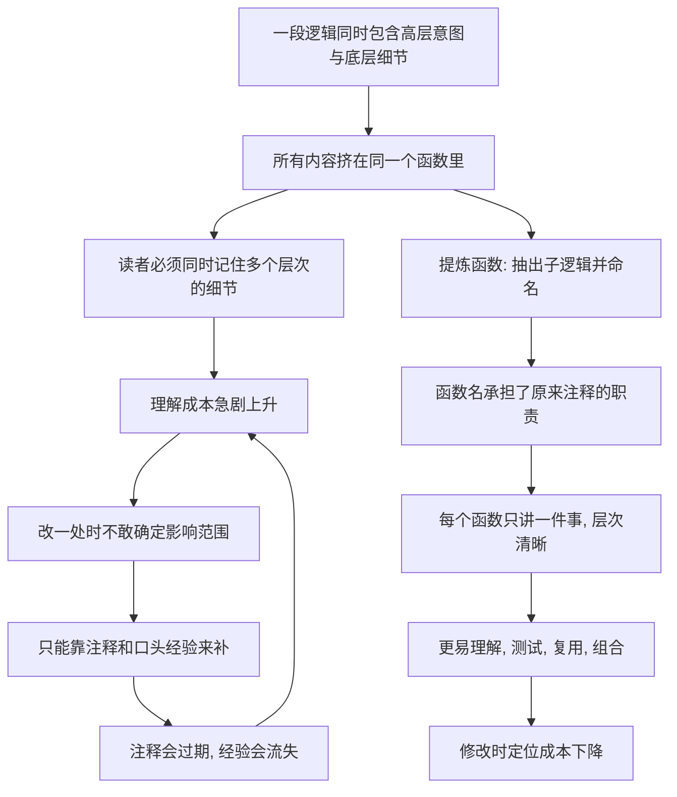

# 10｜为什么函数应该短？——过长函数的真正代价

> 函数长一点，不是能把所有逻辑一次看完吗？福勒为什么偏偏坚持函数要短？

---

## 一、先说结论

福勒坚持函数要短，**不是因为「行数越少越高级」，而是因为长函数的真正问题在于「语义层次」被搅在了一起。**

一个长函数里，往往同时装着一件事的**高层意图**、**中层步骤**和**底层细节**。读它的人必须一边处理「这段在干什么」，一边处理「这行具体怎么实现」，脑子被迫同时记住十几件事。这就是它难读的根源，而不是「行数太多」本身。

短函数的解法，是**一次只讲清楚一件事**，并让**名字**代替注释。福勒最核心的手段是**提炼函数（Extract Function）**：把一段逻辑抽出来，起一个能说明意图的名字。他还给过一条实用判据：如果一个函数需要注释来解释它「在做什么」，那就该考虑把这段提炼出去，让注释变成函数名。

但要注意分寸：**函数短不是越短越好，拆得太碎同样有害。**

---

## 二、我们先理解一个问题

看下面这段伪代码。它是一个「提交订单」的函数，大约一百多行，大致结构是这样的：

```text
submitOrder():
  1. 校验用户是否登录、是否有权限、是否被风控拦截
  2. 校验商品是否上架、库存是否充足、限购数量是否超限
  3. 计算原价、优惠、运费、税费、最终金额
  4. 扣减库存、生成订单、创建支付单、发送通知
  5. 写日志、埋点、更新缓存
```

这段代码能跑，而且逻辑都是对的。

有人会说：**「长函数不是挺好的吗？所有逻辑都在一个地方，从上到下看一遍就全懂了，不用在多个函数之间跳来跳去。」**

这个说法听起来很有道理，它抓住了「局部性」这个优点。但它忽略了一件事：当你从上往下读这一百多行时，你的大脑正在做一件非常费力的工作——**它必须记住前面所有的细节，才能理解后面的一行。**

于是问题变成：

> **为什么「一次看完」反而不容易看懂？长函数真正让人吃力的地方，到底在哪里？**

---

## 三、作者到底提出了什么观点？

福勒关于长函数的观点，可以拆成三层。

**第一层：问题不在长度，在「语义层次混乱」。**

一个函数里，如果并排出现「校验用户权限」和 `if (user.level > 3 && user.flags.contains("A"))`，那问题不在于它有多少行，而在于这两个东西**不是同一个抽象层次**。前者在说「做什么」，后者在说「怎么做」。把它们塞在一起，读者就得在两种思维模式之间反复切换。

**第二层：短函数的价值，是用名字替代注释。**

福勒有一个很实用的判断方式：**如果你需要写一段注释来解释某几行代码在干什么，那就干脆把那几行提炼成一个函数，用函数名当注释。** 这样注释就变成了代码的一部分——而且它不会像注释那样过期。注释可能忘记更新，函数名却必须跟着代码改。

**第三层：短函数更易测试、复用和组合。**

函数短、只做一件事，就更容易被单独测试（输入明确、职责单一），也更容易在不同地方被复用来拼装更大的逻辑。长函数则往往只能整体测试、整体复用，一旦要拆借其中一部分，就得连着一堆无关逻辑一起搬走。

福勒用的核心工具是**提炼函数（Extract Function）**——这是他在书里最基本、也最高频的重构手法之一。

---

## 四、把这个观点翻译成人话

用**一篇不分段的文章**来理解，最合适。

想象你拿到一篇文章，它整整一页，**没有任何分段**。所有内容从第一行一直排到最后一行。

奇怪的是，这篇文章其实写得不错，句子也通顺，内容也有条理。但你读起来就是很累，读到最后已经忘了开头讲了什么。

为什么？因为**段落就是文章的「语义层次」**。分段做的事，是告诉你：这一块在讲一件事，下一块在讲另一件事。没有段落，读者就失去了这个导航，只能自己一边读一边在脑子里重新切分。

好的分段文章则完全不同：你扫一眼小标题，就知道每段在讲什么；需要细节时再进去看，不需要时可以直接跳过。**段落的标题，就是函数的「名字」。**

长函数就是那篇不分段的文章。短函数则像结构清晰的报告：每一节只讲一件事，标题说明了它讲什么。你甚至不需要读完每一节，也能把握整体结构。

福勒说的「函数应该短」，本质就是这句话：

> **把「一段逻辑」变成「一个有名字的段落」。**

---

## 五、为什么会这样？

把这条逻辑整理成推理链：



图里最关键的是 **C 这一步**。

长函数之所以费脑，是因为人一次能同时持有的「活跃信息」是有限的。一个函数里层次越多，读者需要同时抓住的上下文就越多，一旦超过容量，理解就会失败——这不是能力问题，是认知规律。

而提炼函数做的事，是**用命名把信息压缩**。当一段底层细节被折叠成一个名字叫「校验用户权限」的函数后，读者在高层阅读时，只需要看这个名字，不必关心里面怎么实现；只有真正需要时，才展开进去看细节。**这就是所谓的「分层阅读」：名字负责压缩复杂度。**

---

## 六、举一个现实生活中的例子

用阅读一份**技术文档**和**一段代码**做对比，会更贴近开发者。

假设你接手一个项目，要理解「优惠券是怎么算进去的」。你打开代码，看到这样一个方法：

```java
public BigDecimal calculateTotal(Order order) {
    // ... 20 行校验 ...
    // ... 15 行库存判断 ...
    // ... 40 行价格与优惠计算 ...
    // ... 25 行下单、通知、日志 ...
}
```

一百多行读下来，你大概能勉强明白它在干什么，但你也说不清「优惠券到底在哪一步生效」——因为它被埋在一大堆别的东西中间。

现在换一个版本：

```java
public BigDecimal calculateTotal(Order order) {
    validateOrder(order);
    checkStock(order);
    BigDecimal price = calculatePrice(order);
    BigDecimal discount = applyCoupon(order, price);
    return applyShipping(price, discount);
}
```

同样是十秒阅读，但这个版本让你一眼就看到了**整体流程**：校验、查库存、算价、用券、加运费。你甚至不需要看每个方法的实现，就已经理解了主逻辑。想看优惠券的具体规则时，再点进 `applyCoupon` 就好。

这就是短函数带来的核心变化：**高层读结构，低层读细节，两者不再互相干扰。**

这和文章分段是同一个道理。你读一份报告，先看目录和小标题，就掌握了全文骨架；要深究某一节，再翻进去。**没人要求你为了理解文章，把每一段的每个字都同时记在脑子里。**

同样地，函数过短的极端也要提防。如果一个函数只是简单转发一次调用，名字也没有增加任何信息量，那它就只是增加了「跳来跳去」的负担。**短是为了让层次清晰，不是为了把代码切碎。**

---

## 七、回到书中重新理解

现在再回看福勒那句「函数应该短」，就不会把它误解成一种行数崇拜了。

他真正关心的是**读者的理解成本**。在书里，提炼函数被放在最基础的位置，几乎所有其他重构手法最后都会用到它——因为「把一段有意义的逻辑抽出来并命名」，是让代码变得可读的通用动作。

福勒还反复强调命名的重要性。他并不认为「短」本身能带来可读性，**「短 + 有意义的名字」才可以**。一个只有三行、却叫 `doStuff()` 的函数，不会让任何人更容易理解；一个被抽出来、名字准确表达意图的函数，才真正把复杂度压缩掉了。

所以他反对的从来不是「长」，而是**「一段代码同时承担了多个抽象层次，且没有名字来区分它们」**。理解了这一点，你就明白了为什么这一章的标题是「长函数」，而解药却主要是「命名」和「提炼」。

---

## 八、这个观点背后还有什么？

**第一，它和「注释」那一条坏味道是连着的。**

福勒说过一句容易引起误解的话：注释有时是坏味道。他的意思并不是「不要写注释」，而是：**当一个注释在解释「代码在干什么」时，它往往是在替一段表达不清的代码打掩护。** 如果能用提炼函数加命名，让代码自己说清楚，那比注释更可靠——因为注释会过期，函数名不会。

**第二，它和「单一职责」在函数层面的投影是同一个东西。**

一个函数只做一件事，其实是把「职责划分」缩小到了函数粒度。函数太长，通常意味着它承担了太多职责；把它拆短，就是在恢复职责的边界。这一点，在讲「过大的类」时会以更大的尺度再次出现。

**第三，命名是一种「知识压缩」，它把口头经验固化了下来。**

老手读长代码时，能凭经验迅速分辨层次；但这份能力在团队成员之间无法传递。短函数加上准确命名，把这种「只有老手才有的分层能力」**写进了代码里**，让新人也读得懂。这是它对团队协作的真正价值。

---

## 九、这个观点有问题吗？

有一个明显的争议：**「短」到底有没有一个标准？**

福勒没有给，也几乎没人给得出。三行算短吗？二十行算长吗？答案是：**脱离上下文没法判断。** 一个包含复杂业务规则的函数，二十行可能已经很清晰；一个简单逻辑却拆成七个函数，反而让人疲于跳转。所以「函数应该短」是一条方向，不是一个阈值。

另一个值得警惕的是**过度提炼**。有些团队把「函数越短越好」奉为纪律，结果是：

- 函数被拆得极碎，读一个逻辑要在十几个函数之间跳来跳去；
- 名字开始变得空洞（`handleData`、`processItem`），因为太短的片段本来就没有清晰的语义；
- 抽象层次反而更乱——读者失去了「整体在哪、细节在哪」的锚点。

这引出一条务实的态度：**提炼的价值要看它是否降低了理解成本。** 如果一个提炼没能让某件事变得更容易理解，那它就只是把代码切碎了，而不是改善了结构。

此外，还有两个现实约束。第一，**性能敏感的场景**里，频繁的函数调用（尤其在没有充分优化的情况下）可能有开销，虽然多数情况下可以忽略。第二，**遗留系统**里到处是长函数，一次全拆既不现实、也不安全，更合理的做法是**在要改动的那一部分**顺手提炼，而不是专门开一个「拆函数」的项目。

结论是：**短是手段，理解成本才是目标。** 把「短」当成目的，就背离了福勒的本意。

---

## 十、今天再看这个观点

（以下为现代延伸，非福勒原文）

长函数这个话题，在工具发达之后，姿态发生了一点变化。

一方面，**IDE 让提炼函数变成了几乎零成本的操作**。选中一段代码，一键提取、自动生成参数、自动替换调用点。当年需要手工搬运、小心验证的重构动作，现在几秒钟就能完成。这意味着「把长函数拆短」的执行门槛，比福勒写书时低得多。

另一方面，**「短」这件事本身可以被工具自动度量**。圈复杂度、函数行数、嵌套深度都能被静态检查直接报出来。于是有些团队把「函数不超过 N 行」写进了代码规范，交给流水线把关。

但这也带来了反向的风险：**当「短」变成一条可自动检查的指标时，它很容易被异化成数字游戏。** 为了压行数而拆函数、为了过检查而机械提炼，都会产生那种「很短、但更难懂」的代码。指标能衡量长度，衡量不了清晰度。

还有一层现代延伸，和 AI 有关。**AI 生成代码时，天然倾向于产出长函数**——它把用户描述的所有步骤一次性铺进一个方法里，读起来像是把需求文档逐句翻译成了代码。这种代码往往「能跑、层次混乱」，恰恰是最需要提炼函数的那一类。

于是今天真正的分工可能是这样：**工具负责发现「这里太长了」，AI 负责执行「把它拆开」，而人负责判断「拆成什么名字、按什么边界拆、拆完是不是真的更清楚了」。** 最后那一问——「这个提炼有没有降低理解成本」——始终是人的工作。

---

## 十一、这一篇真正应该记住什么？

1. **长函数的问题不在「长」，在「语义层次混乱」。** 高层意图和底层细节搅在一起，读者要同时记住太多东西，这才是难点。

2. **短函数的本质是用名字替代注释。** 把一段逻辑提炼出来并起个说明意图的名字，比写一段会过期的注释更可靠。

3. **提炼函数是最核心的动作。** 如果一个函数需要注释来解释它在做什么，就考虑把那段逻辑提炼出去。

4. **短函数更容易测试、复用和组合。** 职责单一的函数，输入明确、边界清晰，是拼装更复杂逻辑的更好积木。

5. **短是手段，不是目标。** 拆得太碎、名字空洞的代码同样难读；判断标准始终是「理解成本有没有真的下降」。

---

## 十二、留一个问题

我们已经看到，一个函数太长的典型症状，是「把太多不同层次的东西塞进了一件事里」。

那么，如果把这个尺度放大到一个**类**呢？

一个类如果什么都管——下单、退款、通知、报表、对账全在里面——它会变成什么样子？为什么这种类在维护时如此令人头疼？而那些参数多到写不下调用语句的函数，又是怎么一步步长成那样的？

下一篇，我们就来看看复杂度是如何在更大的尺度上堆成山的：**上帝类与过长参数列表**。
