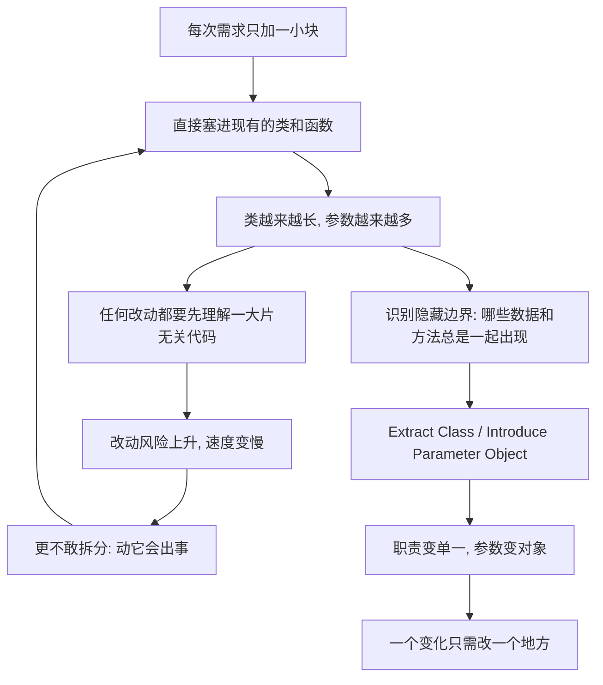

# 11｜上帝类与过长参数列表：复杂度是怎么堆成山的？

> 一个类为什么会长成什么都管的庞然大物？一个函数的参数，为什么总会越加越多？

---

## 一、先说结论

福勒把「过大的类」（上帝类）和「过长的参数列表」放在一起讲，是因为它们其实是同一件事的两面：**没有及时拆分。** 上帝类承担的职责太多，导致任何一个小改动都要碰它；过长参数列表则说明一次调用要同时知道太多信息，而这些信息往往本来就该是一个整体。它们的共同解药，是**识别出隐藏的边界，然后把边界内的东西提炼出去**——用 Extract Class 拆类，用 Introduce Parameter Object 把参数打包成对象。

这不是行数问题，是理解成本问题。

---

## 二、我们先理解一个问题

设想一个电商系统里的 `OrderService`。

它最初只做一件事：创建订单。代码两百行，清清楚楚。

后来产品说要支持取消订单，加进去；要支持退款，加进去；要算优惠券，加进去；要对接物流、开发票、处理积分、发送通知、计算跨境税费……每一次需求，都是在这同一个类上「顺手补一块」。

三年后，这个类有三千多行、八十多个方法、四十多个字段。新人想改一行退款逻辑，得先读懂整个文件。

与此同时，类里某个方法的签名长成了这样：

```java
BigDecimal calculatePrice(
    Long userId, String userName, int userLevel,
    Long productId, BigDecimal productPrice, int quantity,
    String couponCode, BigDecimal couponAmount,
    boolean isVip, String province, String city,
    String currency, String invoiceType
);
```

十三个参数。**没人故意把它写成这样，它是一天一天长成这样的。**

问题来了：为什么类会越来越臃肿，参数会越来越多？

---

## 三、作者到底提出了什么观点？

在「代码的坏味道」这一章里，福勒列出了两条相邻的坏味道：**Large Class（过大的类）**和 **Long Parameter List（过长的参数列表）**。请注意措辞——他说的是「味道」，不是「错误」。

**过大的类**：当一个类承担了太多职责，它就会有太多字段、太多方法。它像一个权力过度集中的机构，任何事都要经过它。福勒观察到，这类「上帝类」往往是一次次「先塞进去再说」累积出来的，而不是被谁设计出来的。

**过长的参数列表**：当参数超过三四个，阅读者就很难记住顺序和含义；更关键的是，福勒指出，很多参数之间其实彼此关联——它们本该是一个对象。长参数列表常常是「本该被识别出来的概念没被识别」的信号。

针对这两条味道，福勒给出的手法很明确：

- 对上帝类：**Extract Class（提炼类）**、Extract Subclass、Extract Interface；
- 对长参数列表：**Introduce Parameter Object（引入参数对象）**、Preserve Whole Object（保持对象完整）；
- 共同的动作只有一个：**找出该在一起的东西，把它们单独放到一个地方。**

---

## 四、把这个观点翻译成人话

先看一把**万能瑞士军刀**。

它什么都有：刀、剪子、锯、开瓶器、小螺丝刀。放在口袋里，确实便携，什么都「能」干。

但真让你拧一颗螺丝，你会去找那把专门的螺丝刀；真让你剪东西，你会拿专门的剪刀。为什么？因为**用瑞士军刀干每件事，你都要先在一堆功能里找到那一片，还要小心别被别的部件硌到手**。

上帝类就是这把瑞士军刀。它不是「坏」，它是「应急」。问题是，一个业务系统要用很多年，你不能所有的活都拿它应急。

再看**点餐**。

如果服务员只需要你说一句「来一份 A 套餐」，一句话就够了。但如果让你逐项报：「主食要什么、主菜要什么、饮料要什么、甜点要什么、几分辣、有什么忌口、要不要餐具、堂食还是打包、发票抬头……」——你报错顺序的概率立刻大增。

`Introduce Parameter Object` 做的就是这样一件事：**把「一份 A 套餐」这一个概念，从一串零散参数里还原出来。** 之后调用者只需要传一个「套餐对象」，而不是靠记忆去排十三个位置。

---

## 五、为什么会这样？

把「类越长越大」的循环画出来，是这样：



这条链的要点在于：**膨胀从来不是一次发生的，而是一个自我强化的循环。** 每加一块都很便宜，所以每次都会选择「直接塞进去」；而每塞一次，拆分的成本又高一点，于是更倾向于继续塞。

真正打破循环的，不是某天鼓起勇气重写，而是识别出那个**本来就存在的边界**。比如上面那个 `calculatePrice`，你会发现 `province`、`city`、`invoiceType`、`currency` 从来都是一起出现的——它们背后其实是一个叫「收货与开票信息」的概念。一旦你把它变成一个对象，十三个参数立刻变成三四个。

---

## 六、举一个现实生活中的例子

回到那个三十岁的 `OrderService`。

**Code review 场景。** 一个新人接手这个类，想给退款加一条「跨境订单需要额外校验」的规则。他打开文件，发现退款方法里还夹着积分回滚、发票冲红、物流拦截的代码。他花了两天才定位到该改哪几行，改完还不敢提交，因为「看起来旁边的东西也可能受影响」。

这就是过大的类最真实的代价：**它不需要有 bug，就已经让每次改动的成本高得离谱。**

**另一个场景是参数顺序事故。** 某个 `transfer(amount, fromAccount, toAccount, ...)` 曾被误传成 `(amount, toAccount, fromAccount)`，测试没覆盖到这条路径，上线后钱转反了方向。事后团队没有到处加注释提醒「注意顺序」，而是引入了一个 `TransferRequest` 参数对象——**让类型系统替你检查，而不是靠人的记忆。**

这两件事背后是同一个判断：`fromAccount` 和 `toAccount`、`province` 和 `city`，它们是有关系的，不该被当成一堆散装参数。

---

## 七、回到书中重新理解

现在再回看福勒把这两条味道排在一起，就顺理成章了。

他其实在说：**过大的类和过长的参数列表，是同一个「不拆分」习惯在两个尺度上的表现。** 一个发生在类这一层，一个发生在方法签名这一层。而在系统里，它们经常同时出现——因为一个什么都管的类，它的方法也往往是「什么都往上加」，参数自然越堆越多。

所以福勒给的手法看似很多，本质都是同一个动作：**把总是一起出现、一起变化的东西，打包成一个新的单元。** Extract Class 打包的是「方法 + 字段」，Introduce Parameter Object 打包的是「参数」。命名可以不同，动作是同一个。

福勒还给了个更细的提示：当你发现**同一组数据在好几个地方反复一起出现**时，那几乎就是在提醒你——这里有一个还没被命名的概念。这个更具体的信号，就是后面要讲的「数据泥团」。

---

## 八、这个观点背后还有什么？

第一，它预设了一个立场：**好的边界不是一开始就能全部设计出来的，而是在写代码的过程中被逐渐「发现」的。** 这与福勒一贯的演化式设计倾向一致——他不相信有人能在项目第一天就画出完美的类图。

第二，它和**单一职责原则**（SRP，由 Robert C. Martin 提出）说的是同一件事的两种语言。SRP 的经典表述是「一个类应该只有一个引起它变化的原因」。需要说明的是，这是 Martin 的措辞，不是福勒的原话；福勒用的是「职责」和「变化」这类词，但指向高度一致。

第三，它和下一篇要讲的**发散式变化**直接相连：**上帝类恰恰是发散式变化的温床**——因为它什么都管，所以它会因为各种不相干的理由被反复修改。

第四，参数对象不只是「看着清爽」。它把一组隐含的约束变成了一个**有名字、有类型的概念**，让编译器、IDE 和后来的人都能看懂。

---

## 九、这个观点有问题吗？

有，而且值得认真对待。

**首先，「太大」没有硬阈值。** 多少行算大？几个参数算长？福勒自己也没有给出一条红线。一些工程师认为，一个几百行但高度内聚的类未必是问题；反过来，机械地按行数或参数个数去拆，很容易造出一堆互相调用、彼此纠缠的小类，结果**比原来更难懂**。所以坏味道是启发式的信号，不是罪名。

**其次，引入参数对象是有成本的。** 你要多定义一个新类型、多一层间接。对于一个只在内部调用一次、参数还经常变动的私有方法，硬造一个对象可能是过度设计。有经验的工程师会先问：这组参数是不是一个稳定的领域概念？还是只是恰好凑在一起？

**再次，参数多有时是「配置」性质，而不是「概念」。** 把所有参数都强行塞进一个对象，未必自然，甚至可能把不相关的信息绑死。

这些争议的落点不是「福勒错了」，而是：**拆分是一种判断，不存在放之四海皆准的阈值。**

---

## 十、今天再看这个观点

（以下为现代延伸，非福勒原文）

**IDE 把执行成本降到了几乎为零。** 今天的 IntelliJ、VS Code 等工具都内置了 Extract Class、Introduce Parameter Object 的一键重构。福勒当年需要手动、小心完成的搬移，现在几秒钟就能做完。但工具只解决了「怎么改」，没有解决「该不该改、边界划在哪」——后者仍然完全是人的判断。

**微服务的拆分类比。** 把上帝类拆开，和把单体应用拆成服务，在思维上是同一件事：识别边界。但需要提醒的是，拆服务还要额外付出网络调用、分布式事务、部署运维的代价，**粒度选错的成本远高于拆错一个类**。所以「拆」从来不是免费的。

**AI 辅助重构。** 今天的模型可以帮你识别出反复一起出现的参数组，甚至生成参数对象的骨架代码。但一个边界是否对应真实的业务概念，模型往往只能从字面猜。**它能加速操作，不能替你承担判断。**

---

## 十一、这一篇真正应该记住什么？

1. **上帝类和过长参数列表，本质是同一件事：没有及时拆分。** 一个在类这一层，一个在方法签名这一层。

2. **判断标准不是行数，而是「改一处是否要先理解一大片无关代码」。** 让人不敢动的代码，才是真正的坏味道。

3. **一组总是一起出现的数据，往往对应一个还没被命名的概念。** 把它变成对象，是让类型系统替你工作。

4. **解药是识别边界，而不是推倒重写。** Extract Class 和 Introduce Parameter Object 是同一个动作在不同尺度上的应用。

5. **坏味道是信号，不是罪名。** 「多大算大」没有统一阈值，拆分要算收益。

---

## 十二、留一个问题

我们已经知道，拆开上帝类的依据是「哪些方法总在一起变化」。

可是现实中常有另一种困境：你明明已经把类拆小了，可**改一个需求，仍然要同时改好几个类**；或者反过来，**一个类总是因为各种不相干的理由被反复修改**。

一个「变化」，到底应该只需要改几个地方？如果答案是「一个」，那我们要对齐的，究竟是什么样的边界？

下一篇，我们就来看看福勒描述得最精妙的两种困局——**发散式变化与霰弹式修改**。
