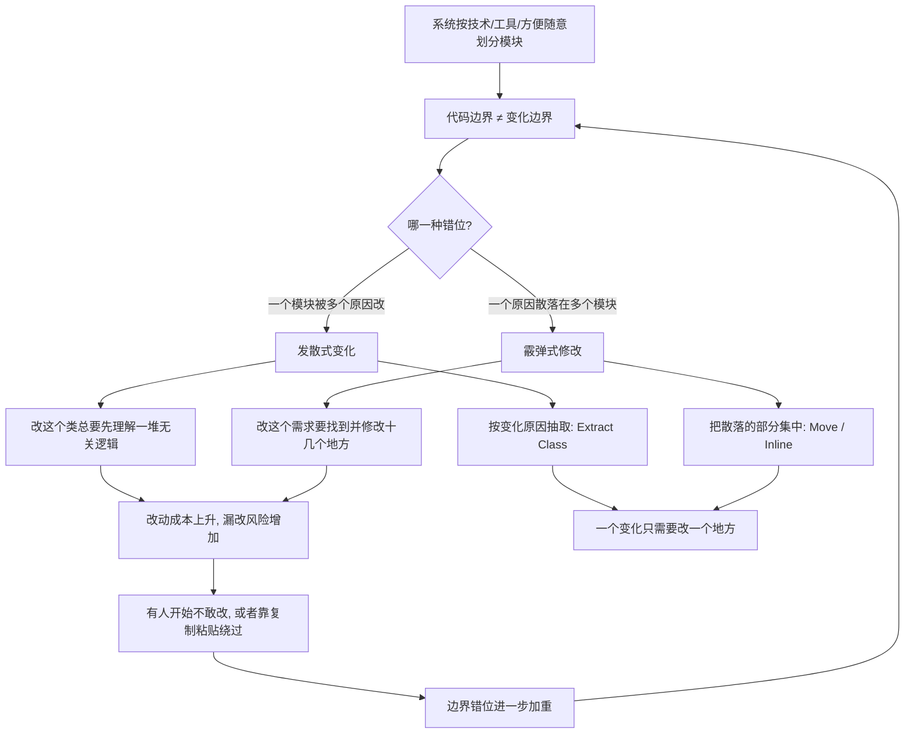

# 12｜发散式变化与霰弹式修改：为什么改一处就崩一片？

> 为什么有的代码改一个需求，会同时震动十几个文件？而有的类，又总是被各种毫不相干的理由反复修改？

---

## 一、先说结论

福勒用两条坏味道，描述了同一枚硬币的两面。

**发散式变化（Divergent Change）**：一个类因为**多个不相干的原因**被反复修改。今天为了结算改它，明天为了导出改它，后天为了通知又改它。

**霰弹式修改（Shotgun Surgery）**：一个变化却要求你**同时改十几个地方**。加一个字段，得在七八个文件里各补一行。

这两者看起来方向相反，本质却完全一样：**代码的边界，和变化的边界没有对齐。** 重构的目标，就是让「一个变化，只需要改一个地方」。

---

## 二、我们先理解一个问题

想象一位维护支付系统的工程师。

产品提了一个很小的需求：给订单增加一种新的支付方式。

听起来简单。但他一搜代码，发现要改的是：支付方式枚举、金额计算、手续费规则、对账导出、消息通知模板、前端下拉框、报表统计口径、风控白名单……**八个地方，一个都不能漏。**

漏掉一个会怎样？手续费算错了，或者对账对不上，或者报表里多了个看不懂的状态。**问题不会在开发时暴露，而是在某个月底的财务对账里爆炸。**

换个场景。同一个工程师维护的 `OrderUtils` 类，这三个月分别因为以下原因被改过：新增优惠券规则、调整发票格式、修复物流状态同步、改短信通知文案、适配新的税率政策。

五个需求，毫无关系，却都落在这一个类上。

这就是福勒想让我们看到的两种病：一个是「一处变化牵动全身」，一个是「一个地方被所有变化反复光顾」。**它们都不是 bug，却都在持续抬高每次改动的成本。**

---

## 三、作者到底提出了什么观点？

在「代码的坏味道」一章里，福勒把这两条并列列出：

**Divergent Change（发散式变化）**：当你发现**一个类经常因为不同的原因被修改**时，就闻到了这个味道。它通常意味着这个类承担了太多职责。福勒建议的手法，是针对那些「因为同一原因而变化」的部分做 **Extract Class**，把它们各自独立出去。

**Shotgun Surgery（霰弹式修改）**：当你发现**每做一处修改，都必须在很多个地方做类似的小改动**时，就闻到了这个味道。它和发散式变化恰好相反——不是一个类被很多原因改，而是一个原因被散落到很多类里。福勒建议的手法，是把那些散落的改动**集中到一处**：用 Move Method、Move Field 把它们搬到同一个模块，必要时用 Inline Class 合并。

福勒的核心洞见，用一句话概括就是：

> **让代码的结构边界，去对齐「变化发生的地方」。**

他没有明确说「必须按需求变化来划分模块」这种口号，但他的判断标准非常清楚：**看哪一类改动总是成批出现，它们就该住在一起。**

---

## 四、把这个观点翻译成人话

用一栋楼来理解这两种病。

**发散式变化 = 整个楼只有一个总电闸。**

这栋楼里，财务部、研发部、食堂、机房，全挂在同一个闸上。结果是：财务要加一台打印机，可能触发跳闸；机房要升级设备，全楼先停电。**这个总电闸本身没坏，坏的是它承担了它不该承担的范围。** 每换一个部门的用电需求，都要动这个总闸——它因为各种不相干的原因被反复操作。

**霰弹式修改 = 反过来，每盏灯的开关被拆散到了整栋楼。**

你想关掉会议室所有的灯，却发现每盏灯的控制面板分别装在不同楼层的不同房间里。你得到处跑，一个都不能漏。**一种「变化」（关掉会议室），被散落在了十几个位置。**

两种病看起来相反，但你会发现：**正常的做法其实是——按部门、按区域分回路。**

财务部一个回路、机房一个回路、会议室一个回路。这样：

- 改财务部的用电，只需要动财务部那一路——**发散被收敛了**；
- 关掉会议室，只需要关会议室这一路——**散落被集中了**。

「一个变化只需要改一个地方」，就是这两条坏味道共同的解药。

---

## 五、为什么会这样？

把这条推理链画出来：

关键在 B 那个节点：**问题的根源不是代码写错，而是划分模块的维度，和需求变化的维度不一致。**

现实里，模块常常是按「技术上方便」划分的——一个 `Utils` 类、一个 `Manager` 类、一张万能表。而需求的变化是沿着业务概念发生的：一次税率调整、一种新支付方式、一个新地区。**两个维度一错位，就同时制造出发散和霰弹。**

---

## 六、举一个现实生活中的例子

再具体一点。

某团队把支付方式枚举、手续费计算、对账导出、通知模板分别放在了四个不同的模块里——每个模块单看都「内聚」得很好。问题是：**它们都各自包含一份「支付方式有哪些」的判断逻辑。**

于是每次新增一种支付方式，工程师都要：

1. 在枚举里加一个值；
2. 在手续费计算里加一个分支；
3. 在对账导出里加一段映射；
4. 在通知模板里加一个文案。

四份逻辑，四种写法，一处漏掉就是线上事故。这就是标准的霰弹式修改。

后来他们做了一次重构：把「一种支付方式的完整定义」收敛到一个地方——包括它的枚举值、费率、对账标识、通知文案。新增支付方式，从此**只改一处**。

注意，他们没有推翻整个架构，只是**把散落的、围绕同一个概念变化的代码，挪到了一起**。这正是福勒说的动作：让代码的边界，去对齐变化的边界。

反之，如果那个 `OrderUtils` 继续被五个不相干的需求轮番光顾，它迟早会长成一个上帝类——**发散式变化，往往就是上帝类的前兆。**

---

## 七、回到书中重新理解

现在再回看福勒把这两条味道放在相邻位置，用意就清楚了。

它们不是两个孤立的技巧，而是**同一个诊断问题的两个角度**：当系统难以修改时，先问是哪一种错位。

| | 发散式变化 | 霰弹式修改 |
|---|---|---|
| 现象 | 一个类被很多原因改 | 一个原因被散到很多类 |
| 方向 | 一对多 | 多对一 |
| 典型成因 | 职责过载 | 概念被拆散 |
| 福勒的手法 | Extract Class | Move Method / Inline Class |
| 本质 | 边界与变化错位 | 边界与变化错位 |

看懂这张表，你就抓住了这一章最实用的一条判断法则：**不要问「这块代码写得对不对」，要问「这个变化，本来应该只落在哪里」。**

---

## 八、这个观点背后还有什么？

这一条背后，是软件工程里一个被反复表述、却极难做到的原则。

**第一，它和「高内聚」是同一件事的两种说法。** 福勒从「变化」切入，Martin 的单一职责原则（SRP）从「引起变化的原因」切入，两者殊途同归。需要说明：SRP 是 Robert C. Martin 提出的表述，不是福勒的原话。

**第二，它揭示了一个容易被忽略的事实：内聚是相对于「变化」而言的，不是相对于「代码长得像」而言的。** 两个函数都操作字符串，不代表它们该在一起；两个函数都因为「税率调整」而变，才说明它们该在一起。**按相似性分组是直觉，按变化分组才是工程。**

**第三，它对「模块怎么分」这件事给出了一个可操作的检验标准。** 与其争论按层分、按功能分还是按领域分，不如问一句：**新增一个业务概念时，我要改几个地方？** 这是可以数出来的。

**第四，它和第 11 篇的上帝类是连贯的。** 上帝类几乎必然伴发散式变化；而拆得不当、把概念打散，又会制造霰弹式修改，逼着人再把它们合并回来。**重构不是单向的拆分，而是不断让边界和变化重新对齐。**

---

## 九、这个观点有问题吗？

有值得警惕的地方。

**首先，「按变化来划分」需要你知道未来的变化。** 而现实中，变化往往是事后才被发现的。一个新概念出现前，没人知道它将来会沿着哪条线生长。所以这种对齐不是一次性设计，而是**反复调整**——指望一开始就分对，本身就是不现实的。

**其次，对齐过度也会出问题。** 如果每遇到一种变化就抽出新模块，可能得到大量细碎、只能用在一种场景的类，反而增加跳转和阅读成本。有工程师观察到，「一个变化只改一处」在复杂系统里更像一个**值得逼近的方向，而不是可以完全达到的状态**。

**第三，不同原因的变化有时真的纠缠在一起。** 比如金额计算既依赖支付方式，也依赖税率、地区、促销——你很难把它完整地归到某一边。这时只能做取舍，而不是追求纯粹。

**第四，松散耦合的分布式系统会让这个问题更严重。** 单个进程里 Move Method 很简单；一旦拆成服务，「把散落的东西挪到一起」可能意味着跨服务、跨团队、跨部署的协调。福勒写书时的语境，和今天一个几十个微服务的系统，不完全一样。

所以更准确的说法是：**这两条坏味道是极好的诊断工具，但不是一把可以机械执行的尺子。**

---

## 十、今天再看这个观点

（以下为现代延伸，非福勒原文）

**领域驱动设计（DDD）与它高度共鸣。** DDD 强调的「限界上下文」「把围绕同一业务概念变化的东西聚在一起」，在某种程度上就是把福勒的「对齐变化边界」放大到了系统架构层面。

**微服务给了它一个更昂贵的舞台。** 服务怎么切？一个常用的判断依据就是：**一个业务变化，是否只落在一个服务里。** 如果每次改需求都要同时发布五六个服务，那就是架构层面的霰弹式修改——而修复它的成本，比在一个类里 Move Method 高得多。

**AI 可以帮你**找出「哪些文件总是一起被修改」。版本历史里藏着真实的变化边界：如果 A、B、C 三个文件在过去一年里总是被同一个提交一起改动，它们很可能本就该属于同一模块。这类「共变分析」是工具能做、而人容易忽略的信号。

**但方向仍要人定。** 工具能告诉你哪里总是一起变，却不能告诉你**应该**让它们一起变，还是应该把它们拆开——因为那取决于业务想怎么演化。这恰恰是重构里最难、也最不可替代的部分。

---

## 十一、这一篇真正应该记住什么？

1. **发散式变化：一个类被很多不相干的原因修改。** 它通常意味着这个类职责过载，是上帝类的前兆。

2. **霰弹式修改：一个变化要求你改十几个地方。** 它意味着同一个概念被拆散了，漏改的风险极高。

3. **两者方向相反，病根相同：代码边界和变化边界没有对齐。** 诊断时要先分清是哪一种错位。

4. **解药是让「一个变化只改一个地方」。** 该拆的抽出来，该合的搬回去，方向取决于变化落在哪里。

5. **变化边界要靠观察发现，不能靠一次设计猜准。** 所以重构是反复对齐的过程，而不是一劳永逸的动作。

---

## 十二、留一个问题

假设你已经把边界对齐好了，一个变化真的只需要改一处了。

但这时候你可能会看到另一种代码：为了区分订单的不同状态，项目里到处写着 `if (status == 1) ... else if (status == 2) ...`；用户性别存成 `"1"` 或 `"0"`，金额用 `double` 直接传。**它们看起来简单直接，真的有问题吗？**

如果这些「简单」的表达方式，其实正是让变化边界无法收敛的隐形推手呢？

下一篇，我们就来看福勒另外两条最容易被忽视的坏味道——**基本类型偏执与重复的 switch**。
