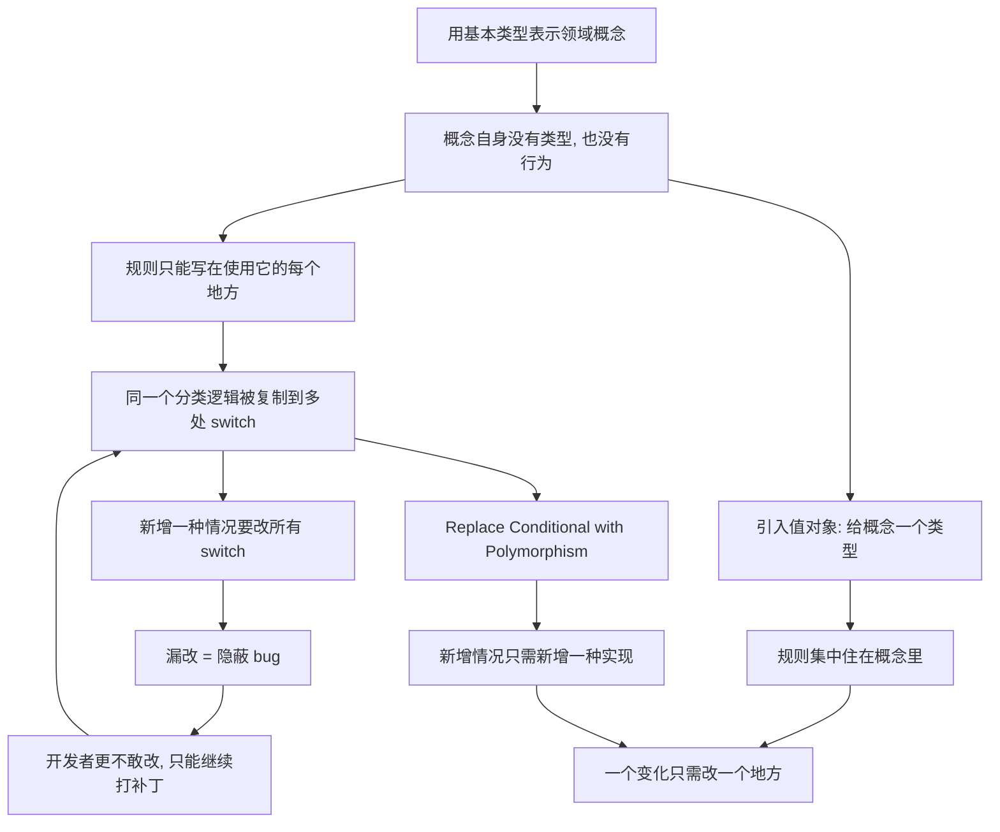

# 13｜基本类型偏执与重复的 switch：什么时候该引入对象？

> 用字符串表示状态、到处写 switch 判断，明明最直接，为什么在福勒眼里却是坏味道？

---

## 一、先说结论

福勒用两条坏味道，指向同一种偷懒。

**基本类型偏执（Primitive Obsession）**：用字符串、数字去硬编码那些本应有自己类型和行为的领域概念。手机号是 `String`，金额是 `double`，性别是 `"1"` 和 `"0"`。

**重复的 switch（Repeated Switches）**：同一个分类逻辑散落在很多地方，每加一种情况，就要去改所有的 switch。

它们的共同解法是：**引入对象与多态，把「分散在各处的判断」，变成「一个集中的定义」。** 但也要记住另一面：不是所有 switch 都该被消灭，简单场景下 switch 反而更清楚。

---

## 二、我们先理解一个问题

先看两段代码。

第一段，用户表里这样存性别：

```java
int gender = 1; // 1=男, 0=女, 2=未知? 9=保密?
```

某天产品要加一个「其他/不愿透露」。于是问题来了：数据库里已有的 `1`、`0` 不变，新的用什么？有人写 `2`，有人已经在别处用 `2` 表示「未知」。同类值还可能被写成 `"1"`（字符串）、`true`、`"male"`——**同一个含义，五六种写法。**

第二段，订单状态：

```java
if (order.getStatus() == 1) { ... }
else if (order.getStatus() == 2) { ... }
else if (order.getStatus() == 3) { ... }
```

这段逻辑，在结算、发货、退款、导出、通知里各写了一遍。现在要新增一个「部分退款」状态。于是你要翻遍项目，找出所有 switch/if-else 链，一个个补分支——**漏掉任何一个，就是线上 bug。**

问题来了：这些写法明明最「直接」，为什么在福勒眼里成了坏味道？

---

## 三、作者到底提出了什么观点？

福勒在坏味道清单里给了这两条：

**Primitive Obsession（基本类型偏执）**：人们倾向用基本类型（字符串、数字、布尔）去表示本可以有自己的类型和行为的领域概念。福勒指出，本来该有一个 `PhoneNumber`、`Money`、`DateRange` 这样的类型，结果却被一个裸的 `String` 或 `int` 代替了。这样一来，**所有关于这个概念的规则和行为，都只能写在使用它的地方，而不能写在这个概念自己身上。**

**Repeated Switches（重复的 switch）**：当同一个 switch（或一串 if-else）在多个地方反复出现，判断同一件事时，就说明这段分类逻辑没有被集中定义。福勒观察到，**每当你新增一种情况，就必须同时修改所有的 switch**——而总有地方会被漏掉。

对应手法主要有两个：

- 对基本类型偏执：**Replace Data Value with Object（用对象替换数据值）**、Replace Type Code with Class / Subclass；
- 对重复的 switch：**Replace Conditional with Polymorphism（以多态取代条件表达式）**。

福勒的核心主张是：**应该让「这个分类规则」有一个明确的老家，而不是让它住在每个使用者的脑子里。**

---

## 四、把这个观点翻译成人话

用一个更贴近生活的例子。

你给朋友发地址，写成「北京市朝阳区 XX 路 3 号 1801」。这是一串文本，人读得懂。但如果让程序处理它，程序**不知道**：哪个是省、哪个是市、邮编在哪、能不能寄到海外。

于是每个需要用到地址的地方，都要自己写解析：这里截一段当城市，那里判断一下是不是「自治区」。**规则被打散在无数使用点上，而且每个点的实现还可能不一样。**

更好的做法，是有一个 `Address` 概念：它有 `province`、`city`、`postalCode` 这些字段，有校验方法，有格式化方法。**关于地址的知识，集中住在「地址」自己家里。**

基本类型偏执说的就是这件事：**你以为你存的是一串字符，其实你存的是一个还没长大的对象。**

再看重复的 switch。它像什么？像一家公司里每个部门都各自保存了一份「员工职级对照表」。公司新增一个职级，HR 改了，财务没改，门禁系统也没改。**同一份规则被抄了很多份，新鲜度全靠运气。**

Replace Conditional with Polymorphism 的做法是：**把「不同情况该怎么做」交给不同情况自己去回答。** 新增一种情况，只需要新增一个类，而不用去动所有判断它的地方——**这正是第 12 篇「一个变化只改一处」的另一种实现方式。**

---

## 五、为什么会这样？

推理链条是这样的：



链条的关键在 B 和 D 之间：**因为没有类型，所以没有归属；因为没有归属，所以规则只能散落。**

一旦你意识到「这不只是一个 `int`，这是一个『性别』概念」，你就会自然地想：那关于它的合法值、显示文案、校验规则，是不是该由它自己管？——多态和值对象，就是这么被逼出来的。

---

## 六、举一个现实生活中的例子

再看状态字符串满天飞的场景。

某系统用字符串表示订单状态：`"CREATED"`、`"PAID"`、`"SHIPPED"`、`"CANCELLED"`。看起来可读性还行，但问题藏在细节里：

- 有人写 `"PAID"`，有人写 `"paid"`，有人写 `"Paid"`——字符串比较区分大小写，一不留神就匹配不上；
- 状态之间的**合法迁移**（比如「已取消」不能再「发货」）没有地方统一管，只能在每个操作入口各写一遍判断；
- 报表统计时又要 `switch (status)` 枚举所有状态，新增状态时容易漏。

后来团队引入了一个 `OrderStatus` 枚举/类，把合法值、显示文案、可迁移目标都定义在里面。**新增状态，从「改十几个 switch」，变成了「加一个定义」。**

但请注意一个容易被忽略的对照：**并不是所有 switch 都该消失。**

比如一个只在一个地方使用、情况固定、逻辑极短的映射——把「状态码转成显示文案」写成一个简单的 `switch`，比引入一整棵多态类树更清楚。**强行把每个 switch 都多态化，是另一种形式的本末倒置。** 福勒说的是「重复的 switch」，关键词是**重复**。

---

## 七、回到书中重新理解

现在再看福勒把这两条味道并列，它的用意很清楚：

**基本类型偏执，是重复 switch 的温床。** 因为你没有给概念一个类型，所以每次用到它，都只能重新判断一次；判断写多了，就成了重复的 switch。

反过来，**引入对象，是消灭重复 switch 的一条主要路径**。当 `OrderStatus` 自己知道「能不能发货」，调用方就不需要再写 `if (status == SHIPPED)`；当每种支付方式自己知道「怎么算手续费」，就不需要在外层堆一个大 switch。

福勒给的从来不是「消灭所有基本类型」或「消灭所有 switch」这种口号，而是一条判断准则：

> **当这个概念有自己的规则、自己的行为、并且这些规则在多处被重复判断时，它就该从数据升级为对象。**

---

## 八、这个观点背后还有什么？

**第一，它体现了「把数据和操作数据的行为放在一起」这一古老而核心的设计原则。** 用对象替代裸数据，不只是为了好看，而是为了让规则有唯一归属。这和「封装」是同一件事的两面。

**第二，它和「类型即文档」相通。** `String phone` 什么都没告诉你；`PhoneNumber phone` 立刻说明了很多事——它是一个有格式、可校验的概念，而不是随便一段文字。**类型本身就是一种表达力。**

**第三，它把「编译期检查」变成了免费的守卫。** 用 `"1"` 表示性别，编译器帮不了你；用 `Gender.MALE`，写错名字就编译不过。**很多运行时事故，本质上是把本可以在编译期发现的问题，拖到了线上。**

**第四，它与第 12 篇的变化边界思想一脉相承。** 「新增一种情况只改一处」，正是对齐变化边界的又一种具体形式——只不过这次对齐的，是「分类逻辑」这条边界。

---

## 九、这个观点有问题吗？

有，而且这一条特别容易被过度使用。

**首先，值对象和多态不是免费的。** 引入一个新类型意味着更多的文件、更多的间接层，团队里所有人都要学习它。对于只有两三种取值、且逻辑极简单的场景，一个枚举甚至一个常量往往就够了。**为了「消灭基本类型」而造的类，可能比问题本身更难维护。**

**其次，判断「什么时候值得引入对象」并没有客观标准。** 有工程师认为，如果一个概念目前只有展示、没有行为、也没有多处重复判断，那就先别急着给它建类；等它开始长出行为、开始被重复判断时再升级。这其实也是福勒「三次法则」的精神——**重复出现，才是动手的信号。**

**第三，多态也有它的代价。** 当一个分类维度特别多、组合特别复杂时，多态类树可能爆炸，反而不如一张配置表或一个数据驱动的规则引擎直观。有团队在实践中发现，**把规则放进数据，比放进类继承结构更灵活**——这是对多态方案的一种现实补充，不一定是福勒原来强调的方向。

**第四，还涉及团队现实。** 在一个基本类型满天飞的遗留系统里，全面引入值对象是一次大工程。硬推容易变成「重构导致大量改动、改动引入风险」的恶性循环。更现实的做法是：**在新代码里做对，在旧代码里遇到重复判断时顺手收敛。**

---

## 十、今天再看这个观点

（以下为现代延伸，非福勒原文）

**现代语言的类型系统正在把这件事变得更容易。** 枚举、`record`（Java）、`dataclass`（Python）、密封类/联合类型（Kotlin、TypeScript）等特性，让「为概念建一个小类型」的成本大幅下降。当年在 Java 里定义一个值对象要写一堆样板代码，今天可能只要一行。**工具变了，但福勒的判断标准没变：这个概念值得有自己的类型吗？**

**领域驱动设计（DDD）强化了这条思路。** DDD 里的「值对象」几乎就是「用对象替换基本类型」的系统化版本：金额、货币、地址、时间段，都应该是自成一体的概念。前面提到的 `Money`、`PhoneNumber`，正是这条路线上的经典例子。

**AI 时代又多了一层含义。** 当代码越来越多地由人和 AI 共同生成时，**类型是给机器的说明书**。一个 `String status` 对模型来说信息极少，而一个明确的 `OrderStatus` 类型能显著降低生成错误代码的概率。**类型越清晰，人和 AI 出错的空间越小。**

**但反过来说，AI 也很容易大批量复制「用 `"1"` 表示性别」这种写法。** 它生成得越快，坏味道扩散得越快。所以越是自动生成代码，越需要人判断：这里到底该用一个裸值，还是该有一个概念。

---

## 十一、这一篇真正应该记住什么？

1. **基本类型偏执：用裸的字符串、数字，硬表示本应有类型和行为的领域概念。** 后果是规则失去归属，散落到各处。

2. **重复的 switch：同一个分类逻辑写了多遍，新增情况要改所有地方。** 它和基本类型偏执往往互为因果。

3. **共同解法是让概念升级为对象：规则集中定义，变化只改一处。** 值对象管住数据，多态管住分支。

4. **关键词是「重复」，不是「switch」。** 简单、单点、稳定的判断，用 switch 往往比多态更清楚。

5. **动手的时机是「它开始长出行为和重复判断」，而不是「它是基本类型」。** 过早建类同样是负担。

---

## 十二、留一个问题

到这里，我们讨论的坏味道，基本都发生在「某个类」或「某个函数」内部。

可是有一种代码，它单看每一块都没问题，毛病却出在**块与块之间的关系**上：一个函数明明住在 A 类里，却对 B 类的数据格外执着；几个字段总是成组出现却从没被当成一个整体；一次调用要像传话游戏一样，转好几个手才拿到结果。

**代码的问题，难道不只在代码片段本身，也在片段之间的关系里？**

下一篇，我们就来看福勒用最「拟人」的词命名的那组坏味道——**依恋情结、数据泥团与消息链**。
