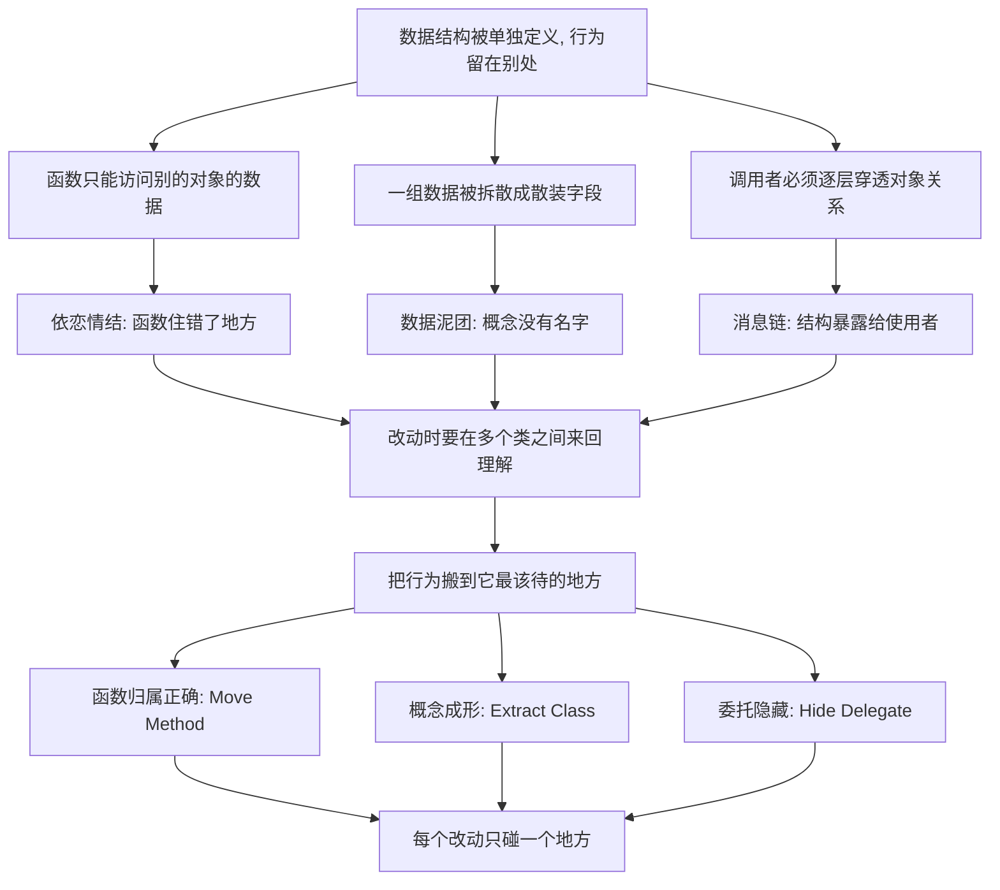

# 14｜依恋情结、数据泥团与消息链：代码的「社交病」

> 为什么福勒用「依恋」「泥团」「链条」这些像人际关系一样的词，来描述代码的毛病？

---

## 一、先说结论

前面几篇讲的坏味道，大多能在一个类或一个函数内部看到：太长、太大、类型太原始。

但福勒还有一组坏味道，看的是**结构关系**：

- **依恋情结（Feature Envy）**：一个函数总是痴迷地访问另一个对象的数据，胜过访问自己所在对象的数据；
- **数据泥团（Data Clumps）**：几个数据总是一起出现，却从没被当成一个整体；
- **消息链（Message Chains）**：一次调用要像传话一样，一路问下去才拿到结果。

它们共同传递一个信息：**代码的问题不只在单个片段里，也在片段与片段的关系里。** 而解法往往只有一句话——**把行为搬到它最该待的地方。**

---

## 二、我们先理解一个问题

想象你在读一段代码。

有一个 `Order` 类，里面有个方法叫 `calculateDiscount()`。你点进去看，发现它几乎没碰 `Order` 自己的字段，而是：

```java
customer.getMembership().getLevel().getDiscountRate()
```

一路问下去，最后从「会员等级」里拿到折扣率。`Order` 自己的东西，它反而用不上。

再往下看，还有这样的调用：

```java
order.getCustomer().getAddress().getCity().getPostalCode()
```

四层跳转，就为了拿一个邮编。

再往下看，几个字段总是结伴而行：

```java
saveCustomer(String name, String phone, String province,
             String city, String street, String postalCode);
```

六个参数，其中 `province/city/street/postalCode` 永远一起出现，在七八个方法的签名里都能看到。**它们明明是一件事，却从来没有一个名字。**

这三段代码单看都不长，也没什么 bug。可为什么福勒要给它们专门命名，还起了这么「拟人」的名字？

---

## 三、作者到底提出了什么观点？

福勒在坏味道清单里列了这几条（它们彼此相关）：

**Feature Envy（依恋情结）**：当一个函数对另一个对象的数据的兴趣，超过对自己所在对象数据的兴趣时，就说明**这个函数住错了地方**。福勒给的主要手法是 **Move Method（搬移函数）**——把它搬到它真正依恋的那个对象里去。

**Data Clumps（数据泥团）**：同一组数据（比如上面那四个地址字段）在多个地方反复一起出现。福勒认为，这几乎总是一个信号：**这组数据本该是一个对象。** 对应的手法是 **Extract Class（提炼类）**，或者当它们出现在参数里时，用 **Introduce Parameter Object**。他给了一个很实用的检验方式：删掉这些字段中的一个，其他几个还有意义吗？如果它们总是一起出现、一起去掉，那就是泥团。

**Message Chains（消息链）**：`a.getB().getC().getD()` 这种一路问下去的结构，意味着调用者必须知道整条关系链。福勒建议用 **Hide Delegate（隐藏委托）**，让中间对象提供一个直接的接口给调用者。

此外还有两条和它配套的味道：**Middle Man（中间人）**——如果一个类大部分方法都只是在转发给别的对象，那它就是个多余的传声筒，该用 **Remove Middle Man**；以及 **Insider Trading（内幕交易）**——两个类之间过于频繁地互相访问私有细节。

福勒的核心判断可以概括成一句：**每个行为都应该住在它最该住的地方，每个概念都应该有它自己的名字。**

---

## 四、把这个观点翻译成人话

**依恋情结，像一个总往邻居家跑的人。**

一个人明明有自己的家，却天天待在邻居家里吃饭、看电视、用邻居的洗衣机。不是说不能去，而是既然你大部分生活都在邻居家，**那你是不是本来就该住在那里？**

代码里的函数也一样。如果一个方法大部分时间都在操作 `Customer` 的数据，那这个逻辑本质上属于 `Customer`，而不是 `Order`。把它搬过去，`Order` 变清爽，`Customer` 也变得更完整。

**数据泥团，像一群从不解散的旅伴。**

如果他们每到一个地方都一起出现、一起行动、一起离开，别人迟早会给他们一个团体名。地理字段也一样：`province`、`city`、`street`、`postalCode` 总是结伴，那它们为什么不叫 `Address`？

**消息链，像玩传话游戏。**

你想知道最终答案，必须经过 A 传给 B、B 传给 C、C 才告诉你。中间任何一环换了人、改了流程，你的调用就断了。**调用者被迫知道了太多它本不需要知道的中间结构。**

而 `Hide Delegate` 做的事情，就是：**你想知道答案，问我就行，内部经过谁，不用你操心。**

---

## 五、为什么会这样？

这几种味道，都是「行为放错了地方」的表现。画成链条：



关键在于 A：**数据和行为的分离，是这几种味道的共同源头。**

面向对象最初的主张，就是把「数据」和「操作数据的行为」放在一起。但现实中，我们常常先建了一堆「只有 getter/setter 的数据袋」，然后把逻辑写在外面的各种「Service」里。逻辑要在外面干活，就不得不反复穿透对象、访问别人的数据——**于是依恋情结、消息链、数据泥团，就都冒出来了。**

---

## 六、举一个现实生活中的例子

用开发场景来看。

**依恋情结的例子。** 有个 `ReportGenerator`，它的 `formatAmount()` 方法几乎只操作 `Invoice` 的数据：读它的金额、税率、币种，做各种格式化。`ReportGenerator` 自己的字段一个都没用上。

后来团队把 `formatAmount()` 搬进了 `Invoice`。结果不仅是 `ReportGenerator` 瘦了——**更重要的是，以后所有需要格式化金额的地方，都知道该去问 `Invoice`，而不是各自再写一份。** 这正是第 13 篇说的「规则集中到概念自己身上」。

**数据泥团 + 消息链的例子。** 一个物流系统里，取收件城市要写：

```java
order.getReceiver().getAddress().getCity()
```

三跳。更糟的是，`getReceiver()` 内部哪天改成返回快递单而不是用户，全项目的这条链都会断。团队后来做了两件事：在 `Order` 上提供一个 `getReceiverCity()`，把委托藏起来；同时把散落的地址字段提炼成一个 `Address` 值对象。

改完之后，调用方从「知道三层结构」变成「知道一件事」——**结构变化的影响被挡在了内部。**

**传话游戏的真实代价。** 有一次线上事故的根因，就是一条消息链中间某个 getter 加了空值保护却返回了默认值，链最末端拿到的是错误数据，而调用方浑然不觉。链条越长，**任何一环的意外都会被悄悄传递到终点。**

---

## 七、回到书中重新理解

现在再看福勒为什么用这些「拟人」的词，就好懂了。

它们不是文学修辞，而是**在提醒你观察代码各部分之间的关系**：

| 坏味道 | 关系上的病症 | 该做的动作 |
|---|---|---|
| 依恋情结 | 函数用别人的数据比用自己的多 | Move Method，把函数搬过去 |
| 数据泥团 | 一组数据总在一起，却没有名字 | Extract Class，让它成为概念 |
| 消息链 | 调用者被迫穿透多层结构 | Hide Delegate，藏起中间层 |
| 中间人 | 一个类只会转发，没有实质职责 | Remove Middle Man |
| 内幕交易 | 两个类过度交换内部细节 | 重新划定边界 |

这几条一起看，就是一句工程准则：**让行为住在它最该住的地方，让调用者只知道它需要知道的。**

福勒没有说「所有 getter 都该死」，他要的是：**当访问别人数据成为常态时，说明职责划分错了位。**

---

## 八、这个观点背后还有什么？

**第一，它和「信息隐藏」是同一件事。** 消息链暴露的是结构；Hide Delegate 保护的是调用者不必知道结构。这正是封装想解决的问题：**复杂度应该被关在边界里，而不是沿着调用链扩散出去。**

**第二，它把「耦合」从一个抽象的词变成了可观察的现象。** 你说不清「耦合度高」是什么样，但你能看到一条四层的消息链，能数出一组参数在几个方法里反复出现。**这些味道让耦合变得肉眼可见。**

**第三，它和前面的坏味道串成了一条线。** 数据泥团如果不处理，会继续长成基本类型偏执（一堆裸字符串）；依恋情结如果不管，函数会越来越像某个「别人的类」的方法；上帝类里往往住着大量依恋情结的函数——**它们其实是同一个问题在不同尺度上的显影。**

**第四，它提醒我们：关注点应该在「关系」，而不只是「片段」。** 一段代码自己写得再干净，如果它放错了位置，整个系统的理解成本仍然很高。这也是为什么 code review 时，有经验的工程师常会问一句：**「这个方法，为什么不放在它操作的那个类里？」**

---

## 九、这个观点有问题吗？

有几个地方需要拿捏，不能机械执行。

**首先，依恋情结的「搬移」并不总是可行。** 有时候一个函数同时操作两三个对象的数据，搬给谁都不对。福勒自己也提到，这时可能需要的不是 Move Method，而是先做 Extract Function，把依恋的部分拆出来再搬。**硬搬，可能制造出新的耦合。**

**其次，「数据总是成组出现」不等于「它们就该是一个类」。** 有工程师指出，某些字段之所以总在一起，可能只是因为接口的约定，而不是因为它们构成一个领域概念。把它们强行打包，反而可能引入一个没有行为的「数据袋」。**判断的关键依然是：它们是不是一起变化、是否有共同的行为。**

**第三，隐藏委托和消息链之间，存在一个真实的权衡。** 隐藏得太少，调用者被结构绑死；隐藏得太多，就会制造出只会转发的「中间人」，多一层无谓的间接。**Hide Delegate 和 Remove Middle Man 是同一根滑杆的两端**，福勒把它们同时列出来，本身就在承认：这里没有标准答案，只有当前更合适的位置。

**第四，过度的「搬家」也会伤害可读性。** 如果为了消除依恋情结，把一个完整流程拆散到七八个类里，读者要来回跳转才能理解一件事。**内聚和可读性，有时会打架。**

所以更准确的态度是：**这些味道帮你看清关系出了问题，但具体怎么搬、搬到哪、搬多少，要靠具体场景判断。**

---

## 十、今天再看这个观点

（以下为现代延伸，非福勒原文）

**现代编辑器让「搬移」的物理成本大幅下降。** IDE 的 Move Method、Extract Class 已经能自动完成引用更新。过去搬一次函数要提心吊胆，现在风险主要变成了「该不该搬」这个判断问题，而不是「搬不搬得动」。

**流式 API 和链式调用，让消息链以另一种方式复活了。** 现代代码里大量 `a.b().c().d()` 的写法，很多是可读性友好的设计，不一定是坏味道。**判断标准不是「链长不长」，而是「调用者是否被迫知道了它不该知道的内部结构」。** 这条界线，比福勒写书时更需要分辨。

**领域驱动设计（DDD）把「数据泥团」推向了前台。** 地址、金额、时间段这些值对象，基本就是「让反复出现的数据组成为一等公民」的系统化版本。

**微服务让这些味道的代价变高了。** 在单体里 Move Method 是几秒钟的事；在服务之间，跨服务的依恋会变成网络调用，消息链会变成跨服务级联。**分布式系统里，把行为放对地方的价值反而更大了。**

**AI 生成代码时尤其容易制造这些味道。** 模型很擅长写出「能跑」的 getter 穿透和参数堆叠，因为它不了解你的领域里「什么该是一个概念」。**越是自动生成，越需要人来确认：这个行为，到底该住在谁家。**

---

## 十一、这一篇真正应该记住什么？

1. **这三种味道看的不是代码片段，而是片段之间的关系。** 单看每块都没错，合起来却处处别扭。

2. **依恋情结：函数对别人数据的兴趣超过自己。** 信号是「它住错了地方」，解法通常是 Move Method。

3. **数据泥团：一组数据总一起出现却没名字。** 检验方式是「删掉一个，其他还有意义吗」，解法是给它一个概念。

4. **消息链：调用者被迫穿透多层结构。** 用 Hide Delegate 藏起中间层；但要小心别造出只会转发的中间人。

5. **核心准则只有一句：把行为搬到它最该待的地方。** 关注关系，而不只是关注单个类。

---

## 十二、留一个问题

我们聊了这么多坏味道，它们都是「代码结构」上的问题。

但福勒的坏味道清单里，还有一条特别容易被误读。它不是代码，而是**代码旁边的那行字**——注释。

福勒把「注释」也列进了坏味道。可注释不是公认的好习惯吗？老师、规范、代码审查，都鼓励我们多写注释。**为什么在《重构》里，注释反而成了一种嫌疑？**

难道福勒真的主张「不要写注释」？

下一篇，我们就来把这句话说清楚——**「注释是坏味道」，到底是什么意思？**
