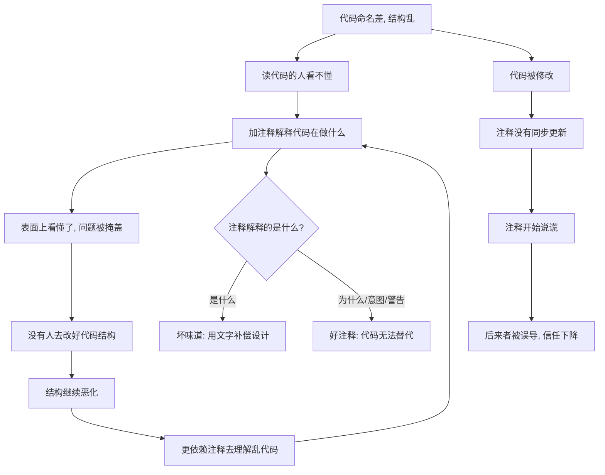

# 15｜「注释是坏味道」这句话，到底什么意思？

> 注释不是公认的好习惯吗？为什么福勒会把它列进「坏味道」清单？

---

## 一、先说结论

福勒的意思**不是「不要写注释」**。他要指出的是：

> 当一段注释在解释「这段代码在干什么」时，它往往是在**为一段表达不清的代码打掩护**。

如果一段逻辑能用更好的命名或结构说清楚，那比注释更可靠——因为**注释会过期，代码不会**。你改了代码忘了改注释，注释就从帮手变成了误导。

所以他真正的意思是：**注释应该解释「为什么」，而不是「是什么」。** 那些只是在复述代码、或者在为混乱结构道歉的注释，才是坏味道。

---

## 二、我们先理解一个问题

看几段注释和它旁边的代码：

```java
// 检查状态是否为 2
if (status == 2) { ... }

// 如果用户是VIP并且订单金额大于100并且没有使用优惠券
if (user.isVip() && order.getAmount() > 100 && !order.hasCoupon()) { ... }

// 下面的逻辑有点复杂, 别改, 会出问题
// ... 三十行难懂的代码 ...
```

第一段，注释只是把代码翻译了一遍——`status == 2` 是「正在处理」还是「已取消」？注释没告诉你，代码也没告诉别人。**它复述了「是什么」，却没说清「2 代表什么」。**

第二段，注释又长又和代码重复。哪天业务改成金额大于 200，注释多半忘了同步。

第三段最诚实，也最悲哀：**它承认了这段代码没人能懂，却选择用一行警告把问题盖住，而不是把它改清楚。**

问题来了：这些注释明明是好心写的，为什么反而成了问题？

---

## 三、作者到底提出了什么观点？

福勒在坏味道清单里放了「Comments（注释）」这一条。但他写得很清楚：**注释并不都是坏的。**

他真正批评的是**用注释来弥补坏代码的那种用法**。他的典型例子包括：

- 注释在解释一段**难懂的代码**——真正的解法是把这段代码提炼成一个有名字的函数，让名字承担解释的职责；
- 注释在**复述代码**——代码本身已经说清楚了，注释只是噪音，还会过期；
- 注释在**为诡异的实现辩解**——这说明代码本身应该被改进。

与之相对，福勒承认有些注释是**有价值的**，而且无法被代码替代：

- 解释**为什么**要这么做（而不是做了什么）；
- 记录**意图**和背景；
- **警告**某些特殊约束或坑；
- **TODO**、待办与已知限制。

所以他给的判断标准可以概括成一句：**注释应该告诉你「代码没说的信息」，而不是重复「代码已经说的信息」。**

---

## 四、把这个观点翻译成人话

用手机来理解。

**好的手机 UI，不需要说明书。**

你第一次拿到它，看到「设置」「音量」「返回」这些图标和文字，就大概知道怎么用。不是因为它功能简单，而是因为**它的设计本身把意图表达出来了**。

**需要厚厚说明书的设备，往往是交互设计失败的信号。**

当一份产品要在说明书里花三页告诉你「按 A 再长按 B 三秒再输入 1234 才能进入某个模式」，问题从来不是「说明书没写清楚」，而是**这个操作本身没有设计好**。

代码里的注释也是同一个道理。

一行 `// 检查状态是否为 2` 和一份「按键组合说明」一样——它是在用文字去补一个本该由设计解决的问题。**更好的做法是让代码自己说话：把 `2` 换成一个有名字的常量，把那三十行难懂逻辑提炼成一个名字清楚的函数。**

当代码命名和结构足够好时，你会发现很多注释突然变得多余——**这恰恰证明它们本来就在补偿代码的表达力不足。**

但要注意：说明书并非一无是处。**如果说明书解释的是「为什么这样设计」「这个模式用在什么场合」，那它就有价值。** 代码注释也是这样：解释「为什么」的注释，说明书替代不了。

---

## 五、为什么会这样？

把「注释变坏」的过程画出来：



链条的核心是 C 这个节点：**加注释让「看不懂」这件事暂时不那么痛了，于是改进结构的动力被削弱了。**

更麻烦的是 H：代码会变，注释常常不会。**一份过期的注释，比没有注释更危险**——因为它会让人相信一个已经不存在的事实。

---

## 六、举一个现实生活中的例子

看一个 code review 里非常典型的场景。

**场景一：用注释代替命名。**

```java
// 计算折后价
double calc(double a, double b, double c) {
    return a * b - c;
}
```

`a`、`b`、`c` 完全靠猜。注释写了「计算折后价」，但没告诉你哪个是价格、哪个是折扣、`c` 是优惠券还是运费。

更好的写法是把名字说清楚：

```java
double discountedPrice(double originalPrice, double discountRate, double couponAmount) {
    return originalPrice * discountRate - couponAmount;
}
```

代码自己就把话说完了，那条注释自然可以删掉。

**场景二：注释过期导致线上事故。**

某个方法原来有注释「金额单位为元」，后来团队统一改成「分」，代码改了，注释没改。半年后一个新人按注释理解，把一笔金额多乘了一百倍。**这不是注释不够多，恰恰是注释骗了人。**

**场景三：该保留的注释。**

反过来，有一行注释是这样的：

```java
// 必须先用流水号排序, 否则并发下会死锁 (2023 年线上事故复盘 #417)
lock(sortedById(ids));
```

这条注释解释的是「为什么必须这样」以及「踩过什么坑」，代码本身无法表达。**这种注释，删掉才是损失。**

区别就在于：第一种注释在替代码解释，第三种注释在给代码补充它无法承载的信息。

---

## 七、回到书中重新理解

现在再回看福勒把「注释」放进坏味道清单，就能理解他的分寸了。

**他列的不是「注释」这个东西，而是「需要靠注释才能读懂代码」这个信号。** 当他看到一段解释「这里在做什么」的注释时，他的第一反应不是「注释写得不错」，而是：

> 为什么这里需要解释？是不是这段代码本来可以写得更清楚？

这是一种**归因方式的转变**：不要停在注释上，要继续往下问一层——**注释在补偿什么？** 是命名不好，是函数太长，还是结构错位？把那个根因修掉，注释自然就解脱了。

也正因为如此，福勒在重构手法里有一条很直白的关联：**Extract Function（提炼函数）常常能替代注释。** 你把一段逻辑抽出来，给它一个准确的名字，这段代码就从「需要注释解释」变成了「名字自己会解释」。**名字比注释可靠，因为名字和代码在一起，不容易过期。**

---

## 八、这个观点背后还有什么？

**第一，它背后是对「可读性来源」的一个判断：代码本身就是最主要的文档。** 使用者最先看到、修改时最先读到的，永远是代码。如果文档（注释）和代码不一致，**人会相信代码**——那注释存在的意义就大打折扣了。

**第二，它区分了「让机器执行的语言」和「给人理解的语言」。** 好的代码同时服务两者。注释如果不能帮助人更好地理解，就只剩维护成本。

**第三，它和前面几篇是连贯的。** 命名即文档、函数要短、把行为放到该在的地方——**这些手段都在减少「需要注释解释」的场合。** 注释坏味道，其实是这一整套重构思想的自然推论。

**第四，它隐含一个现实前提：注释的维护成本常被严重低估。** 代码会被测试、被编译器、被 code review 反复检查；注释却没有任何机制保证它是对的。**一份无人验证的文字，迟早会腐烂。**

---

## 九、这个观点有问题吗？

这一条是被误读最严重的，所以争议也最值得说清。

**第一，「注释是坏味道」常被断章取义成「不要写注释」。** 这显然不是福勒的原意。他自己也承认有大量注释是必要的：意图、约束、警告、历史背景、为什么用这个看似奇怪的方案。**把这条当成「反注释」的许可证，是一种典型的误用。**

**第二，「代码自解释」本身也是有边界的。** 有些知识根本无法用命名表达——比如「这个常量是按某份监管文件定的」「这段逻辑是为了绕开某个已知的库 bug」。**这类信息不写注释，就真的丢失了。**

**第三，把复杂度完全归因于代码结构，可能是过度简化。** 有些逻辑天生复杂（税务、清算、协议解析），再怎么提炼函数、改名字，读者仍然需要额外的背景说明。**这时注释不是坏味道，而是必要的信息载体。**

**第四，它和「注释有用论」之间的分歧，本质是「成本与风险」的权衡。** 反对者会说：注释会过期，所以少写；支持者会说：不写注释，那些不可从代码推断的信息就永久丢失。**比较中肯的立场是：注释用来记录代码无法表达的东西，而不是用来重复代码已经表达的东西。**

**第五，还有团队与语言现实。** 在快速迭代、人员流动大的项目里，维护注释几乎不可能；而在安全关键、监管严格的领域，注释的追溯价值可能远大于过期风险。**同一句话，放在不同语境下，结论并不相同。**

---

## 十、今天再看这个观点

（以下为现代延伸，非福勒原文）

**现代 IDE 和分析工具，把「代码自解释」的门槛降低了。** 重命名重构、结构高亮、类型提示、跳转定义，让「读懂代码」不再那么依赖文字说明。当年要靠注释才能搞清的类型和调用关系，现在鼠标一悬停就能看到。

**AI 让注释的生产成本几乎归零，也让它更容易垃圾化。** 模型可以瞬间为每个函数写一大段注释——如果这些注释只是复述代码，那它们不但没用，还会**制造一种「有人仔细看过」的假象**。真正稀缺的从来不是注释的数量，而是「代码无法表达的那些信息」。

**同时，AI 也带来了一个新的用法：把注释当作意图的载体，让模型生成代码。** 在「先写清楚这段的意图和约束，再让模型实现」的工作方式里，注释从「事后解释」变成了「事前规格」。**这和福勒批评的注释，性质完全相反——它说的是「为什么」和「要什么」，而不是「代码在做什么」。**

**文档与注释的边界也在变化。** 接口文档、ADR（架构决策记录）、提交信息、PR 描述，正在承担一部分原本塞在代码注释里的知识。**把「为什么」放到更合适的地方，往往比塞在代码旁边更可靠。**

**但核心判断没有变：** 能靠命名和结构说清的，就别靠注释；代码说不清的，就必须写下来。

---

## 十一、这一篇真正应该记住什么？

1. **福勒不是反对注释，而是反对用注释去补偿糟糕的代码。** 解释「是什么」的注释，往往是设计不足的遮掩。

2. **注释最大的风险是过期。** 代码会被测试和审查，注释不会；一份过期的注释比没有注释更危险。

3. **好注释解释「为什么」：意图、原因、约束、警告、TODO。** 这些信息代码本身无法承载，删掉才是损失。

4. **命名和结构是比注释更可靠的文档。** Extract Function 常常能直接替代一整段解释性注释。

5. **看到注释，先问「它在补偿什么」。** 把根因修掉，比把注释写得更详细更有价值。

---

## 十二、留一个问题

我们已经把「代码坏味道」这一组走得差不多了：太长、太大、边界错位、类型原始、关系别扭、注释补偿。

它们的共同点是——**都是「结构」层面的问题，和改变功能无关**。我们一直在说：重构只改结构，不改行为。

可现实中，工程师一边要加新功能，一边还想顺手把刚看到的结构问题改掉——**这两件事，能不能同时干？**

如果不能，为什么不能？一边加功能一边重构，不是效率更高吗？福勒专门为此提了一个很形象的比喻——**两顶帽子**。

下一篇，我们就进入重构的方法论：为什么**不能同时戴着「加功能」和「重构」两顶帽子**。
