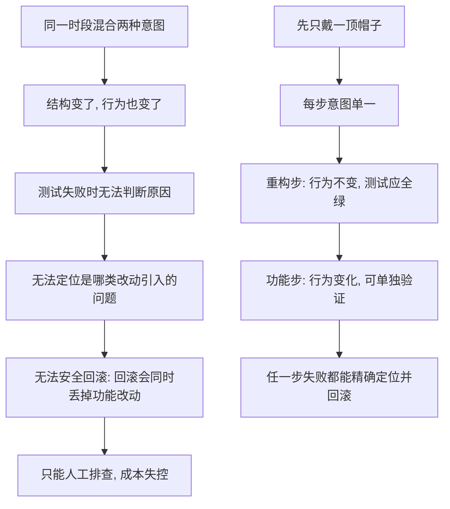

# 16｜「两顶帽子」：为什么不能一边加功能一边重构？

> 改代码明明可以一次做完，为什么福勒偏要你把「加功能」和「重构」分成两件事？

---

## 一、先说结论

福勒在书里借用了一个很有画面感的比喻——**「两顶帽子」**。这个比喻最早由肯特·贝克提出，福勒把它写进书里并加以推广。

福勒认为，改代码其实有两种完全不同的意图。一种叫「添加功能」，一种叫「重构」。你一次只能戴一顶帽子。

戴着重构的帽子时，你只调整内部结构，绝不改变任何外在行为；戴着加功能的帽子时，你只增加或修改功能，不顺手把结构大改一遍。

为什么非要这么较真？因为把两种意图混在一起，改出来的结果既不是一次干净的功能改动，也不是一次安全的结构调整。一旦出问题，你根本说不清是哪一部分惹的祸。**把意图分开，每一类改动才可验证、可回滚。**

---

## 二、我们先理解一个问题

先看一个几乎每个程序员都遇到过的场景。

你正在给一个下单流程加「优惠券」功能。改着改着，你发现计算价格的函数又长又乱，参数一大堆，于是你顺手把价格计算逻辑抽成了一个小函数，顺便改了改命名，又觉得某个判断条件写得太啰嗦，也一并简写了。

整个过程很流畅，一个下午就干完了。

结果测试时发现，某类订单的价格算错了。

于是问题来了：这个错误，是你新加的优惠券逻辑引起的？还是你顺手重构价格函数时改坏的？还是那个判断条件被你简写时漏掉了一个边界情况？

**你没法回答。因为你在同一段时间里，既改了「行为」，又改了「结构」。**

福勒要解决的，正是这个让人头疼的问题。

---

## 三、作者到底提出了什么观点？

福勒的观点，可以用一句话概括：

> **改代码时，你要清楚地知道自己此刻戴的是哪顶帽子；一次只戴一顶。**

- **加功能的帽子**：目标是让系统多出某种用户能感知的行为。戴这顶帽子时，你只关心功能对不对。
- **重构的帽子**：目标是让代码结构更清晰。戴这顶帽子时，你铁定不改变任何外在行为。

注意，福勒并不是说这两件事不能在同一天做，而是说**它们不能在同一个「意图单元」里混着做**。你完全可以先戴一段时间的重构帽子，摘下来，再戴上功能帽子。但切换必须是清楚的、有意识的。

他还强调一个关键细节：**每换一次帽子，测试状态必须明确。** 戴完重构帽子，测试应当还是全绿，因为行为没变；戴上功能帽子之后，才可能新增测试、修改测试。

这听起来像一条死板的纪律，但福勒想表达的是：**混乱往往不是来自改动本身，而是来自意图的模糊。**

---

## 四、把这个观点翻译成人话

想象一个场景：**换工作服**。

不同工作，穿不同的工作服。一位厨师在厨房里就是这套规矩：**切菜的时候穿切菜的围裙，端热锅的时候戴防烫手套。** 你不会把防烫手套套在正在切菜的手上，也不会穿着满是油渍的围裙去接外卖。

为什么？不只是因为脏。更因为**这两件事的注意力方向完全不同**：

- 切菜要的是精准、稳定、按菜谱来。
- 端热锅要的是防烫、快速、注意力在危险上。

如果你一边切菜一边想着端锅，最可能发生的是：刀切歪了，锅也洒了。

「两顶帽子」就是这个道理。加功能和重构，是两种注意力方向完全不同的工作：

- 加功能，你要问「用户看到的行为对了吗？」
- 重构，你要问「行为没变吧？结构更清楚了吗？」

把两件事挤在一起做，你的脑子里同时存在两套标准，最后哪套都没守住。

---

## 五、为什么会这样？

把福勒的逻辑拆成链条，是这样的：

这条链里最关键的一点是**「回滚的粒度」**。

如果一次提交里既有重构又有功能，你想撤销这次改动时，只能把两者一起撤销——结果功能没了，结构也回到原点。而如果分成两次提交，重构那次可以放心回滚，功能那次可以单独修。**意图一旦分开，每一次操作才成为一个可以独立撤销的单位。**

---

## 六、举一个现实生活中的例子

回到那个加优惠券的场景，用「两顶帽子」重做一遍：

**第一步，先戴重构帽子。** 你什么都不加，只把那段混乱的价格计算逻辑抽成有名字的函数，给它改个清楚的命名。改完，跑一遍测试——因为行为没变，测试应该还是全绿。

**第二步，摘下重构帽子，戴上功能帽子。** 现在你在这个已经清爽的结构上，加优惠券逻辑。这时候如果测试变红了，你几乎可以确定：**问题一定出在新加的优惠券代码上**，因为结构那一步已经被验证过了。

对比一下：前者（混着改）出错时是一片迷雾；后者（分开戴）出错时是一支探照灯。

再看一个团队层面的例子。code review 时，如果一位同事的 PR 里同时包含「重构某模块」和「新增某接口」几十个文件的改动，评审人几乎无法判断这次改动是否安全，只能粗略地看一眼就通过。而如果拆成两个 PR——一个只重构、一个只加功能——评审就变成了两件各自清楚的事。**这顶帽子的价值，在整个团队里会被进一步放大。**

---

## 七、回到书中重新理解

现在我们再回头看福勒在书里的原话，就容易理解了。

福勒说，重构不是要你「时不时整理一下代码」，而是要你把「整理代码」当成一种**有明确边界的独立工作模式**。它之所以能安全进行，前提正是「不改变行为」这条铁律；而「两顶帽子」是在说：**你不仅要遵守这条铁律，还要在时间上、提交上、心理上把它标记清楚。**

换句话说，前面几篇讲的「行为不变」是一条规则，而「两顶帽子」是让你能够真正执行这条规则的**操作纪律**。没有这顶帽子，规则很快就会被「顺手」冲垮。

---

## 八、这个观点背后还有什么？

第一层，它其实是在管理**人的认知负荷**。人在同一时间能稳定遵守的标准是有限的，混着做两件事，就等于把两套标准同时压进脑子里，出错概率自然上升。

第二层，它和「小步前进」「持续集成」「版本控制」是连在一起的。两顶帽子之所以可行，前提是你有独立提交、独立测试、独立回滚的能力。这也是为什么福勒反复强调：**这些实践是一整套，不是可以随便拆开的技巧。**

第三层，它是一个关于「意图清晰」的隐喻。福勒真正在乎的不是帽子本身，而是**你每次动手之前，能不能说清楚自己这次要干什么、不干什么。** 这个习惯，比任何具体手法都更难养成，也更有价值。

---

## 九、这个观点有问题吗？

有一些批评值得听。

首先，**现实中严格分开并不总是容易。** 很多时候重构和加功能就是纠缠在一起的：你要加的功能，恰恰需要先调整接口；你调整接口时，又顺手改了命名。有工程师认为，福勒的描述理想化了，真实开发中「完全纯粹的单一意图提交」很难做到。

其次，**频繁切换帽子本身也有成本。** 拆成两个 PR、两次提交、两轮测试，会带来额外的流程开销。对某些小改动来说，这种严格程度可能得不偿失。

不过需要注意的是，这些争议多数针对的是「严格到什么程度」，而不是「要不要分开」。福勒本人的说法也留了余地：这更像是一种**需要刻意练习的倾向**，而不是一把必须每次都落下的钢尺。争议的真正落点在于：**当分开的成本确实很高时，你该如何权衡？** 这个问题没有标准答案，但至少，福勒让你意识到了「混着做」是有代价的。

---

## 十、今天再看这个观点

（以下为现代延伸，非福勒原文）

在 AI 辅助编程的时代，「两顶帽子」反而变得更值得强调。

现在你可以让 AI 一口气生成几百行改动。如果这个改动里同时包含重构和新功能，你面对的将是一片比过去更难排查的迷雾。有工程师已经形成一种习惯：**让 AI 先只做重构，跑通测试；再让它只加功能，单独验证。** 把两次任务拆开，AI 的产出反而更可控。

同样的道理也适用于自动化工具。IDE 的一键重命名、一键抽函数，本质上都是在帮你「戴着重构帽子」——它们保证行为不变，产出可以放心提交。顺着这个思路，**把「结构改动」和「行为改动」在提交历史里分开，正在成为越来越多团队的工作习惯。**

---

## 十一、这一篇真正应该记住什么？

1. **改代码有两种意图：加功能与重构。** 它们对应两顶帽子，同一时间只能戴一顶，切换时要有意识地标记。

2. **戴重构帽时，行为绝不能变。** 这是前面刚立下的铁律；两顶帽子，是让这条铁律真正落地的操作纪律。

3. **混合意图会摧毁定位与回滚能力。** 结构行为一起改，出错时无法判断来源，回滚时又只能整块撤销。

4. **分开之后，每一步都成为可独立验证、可独立撤销的单位。** 这正是它带来的最大实际收益。

5. **这不是死板教条，而是一种需要权衡的倾向。** 严格程度可以协商，但「混着做有代价」这件事，值得你时刻记着。

---

## 十二、留一个问题

把意图分开了，接下来还有一个更细的问题：

就算你现在只戴一顶帽子，只做重构，那你这一顶帽子底下，是不是可以一次改很多地方？

福勒的回答是：不行。**重构还得一小步一小步地走。** 为什么不能一步到位？答案和「出错时你到底知不知道是哪一步坏了」直接相关。

下一篇，我们就来看看**小步前进**：为什么最慢的那条路，往往才是最快的。
