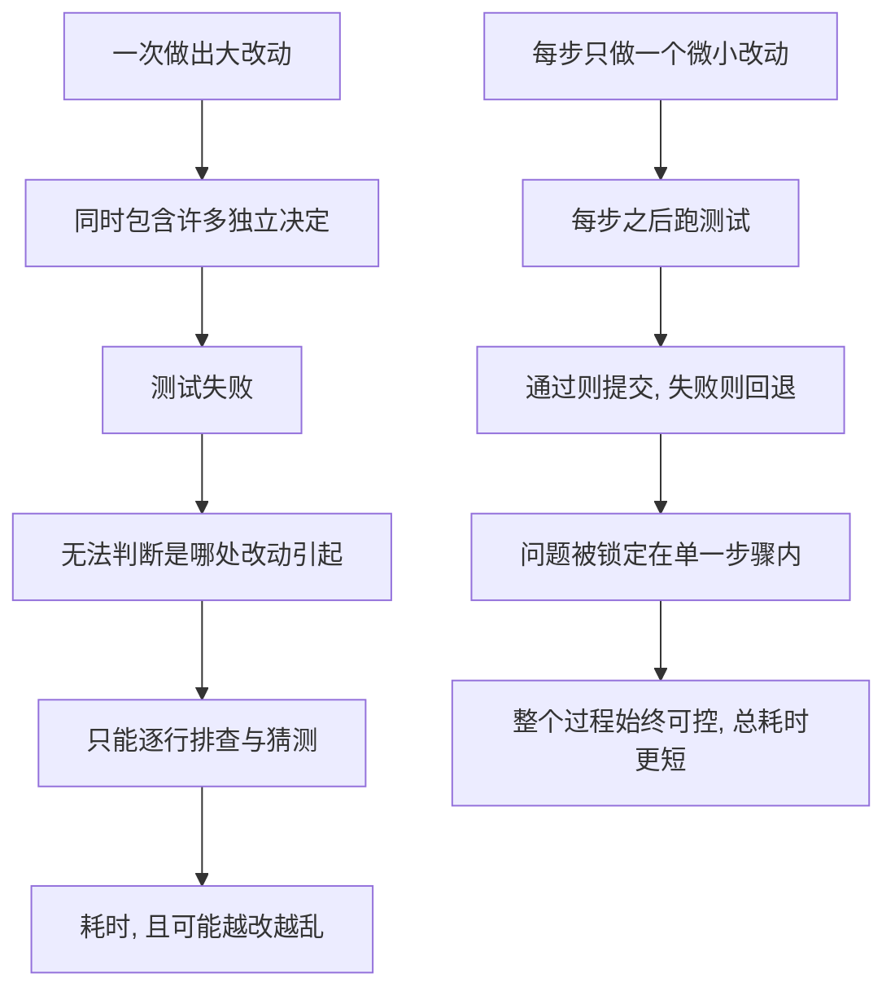

# 17｜小步前进：为什么重构必须一次只走一小步？

> 既然要改，为什么不一次改到位，而要把它拆成许多几乎不起眼的小步？

---

## 一、先说结论

福勒认为，重构必须**一小步一小步地走**：每走一小步，就跑一次测试，确认系统仍然正常，然后提交，再走下一步。

原因只有一个：**一旦改动过大，出错时你根本不知道是哪一步引入的，只能从头漫长调试。** 相反，小步把「定位问题」的成本压到几乎为零——因为出问题的范围永远只有刚刚那一步。

小步前进看起来慢，实际是最快的。软件工程界普遍把这套做法和版本控制、持续集成绑在一起：每步一个提交、每步一次验证，整个过程始终处在可控状态。

---

## 二、我们先理解一个问题

设想一个再常见不过的场景。

你接手了一个三百多行的函数：多层嵌套的条件判断、一堆临时变量、几处隐藏的特殊情况。你决定「一次到位」，把它彻底重写干净，花了一个下午改完，编译通过，运行测试——挂了。

你盯着自己刚写完的新代码，几十行改动、二十来处决定，你隐约觉得问题可能在某个判断条件的顺序上，但你不能确定。于是只能逐行打印、加日志、二分注释，直到深夜。

这时候，真正的问题不是「你技术不行」，而是：**你在一次改动里，同时做出了太多独立的决定，却没有给其中的任何一个留下验证点。**

福勒要解决的，正是这种「一改就是一团」的困境。

---

## 三、作者到底提出了什么观点？

福勒的观点可以概括为一句话：

> **重构应当按照一系列「微小的、可立即验证的步骤」进行。**

它的具体含义有三层：

- **每一步都要足够小。** 小到即使改错了，你也能马上说出是哪一步、哪一处造成的。
- **每一步之后都要跑测试。** 测试通过，说明这一步没有破坏行为；测试失败，说明问题就在这一步里。
- **每一步之后都要能回退。** 借助版本控制，失败的步骤可以干净地撤回，回到上一个「绿色」的状态。

福勒强调的不是「小」本身，而是**每一步之后系统都是一个可验证、可回滚的状态**。测试是这趟旅程的检查点，版本控制是这趟旅程的安全绳。

这也解释了为什么「重构必须依赖测试」——如果没有测试，你每走一步都不知道自己是否踩空，小步就失去了意义。

---

## 四、把这个观点翻译成人话

想象你在**登山**。

你不会站在山脚，深吸一口气，纵身一跃跳到山顶。那叫跳崖，不叫登山。真实的登山是一步一步走的：踩实这一块石头，再迈下一只脚；每走一小段，你会确认脚下的落点稳不稳。就算滑了一下，你也只是退回来一步，不会整个人滚下山。

而「一次到位」的大改动，就像是试图一跃到顶：如果没成功，你连自己是在哪一段失足都说不清。

**山是一步一步登上去的，代码也是一步一步改好的。** 每一小步看上去微不足道，但正是因为每一步都踩实了，整趟路才不会整体崩塌。

---

## 五、为什么会这样？

把福勒的逻辑拆成链条，是这样：

这条链里最关键的一点，是**「信息的可控性」**。

一次改动越大，它内部包含的「假设」就越多——你默认了这里的顺序对、那里的空值不会出现、这个边界没人碰上。改动小的时候，你只需验证一两个假设；改动大的时候，你要同时验证一整串，而验证成本不是相加，而是相乘。

所以小步前进的真实收益，不是让人「更小心」，而是让**每一刻需要验证的东西始终少得可怜**。这正是它「看起来慢、实际最快」的根本原因。

---

## 六、举一个现实生活中的例子

**版本控制里的提交历史。** 如果每次重构都拆成一个独立提交，出问题时你可以用二分查找迅速锁定是哪个提交引入的；而如果几十处改动揉在同一个提交里，工具再强也帮不了你——它只能告诉你「这一大坨里的某处有问题」。

**持续集成（CI）。** 每推一小步就触发一次构建和测试，坏消息在几分钟内就到你手上。相反，如果重构在一个分支上藏了几个月，等合并时才发现大面积测试失败，那时候你已经忘了自己在什么时候埋下了哪颗雷。

**线上发布。** 频繁的小发布，出问题时回滚一次只退回一点点；一年一次的大发布，回滚本身就是一场灾难。

这些场景背后是同一个道理：**风险不是来自改动总量，而是来自单次不可验证的改动规模。**

---

## 七、回到书中重新理解

现在再回看福勒在书里的原话，就顺理成章了。

他讲的不只是「步骤要小」，而是一整套**反馈循环**：每一步都对应一次「改—测—提交」的循环，让反馈尽可能短、尽可能频繁。

如果说前面讲的「两顶帽子」解决的是**一次只做一类事**，那么「小步前进」解决的就是**一次只做一点点**。两者合在一起，构成重构最基本的工作节奏：意图单一，步幅极小。

福勒反复提醒的是：重构之所以能安全进行，靠的不是你有多聪明、一次能想清楚多少，而是你**把每次需要想清楚的东西，压缩到很少**。

---

## 八、这个观点背后还有什么？

第一层，它有一个隐含前提：**测试必须足够快。** 如果跑一次测试要半小时，「每步一测」就成了空话。这也是为什么自动化测试、快速构建在整个工程实践里如此重要——小步前进依赖于廉价的反馈。

第二层，它和前面第 04 篇讲的「不要大爆炸式重写」是同一种世界观的两种表达。重写是「一次豪赌」，小步重构是「持续小赌」，后者把无法承受的大风险拆成了许多可以承受的小风险。

第三层，它是一个关于**风险工程**的判断：不追求「一次做对」，而是追求「任何时候出错都能迅速发现、迅速撤回」。

---

## 九、这个观点有问题吗？

有一些反驳值得听。

首先，**对极小的改动而言，分步提交和反复跑测试确实有额外流程开销。** 改一行变量名也要走一遍「提交—推送—等 CI」，有人会觉得这是形式主义。有工程师认为，严格程度应当随改动风险而变，而不是一刀切。

其次，**在遗留系统里，小步前进常常不成立。** 代码没有测试，或者测试跑一次要很久，这时候「每步一测」的成本高得让人放弃。这也是批评者常说的一点：「理想实践」和「存量现实」之间有巨大鸿沟。

再次，有人担心**提交历史被拆得过碎**，反而难以阅读。

不过这些争议的落点，大多不是「要不要小步」，而是**「多小算小、在什么条件下值得」**。小步前进更像一条需要结合现实去拿捏的原则，而不是一把对所有人、所有项目都同样的钢尺。

---

## 十、今天再看这个观点

（以下为现代延伸，非福勒原文）

福勒当年描述的小步实践，今天几乎成了整个行业的默认节奏。

**持续集成与持续交付** 把「每步一测」从个人习惯变成了流水线：主干开发、频繁合并、自动化门禁，本质上都是把大改动拆成小改动、把长反馈压成短反馈。

**特性开关（feature flag）** 让「代码合了」和「功能开了」解耦，使开发者可以先小步合入结构改动，再单独放量新功能——这其实是「小步」和「两顶帽子」在现代工程里的组合应用。

而在 **AI 辅助编程** 的今天，这个原则反而更值得强调。现在你可以让模型一口气生成几百行改动，如果这些改动是一整块塞进来的，你面对的将是比过去更浓的迷雾。有工程师已经形成习惯：让 AI 每次只完成一个可以独立验证的小目标，逐步跑测试、逐步提交。**改动越快越多，验证点就必须越密。**

---

## 十一、这一篇真正应该记住什么？

1. **重构的节奏是「改—测—提交」的循环。** 每一步都要小，小到出错时能立刻锁定范围。

2. **小步的收益是定位成本趋近于零。** 问题永远只可能出在刚刚那一步，而不是一大坨改动里的某处。

3. **测试和版本控制是小步前进的两条腿。** 没有测试，不知道有没有踩空；没有版本控制，回不到上一个绿色状态。

4. **小步看似慢，实际最快。** 它用频繁的小验证，替代了事后昂贵的大排查。

5. **严格程度要随风险调整，但方向不变。** 「多小算小」可以商量，但「改动规模越大、风险越高」这一点不会变。

---

## 十二、留一个问题

小步前进保证了每一步都是**正确的**——测试全绿，行为没变。

但这里还藏着一个更尴尬的问题：如果这段代码结构清晰、测试全绿，却**慢得让人无法接受**呢？

重构会把代码拆成许多小函数、多出一些间接层，它会不会让程序变慢？我们应该**先让它跑对，还是先让它跑快**？

下一篇，我们就来看看福勒给出的那条经典次序——**先让它运行，再让它正确，最后让它快**。
