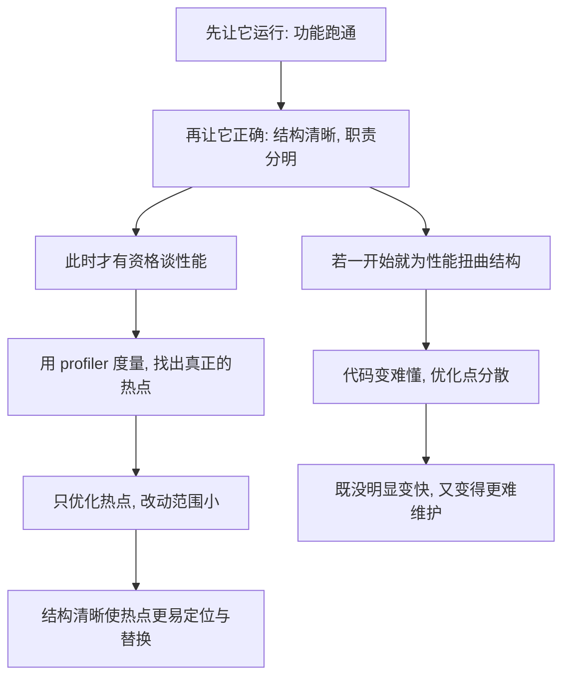

# 18｜重构与性能：先让它跑对，还是先让它跑快？

> 重构会多出函数调用和数据搬运，它会不会拖慢程序？到底该先优化性能，还是先整理结构？

---

## 一、先说结论

福勒建议遵循这样一条次序：**先让它运行，再让它正确，最后让它快。**

他认为，清晰结构带来的性能损失，在绝大多数情况下微乎其微；而糟糕结构带来的维护成本，却是实实在在、每天都在发生的。真正需要优化时，应该靠**度量（profiling）**去定位瓶颈，而不是凭直觉在结构上乱堆技巧。

软件工程界也普遍流传着一句被归于计算机科学家唐纳德·克努特（Donald Knuth）的话：**过早优化是万恶之源。** 它想说的不是「不要优化」，而是「不要在还没测量清楚之前就优化」。

---

## 二、我们先理解一个问题

这是一个几乎每个程序员都纠结过的问题。

重构的本质，就是把代码拆开、给逻辑起名字、多引入一些对象和间接层。可是从直觉上看：多一次函数调用、多创建一个对象、多绕一层间接，不都要花时间吗？

于是两难出现了：

- 如果先重构，会不会把本来能跑的代码改慢，等上线才发现顶不住？
- 如果先优化，会不会还没搞清楚瓶颈在哪，就把结构改乱，最后既没变快，又变得难改？

福勒要回答的，正是这个次序问题。

---

## 三、作者到底提出了什么观点？

在书里，福勒并不把重构和性能看成一对敌人。他的观点大致有三层：

**第一，先后次序要清楚：先运行，再正确，最后快。**
先把功能跑通，再把结构做对，最后才在**清晰的结构上**针对性地优化。而不是在一团乱麻里凭感觉塞优化。

**第二，清晰结构带来的性能代价通常可以忽略。**
多一层函数调用、多一个对象，在现代处理器、编译器与运行时面前，往往小到测不出来。福勒认为，为了这点微小开销去牺牲结构，是一笔极不划算的交易。

**第三，性能问题要靠度量，而不是靠直觉。**
该不该优化、优化哪里，应该由 profiler 的数据说话。凭直觉猜测瓶颈，十有八九会猜错——而猜错时你付出的，恰恰是结构的代价。

换句话说：**重构不一定让程序变快，但它通常会让「变快这件事」更容易做**，因为瓶颈在清晰的代码里更容易被找到和替换。

---

## 四、把这个观点翻译成人话

想象你在**做饭**。

一顿饭有三个层次：**先能吃，再好吃，最后才是快。**

- 先保证菜别烧焦、别夹生——这是「先让它运行」。
- 再调整调味、火候、摆盘——这是「先让它正确」。
- 只有当你要给几十桌同时上菜时，才去研究怎么用高压锅、怎么提前预制、怎么优化流程——这是「最后让它快」。

没有人会在菜还是生的阶段，就纠结摆盘够不够精致；也没人会在只有两三个人吃饭时，就上一条工业流水线。**次序错了，力气就白花。**

写代码也一样：一上来就为了「快」把逻辑揉成一大团、到处塞缓存，就像菜还没出锅就忙着摆盘——最后不但没变快，还把自己搞晕了。

---

## 五、为什么会这样？

把福勒的逻辑拆成链条，是这样：

这条链里最关键的，是**「度量」这个中间环节**。

性能优化有一个被软件工程界反复验证的经验：**程序中很小一部分代码，消耗了大部分运行时间。** 如果这是真的，那么在没测量之前，你根本不知道瓶颈在哪；而你「顺手优化」的地方，很可能压根不是热点。结果就是：白改了结构，性能纹丝不动。

反过来，当结构清晰时，一旦 profiler 指出热点，你往往能干净地替换掉那一小块——因为它的边界是清楚的。

---

## 六、举一个现实生活中的例子

**第一个场景：报表接口变慢。** 团队凭直觉认定「肯定是数据库慢」，于是加班加索引、改查询，忙了两天，接口还是卡。后来用 profiler 一测，发现真正耗时的其实是**返回结果的序列化**。真正的瓶颈和他们猜的方向完全相反。**没有度量，努力就是随机投掷。**

**第二个场景：为性能扭曲的结构。** 有人为了「减少函数调用」，把好几个逻辑合并进一个巨型函数，还顺手加了几个共享缓存。短期跑分没明显变化，但之后每加一个需求，都要小心翼翼绕过那个函数和那几处缓存，bug 越来越多。**这就是把优化建在错误地方的真实代价。**

**第三个场景：重构让优化变简单。** 一段结账逻辑被整理成清晰的几块之后，团队发现其中某一块可以整体替换成更高效的实现，改动范围小、验证容易。**清晰的结构本身就是优化的地基。**

这三种情形放在一起，正好说明福勒的次序为什么合理：结构对了，优化才有落点。

---

## 七、回到书中重新理解

现在再回看福勒关于性能的论述，就容易理解了。

他并不宣称「性能不重要」，恰恰相反，他很清楚性能是真实需求。但他提醒的是**方法和时机**：不要在结构还没理清时就凭直觉乱优化，那往往两头落空。

他也坦率承认，重构确实可能引入一点点开销——多一层调用、多一个对象。但他的判断是：这些代价通常远小于「代码难以理解和修改」的代价，而且在真正需要时，清晰的结构让你更容易把性能找回来。

福勒的这句话常被简化为一条口诀。要真正理解它，得记住后半句：**「最后让它快」不是「不要让它快」，而是「用正确的方法、在正确的时点让它快」。**

---

## 八、这个观点背后还有什么？

第一层，它依赖一个隐含前提：**大多数代码不是瓶颈。** 这正是「过早优化」这个说法能成立的基础。如果程序的每一行都同样重要，那么先做对后做快就无从谈起。这个前提在通用业务系统里大体成立。

第二层，它和第 16 篇的「两顶帽子」是呼应的。**性能优化其实也是一种独立的意图**——它既不是重构（因为可能改变行为与结构），也不是普通加功能。理想情况下，它应该在结构清晰之后再单独进行，而不是混在重构里顺手做掉。

第三层，它把「可维护性」放在了「局部性能」之前。这是一条价值排序，而不是纯粹的技术结论：**当两者冲突且性能损失可忽略时，福勒选择结构。**

---

## 九、这个观点有问题吗？

有，而且不同领域的答案可能截然不同。

**第一，性能在某些场景里就是功能本身。** 在实时系统、游戏引擎、嵌入式设备、高频交易里，「先做对后做快」可能是灾难——如果一开始的架构就慢到无法挽救，后期优化根本无力回天。有工程师认为，在这种领域，性能必须从设计阶段就纳入考虑。

**第二，「先做对后做快」容易被误用成「永远不做快」。** 有些团队把这句话当挡箭牌，长期无视性能，直到上线才发现来不及，届时又被迫在混乱的代码上应急优化，反而更糟。

**第三，「过早优化是万恶之源」常被断章取义。** 克努特的原意更接近「不要在还没有测量时就优化」，而不是「优化是错的」。把它简化成「别优化」，是对原话的曲解。

这些争议的落点其实很清楚：**优化的时机和程度，取决于你所处的领域和约束，而不是一句放之四海皆准的口号。** 福勒的次序对通用业务软件是一个稳妥的默认值，但它不是法律。

---

## 十、今天再看这个观点

（以下为现代延伸，非福勒原文）

福勒写下这些判断时，硬件和工具链还没有今天这样强。今天再看，「先度量、后优化」反而比当年更容易落地。

**一方面，很多历史上的「直觉优化」已经不再必要。** 编译器会做内联和优化，运行时（如 JIT）会动态提升热点代码，云平台的弹性也让「机器不够就加机器」成为常见选择。为了让代码快一点点而牺牲大量可读性，性价比比过去更低。

**另一方面，度量本身变得前所未有地方便。** 可观测性、APM、分布式追踪让「哪一段真的慢」可以被直接看到，而不是靠猜。**「先测量」这道门槛，今天几乎被工具抹平了。**

同时也要看到反面：在 AI 大模型训练、低延迟交易、移动端电量敏感等场景里，性能依然是硬约束，依然需要从设计阶段就认真对待。所以更准确的说法或许是：**度量优先是普适的，但「多早、多深地介入性能」因领域而异。**

---

## 十一、这一篇真正应该记住什么？

1. **次序是「先运行、再正确、最后快」。** 先跑通功能，再做清结构，最后在清晰结构上针对性优化。

2. **清晰结构的性能代价通常可以忽略。** 多一层调用、多一个对象，往往远小于代码难懂难改的代价。

3. **优化必须建立在度量之上。** 凭直觉猜瓶颈，十有八九猜错，还会顺手把结构改坏。

4. **重构不一定让它变快，但让它更容易变快。** 结构清晰后，热点更易定位，替换更安全。

5. **「过早优化」不是「不要优化」。** 它反对的是没测量就动手，而非优化本身；领域不同，性能介入的时机也不同。

---

## 十二、留一个问题

到这里，我们已经把重构的**节奏**讲完了：一次只戴一顶帽子，一次只走一小步，而且要先正确、后追求快。

但还有一个更实际的问题没有回答：道理我都懂，可真动起手来，**我到底该改什么？**

原书里列了几十种重构手法，光是名字就让人望而生畏。它们背后，有没有一张更简单的地图？学会这张地图，是不是比死记几十个名字更有用？

下一篇，我们就来摊开这张**重构手法全景图**。
