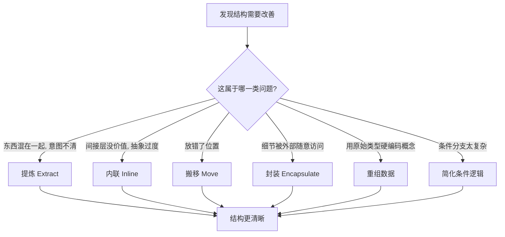

# 19｜重构手法全景：提炼、内联、搬移、封装、重组条件

> 原书列了几十种重构手法，名字多到记不住。它们背后有没有一张统一的地图？

---

## 一、先说结论

有。福勒在《重构》第二版里，把这些手法按**目的**归入几大类：**提炼（Extract）、内联（Inline）、封装（Encapsulating）、搬移特性（Moving Features）、重组数据（Organizing Data）、简化条件逻辑（Simplifying Conditional Logic）、重构 API（Refactoring APIs）** 等。

记住这张地图，比记住几十个名字更有用。因为大多数具体手法，本质上都是这几个**基本动作的组合**：把东西抽出来、把东西塞回去、把东西挪到该在的地方、把细节藏起来、把数据整理好、把复杂判断拆开。

这一篇不逐一展开每个手法，只帮你建立一张「到哪一类里找答案」的索引。

---

## 二、我们先理解一个问题

打开原书，你会发现近三分之一的篇幅是目录式的重构手法清单。Extract Function、Inline Function、Move Function、Encapsulate Variable、Replace Conditional with Polymorphism……几十个名字，每个都有自己的步骤和适用场景。

初学者的第一反应通常是：**这么多，我怎么可能记得住？**

但真正用过一段时间的人会告诉你：日常写代码时，你几乎从来不是「从清单里挑一个名字」，而是脑子里先冒出一句话——

> 「这段逻辑混在一起了，得抽出来。」
> 「这层间接根本没用，塞回去。」
> 「这个方法放错类了，得挪走。」
> 「这个字段谁都能改，太危险，藏起来。」

**这些念头，本身就是那几大类动作。** 名字只是给动作贴的标签。所以真正该记的，不是标签，而是动作。

---

## 三、作者到底提出了什么观点？

福勒把重构手法组织成一个分类目录，每一类对应一种典型的「结构病症」和一组解决方案。代表性的分类与手法大致如下（不逐一展开）：

| 类别 | 想解决的问题 | 代表手法 |
|---|---|---|
| 提炼 Extract | 一段逻辑混在一起，意图不清 | Extract Function、Extract Variable、Extract Class |
| 内联 Inline | 间接层没有价值，抽象过度 | Inline Function、Inline Variable |
| 封装 Encapsulating | 数据或细节被外部随意访问 | Encapsulate Variable、Encapsulate Collection |
| 搬移特性 Moving Features | 东西放错了地方 | Move Function、Move Field |
| 重组数据 Organizing Data | 用原始类型硬编码领域概念 | Replace Magic Number、Replace Primitive with Object |
| 简化条件逻辑 | 条件分支太复杂、重复 | Decompose Conditional、Replace Conditional with Polymorphism |
| 重构 API | 接口难用、参数混乱 | Introduce Parameter Object、Remove Flag Argument |

需要强调的是，这些界线是**人为的、便于查找的**，真实项目里一次改动常常横跨好几类。福勒编制目录的目的，是让这些动作**可命名、可交流、可复用**，而不是要求你严格按分类编号执行。

---

## 四、把这个观点翻译成人话

想想**乐高积木**。

乐高能拼出汽车、城堡、宇宙飞船、整个城市，看起来无穷无尽。但如果你把它拆到底，会发现基础动作其实只有那么几种：**凸起对凹槽的拼、叠、扣**。所有的复杂结构，都是这几种基本动作在不同层次的重复组合。

学乐高的人，不会去背「一千个成品长什么样」，而是掌握那几种基本拼法，然后自由组合。

重构手法也是这个道理：**Extract、Inline、Move、Encapsulate** 就是那几种基本拼法。Extract Class 是「大块的 Extract」，Inline 是「反向的 Extract」，Move 是「换了位置的 Extract」。理解了基本动作，遇到没背诵过的手法名，你也能大致猜到它在干什么。

---

## 五、为什么会这样？

把「遇到问题时如何找到手法」的过程画出来，是这样：

这张图的价值在于：它把「我该用哪招」从一个**记忆问题**，变成了一个**判断问题**。

你不需要背下所有手法名，只需要先判断「我面对的是哪一类问题」——是东西混在一起了？还是放错地方了？把它归到某一类，那一类里的手法就是你的候选答案。这也是为什么福勒说，坏味道和重构手法是一对：**坏味道告诉你哪里有毛病，分类地图告诉你到哪个柜子里找药。**

---

## 六、举一个现实生活中的例子

**IDE 的重构菜单，几乎就是这张地图的现实版本。** 打开 IntelliJ 或 VS Code 的重构菜单，你会看到 Extract、Inline、Move、Rename、Encapsulate 这些分组——工具厂商并没有凭空发明分类，而是直接沿用了业界（包括福勒这套体系）的做法。**能一键调用，正说明这些动作已经被标准化、可命名了。**

**Code review 里的共同语言。** 评审时，一句「这段该 Extract 一下」或「这层封装一下」，团队成员立刻明白你在说什么，不需要展开解释。这和第 08 篇讲的「坏味道作为共同语言」是同一件事的两面：**一边是问题的名字，一边是动作的名字。**

**跨类别的真实改动。** 比如把一段价格计算从订单类里抽出来（Extract + Move），顺手把字符串状态换成枚举对象（Organizing Data），再简化里面的条件判断（Simplifying Conditional）。**真实的重构从来不按目录走，而是按需要组合。**

---

## 七、回到书中重新理解

再回看整本书的结构，你会发现那个庞大的手法目录其实是有骨架的。

福勒写这本书的一个核心目的，是给「改进代码结构」这件事建立一套**词汇表**。在它之前，人们也在改代码，但说不清在改什么、怎么改、改到什么程度算完成。软件工程界普遍认同：**一个能被命名的动作，才容易被讨论、被传授、被工具化。**

所以原书目录不只是「招式大全」，它更像一张**共同语言表**：让「抽出来」「塞回去」「挪过去」「藏起来」这些模糊的念头，有了精确的名字和可重复的步骤。

理解了这一层，就不会被几十个名字吓到——**名字是多，但动作很少。**

---

## 八、这个观点背后还有什么？

第一，**提炼和内联是一对互逆动作。** 这说明重构不是单向的「越抽象越好」。有时候正确的动作恰恰是**反向**的：把当年过度抽象出来的东西塞回去。这一点常被初学者忽略。

第二，**分类的重叠是刻意的。** 一个修改条件的动作，可能同时是「简化条件」和「提炼函数」。类别是查找用的索引，不是互斥的抽屉。

第三，**地图要配着坏味道用。** 单独背手法目录很难记住，因为缺少「什么时候用它」的挂钩。而当你先学会识别坏味道（第 08～15 篇），再去看这张地图，每一类手法都会自然挂到某一种病症上，记忆效率会高得多。

---

## 九、这个观点有问题吗？

有几个批评值得听。

**首先，有人批评这种分类「更像是为了编书方便」。** 真实的开发中，一次改动往往同时涉及提炼、搬移、改名，硬要归类反而显得别扭。有工程师认为，最有用的从来不是分类本身，而是每个具体手法的操作步骤。

**其次，这套分类带有较强的面向对象色彩。** 有工程师指出，第二版的一些类别（比如围绕类与继承的部分）对函数式编程风格覆盖不足；在函数式语言里，同样的意图可能有更简洁的表达方式。

**再次，目录的体量本身可能造成负担。** 几十个名字对已经有经验的人是索引，对新手却可能变成压力。

这些争议的落点不是「分类对不对」，而是：**分类是认知工具，不是执行流程。** 它帮你定位，但真正动手时，还是得回到具体问题上权衡。

---

## 十、今天再看这个观点

（以下为现代延伸，非福勒原文）

福勒当年整理的这套分类，今天已经不只是纸上的目录，而是**被工具和协议固化下来**。

- **IDE 与语言服务器（LSP）** 的 Refactor 能力，基本沿用了 Extract / Inline / Move / Rename / Encapsulate 这套分类；你今天点一下菜单，用的就是这套体系几十年沉淀的成果。
- **现代语言的表达力** 让「简化条件逻辑」有了新工具：记录类型、代数数据类型、模式匹配，让过去需要多态才能表达的分支，今天可以用更直接的方式写出来。但**意图没变——判断还是那些判断，只是表达方式更新了。**
- **AI 辅助重构** 能识别出「这段可以抽函数」「这个类可以拆」，并生成骨架代码。但值得注意的是，模型往往照着这套分类「套招」，却未必真的理解你项目里的领域边界。**分类是问句的模板，答案仍要人来填。**

---

## 十一、这一篇真正应该记住什么？

1. **几十个手法背后只有几类基本动作。** 提炼、内联、搬移、封装、重组数据、简化条件，就是那张地图。

2. **别背名字，记动作。** 先判断「这是哪一类问题」，属于哪一类，就到那一类里找答案。

3. **提炼和内联是互逆的。** 抽象不是越多越好，过度抽象时，正确动作是反向的内联。

4. **地图要配坏味道用。** 坏味道标出病灶，分类地图指向药柜，两者是对偶的。

5. **分类是认知工具，不是流程。** 真实改动常跨多类，不必被目录框住。

---

## 十二、留一个问题

地图有了，但日常开发中，你显然不可能每次都用上全部类别。

如果只让你练**三个**动作，练到滚瓜烂熟，就能解决日常相当一部分结构问题——你会选哪三个？

福勒给出的答案，出乎意料地朴素：一个是最基础的**提炼函数**，一个是它的逆操作**内联**，还有一个看似最简单、性价比却最高的——**改名字**。

下一篇，我们就来看看这三个动作，以及它们为什么值得反复练。
