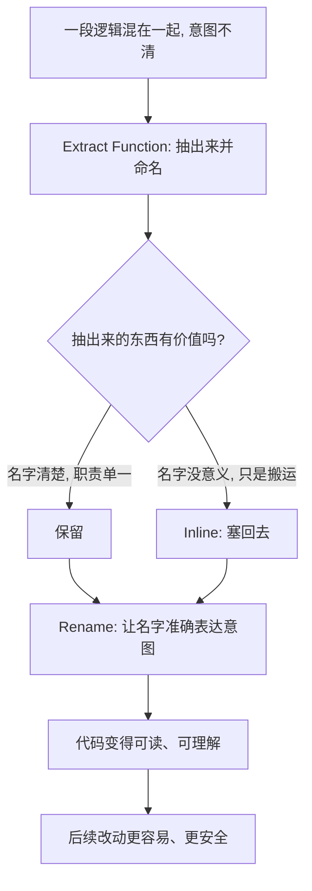

# 20｜最常用的三个动作：提炼函数、内联、改名字

> 如果只让你练三个重构手法，应该选哪三个？为什么是这三个？

---

## 一、先说结论

福勒给出的答案很朴素：**提炼函数（Extract Function）、内联（Inline）、改名（Rename）。**

- **提炼函数** 是最基础、最高频的重构。把一段逻辑抽出来、给它起个名字，几乎所有其他手法最终都要用到它。
- **内联** 是提炼的逆操作。当一个间接层没有价值、或者抽象过度时，把它塞回去，让代码更直接。
- **改名** 看起来最简单，却是提升可读性性价比最高的动作。名字本身就是最便宜的文档。

掌握这三个动作，就能解决日常开发中相当大一部分结构问题。而且它们彼此配合：**抽、塞、名**，构成一个可以反复使用的基本循环。软件工程界普遍认为，能熟练使用 IDE 的一键 Extract / Inline / Rename，是重构入门最重要的基本功。

---

## 二、我们先理解一个问题

前面我们已经有了手法全景图：提炼、内联、搬移、封装、重组数据、简化条件。

可现实中，一个人一天写的代码，根本用不到那么多种类。大多数时候，他心里冒出的念头其实就是两句：

> 「这段太乱了，抽一下。」
> 「这个抽得没意义，还是塞回去吧。」

那么问题来了：**如果只练几个动作，哪几个的投入产出比最高？** 为什么福勒会把「改名」这种看起来毫无技术含量的动作，和「提炼函数」这种核心手法并列？

---

## 三、作者到底提出了什么观点？

福勒在手法的编排里，花了相当大的篇幅讲 **Extract Function**，并且把它当作很多其他手法的第一步：你想搬移代码，往往先提炼再搬；你想简化条件，往往先被提炼出来才谈得上简化。可以说，**没有提炼函数，后面很多手法都无从落地。**

**Inline** 则常被当成「次要的」。但福勒把它明确列为独立手法，因为它解决一种真实而常见的病：**过度抽象**。不是所有抽出来的东西都值得保留，有些函数名和函数体一样清楚，甚至更啰嗦；有些中间层是历史遗留，早就不再有价值。这时候正确的动作不是继续往上堆，而是塞回去。

**Rename** 是三者中最容易被轻视的。但福勒一贯强调命名的分量——他甚至把「注释」列为坏味道，理由正是：**当你能用一个好名字表达意图时，注释就是多余的。** 改一个准确的名字，等于给代码写了一份永不过期、永远不会忘记更新的文档。

三者合起来构成一个循环：**Extract 把模糊的一坨变成有名字的一块；Inline 把没有意义的名字去掉；Rename 把名字调整到准确。** 名字，是这个循环的核心。

---

## 四、把这个观点翻译成人话

想象你在**写文章**。

初稿的时候，你常常是「一口气写一大段」——因为思路是连续的，先把想法倒出来最重要。这时候这一段读起来又长又闷。

接下来你会做三件事：

- **拆分**：把长段拆成几个小段，每段只讲一件事，各起一个小标题。这就是 Extract Function——**把一坨逻辑变成几个有名字的单元。**
- **合并**：有些话说得太碎，单独成段反而啰嗦，就把它们并回一段。这就是 Inline——**把没有价值的拆分收回来。**
- **改标题**：小标题起得不好，读者抓不住重点，就换一个更准确的。这就是 Rename——**让名字准确表达内容。**

写文章和写代码，在这里是同一件事：**先写成一坨，再拆开、合并、命名，直到每部分都名实相符。** 一个有经验的作者和一个有经验的程序员，做的都是同一套动作，只是操作对象不同。

---

## 五、为什么会这样？

把这三个动作的配合关系画出来，是这样：



这条链的关键在于**两头都能走**。

很多人对重构的误解是：只会「抽」。结果代码被拆成几十个小函数，读一行要跳转五次，反而更难懂。福勒把 Inline 单独列出，就是在提醒：**抽象是有成本的，过度抽象也是一种坏味道。** 该抽的时候抽，该塞的时候塞，方向由「能不能让代码更清楚」决定，而不是由「抽了显得更专业」决定。

而 Rename 之所以最关键，是因为整条链最终都要落到「名字」上：提炼的价值靠名字兑现，内联时你判断「名字有没有意义」，也是靠名字。**名字不对，前面两步就白做。**

---

## 六、举一个现实生活中的例子

看一段真实会遇到的重构，用**极短的代码**演示提炼函数。

改之前，一个方法里既有计算、又有打印、又有格式拼装，全搅在一起：

```java
void printOwing() {
    double outstanding = 0;
    for (Order o : orders) {
        outstanding += o.amount();
    }
    System.out.println("***********************");
    System.out.println("**** Customer Owes ****");
    System.out.println("***********************");
    System.out.println("name: " + name);
    System.out.println("amount: " + outstanding);
}
```

用 **Extract Function** 抽成几块之后：

```java
void printOwing() {
    double outstanding = calculateOutstanding();
    printBanner();
    printDetails(outstanding);
}

double calculateOutstanding() { /* 遍历累加 */ }
void printBanner()           { /* 打印星号横幅 */ }
void printDetails(double outstanding) { /* 打印姓名与金额 */ }
```

现在，读 `printOwing` 这一层，你一眼就知道它做三件事：算、印头、印明细。**细节被名字挡住了，但不是被藏起来——需要时点进函数就能看到。**

**什么时候该 Inline？** 如果团队里有个方法长这样：

```java
boolean moreThanFiveDeliveries() {
    return deliveries > 5;
}
```

它的名字和它的实现一样清楚，甚至更啰嗦，调用处还得跳一次。这种情况下，把它**内联**回调用点，代码反而更直接。同样，如果某次重构留下了一个纯粹转发、毫无加工的中间函数，那也是内联的典型目标。

**Rename 的价值**则更日常：把 `calc()` 改成 `calculateShippingFee()`，把循环变量 `d` 改成 `dueDate`，把 `status == 3` 背后的枚举改成 `OrderStatus.PAID`。改完之后，你不需要任何注释，就能读懂这行代码在干什么。**而且这些改动在 IDE 支持下一键完成，几乎零风险——行为完全没变。**

---

## 七、回到书中重新理解

再回看福勒对这三个动作的强调，就顺理成章了。

他并不是说其他手法不重要，而是说：**这三个是所有手法的「原子动作」。** 提炼函数给出了「命名」这个能力，内联保住了「抽象不能过度」的平衡，改名则直接命中了他最在意的一件事——**代码应当自解释。**

这一点和第 15 篇讲的「注释是坏味道」是一脉相承的：福勒不是反对注释，而是主张**能用名字说清楚的，就别用注释说**。因为注释会过期，名字（在工具支持下）可以随时更新。改名，就是把这份「活的文档」不断校准。

---

## 八、这个观点背后还有什么？

第一，**这三个动作恰好构成了「抽象」的完整循环：加一层（Extract）、减一层（Inline）、校准一层（Rename）。** 只学抽不学塞，就容易走进「越抽象越乱」的坑。

第二，**它们都特别依赖工具。** 现代 IDE 对 Extract、Inline、Rename 的支持已经非常成熟，一键完成、自动更新所有引用。也正因如此，这三个动作的**执行成本极低**，是性价比最高的日常习惯。福勒当年需要手工小心的操作，今天几秒钟就能做完。

第三，**它们和「小步前进」是天作之合。** 每一个动作都足够小，都能在工具支持下保持行为不变，改完就能跑测试确认。**高频 + 零风险 + 立即验证，正是这三个动作值得反复练的原因。**

---

## 九、这个观点有问题吗？

有几点值得保持清醒。

**首先，过度提炼是真实存在的反模式。** 有工程师认为，把逻辑切得太碎，会让读者在函数之间反复跳转，反而增加理解成本。有人甚至主张「能内联就内联」的相反倾向。这两种声音的落点其实一致：**问题不在「抽」或「塞」，而在粒度。**

**其次，改名并非永远无风险。** 在私有代码里，Rename 有 IDE 兜底，几乎没成本；但如果改的是对外公开的 API、SDK 或协议字段，改名会直接破坏兼容性，通常需要用「保留旧名 + 标记废弃」的方式过渡。所以「改名最便宜」这句话，要在**你能控制所有调用方的边界内**才成立。

**再次，这三个动作解决的是局部清晰，不解决结构设计。** 如果一个类本身职责就错了，你抽一百个函数也救不回来——那需要的是搬移和拆类。**三个高频动作是日常主力，不是万能钥匙。**

这些争议的落点不是「该不该用」，而是**「用到什么程度、在什么边界内用」**。

---

## 十、今天再看这个观点

（以下为现代延伸，非福勒原文）

**IDE 与语言服务器已经把这三个动作变成了基础设施。** 一键 Extract、一键 Inline、一键 Rename 几乎出现在所有主流开发环境里。今天一个开发者在键盘上敲几次快捷键完成的工作，正是福勒当年在书里逐条写下操作步骤的内容。**工具的普及，本身就是这套方法被行业接受的证据。**

**静态类型与编译器**进一步放大了改名的价值：当名字、类型都准确时，编译器能替你把住很多关口。这也是为什么在强类型语言里，改名常常是「最安全却收益最大」的重构。

**AI 辅助编程**则带来了一个新情况。模型很擅长做提炼、内联、改名这几件事——它生成的代码往往「看起来很规范」。但最需要人判断的恰恰是**名字**：`processData`、`handleInfo`、`utilMethod` 这类空洞命名，AI 很容易大批量地造出来。**它能让动作变快，却不能替你判断这个名字是否真的表达了领域含义。** 越是能自动改代码，命名这件事就越需要人来把关。

---

## 十一、这一篇真正应该记住什么？

1. **只练三个：Extract、Inline、Rename。** 它们是所有重构手法的原子动作，覆盖日常大部分结构问题。

2. **提炼函数是第一基本功。** 它把模糊的一坨变成有名字的单元，也是许多其他手法的第一步。

3. **内联是提炼的逆操作，专治过度抽象。** 记住抽象有成本，不是越抽越好。

4. **改名是性价比最高的动作。** 名字就是最便宜、最不容易过期的文档；在自有代码里，它几乎零成本。

5. **三者构成「抽—塞—名」的循环。** 方向由「是否更清楚」决定，而不是由「是否更抽象」决定。

---

## 十二、留一个问题

我们从第 16 篇走到这里，其实一直在默认一件事：**你有自动化测试可以随时跑，能独立提交，也能放心地改动别人写的代码。**

可是现实中的团队，真的都具备这些前提吗？如果测试没人写、构建要等很久、动别人的代码被视为「冒犯」，那么前面讲的所有手法和节奏，还成立得起来吗？

福勒这本书表面上讲的是技术动作，底层却悄悄依赖了一整套团队工程实践。

下一篇，我们就来看看重构的**隐藏前提**——为什么它是一种「团队工程」，而不是个人洁癖。
