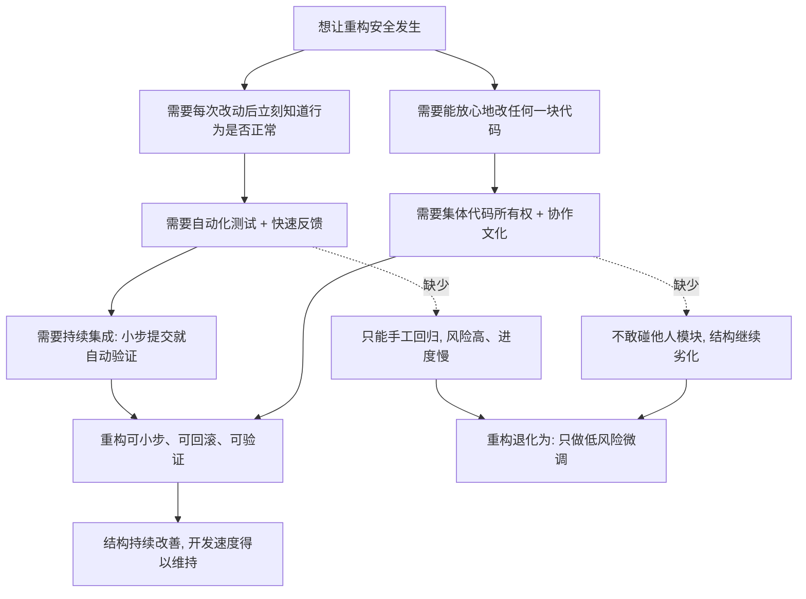

# 21｜重构的隐藏前提：为什么它是一种团队工程？

> 为什么一个程序员再懂重构，到了没有测试、没有协作文化的团队里，也只能小心翼翼地修修补补？

---

## 一、先说结论

福勒的书表面上在讲技术手法：怎么抽函数、怎么搬移、怎么改名。但如果你只看到这一层，就会以为「重构是个人的技术习惯」。实际上，福勒在书里反复把重构和一系列团队实践绑在一起：**自动化测试、持续集成、代码集体所有、以及一种不把「改别人代码」当成冒犯的协作文化。**

这些不是重构的装饰，而是它能够安全运行的地基。没有这套土壤，个人再懂手法，也往往只能做低风险的微调。这也正是《重构》最常被误读的地方——它看起来是一本个人手艺书，底层却是一份团队工程清单。

---

## 二、我们先理解一个问题

先看一个具体的场景。

你读完了《重构》，手法记得滚瓜烂熟，正想大干一场。你所在团队维护着一套点餐系统，订单模块是几年前的人写的，调用关系混乱，一个函数几百行。你很想去理一理。

但你环顾四周，发现几个事实：

- 自动化测试只覆盖了登录和少数主流程，订单金额计算几乎没测。
- 持续集成每天只跑一次，而且经常红着。
- 订单模块是某位老同事的「地盘」，你一动他就问：「你改我代码干嘛？」
- 提交合并请求时，评审人通常只扫一眼有没有明显语法问题。

于是你能做的，只剩下：在那段你根本不敢碰的逻辑旁边，悄悄加一个 `if` 绕过去。

你的重构能力，一点没派上用场。

所以真正的问题是：**为什么同样一个人，在有的团队里能放心大胆地重构，在另一个团队里却寸步难行？**

---

## 三、作者到底提出了什么观点？

福勒认为，重构从来不是一个人关起门来做成的事。他在书里把重构和几项实践明确放在一起：

- **自测试代码**：重构要频繁改动结构，所以必须有一套自动化测试，能在每次改动后立刻告诉你「行为有没有变」。
- **持续集成**：改一点点就集成、就自动跑测试，让问题在最便宜的时候暴露出来。
- **集体代码所有权**：代码属于团队而不是个人，谁都可以改，也谁都要负责。（这是极限编程 XP 的实践之一，肯特·贝克是其中的关键推动者。）
- **配合版本控制与小步提交**：让每一次改动都能单独回滚。

福勒的立场可以概括为一句话：**重构是一整套工程实践体系的一部分，不能孤立地使用。**

这里需要做一个区分：福勒在书中明确讲的是手法与原则；而「重构依赖一整套团队土壤」这个整体判断，是软件工程界从这些实践里读出来的共识，也是对福勒思想的一种延伸概括，未必是他逐字写下的原话。

---

## 四、把这个观点翻译成人话

想象一座城市的日常清洁。

一座城市之所以干净，靠的不是一年一次的大扫除，而是每天有人扫地、路边有垃圾桶、有垃圾车定时来收、市民也不乱扔。

假如这些都没有，只靠一个特别热心的市民，他今天把一条街扫得干干净净，明天就又脏了。他不是不努力，而是**他在用个人的努力，对抗一个没有支撑的系统。**

重构就是代码的日常清洁：它是每天顺手做一点，而不是攒到无法收拾时搞一次大清理。

而让「每天做一点」成为可能的，恰恰是那些看起来与重构无关的基础设施——测试、持续集成、协作规则。它们不在聚光灯下，却决定了你能走多远。

---

## 五、为什么会这样？

把福勒这套逻辑整理成一条链，是这样的：

这张图里其实只有两个前置条件：**能不能验证，敢不敢动。**

- 没有测试和持续集成，你就**无法验证**——每次改完只能靠手工回归，风险和成本高到无法承受。
- 没有集体代码所有权，你就**不敢动**——一旦「改别人代码」被当成冒犯，重构的范围就会被死死限制在你自己写的那点代码里。

任何一个条件缺失，重构都会退化成同一个结局：**只敢做低风险的微调**。而这恰恰是福勒最不想看到的状态——不是不做，而是只能做一点点，眼睁睁看着结构继续劣化。

---

## 六、举一个现实生活中的例子

还是那套点餐系统，我们对比两个团队。

**A 团队**：关键金额计算有自动化测试，持续集成十分钟跑完一轮。有人发现两处重复的优惠计算，把它抽成一个函数，跑测试，全绿，提交，前后不到五分钟。第二天他又顺手改了个命名。没有人觉得这有什么特别。

**B 团队**：同样发现了那两处重复。但改完之后要手工回归两个小时，还得先去找老同事确认：「订单模块我能动吗？」对方说：「你改坏了谁负责？」最后大家决定：不改了。

一年之后，A 团队的订单模块还能改，新需求进去还算顺手；B 团队的订单模块已经没人敢碰，谁要动它都要先开一次会。

**差距不在个人水平，而在工程土壤。**

A 团队那个人未必比 B 团队的人更懂重构，他只是恰好站在了一块能承重的土地上。

---

## 七、回到书中重新理解

现在我们再回头看福勒的写法，就很容易理解了。

他为什么把测试章、原则章放在厚厚的手法目录之前？为什么花那么多篇幅讲小步前进、两顶帽子、持续集成？因为这些**不是配菜，而是主菜的前提**。

书中那个著名的第一个案例之所以行云流水，是因为它默认了一个理想环境：有测试、能快速回滚、随时可以验证。福勒没有把这个前提天天挂在嘴边，但它贯穿了整本书。

理解了这一层，《重构》就从「一本教你改代码的书」，变成了「一本要求你先搭好工程环境的书」。这也是它常被误读的地方——人们记住了手法，却忘了手法运行所需要的地面。

---

## 八、这个观点背后还有什么？

- **集体所有权要求团队信任。** 如果「改别人代码」会被当成打脸，那所有权只是名义上的，代码在心理上仍然是私有的。
- **代码评审的定位。** 它应该是知识共享和风险兜底，而不是审判。否则没人愿意提一个「只重构、不加功能」的小改动。
- **重构是日常习惯，不是专门项目。** 福勒明确反对把重构攒成一个项目统一做——而这正需要稳定的日常节奏和配套的工具。
- **管理者的认可。** 重构的收益往往不可见，需要组织愿意为「看不见的整洁」买单。
- **版本控制与小步提交。** 让每一次改动都成为可独立撤销的单位，这是团队协作里重构安全的前提。

这些点合在一起，说明一件事：**重构的技术动作很小，但它依赖的社会性条件很大。**

---

## 九、这个观点有问题吗？

有几个争议值得摆出来。

第一，有工程师认为，福勒把重构和极限编程（XP）绑得比较紧，这让它在非 XP 团队里显得门槛过高。事实上，测试和持续集成今天已经相当普遍，但集体代码所有权仍然少见——这就意味着福勒式重构在很多团队天然水土不服。

第二，集体所有权并非没有代价。它可能带来责任边界模糊、新人误改核心逻辑、出事时说不清是谁改的等问题。也有团队坚持模块负责人制，同样运行得不错。

第三，也有批评者指出，福勒谈论的其实是一个相对理想的团队；对大量维护遗留系统的团队来说，真正的问题不是「要不要集体所有权」，而是「连测试都补不起来」。

所以争议的落点不在「重构需不需要支撑」，而在**这套支撑在现实中能凑齐多少**。凑得齐，重构就是日常；凑不齐，重构就只是少数人的理想。

---

## 十、今天再看这个观点

（以下为现代延伸，非福勒原文）

今天的工具，把福勒当年假设的土壤部分产品化了。CI/CD、主干开发（trunk-based development）、平台工程，把「小步提交、自动验证」变成了默认配置；IDE 和 AI 助手则让执行手法一键完成。

但有一件事反而变难了：**集体所有权的「归属感」正在被稀释。**

当相当比例的代码由 AI 生成，「谁真正理解这块代码」就成了新问题。能改的人很多，真正懂的人却可能变少。表面上人人拥有，实际上没人负责——这是集体所有权在 AI 时代的新风险。

换句话说，工具能替代一部分基础设施，却替代不了「团队共同理解代码」这件事。而这，恰恰是集体所有权最核心的含义。

---

## 十一、这一篇真正应该记住什么？

1. **重构不是个人手艺，它长在一套团队实践上：** 自动化测试、持续集成、集体代码所有权、协作文化，缺一不可。

2. **缺了两件事，重构就会退化：** 没有测试就无法验证，没有集体所有权就不敢动别人的代码。

3. **福勒把测试和原则放在手法之前，** 说明这些前提不是配菜，而是主菜的地基——手法只是上层建筑。

4. **重构是每天的清洁，不是一次大扫除。** 它需要稳定的日常节奏，而不是专门立项、攒起来统一做。

5. **争议不在「要不要土壤」，而在「土壤能凑齐多少」。** 这决定了重构在一个团队里究竟能走多远。

---

## 十二、留一个问题

如果重构这么依赖测试、持续集成、集体所有权这一整套前提，那问题就来了：

**对那些根本不具备这些条件的团队来说，「你应该重构」这条建议，到底还有多少现实意义？**

会不会我们把重构说得太美好，忽略了它在很多真实环境里根本跑不起来？

下一篇，我们就直面这些反对声音，看看对福勒的批评，究竟哪些站得住，哪些只是误解。
