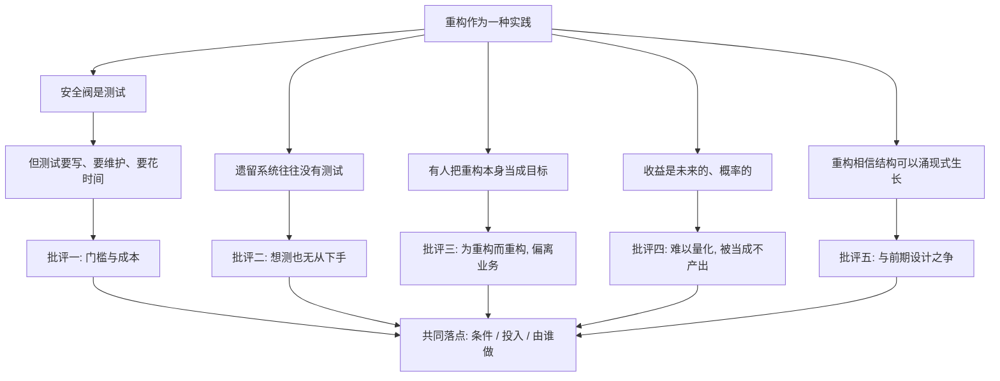

# 22｜重构被夸大了吗？——对福勒的几种批评

> 如果重构真的既能改善结构又能提升速度，为什么现实中还有那么多人对它心存疑虑？

---

## 一、先说结论

对重构的批评里，确实有几条站得住：**它依赖测试，而测试本身有成本；在遗留系统里常常想测都无从下手；实践中存在为重构而重构、偏离业务价值的情况；它的收益难以量化，容易被当成「不产出」；此外还有「重构 vs 前期设计」的路线之争。**

但换个角度看，这些批评大多不是要否定重构，而是在追问同一件事：**在什么条件下、投入多少、由谁来做？** 把重构当成无条件正确的教条，和把它当成毫无价值的洁癖，是同一种误读的两面。

---

## 二、我们先理解一个问题

先看一场常见的技术评审会。

一方说：「这段代码再不重构，以后没人敢改。」

另一方说：「重构重构，上个季度业务需求都排不下，你还有空整理代码？」

两边听起来都有道理，却永远吵不到一起去。为什么？

因为他们其实在争论不同的东西：一个谈的是长期维护成本，一个谈的是本期能不能交付。**如果不把「前提条件」摆到桌面上，这场争论就注定没有答案。**

所以真正值得问的是：重构这件事，到底在什么前提下才成立？它的代价和边界又在哪里？

---

## 三、作者到底提出了什么观点？

先说清楚一件事：很多对「重构」的批评，针对的其实不是福勒本人，而是被简化、被口号化的「重构」。

福勒本人在书里的立场其实很有分寸：

- 他给出了一份「不该重构」的清单：代码即将废弃、没有测试又补不上、收益远低于成本、正处在紧急交付中。
- 他反复强调重构是判断，不是教条。
- 他反对为重构而重构——重构要服务于「更易修改、更易理解」，而不是为了整齐好看。

也就是说，那个被批评的「逢乱必改、不计代价」的重构，并不是福勒的主张。

这里要严格区分三层：**福勒认为**，重构要嵌入日常、要克制、要有测试兜底；**软件工程界普遍认为**，重构是长期项目里必要的维护手段；而**存在争议**的部分，是它的成本、边界与适用条件。下面提到的种种批评，多来自不同的实践者，本文会尽量标明。

---

## 四、把这个观点翻译成人话

想象健身。

适度运动有益健康，这几乎没人反对。但下面这些说法就是另一回事了：

- 「每天必须练三小时，一天不练就焦虑。」
- 「为了朋友圈打卡而健身，练什么、练得对不对都不重要。」
- 「把健身当成生活的全部，工作和家庭都不管了。」

运动本身是对的，出问题的是**目的错位、剂量失控、以及把手段当成了目标**。

对重构的批评，很多也正是这个结构：反对的不是「整理代码」，而是「为了整理而整理」「不计代价地整理」「把手段当目的」。分清楚这一点，很多争论就清晰了。

---

## 五、为什么会这样？

把常见的批评按来源整理成一条链：

这张图想说明：**这五条批评看似分散，最后都收敛到同一组变量上——条件、投入、由谁来做。**

条件，指有没有测试、有没有安全网；投入，指愿意为它花多少时间；由谁做，指这是个人顺手为之，还是需要组织决策。这三个变量不回答清楚，正反双方就只是在各说各话。

---

## 六、举一个现实生活中的例子

几个开发场景。

**第一，大重构暂停业务。** 某团队决定把核心结算模块「彻底重写式地重构」，为此暂停新需求两个月。期间竞争对手上线了新功能，业务方压力巨大；两个月后上线，还带出一批回归问题。从此，「重构」在这家公司成了一个敏感词。

问题其实不在重构，而在于：做一个需要暂停业务的大动作时，没有分阶段、没有保持系统始终可工作。

**第二，对协作的冲击。** 一个涉及几百个文件的改名重构，会把真正的功能改动淹没在噪音里。评审人无从下手，新贡献者的改动也没人看了。结构是好看了，协作反而更差了。

**第三，结构好不等于产品对。** 一个团队把代码整理得非常优雅，模块边界清晰、命名讲究，但产品方向选错了，用户根本不买。技术上的整洁，救不了一个没人要的产品。

这三个例子分别对应了成本、协作和价值三个层面的批评，它们都是真实会发生的。

---

## 七、回到书中重新理解

回头再看福勒，你会发现他其实是这些批评的「同盟军」，而不是靶子。

- 「三次法则」是在**克制过早重构**；
- 「不该重构清单」是在**给重构设边界**；
- 「两顶帽子」是在**防止结构与功能混着改**；
- 他一再强调，重构不是目的，而是让代码持续可维护的手段。

所以真正值得警惕的，不是福勒的原始论述，而是被剥离了前提、只剩口号的那句「代码要重构」。

换句话说，批评「重构原教旨主义」是对的，但把这笔账记在福勒头上，多半是找错了对象。

---

## 八、这个观点背后还有什么？

- **前期大设计（Big Design Up Front）与涌现式设计之争。** 一派认为架构应该提前规划，否则事后改起来代价巨大；福勒这一路更相信让小结构在实践中生长。这不是简单的对错，而取决于系统规模、需求稳定度和团队经验。
- **重构可能掩盖架构问题。** 如果方向本身就错了，把每个模块都改得漂亮，只是让错误的结构更难看穿。局部的整洁，有时会给人一种「整体没问题」的错觉。
- **大重构需要暂停业务。** 有些改动确实无法小步完成，比如更换底层存储。这时候重构就从「日常习惯」变成了「项目决策」，风险与成本完全不同。
- **对新人、开源协作的影响。** 大规模重构会打断别人正在建立的理解，也会让外部贡献者难以跟上。
- **价值量化难。** 测试、重构、文档这类工作，收益是「避免了什么」，而「没发生的事」最难写进报表。

这些点说明，重构从来不是一个纯技术问题，它牵涉排期、组织与协作。

---

## 九、这个观点有问题吗？

要分开看，不能一锅端。

**站得住的批评：**

- 测试成本确实真实存在，写测试、维护测试都要时间。
- 遗留系统「想测也无从下手」，是大量团队的日常，不是借口。
- 为重构而重构、把结构当考核指标，确实会发生。
- 大型重构确实可能伤害交付节奏和团队协作。

**站不太住的批评：**

- 「重构不产出」这种说法，往往暴露的是度量方式的问题——只统计新增功能，却不统计「因为结构差，改一个功能多花的时间」。
- 把重构全盘否定，等于说「代码永远不需要整理」，这在任何长期运行的系统里都不成立。

所以争论的落点不是「重构对不对」，而是：**在什么条件下做、投入多少、由谁来判断。** 这三个变量不回答清楚，正反双方都会继续各说各话。

---

## 十、今天再看这个观点

（以下为现代延伸，非福勒原文）

今天的争论又多了几层。

一是**重构开始被当成绩效包装**。有人把大范围改动标成「重构」，实际上改了行为、甚至引入了风险，让「重构」这个词本身逐渐失信。

二是**AI 生成代码带来的新压力**。当代码被快速生产出来，结构劣化的速度也变快了，「要不要重构」从选择题变成了必答题；但与此同时，AI 也让大规模机械重构第一次变得便宜可行。

三是**大规模自动化迁移**。一些大型技术组织用工具一次性改造成千上万个文件，这更像一次工程化的「大重构」。它既验证了自动化能大幅降低执行成本，也提醒我们：越是大规模改动，越依赖清楚的验证与评审，而不是手速。

这些都不是福勒书中的内容，而是围绕他的思想延伸出来的新问题。

---

## 十一、这一篇真正应该记住什么？

1. **对重构的批评大多成立，** 但它们指向的是「条件、投入与执行方式」，而不是「重构本身没有价值」。

2. **很多批评针对的是被口号化的重构。** 福勒本人恰恰用三次法则和不该重构清单，在限制重构。

3. **测试成本、遗留系统困境、为重构而重构，** 是三条最现实的批评，它们都有真实案例支撑。

4. **收益难以量化，是因为它避免的是未来的痛苦。** 度量方式不改，这类工作永远显得「不产出」。

5. **「重构 vs 前期设计」没有标准答案，** 取决于系统规模、需求稳定度和团队经验，不能一刀切。

---

## 十二、留一个问题

如果重构的收益与风险，几乎全部取决于人的判断——判断该不该改、改到什么程度、由谁来做——那么有一个问题就绕不开了：

**当 AI 已经能够替我们执行重构时，这种判断会变得更不重要，还是更重要？**

下一篇，也是这个系列的最后一篇，我们就来聊聊 AI 时代的人工重构。
