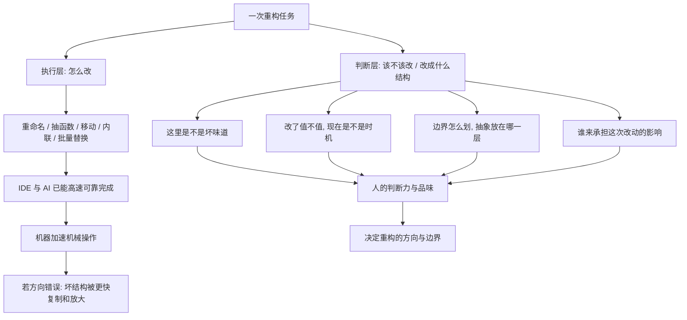

# 23｜AI 时代还需要人工重构吗？

> 当 IDE 和 AI 已经能一键重构，程序员还有必要理解重构这件事吗？

---

## 一、先说结论

先声明：这一篇谈的主要是现代延伸，不是福勒的原文——福勒的书写于 AI 编程助手普及之前。

我的判断是：**工具能替你执行「怎么改」，却无法替你判断「该不该改」「改成什么结构更好」。** 而后面这两件事，恰恰是重构的核心。

AI 能把机械操作加速十倍，也可能把糟糕的结构复制、放大十倍。越是能自动改代码，越需要有人来决定方向。说到底，重构的本质是一场设计决策，而不是敲键盘。

---

## 二、我们先理解一个问题

先看一个让人有点不安的场景。

你把一个文件丢给 AI 助手，说：「帮我重构一下。」几秒钟后，它把重复代码合并了，把长函数拆成了小函数，把变量改成了更有意义的名字，测试还全绿。

你心里冒出一个念头：**那我还学重构干什么？**

再往前一步想：如果你的工作就是「把乱代码改整齐」，而这个动作正被工具自动化，那「理解重构」这件事是不是就要过时了？

这个问题不能靠嘴硬回答，得把它拆开，看清楚重构到底由哪几部分组成。

---

## 三、作者到底提出了什么观点？

这里必须严格区分几件事。

**福勒本人从未讨论过 AI。** 他在书里说的始终是那句定义：在不改变外在行为的前提下改善内部结构，以及一整套手法与原则。

**软件工程界普遍认为**，重构可以分成两个部分：**执行**与**判断**。重命名、抽函数、移动方法这类机械操作，早已可以由 IDE 安全地完成，今天 AI 也只是把它做得更快、更广。

**存在争议的是**：判断部分是否也能被 AI 接管。有工程师认为 AI 迟早能学到「品味」；也有人认为结构好坏高度依赖具体目标与约束，无法脱离人的意图。

至于本文提出的「重构的本质是设计决策」这一说法，是我基于福勒思想的延伸理解，**不是福勒的原话**。

---

## 四、把这个观点翻译成人话

想象导航软件。

它比你更熟悉路况，能实时告诉你哪里堵、哪条路快，甚至能替你重新规划路线。但它始终无法回答一个问题：**你到底要去哪。**

你说「去机场」，它才能开始规划；你如果根本没想清楚目的地，导航只会让你更高效地抵达一个错误的地方。

AI 重构工具就是那个导航：「怎么走」它越来越擅长，「去哪」仍然由你定。而一套代码的「目的地」，就是你想让它将来长成什么样子。

---

## 五、为什么会这样？

把一次重构任务拆开，逻辑是这样的：

这张图想说的只有一句：**AI 位于 B 这一支，而重构的成败取决于 C 这一支。**

执行层可以自动化，因为它有明确答案——「把这个函数抽出来」本来就只有一个正确做法。判断层难以自动化，因为它没有唯一答案——「该不该抽」取决于目标、约束和上下文。

所以「AI 能不能替代重构」这个问题，答案取决于你问的是哪一层。替代执行，可以；替代判断，目前不行。

---

## 六、举一个现实生活中的例子

几个具体的开发场景。

**第一，AI 生成重复代码。** 今天让 AI 写十个相似的接口，它很可能复制出十份几乎相同的逻辑。机械上完全没问题，但如果没人意识到「这里其实只该有一个规则」，这十份就是十个未来的 bug 隐患。AI 复制得越快，坏结构的扩散也越快。

**第二，改名救不了职责错位。** IDE 一键改名非常安全，但如果一个类本身承担了太多职责，换个好听的名字，只是给错误的东西换了件衣服。工具能保证行为不变，不能保证结构变对。

**第三，一次看起来「行为不变」的 AI 重构。** 让 AI 抽一个方法、合并两个分支，测试通过，但异常处理的传播路径被悄悄改变了——直到线上才暴露出来。这说明：越是自动化的改动，越需要清楚的定义、充分的测试和严格的评审来兜底。

三个例子的共同点是：**机器负责了「改」，人则要为「改成什么」负责。** 一旦人缺席，问题不会消失，只会来得更快。

---

## 七、回到书中重新理解

现在再回看福勒的定义，会有新的体会。

「在不改变外在行为的前提下改善内部结构」这句话里，藏着两个关键词：「改善」和「结构」。

**什么算改善、哪种结构更好，这本书从头到尾都在讨论，而它从来不是纯技术问题**——它取决于你要把系统带向哪里。

这也是为什么福勒把重构放在「设计」这个话题里谈：重构不是维护的杂活，而是**持续的设计活动**。手法目录只是执行层，判断才是灵魂。

于是「AI 能否替代重构」就变得清楚了：**AI 替代的是手法，不是判断。** 只要「什么结构更好」仍然依赖人的目标，重构就仍然需要人。

---

## 八、这个观点背后还有什么？

- **判断力与品味。** 识别坏味道、权衡抽象层次、感知「这里以后会出问题」，这些能力靠读代码、踩坑、做决策慢慢积累，很难被一次生成替代。
- **意图与约束。** AI 需要有人告诉它目标：性能优先还是可读性优先？兼容旧接口还是允许破坏性变更？这些约束来自业务，不来自代码本身。
- **验证比过去更重要。** 改动越容易，错误扩散越快，所以测试、持续集成、代码评审在 AI 时代不是过时，而是被加强了。
- **知识传承。** 新人往往通过亲手重构来理解一段设计的来龙去脉。如果全部交给工具，「为什么结构是这样」的知识可能会断代。

这四点合起来，指向一个不那么技术、却更根本的能力：**为代码的长期形态负责。**

---

## 九、这个观点有问题吗？

必须承认，反对意见也有分量。

有工程师认为，所谓「品味」被神秘化了——很多判断其实是可被数据和学习到的模式，AI 完全可以逐步逼近，甚至超过普通开发者。

也有人指出，日常开发中大多数重构确实是机械的，「人的判断」被高估了；真正困难的设计决策并没有那么多。

还有人担心，强调「判断不可替代」会变成拒绝使用新工具的借口——过去说「编译器不可靠」，今天说「AI 不懂结构」，逻辑其实很像。

这些担忧都值得听。更平衡的说法也许是：**机械部分会被大量自动化，判断部分的价值被进一步凸显；但「判断」究竟有多少能由机器承担，是一个开放的问题。** 本文不打算给一个斩钉截铁的结论。

---

## 十、今天再看这个观点

（以下为现代延伸，非福勒原文）

从趋势上看，重构正在出现两种形态。

一种是**日常的、嵌入 AI 助手的重构**：随手完成，成本趋近于零，就像今天用一个快捷键改名一样自然。

另一种是**由 agent 驱动的大规模自动化改造**：一次改动成百上千个文件，把过去需要几个月的工作压缩到几天。

前者让「每次顺手改一点」变得更容易，后者让「一次改一大片」第一次变得可行。但两者的风险是同一个：**当执行变得廉价，方向错误也会被更高效地执行。**

所以 AI 时代真正稀缺的，不是会背重构手法的人，而是能判断「这段结构该往哪走」的人。这也正好呼应了本系列开篇的那句话：**重构是持续的设计，而不是一次性的清理。**

---

## 十一、这一篇真正应该记住什么？

1. **工具能替代「怎么改」，不能替代「该不该改」「改成什么结构更好」，** 后者才是重构的核心。（本点为现代延伸）

2. **AI 加速机械操作，也会加速坏结构的复制与放大。** 效率越高，方向错误的代价越大。

3. **重构的本质是设计决策。** 手法是执行层，判断是灵魂；AI 替代得了前者，替代不了后者。

4. **判断力来自目标与约束。** 性能还是可读性、能否破坏兼容，这些只能由人给出。

5. **在 AI 时代，测试、持续集成、评审不是过时，而是更被需要。** 因为验证比执行更关键。

---

## 十二、留一个问题

这个系列从「重构究竟是什么」开始，一路走过行为铁律、测试前提、坏味道、手法、团队土壤与争议。如果要用一句话收束，大概就是：

**重构是持续的设计，而不是一次性的清理。**

但既然 AI 已经能够自己改代码，那个最初的问题又回来了，而且更难回答了：

**如果结构的好坏终究取决于人的目标，那么在人和 AI 一起写代码的世界里，「什么算好结构」该由谁来定义？又该由谁来保证，它服务的是对的目标？**

这个问题，留给你。也留给每一个正在打开编辑器、准备按下那个「一键重构」按钮的人。
