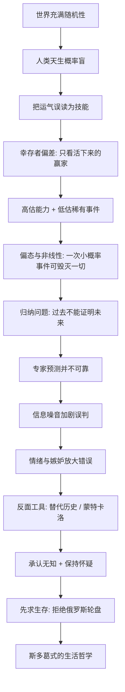

# 《随机漫步的傻瓜》深度解读系列

## 系列简介

《随机漫步的傻瓜》是塔勒布"不确定性"系列的开篇。它要回答的问题看似简单，却击中我们几乎所有人的思维盲区：**那些赚到钱的人、成功的企业、被追捧的专家，究竟是靠本事，还是靠运气？**

塔勒布以交易员的视角告诉我们：人类天生是"概率盲"。我们只看得见活下来的赢家，看不见沉默的失败者；我们把一段随机的好运，误读成一套可复制的技能；我们按"平均情况"思考，却忽略了极少数稀有事件足以改变一切。更危险的是，黑天鹅一旦降临，就可能在一瞬间抹掉此前所有的"成绩"。

这本书没有宏大叙事，它更像一场针对思维盲区的冷峻训练。塔勒布的核心主张不是"努力无用"，而是：**承认运气、敬畏随机、先求活下来。** 在一个充满不确定性的世界里，谦逊、怀疑主义和斯多葛式的克制，比预测和自信更能保护你。

本系列围绕 **19 个核心问题**，从幸存者偏差、蒙特卡洛思维、归纳问题，一路讲到信息噪音、嫉妒与幸福，最后落到"如何与随机性共处"，把这本书拆成一套可理解、可应用的不确定性思维课。

---

## 全书核心问题

| 层次 | 问题 |
|---|---|
| 认知问题 | 我们为什么看不见运气，反而把它误认为能力？ |
| 概率问题 | 人类的心智为什么天生不擅长处理概率与稀有事件？ |
| 哲学问题 | 既然过去不能证明未来，我们凭什么相信自己知道会发生什么？ |
| 生存问题 | 在一个被随机性支配的世界里，我们该如何行动、评价与自处？ |

---

## 全书知识地图



---

## 全系列目录

### 第一部分：看不见的运气

#### 01｜为什么我们总把运气当成实力？

核心问题：为什么我们明明知道有运气，却总是把它当成能力？

核心观点：人类的心智为"找因果、编故事"而生，却对随机性极不敏感。当一件好事发生，我们本能地给它编一个理由，而不是承认它可能只是随机的结果。塔勒布认为，看不清运气，是一切误判的起点。

理解难度：★★☆☆☆

关键词：随机性、归因偏误、叙事谬误、运气

---

#### 02｜什么是“幸运的傻瓜”？

核心问题：为什么有些人赚了钱、成了名，却依然是"傻瓜"？

核心观点：塔勒布用"幸运的傻瓜"指那些因为运气而成功、却把它归功于自己能力的人。问题不在于他们赚了钱，而在于他们误读了赚钱的原因——因此下一次几乎必然要还回去。

理解难度：★★★☆☆

关键词：幸运的傻瓜、结果与过程、尼罗、约翰

---

#### 03｜为什么成功者的话最不可信？

核心问题：为什么我们越是听成功者的经验，越可能被误导？

核心观点：幸存者偏差——我们只能看到活下来的赢家，看不到同样方法却失败的沉默者。于是把"幸存者的共同点"当成"成功的原因"，得出荒谬结论。成功者的自述，往往是最不可靠的证据。

理解难度：★★★☆☆

关键词：幸存者偏差、沉默的数据、样本偏差

---

#### 04｜如何用“替代历史”看清运气？

核心问题：如果不重来一遍，我们怎么知道成功里有多少运气？

核心观点：塔勒布主张用"替代历史"思考：想象同一批人、同一套策略，在无数个平行世界里会得到什么结果。如果换个世界你就破产了，那你的成功很大程度是运气。蒙特卡洛模拟，就是把这种想象变成可计算的方法。

理解难度：★★★★☆

关键词：替代历史、蒙特卡洛、平行世界、概率分布

---

### 第二部分：我们天生是“概率盲”

#### 05｜为什么我们天生是“概率盲”？

核心问题：为什么连聪明人也经常在概率上犯错？

核心观点：塔勒布指出，我们的大脑是为适应的草原生活而进化的，擅长处理具体、可见、立刻的威胁，却不擅长抽象概率与长期统计。于是凭直觉给出的答案常常是错的，而正确的概率判断需要刻意训练。

理解难度：★★★☆☆

关键词：概率盲、直觉、卡尼曼、系统一与系统二

---

#### 06｜为什么小样本会骗人？

核心问题：几笔成功、几年的业绩，能证明一个人的能力吗？

核心观点：小样本里的结果几乎完全由随机性主导。连续几年跑赢市场，统计上完全可能只是运气。塔勒布强调，样本量越小，"看起来的能力"越可能只是噪音。

理解难度：★★★☆☆

关键词：小样本、样本量、统计显著性、噪音

---

#### 07｜连续赚钱的基金经理，是高手还是运气好？

核心问题：我们该如何判断一个投资人到底是靠能力还是靠运气？

核心观点：塔勒布认为短期内几乎无法区分——因为这里同时踩中"幸存者偏差 + 小样本 + 偏态"三重陷阱。他给出的思路是：看长期、看风险调整后的表现、看他是不是在玩俄罗斯轮盘。

理解难度：★★★★☆

关键词：基金经理、业绩、样本、风险调整、能力

---

#### 08｜为什么稀有事件被我们严重低估？

核心问题：我们为什么总是忽略那些极少发生、却足以改变一切的事？

核心观点：塔勒布用"偏态与非线性"说明：少数稀有事件的后果，可能远超大量常见事件之和。我们的直觉按平均情况思考，忽略尾部；而在现实中，尾部事件往往决定生死。

理解难度：★★★★☆

关键词：偏态、非线性、稀有事件、黑天鹅、尾部风险

---

### 第三部分：归纳、不确定与怀疑

#### 09｜“过去一直如此”，为什么不能证明未来？

核心问题：既然历史一再重复，我们凭什么不能从过去推断未来？

核心观点：休谟的"归纳问题"：再多的白天鹅，也不能证明下一只不是黑的。塔勒布指出，我们依赖历史经验，可历史恰恰很少重复最关键的稀有事件。对归纳法的过度自信，是"随机漫步者"最大的错觉。

理解难度：★★★★★

关键词：归纳问题、休谟、黑天鹅、证伪

---

#### 10｜俄罗斯轮盘：为什么“从没输过”最危险？

核心问题：为什么一个人连续成功，反而可能意味着巨大的风险？

核心观点：塔勒布用俄罗斯轮盘作比：玩一次可能没事，玩一百次终将出事。当有人"从没输过"，要警惕他玩的是不是这种游戏。小概率的毁灭性事件，会在一瞬间抹掉此前所有的胜利。

理解难度：★★★★☆

关键词：俄罗斯轮盘、爆仓、风险、生存、非线性

---

#### 11｜科学与随机性：为什么专家预测不可靠？

核心问题：为什么那么多专业预测者，事后看几乎等于瞎猜？

核心观点：塔勒布区分了真科学与"伪科学式的预测"。许多专家靠复杂模型和自信语气提供确定性，而他们的成功记录被幸存者偏差掩盖。真正诚实的态度，是承认不确定性，而不是用术语把它藏起来。

理解难度：★★★★☆

关键词：专家、预测、伪科学、确定性、不确定性

---

### 第四部分：情绪、信息与幸福

#### 12｜为什么理性懂概率，情感还是会出错？

核心问题：为什么我们"知道"概率，却依然做出错误的反应？

核心观点：塔勒布结合心理学指出，人的理性与情感是两套系统。即使理论上明白概率，情感仍会被短期波动、损失和嫉妒牵着走。真正的概率素养不只是会算，还要能承受。

理解难度：★★★★☆

关键词：情感、理性、卡尼曼、达马西奥、损失厌恶

---

#### 13｜为什么每天看新闻会让你更糟？

核心问题：信息越多，判断为什么反而越差？

核心观点：塔勒布认为，新闻大多是噪音而非信号；高频的信息流会放大随机波动，诱发情绪化反应，还让人误以为自己更了解世界。他主张大幅减少信息摄入，只保留真正重要的信号。

理解难度：★★★☆☆

关键词：信息毒性、噪音、信号、新闻、注意力

---

#### 14｜嫉妒与幸福：我们为什么总跟别人比？

核心问题：为什么我们越比较，越不幸福，也越容易做错决定？

核心观点：塔勒布指出，幸福感很大程度来自与参照群体的比较，而非绝对水平。嫉妒会让人为了"不输给别人"去冒本不该冒的风险，是随机性世界里最昂贵的情绪之一。

理解难度：★★★★☆

关键词：嫉妒、攀比、幸福、参照点、风险

---

#### 15｜噪音与信号：如何不被随机波动牵着走？

核心问题：面对每天的涨跌、涨落、好消息坏消息，我们该相信什么？

核心观点：塔勒布强调区分噪音与信号：短期数据大多是噪音，长期趋势才可能含信号。频繁查看、频繁行动，往往只是对噪音做出反应。降低观察频率、拉长时间尺度，是提升判断力的关键。

理解难度：★★★☆☆

关键词：噪音、信号、时间尺度、频率、观察

---

### 第五部分：与随机性共处

#### 16｜为什么“活下来”比“赚得多”更重要？

核心问题：为什么追求高收益可能是致命的，而生存才是第一位？

核心观点：塔勒布用俄罗斯轮盘和亏损的不对称性说明：一次致命损失可以让之前所有收益归零，甚至让你彻底出局。因此理性的目标不是最大化期望收益，而是先确保自己不会被迫离场——先活下来，再谈赢。

理解难度：★★★★★

关键词：生存、爆仓、遍历性、风险控制、不对称

---

#### 17｜运气还是能力：我们该如何评价成功与失败？

核心问题：既然运气无处不在，我们该如何看待自己和他人的成败？

核心观点：塔勒布主张，评价一个人要看过程与风险暴露，而不只是结果，因为结果里混着运气。给"幸运的傻瓜"以掌声、给"倒霉的高手"以嘲笑，都是对随机性的误读。

理解难度：★★★★☆

关键词：结果偏误、过程、评价、归因、谦逊

---

#### 18｜斯多葛主义：塔勒布为什么推崇古人的智慧？

核心问题：两千年前的斯多葛哲学，能帮我们应对现代的不确定性吗？

核心观点：塔勒布推崇斯多葛式的态度：把注意力放在自己可控的事上，平静接受不可控的结果，用"最坏情况"来校准情绪。这套古老智慧，恰好是应对随机性最实用的心理工具。

理解难度：★★★★☆

关键词：斯多葛、塞内加、可控、情绪、节制

---

#### 19｜在一个随机的世界里，我们该如何生活？

核心问题：如果努力未必有回报、运气又无法控制，我们究竟该怎么活？

核心观点：塔勒布给出的不是鸡汤，而是一种姿态：承认运气、保持怀疑、敬畏风险、先求生存、减少噪音、对自己诚实。努力依然重要，但要把它用在"提高生存概率"和"增加正面不确定性"上，而不是盲目赌一把。

理解难度：★★★★★

关键词：怀疑主义、谦逊、生存、努力、与随机性共处

---

## 推荐阅读顺序

**主线顺序（推荐）：01 → 19，逐篇阅读。**

按认知难度与逻辑依赖，分五段推进：

```text
第一段｜看不见的运气（01–04）
   运气 vs 能力 → 幸运的傻瓜 → 幸存者偏差 → 替代历史
        ↓
第二段｜概率盲（05–08）
   概率盲 → 小样本 → 基金经理 → 稀有事件
        ↓
第三段｜归纳与怀疑（09–11）
   归纳问题 → 俄罗斯轮盘 → 专家预测
        ↓
第四段｜情绪、信息与幸福（12–15）
   情感 vs 理性 → 信息毒性 → 嫉妒 → 噪音与信号
        ↓
第五段｜与随机性共处（16–19）
   先求生存 → 如何评价成败 → 斯多葛 → 如何生活
```

**阅读建议：**

- **想先抓住全书骨架**：读 02、03、04、08、09、16 六篇，即可拼出完整主线。
- **对投资与风险感兴趣**：07、08、10、16 可作为一个独立小单元。
- **对心理与决策感兴趣**：05、12、13、14、15 更贴近日常生活。
- **想练习批判性阅读**：重点看 09、11、16、17 四篇，争议最集中。
- **想直接改善生活**：从 13、15、16、18、19 切入，再回补前文。

---

## 全系列状态

> 本系列 19 篇正文已全部完成，每篇独立成文，均采用统一结构：先说结论 → 提出问题 → 作者观点 → 翻译成人话 → 推理链 → 现实例子 → 回到书中 → 深层逻辑 → 争议 → 现代延伸 → 核心结论 → 留一个问题。
>
> 每篇都严格区分「塔勒布的书中观点」「统计/事实」「学界争议」「现代延伸」，并对争议处保持开放。
>
> 建议阅读顺序：从 **01｜为什么我们总把运气当成实力？** 开始，依次读到 **19｜在一个随机的世界里，我们该如何生活？**
