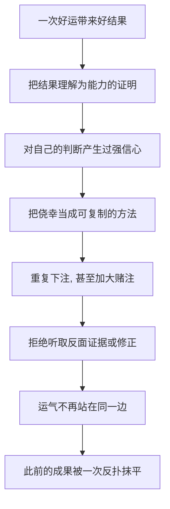

# 02｜什么是“幸运的傻瓜”？

> 为什么有些人赚了钱、成了名，却依然是“傻瓜”？

---

## 一、先说结论

塔勒布造了“幸运的傻瓜”这个词，不是在骂人。

他指的是这样一类人：**他们因为运气得到了好结果，却把这份好结果归功于自己的能力。** 钱是真的，名声是真的，问题出在他们对“为什么会有这个结果”的理解上。

塔勒布认为，真正危险的不是赚到钱，而是一个人误读了赚钱的原因。因为误读之后，他会把一次侥幸当成一套可复制的方法，于是重复下注、拒绝修正。下一次运气不再站他那边时，之前得到的一切就可能被加倍收回去。财务上的数字或许是真的，但那个数字背后的判断是错的。

---

## 二、我们先理解一个问题

先别急着接受这个说法，我们来较个真：

> 如果一个人真的赚到了钱，房子买了、名声有了、账上数字是真的——你凭什么说他“傻”？

这听起来很像酸葡萄心理。别人成功了，你就说他只是运气好，这难道不是失败者的托词吗？

这正是塔勒布要拆开的误会。他说的“傻”，不是评价这个人的品德、智力或生活，而是在说一个非常具体的东西：**他对因果的判断是错的。**

所以这篇要回答的是——结果和判断，为什么可以是两回事？一个人可以在结果上赢，同时在判断上错；而后者才是决定他能不能一直赢下去的关键。

---

## 三、作者到底提出了什么观点？

塔勒布用“幸运的傻瓜”（lucky fool）来形容那些被随机性照顾、却以为自己被能力照顾的人。

他给出这个定义时强调了一点：**“傻瓜”不是道德评价。** 一个幸运的傻瓜完全可能是勤奋、聪明、正直的人。他唯一的问题，是把“我这次成功了”直接翻译成了“我掌握了成功的方法”。

书里有两个交易员的形象常被拿来做对照：一个叫约翰，一个叫尼罗。约翰是那种业绩亮眼、持续赚钱的交易员，看起来很有一套；尼罗则相反，他对随机性保持敬畏，最在意的事情不是“这个月赚多少”，而是“我有没有可能一次亏光”。

这两个人可能在某个阶段里都赚了钱。区别在于：**约翰把赚钱理解成能力的证明，尼罗把赚钱理解成“到目前为止，运气还没有反扑”。** 塔勒布要我们看的不是谁现在更富，而是谁在误读因果。

关于这两个角色的具体情节，书中着墨很多，这里不必展开；只要抓住一点就够了：一个把结果当证据，一个把结果当噪音。

---

## 四、把这个观点翻译成人话

用一个最简单的画面来理解。

两个人要过一条河。A 会游泳，B 不会。那天水位很低，河底露出石头，两个人踩着石头都过去了。

如果只看结果：两个人都到了对岸，分不出区别。

但只要多问一句：**假设明天水位涨起来，谁还能过去？** 答案立刻就清楚了。A 靠的是能力，B 靠的是“今天的河正好没水”。

塔勒布说的“幸运的傻瓜”，就是那个踩着干石头过了河、然后宣称“我掌握了过河的方法”的人。他不但会重复走这条路，还会在水涨起来的时候继续走——因为他真心相信问题已经解决了。

这里有个反直觉的地方：**正因为他成功了，他反而更难反省。** 失败会逼人反思，成功不会。成功会给你一个“我做对了”的信号，而这个信号很可能只是运气留下的假象。

---

## 五、为什么会这样？

把这条链拆开看：

关键在于 **B → C** 和 **C → E** 这两步。

塔勒布认为，“幸运的傻瓜”比普通人危险得多，原因就在这里：

- 普通人知道自己不懂，做事会小心；
- 幸运的傻瓜以为证据（他的成功）站在自己这边，于是**加大赌注**；
- 而且他**拒绝反省**——你拿什么证据去说服他？他手里握着的“证据”，就是他已经赚到的钱。

于是就形成了一个闭环：成功让他自信，自信让他暴露在更大的风险里，更大的风险最终会把他收割。这个闭环最可怕的地方在于，它在被打破之前，看起来一直是“正向反馈”。

---

## 六、举一个现实生活中的例子

说一个很具体的场景。

某个城郊家庭等来了拆迁。一套老房子，最后补偿了几百万现金，外加两套安置房。这笔钱不是他们“经营”出来的，而是政策、地段和时机共同随机落在他们头上的。

但接下来发生的事情，常常是这样的。

男主人开始觉得，自己“命好”“有眼光”“赶上了”。手里有了钱，他把这笔钱理解成某种“我能赚到钱”的证明，于是开始按这个前提去下注：买一辆明显超出需要的豪车，因为“钱要花在看得见的地方”；朋友拉他做项目，投一大笔，理由是自己“有本钱了”；听人说某个投资能翻倍，把大头压进去；还有一部分借出去收高息，觉得稳当。

三五年后，很多人会发现钱所剩无几。房子可能还在，现金却没了。

这里要特别小心，不要把结论说成“暴富的人就是蠢”。真实情况往往复杂得多。塔勒布要说的是：**问题不在他花了钱，而在他把一笔随机的馈赠，误读成了自己判断力的证据。** 于是他不是在“用钱”，而是在按一个错误的前提继续下注。当一笔钱被当成能力的证明来使用时，亏损就不是意外，而更像是迟早的事。

---

## 七、回到书中重新理解

现在回头看塔勒布的原始论述，会更清楚他为什么反复强调“过程比结果重要”。

他在书里区分了两样东西：**结果**和**产生结果的机制**。结果只是一个已经发生的、唯一的事实；机制才决定“下一次会怎样”。而最麻烦的是，随机机制和真实能力，常常产生看起来一样的结果。

所以塔勒布看一个人，不只看他赚没赚到，还看他是**怎么赚的**：

- 他是不是在承担一次性的、小概率却致命的暴露？
- 他的好成绩里，有没有可能只是“样本少 + 运气好”？
- 如果运气反过来，他会不会直接出局？

这套看法会贯穿整本书。塔勒布后面讲的幸存者偏差、替代历史、俄罗斯轮盘，本质上都在回答同一个问题：**怎么才能不被眼前的唯一结果骗到。**

而“幸运的傻瓜”，就是被这个唯一结果骗得最深、也最自得其乐的那一类人。

---

## 八、这个观点背后还有什么？

几个隐含前提值得点出来。

**第一，它成立的前提是“结果受随机性影响很大”的领域。** 在投资、创业、名气、彩票这些地方，运气占比高；但在下棋、外科手术、长跑这类领域，结果和能力高度相关，“幸运的傻瓜”这个概念就没多少用武之地。

**第二，它有一个对称的另一半：倒霉的高手。** 如果运气可以让傻瓜显得像高手，那它也可以让高手显得像傻瓜。塔勒布认为，只奖励前者、只嘲笑后者，都是对随机性的误读。这也为后面“如何评价成功与失败”埋下了伏笔。

**第三，它把“生存”提前摆到了台面上。** 幸运的傻瓜最大的问题不是这一轮输了，而是他可能在一轮里彻底出局。这和后面讲的俄罗斯轮盘、“先求活下来”是同一套逻辑。

**第四，它是对“因果感”的一种警示。** 人脑需要因果才安心，而随机性不给因果。幸运的傻瓜，其实是用自己编的故事，填补了世界本来的那块空白。

---

## 九、这个观点有问题吗？

有，而且值得认真对待。

**第一，它很难证伪。** 这是塔勒布自己都承认的难题：你几乎无法向一个幸运的傻瓜证明他只是幸运，因为他的证据就是他的成功。而成功，恰恰是随机性与能力共同写下的、无法干净拆分的结果。这让“幸运的傻瓜”这个标签在某些时候变得不可检验。

**第二，它容易被事后套用。** 谁赚钱的时候，我们都可以说他“有可能只是运气”；等他亏了，我们再说“你看，果然是傻瓜”。这是一种危险的循环论证。关于一个人某次成功里运气占多少，学界并无统一方法，需要具体分析，不能一概而论。

**第三，成功者里确实有能力。** 把成功者一律归入“幸运的傻瓜”，是另一种过度简化。能力的一个真实表现，恰恰是对风险和随机性的处理——能控制回撤、能活得更久，这本身就是本事，只是它不以“每次都赢”的形式出现。

**第四，还有其他解释。** 一些心理学家会强调，人的过度自信有适应性价值：适度的自信能让人敢于行动、坚持下去；完全“正确”地承认自己什么都不确定，反而可能寸步难行。所以“误读因果”是不是纯粹坏事，也有讨论空间。

更准确的说法是：**塔勒布提供了一个有力的诊断工具，用来识别“结果好但判断错”的情形；但它不是一顶可以随手扣在别人头上的帽子，判断需要具体证据，而不是结果本身。**

---

## 十、今天再看这个观点

以下部分是基于塔勒布思想的现代延伸，不是他在书里的原话。

塔勒布当年主要是在讲交易员。今天，“幸运的傻瓜”的可见度反而更高了。

币圈里一轮牛市造出的一批暴富者，会很快开始输出“方法论”；短视频里靠一条内容突然起量的博主，会立刻被请去讲“爆款公式”；创业圈里拿到融资的年轻人，会被邀请去分享“我的成功经验”。这些人里当然有真本事的，但也有相当一部分，只是恰好站在了随机波动的高点上。

现代环境让“幸运的傻瓜”更容易被生产、也更容易被模仿，因为：结果被极度放大（一次成功就能带来巨大曝光）；分母被彻底隐藏（同样做法但没成功的人，没有故事可讲）；反馈周期被加速（暴富和暴亏都来得更快）。

这给出一个很实用的纪律：**在学任何人的“方法”之前，先问一句——他的成功里，有多少是我看不见的运气？如果同样的运气不出现，这套方法还成立吗？**

---

## 十一、这一篇真正应该记住什么？

1. **“幸运的傻瓜”不是骂人的话。** 它说的是一种因果误读：把运气的结果，当成能力的证明。

2. **结果和判断是两回事。** 一个人可以在结果上赢、在判断上错；而决定他能否持续的，是判断。

3. **傻瓜的危险在于他不觉得自己傻。** 成功会削弱反省的动力，让他重复下注、加大赌注。

4. **评价一个人要看过程。** 看他怎么赚的、冒了什么风险、运气反过来会怎样，而不只看数字。

5. **它有一个对称面：倒霉的高手。** 只崇拜赢家、只嘲笑输家，都是被结果牵着走。

---

## 十二、留一个问题

> 如果有一天，你靠一件事赚到了一笔远超预期的钱——
> 你打算怎么判断，这究竟是你应得的，还是命运恰好站在了你这边？

---

**下一篇**：既然“幸运的傻瓜”是拿结果下判断，那我们就得问一个更尖锐的问题：那些我们仰望的成功者，他们的经验之谈，到底值不值得听？为什么我们越认真研究成功者，可能离真相越远？

下一篇我们就来拆开——**为什么成功者的话最不可信？**
