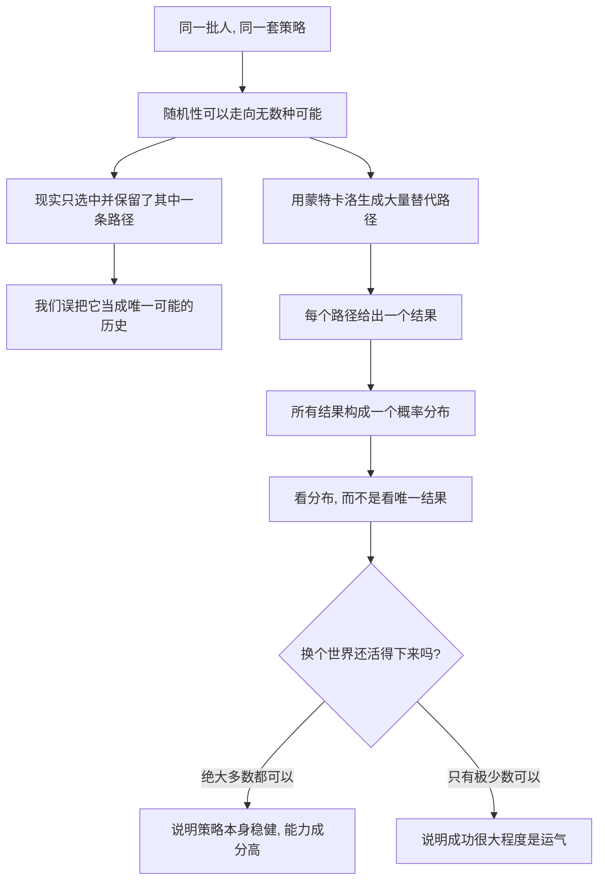

# 04｜如何用“替代历史”看清运气？

> 如果不重来一遍，我们怎么知道成功里有多少运气？

---

## 一、先说结论

塔勒布给出的工具叫“替代历史”（alternative histories）。

它的核心思路是：**不要只盯着实际发生的那一条路径，而要想象同一批人、同一套策略，在无数个“平行世界”里会得到什么结果。** 如果换个世界你就破产了，那你的成功很大程度来自运气；如果换个世界你依然活得很好，那才说明你的策略本身过硬。

塔勒布认为，我们之所以总被运气骗，是因为我们只看到一条已经发生的历史，就把它当成了唯一可能的历史。而蒙特卡洛模拟，就是把“想象无数种可能”这件事，从空想变成可计算的方法：用大量随机路径生成一个结果分布，而不是盯着唯一的结果下结论。

---

## 二、我们先理解一个问题

前面两篇讲了两件事：我们看不见运气，我们只看得到赢家。现在问题变得更棘手了。

> 我们的人生只有一条时间线。发生过的事就是发生了，没发生的事我们永远无从知道。

这就带来一个近乎无解的困难：**没有重来一遍，我们拿什么判断这次成功里有多少运气？**

如果一个人创业成功了，我们能不能说“他运气好”？可我们根本没有一个平行世界来对照——没有另一个他，用同样的方法、同样的时间，失败给我们看。

这就是塔勒布要正面破解的难题。他的答案有点反直觉：**你无法让历史重来，但可以让它在想象和计算里重来无数次。** 你要做的不是改变已发生的事，而是生成“本来可能发生的事”。

---

## 三、作者到底提出了什么观点？

塔勒布提出，应该用“替代历史”的视角来看待任何一个结果。

意思是：现实只保留了无数种可能性中的一条。同一套初始条件、同一个策略，如果随机性走向不同，完全可以走出很多条不同的轨迹——有的更赚，有的小亏，有的一败涂地。**我们看到的，只是这些轨迹里被偶然选中的那一条。**

所以塔勒布看策略，不看“它这次赚没赚钱”，而看“如果把它放进大量不同的随机世界里，会出现什么样的结果组合”。他特别关心的是：在这些可能的世界里，最坏的那几条长什么样。

他主张用蒙特卡洛方法来逼近这个问题。蒙特卡洛的核心思想，就是用大量随机抽样来代替复杂计算：与其推导一个理论答案，不如让电脑反复“掷骰子”，把很多条路径跑出来，然后观察这些结果构成的分布。塔勒布在书里用这套思路来检验交易策略的稳健性——不是问“这个策略过去赚不赚钱”，而是问“如果换一批随机的市场路径，它还能不能活”。

一个耐人寻味的结论是：**很多看起来漂亮的策略，一旦放进替代历史里，就会暴露出它其实只是在某一条幸运路径上侥幸存活。**

---

## 四、把这个观点翻译成人话

我们用一个思想实验，先把“替代历史”这个概念讲清楚。

假设有 1000 个平行世界，每个世界里都站着一个你，你的初始条件、你的性格、你的决策方法完全一样。唯一不同的，是每个世界里随机事件的发生顺序——这次谈判成功或失败、这次市场上涨或下跌、这次遇到的人是对还是错。

然后让这 1000 个世界同时运转一年。

一年后，把 1000 个你的结果收集起来，你会得到一条“结果分布”：也许有几十个你大获成功，有一批你小有斩获，有一批你不温不火，还有几个你彻底出局。

现在，关键问题来了：**你所在的那个真实世界，只是这 1000 个中的一个。** 如果你恰好是那个成功的你，你有没有资格说“是我做对了”？

塔勒布说：看分布。如果分布里绝大部分版本都活得不错，那是你的方法在起作用；如果分布里只有极少数版本成功，而你恰好是其中一个，那你很可能只是被随机性挑中了。

**“替代历史”不是让你后悔“当初要是怎样”，而是让你问一句：换一个随机世界，我还会不会在这里？**

---

## 五、为什么会这样？

把这条推理链拆开：

关键在于 **C → D** 这一步产生的错觉，以及 **E → H** 这一步提供的矫正。

塔勒布的思想逻辑是：**一个结果本身不携带足够的信息，因为它只是分布中的一个点。** 就像你不知道一个人的考试成绩，只知道他的身高，你没法判断什么；同样，你只知道某条路径的结果，却不知道其他路径会怎样，你就无法判断这是能力还是运气。

而替代历史的思路，本质上是在人为地补上那个缺失的“对照组”。它把“如果重来一次会怎样”这个无法直接观察的问题，转化成“如果生成很多次会怎样”这个可以计算的问题。

这也解释了塔勒布为什么如此强调风险而不是收益：**在替代历史的视角下，重要的不是最好的那条路径有多好，而是最坏的那几条路径会不会让你出局。** 一个策略哪怕平均收益很高，只要在某些替代世界里会归零，它就可能是不值得玩的。

---

## 六、举一个现实生活中的例子

如果你玩过有“存档 / 读档”机制的游戏，你已经体验过替代历史了。

假设你面前有一个高难度关卡。第一次尝试，你手忙脚乱，却惊险地过去了——可能是 Boss 最后一击正好暴击，可能是你误打误撞进了正确的路线。屏幕上显示“通关”，你会觉得自己“这一关打得好”吗？

先别急着下结论。打开存档，读档重来。

重来十次，你只过了一次；重来一百次，你大概还是只能在寥寥几次里过关。这时候你就明白了：**第一次的通关，绝大部分是运气，不是技术。**

反过来，如果你读档重来一百次，有九十次都能过，那才说明你确实掌握了这个关卡——第一次的成功是能力的自然结果，而不是随机性的恩赐。

“SL 大法”之所以能让你看清运气，恰恰因为它把那条唯一的历史，变成了成千上万条可能的历史。它就是一个人肉版的蒙特卡洛模拟。

现实中没有存档键，这正是我们看不清运气的根本原因。但也正因如此，塔勒布才主张在头脑里做这件事：**对每一次成功，都试着问一句——如果我能读档重来一百次，其中有多少次，我依然能走到这里？**

---

## 七、回到书中重新理解

现在回到塔勒布的原始论述，会更容易理解他想解决的是什么。

他关心的是：在一个充满随机性的世界里，我们怎么判断一套策略是“真的好”，还是“只是看起来好”。他给出的答案不是更复杂的预测模型，而是换一个观察框架——**从“这条路径的结果”转向“所有可能路径的分布”。**

书里用蒙特卡洛来做的，正是这件事：让电脑反复模拟市场，生成大量的替代历史，然后观察这套策略在不同世界里的表现。如果一个策略只在一部分世界里赚钱、在另一部分世界里爆仓，那么它在真实世界里的成功，就很可能只是一次抽样运气，而不是系统性优势。

这也和塔勒布反复强调的“先求生存”接上了。因为在替代历史里，只要有一条路径会让你彻底出局，那么长期来看你迟早会撞上它——**时间越长，那些罕见路径被抽中的概率就越大。**

理解了这一层，就能看清塔勒布的整套工具是怎么配合的：幸存者偏差帮我们诊断“只看见赢家”的毛病；替代历史则主动去补上那些看不见的分支。前者是发现问题，后者是提供矫正。

---

## 八、这个观点背后还有什么？

几个隐含前提值得单独拎出来。

**第一，它需要你假设一个“随机生成机制”。** 蒙特卡洛不是凭空创造历史，它得先知道“什么在随机、以什么概率随机”。随机模型错了，生成出来的替代历史也会错。

**第二，它把“结果”重新定义为“分布”。** 这是看待世界方式的一次根本转变：不再问“发生了什么”，而是问“可能发生什么，各自概率多大”。这一转变贯穿整本书。

**第三，它天然导向“尾部风险”的关注。** 一旦你从分布的角度看问题，最坏的那几条路径就无法被忽略。而这正是后面讲稀有事件、黑天鹅、俄罗斯轮盘的思想起点。

**第四，它是对人类“单线思维”的一种矫正。** 我们的记忆天然是一条线索，能记住的只有一个版本。替代历史要求我们同时想象很多个版本，这在认知上是有难度的，需要刻意练习。

---

## 九、这个观点有问题吗？

有，而且争议集中在“模拟是否可靠”上。

**第一，模型依赖是最大的软肋。** 蒙特卡洛的结果，完全取决于你输入的概率假设。如果真实世界的分布比你的模型更极端（比如存在你没想到的极端事件），那么模拟会给你虚假的安心。这就是所谓的“垃圾进，垃圾出”。**模拟生成的是模型里的替代历史，不是真实世界的替代历史。**

**第二，历史数据未必代表未来的分布。** 用过去的统计规律去生成未来的随机路径，隐含了“未来和过去同分布”的假设。而这恰恰是塔勒布自己在讲归纳问题时会质疑的东西——这里存在一个内在张力。

**第三，计算能力会制造“精确的错觉”。** 跑出十万条路径、画出一张漂亮的分布图，很容易让人误以为已经掌握了不确定性。但更多路径不等于更正确的模型，只是更多次重复同一个假设而已。

**第四，操作上难以获得真正的反事实。** 现实中，我们无法真的让同一个人重来，很多替代历史只能靠假设构造。关于“反事实到底能不能被合理估计”，统计学界和哲学界都有长期争论。

**第五，心理上很难接受。** 即使一个人理性上理解了替代历史，情感上依然会被那唯一一次的成功或失败牢牢占据。塔勒布后来也承认，懂得概率和能承受概率，是两回事。

所以更准确的说法是：**替代历史提供了一个极有价值的思考框架——它逼你从单条结果转向结果分布；但它的具体结论，取决于你用的模型好不好。框架是可靠的，数字未必。**

---

## 十、今天再看这个观点

以下部分是基于塔勒布思想的现代延伸，不是他在书里的原话。

塔勒布写书时，蒙特卡洛主要流行于金融和物理领域。今天，这套思路已经渗透到很多地方。

在金融业，压力测试几乎成了标准动作：不问“正常情况下会怎样”，而问“如果市场出现极端波动，我会怎样”。这就是用人为构造的替代历史来检验稳健性。在工程、气象、医药研发里，蒙特卡洛模拟同样是常见工具。

在互联网行业，A/B 测试是另一种形式的替代历史：把同一批用户随机分到不同方案里，让“平行世界”同时运行，从而判断到底是方案起作用，还是随机波动。而因果推断这一现代学科，本质上也在系统性地追问“如果没做这件事，会怎样”。

在个人层面，还有一种朴素的延伸叫“事前验尸”：项目开始前先假设它已经失败，再倒推原因。这相当于主动构造几条会让你失败的替代路径。

需要说明的是，这些应用共享的是塔勒布的“分布思维”，具体形态早已超出书的范围，也同样逃不开那个根本限制：**你能不能看见正确的随机机制，决定了模拟对你有没有用。**

---

## 十一、这一篇真正应该记住什么？

1. **我们只看到一条历史，却存在无数条可能的历史。** 把唯一的路径当成唯一的可能，是错觉的根源。

2. **要评价结果，看分布，不看单点。** 一个结果只是分布中的一个点，本身携带的信息很少。

3. **换个世界还活得下来，才算真本事。** 如果多数替代世界里你都成功，那是能力；如果只有极少数，那是运气。

4. **蒙特卡洛是替代历史的可计算版本。** 它让“如果重来会怎样”从空想变成大量随机路径的统计。

5. **框架可靠，数字未必。** 模拟的正确性取决于你假设的随机机制，模型错了，安心就是假的。

---

## 十二、留一个问题

> 如果你能给自己的人生按下“读档”键，重来一百次——
> 你现在的这份成绩，大概会在其中多少次里重现？
> 而对那些只出现寥寥几次的部分，你打算怎么重新看待它？

---

**下一篇**：替代历史这个工具很有力，但它有一个隐藏的门槛——它要求你真正“感觉”到概率，而不只是“知道”概率。可惜人类的大脑天生就不擅长这件事：我们会被生动的故事带偏，会被直觉的答案欺骗，甚至聪明人也常常在简单的概率题上栽跟头。

下一篇我们就来拆开这个更底层的问题——**为什么我们天生是“概率盲”？**
