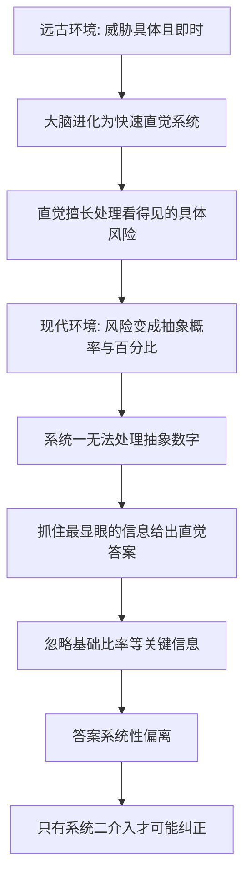

# 05｜为什么我们天生是“概率盲”？

> 为什么连聪明人，也经常在一道简单的概率题上答错？

---

## 一、先说结论

塔勒布给出的答案是：**我们的大脑，不是为理解概率而设计的。**

人类的心智是在漫长的采集狩猎环境中进化出来的。它擅长的是“看得见、摸得着、马上要命”的东西——草丛里有没有蛇、对面的人是敌是友、这条河能不能过去。它不擅长的是“千分之一”“百分之五”“期望值”这类抽象的数字。

所以，面对概率问题，我们不是“算错了”，而是**根本没用上计算**。直觉（卡尼曼称之为“系统一”）会立刻给出一个答案，而这个答案往往系统性地偏离正确值。塔勒布认为，正确的概率判断不是天赋，而是一种需要刻意训练的能力。

---

## 二、我们先理解一个问题

先做一道题，不要急着算，凭第一感觉回答：

> 某种罕见病在人群中的患病率大约是千分之一。
> 有一种检测手段：如果真患病，检出阳性的概率约为 99%；如果没患病，也只有约 5% 的概率会被误报为阳性。
> 现在，一个随机抽到的人检测结果是阳性。
> 他真正患病的概率是多少？

多数人的直觉答案是“90% 以上”，甚至“几乎肯定得病了”。99% 的准确率，加上阳性结果，听起来确实像是“板上钉钉”。

但如果认真算一下，答案会让你吃惊：**大约只有 2% 左右。**

这不是脑筋急转弯，而是绝大多数人在这个问题上会犯的同一个错。真正值得追问的是——**我们为什么会错得这么离谱？**

---

## 三、作者到底提出了什么观点？

塔勒布的核心判断是：**人的心智在处理概率时，天生是失灵的。**

他借用进化心理学的思路指出：我们的祖先在草原上生存，需要快速判断“这个影子是野兽还是石头”，而不是计算“这只野兽出现的先验概率”。前者要求快，后者要求准；而进化优先给了我们“快”。

心理学家丹尼尔·卡尼曼（Daniel Kahneman）把这种机制概括为两套系统：

- **系统一**：快速、自动、直觉、不费力。看到 2 + 2 立刻得到 4。
- **系统二**：缓慢、需要集中注意、费力。计算 17 × 24 才需要它。

塔勒布想说的是：**在概率问题上，我们的默认反应几乎总是系统一给出的。**

系统一并不会计算，它靠的是经验、印象和联想。当它遇到“99% 准确率 + 阳性”这种信息，它会立刻得出“病得很重”的结论——却没有意识到，决定答案的不是那个 99%，而是那个被完全忽略的“千分之一”。

塔勒布把这类现象当作“概率盲”的典型证据：**我们不是不会算，而是直觉根本没打算算。**

---

## 四、把这个观点翻译成人话

想象远古草原上的一个祖先。他看到草丛在动。

他的大脑需要在一秒内判断：是风，还是猎豹？判断错了，可能没命。这个时候，“概率”“样本”“先验”统统没用，他需要的是**一个能立刻行动的答案**。

再看现代社会。你面对的是什么？

- 一份写着“阳性”的体检报告；
- 一个说“上涨概率六成”的财经节目；
- 一句“这款保险覆盖 99% 的风险”；
- 一条“吃这种食物，风险提高三成”的头条。

这些信息全都是抽象符号，没有草丛、没有声音、没有可以直观感受的东西。**系统一在这种情况下无从下手，只能抓住最显眼的那个数字**——“99%”“阳性”“提高三成”——然后据此给出一个直觉答案。

所以，“概率盲”不是智商问题，而是**场景错配**：我们带着一副为草原打造的直觉，走到了一个由百分比和样本构成的世界里。

一个更日常的对照是：

| 场景 | 直觉的表现 | 原因 |
|---|---|---|
| 看到蛇就躲开 | 又快又准 | 具体、可见、立刻 |
| 判断“阳性”意味着什么 | 系统性高估 | 抽象、概率、反直觉 |
| 判断“吸烟有害” | 大致正确，但说不清风险多大 | 具体经验 + 模糊统计 |

看出规律了吗？**越是具体、越是能“看见”，直觉越可靠；越是抽象、越是统计，直觉越不可靠。**

---

## 五、为什么会这样？

把这条推理链拆开：

关键在于 **D → G** 这一步。

以开头的体检题为例。直觉抓住的是“检测准确率 99%”，然后直接得出结论。可正确的算法要求我们把两个数字放在一起看：

- 人群中大约每 1000 人有 1 个真病人；
- 这 1 个病人，大概率会被检出阳性，大致 0.99 人；
- 剩下的 999 个健康人里，约 5% 会被误报阳性，大约 50 人；
- 于是所有阳性者里，真正的病人只有约 0.99 ÷（0.99 + 50），大致 2%。

**真正被直觉忽略的，是“健康人远远多于病人”这个基础事实。** 心理学家把这种现象称为“基础比率忽视”——不是说人们算错了，而是他们压根没想起要去看基础比率。

而问题在于，系统二很懒。它需要主动调用，才会去核对、计算、质疑。大多数时候，我们让系统一直接拍了板。

---

## 六、举一个现实生活中的例子

回到那份体检报告。

老张参加单位体检，其中一项是针对某种罕见病的筛查。这种病在普通人群里的检出率大约只有千分之一。检测本身相当可靠：真患病的人，约 99% 会被查出来；健康人里，约有 5% 会被误报阳性。

几天后，报告出来了：**阳性。**

老张的世界在这一刻塌了。他上网查资料，越查越害怕；他回想自己最近容易累、睡不好，越回想越觉得“症状都对上了”；他开始考虑要不要告诉家人、要不要立刻住院。

医生却让他先别急，安排了一次更精确的复查。复查结果是阴性。

老张松了口气，但心里仍犯嘀咕：“第一次为什么是阳性？万一复查不准呢？”

真正的问题在于，**老张从拿到“阳性”那一刻起，就从未问过一句：这个病本身有多罕见？**

千分之一的患病率意味着，在 1000 个像他这样的人里，只有 1 个是真病人，却有大约 50 个健康人会被误报。换句话说，一个“阳性结果”背后，是“健康人”占绝大多数。**阳性的正确解读不是“你可能得病了”，而是“需要进一步确认”。**

塔勒布想让我们看到的，就是这种错位：**检测的准确率再高，也改变不了“病本身极罕见”这个事实；而恰恰是这个事实，被我们的直觉完全无视了。**

医疗决策中，这种误读每天都在真实发生——不只是普通人，一些专业人员在凭直觉快速判断时也会翻车。这恰恰说明：**概率盲不挑聪明与否。**

---

## 七、回到书中重新理解

现在回看塔勒布在书里反复讲的“概率盲”，就不再只是一个抽象的批评了。

他真正想说的是：**我们引以为傲的“理性判断”，在很多场合其实是一套为远古环境优化的直觉在加班。** 这套直觉在挑水果时可能很好用，但在面对概率时，它会稳定地出错。

这也解释了他为什么对“专家”如此警惕。既然连受过训练的人都会在概率上翻车，那么一个自信地告诉你“明年市场会涨”的分析师，凭什么值得相信？**他的自信，很可能只是系统一的自信，而不是计算的结果。**

更进一步，这解释了塔勒布的写作姿态：他几乎从不说“我预测……”，而是反复强调“我不知道”。这不是谦逊的修辞，而是他对人类认知局限的一种诚实承认——**既然我们天生是概率盲，那么承认无知，本身就是一种认知上的进步。**

理解了这一层，后面关于小样本、稀有事件、俄罗斯轮盘的讨论，就都有了共同的地基：它们都是“概率盲”在不同场景下的具体投影。

---

## 八、这个观点背后还有什么？

有几个前提值得单独拿出来。

**第一，它假设人类存在一个稳定共有的“概率直觉缺陷”。** 这个假设大体成立，但有边界，后文会讲。

**第二，“概率盲”不等于“无法学会”。** 塔勒布认为这是一种可以训练的能力，只是训练很反直觉、很容易退回到本能。

**第三，它把“具体 versus 抽象”当作关键变量。** 同一道题，如果换成“1000 个人里有 1 个病人”这种更具体的说法，人们的正确率往往会明显上升。这一点在心理学界有不少研究支持，例如吉仁泽（Gigerenzer）关于“自然频率”的研究。

**第四，它暗含一个伦理判断：概率素养是一种责任。** 在塔勒布看来，不懂得概率的人不只是“考试会错”，而是在真实世界里更容易被收割——被营销、被话术、被自己的直觉。

---

## 九、这个观点有问题吗？

有，而且这个领域争议一直不小。

**第一，“系统一 / 系统二”的划分被批评为过度简化。** 一些心理学家认为，把认知粗暴地分成两个系统，丢掉了大量细节；它们更像是一个方便的比喻，而非被严格证实的生理结构。

**第二，“人类是概率盲”这个结论本身可能被夸大。** 吉仁泽等人指出：当信息以“频率”而不是“百分比”呈现时，普通人（甚至没受过教育的孩子）的正确率会大幅提升。也就是说，**我们可能不是不会做概率推理，而是现代社会的表述方式不友好。**

**第三，训练的效果可能被高估。** 学过的概率知识，未必能迁移到日常生活；人们在不同情境下的表现差异很大，很难说“学会了统计就从此免疫”。

**第四，把错误归因于“大脑结构”可能掩盖了真正的责任人。** 有些误导性概率信息是刻意设计的，比如营销话术、赌博游戏。问题可能不在大脑，而在信息的提供者。

**所以更准确的说法是**：塔勒布准确地指出了我们在抽象概率上的系统性弱点，但“天生概率盲”是一种强表述；更稳妥的说法是——**在没有训练、表述又不友好的情况下，我们的概率直觉会稳定出错。**

---

## 十、今天再看这个观点

以下部分是基于塔勒布思想的现代延伸，不是他在书里的原话。

塔勒布写这本书的时候，主要针对金融交易。而今天，抽象概率的“攻击面”反而更大了。

医疗 App 给你一个“患病风险 12%”，算法给你一个“你可能会喜欢”的推荐，电商给你一个“仅剩 3 件”，赌博平台用精心设计的即时反馈击中系统一。这些场景的共同点是：**它们都在利用我们的概率直觉失灵。**

再看投资。散户看着“某基金三年年化 15%”的广告，很少有人会先问：这个数字的样本有多小？它承担了多大风险？它是不是恰好赶上了一轮行情？这些正是后面几篇要拆的问题。

甚至连 AI 也在放大这个问题：模型输出一个置信度，看起来像概率，其实含义模糊。**概率盲的现代版本，不是不懂数学，而是被大量“看起来像概率”的数字包围，却依然用直觉在做判断。**

对个人来说，塔勒布式的应对很具体：**遇到概率，先停一秒，把数字换成“1000 个人里有几个”，把结论放进基础比率里核对。** 这不是聪明，而是一种反直觉的纪律。

---

## 十一、这一篇真正应该记住什么？

1. **大脑是为草原而非概率设计的。** 我们擅长具体、即时的风险，不擅长抽象百分比，这是场景错配，不是笨。

2. **直觉负责快，不负责准。** 概率题上，系统一给出的往往是“看起来对”的答案，而不是算出来的答案。

3. **基础比率最容易被忽略。** 体检、投资、招聘都一样——分母常常比那个显眼的百分比更能决定结论。

4. **聪明人也会系统性犯错。** 概率盲不挑智商，受过训练的人同样会在松懈时掉回直觉。

5. **概率素养需要刻意训练，且会因为“表述方式”而变。** 换成具体频率、放慢速度，正确率就会上升。

---

## 十二、留一个问题

> 如果连一份体检报告上的“阳性”，我们都会读错，
> 那么在人生更大的决定上——职业、婚姻、投资——
> 我们有多少判断，其实是被一个从未被检验的直觉替我们做出的？

---

**下一篇**：我们已经知道直觉会在概率上出错。但还有一类错误更隐蔽：当一个结论只建立在很小的一撮数据上时，它看起来依然无比可信——直到你把样本放大。

下一篇我们就来拆开这个问题——**为什么小样本会骗人？**
