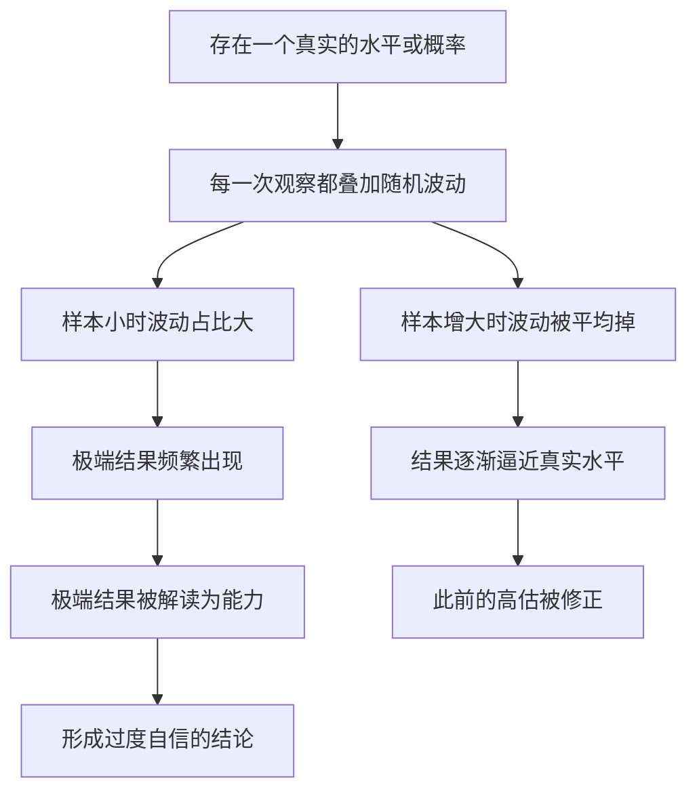

# 06｜为什么小样本会骗人？

> 几笔成功、几年的业绩，真的能证明一个人的能力吗？

---

## 一、先说结论

塔勒布的答案很直接：**样本太小的时候，结果几乎完全由随机性决定。**

一个连续三年跑赢市场的交易员，一个连续三场进球的前锋，一个连续成功几次的创业者——他们的“战绩”看起来耀眼，但在统计意义上可能什么都证明不了。

原因是：样本量越小，随机波动的相对影响就越大，“极端结果”出现的概率就越高。你看到的不是能力，而是**噪音**。

塔勒布认为，短期业绩记录的信息量极低。要判断一个结果里有多少是能力、多少是运气，首先得问一句：**这个数字，是建立在多大的样本上的？**

---

## 二、我们先理解一个问题

先看两句话：

> 一枚硬币抛 3 次，全是正面。你能说这枚硬币“偏心”吗？
> 同样一枚硬币，抛 1000 次，有 700 次是正面。你还会说这是巧合吗？

第一句听起来像玩笑。抛 3 次全正面，概率是 1/8，也就是 8 次里就有 1 次——太正常了，说明不了任何事。

第二句则完全不同。抛 1000 次出现 700 次正面，如果硬币是公平的，这几乎不可能发生。

**同样是“高于一半的正面”，为什么结论天差地别？**

区别只有一个：**样本量。**

这引出了本文真正要问的问题：我们每天都在拿小样本下结论——面试了几个人、吃了几家餐厅、看了几笔交易记录——这些结论，有多少是站得住的？

---

## 三、作者到底提出了什么观点？

塔勒布的核心判断是：**在随机性主导的领域，小样本记录几乎没有统计证明力。**

这里涉及两个基本概念：

- **真实概率**：硬币是否公平、交易员是否真有本事——这是客观存在但我们看不见的东西。
- **观察样本**：我们实际看到的那几次抛掷、那几年业绩——看得见，但被随机性污染。

统计学的基本规律是：**样本越大，观察结果越接近真实概率；样本越小，结果越可能被随机性带偏。**

塔勒布进一步指出，人脑对这一点几乎没有直觉。我们看到“连续三次成功”，第一反应是“这个人有本事”，而不是“样本太小，说明不了问题”。

他把这种现象归入更广的“噪音与信号”问题：**在一小段数据里，噪音往往压倒信号；而我们却把噪音当成了信号。**

---

## 四、把这个观点翻译成人话

先看一个日常场景。

你想找一家餐厅。三个朋友都说“这家超好吃”，你大概率会去。但如果有 3000 条评价，平均 4.8 分，你是否会觉得更有把握？

按理说，3000 条评价的信息量远大于 3 个朋友。可现实中，**我们往往更相信那 3 个朋友**——因为它们具体、鲜活、有面孔。而 3000 条评价只是一个抽象数字。

再看另一个场景。你关注的一只基金，最近三个月涨了 20%。销售会说：“看，业绩很稳。”你心里也会觉得：“这基金经理有一套。”

但三个月是什么概念？中间可能只有几十个交易日，而且还赶上了大盘普涨。**这点数据，连“他比大盘强”都证明不了，更别说“他有能力”了。**

用一句更直白的话总结：

> **看到一个人连续成功，你看到的可能不是他有多强，而是你恰好看到了硬币落在他运气好的那一面。**

小样本最诱人的地方在于：它产生的极端结果特别好看。所以才有人愿意拿“三战三胜”“五连胜”“连续三年”来做文章——**因为样本越小，越容易制造出传奇。**

---

## 五、为什么会这样？

关键在于 **C → E** 这一步。

随机性不是均匀地“摊开”的，它在小样本里表现得更激烈。抛 3 次硬币出现 3 个正面很常见，抛 1000 次出现七成正面则近乎不可能。**同样是“偏离一半”，样本小的时候毫不起眼，样本大的时候就是铁证。**

于是形成了一个陷阱：

- 表现好的样本小，极端值被误读为天赋；
- 表现差的样本小，被解释成“状态不好”，轻易被原谅；
- 我们记住的，往往是那些亮眼的极端结果。

而真正的能力，只有在足够大的样本里才会慢慢显出轮廓。**如果你想看清一个人是不是真有本事，最有效的办法不是找更多“精彩瞬间”，而是把时间拉长。**

---

## 六、举一个现实生活中的例子

一名年轻前锋，新赛季前三场比赛，场场进球。

媒体的标题已经出来了：《新星爆发》《天生射手》《未来的锋线核心》。解说员反复播放他那三个进球：跑位聪明、射术冷静、把握机会能力强。球迷开始讨论他值不值一笔高额转会费。

第四场，他没进球。第五场，还是没进。第六场，他替补下场。

一个赛季结束，他总共出场 30 次，进了 6 个球。数据不算差，但远没有“三场三球”时看起来那么惊人。到了第二个赛季，他甚至开始被质疑“是不是当初被高估了”。

真实情况是什么？**他可能一直就是那个水平——一个还不错的普通前锋。** 只是前三场比赛，恰好赶上了运气好：射门打在门柱内侧弹进、门将判断失误、对手后卫漏人。这些都不是“能力”，而是随机波动。

我们来看看“三场比赛”到底意味着什么。三场比赛，一个前锋可能只有五六次真正的射门机会。在这五六次里进三个球，和一个赛季在几十次机会里进六个球——**后者的样本更大，也更接近他的真实水平。**

塔勒布想让我们警惕的正是这一点：**我们总是被最短的那段记录里最亮眼的几个瞬间说服。** 但能力不会在五六次机会里现形，它只会在大样本里慢慢浮现。

顺带说一句：这并不是说这名前锋一定是“水货”。真正的天才球员，早期确实可能有惊艳表现。问题不在于“连续三场进球是不是好”，而在于——**单凭这三场，我们无法区分他是天才，还是恰好运气好。** 这才是塔勒布关心的困境。

---

## 七、回到书中重新理解

现在回看塔勒布对“业绩记录”的挑剔，就更容易理解了。

他常年在金融市场上工作，见过太多“业绩漂亮”的交易员和基金经理。他反复追问一个问题：**你的记录有多长？这个长度，够不够把噪音和信号分开？**

在书里，他对“短记录”始终抱有戒心。这不是因为他天生怀疑一切，而是因为他知道：**在随机性主导的领域，任何短样本都可能只是随机给出的一个漂亮数字。**

这也解释了他为什么强调“替代历史”：如果不问“这个人做了什么”，而是问“在无数个平行世界里，同样的做法会产生多少种结果”，你就会发现，短记录里那些看似必然的成功，其实只是众多可能性中的一条。

换句话说，小样本的问题不只是“数据少”，而是**它让我们把一条随机的路径，误认为一条必然通往成功的道路。**

---

## 八、这个观点背后还有什么？

**第一，统计显著性是核心概念。** 一个结果要“显著”，意味着它不太可能仅由随机性产生。样本太小，结果再好看也很难显著——这就是为什么“连续三年优秀”在统计上往往站不住脚。

**第二，均值回归是它的孪生兄弟。** 如果一个极端结果里含有大量运气，那么下一次它多半会向平均水平回落。这解释了很多“冠军次年熄火”的现象——不是冠军变弱了，而是运气回归了。这一点在下一篇会用得更充分。

**第三，“热手”问题其实有争议。** 1985 年吉尔维奇（Gilovich）等人研究篮球“热手”，认为球员连续投中并不会提高下一次命中的概率，即“热手是错觉”。但后来一些研究者指出，原始研究存在选择偏差，**“热手效应”可能是真实存在的。** 这说明：并非所有“连续成功”都是噪音，关键要看领域和证据质量。

**第四，它指向一个方法论：先问样本量。** 看到任何结论，第一反应不该是“它听起来有没有道理”，而是“它建立在多少数据上”。

---

## 九、这个观点有问题吗？

有，而且需要小心使用。

**第一，“小样本什么都证明不了”这句话太绝对。** 从贝叶斯的角度看，小样本也包含信息，只是信息量小。5 次成功不是零证据，只是远不足以得出确定结论。

**第二，不同领域的“够用样本”差别巨大。** 在运气主导的领域（短期投资、抛硬币），需要很大样本；在能力主导的领域（下棋、外科手术），几例成功可能已经很有说服力。**不分领域地要求大样本，会让人错失真正的信号。**

**第三，“看长期”存在现实困难。** 基金可能清盘，经理可能跳槽，人的一生有限。要求“足够长的样本”，有时意味着永远无法下结论——这也是塔勒布观点的一个软肋。

**第四，过度怀疑会带来另一种代价。** 如果对任何早期成绩都嗤之以鼻，你可能错过真正有天赋的人、真正有潜力的项目。**怀疑的目的是校准，不是否定一切。**

**所以更准确的说法是**：小样本的结论不可轻信，但也不必全盘否定；关键是根据领域的随机性程度，判断“多大样本才算够”，并对不够的结论保持谦逊。

---

## 十、今天再看这个观点

以下部分是基于塔勒布思想的现代延伸，不是他在书里的原话。

塔勒布的书写于互联网泡沫前后，而今天，“小样本骗人”的场景被技术彻底放大了。

看数据产品：A/B 测试只跑了两天就下结论，转化率“提升 15%”其实来自几百个用户。看内容平台：一条视频爆了，立刻总结出“爆款方法论”，却看不到同样方法却沉底的成千上万条。看招聘：三轮面试就断定一个人“不行”，而这三次表现里又混着多少当天的状态？

更典型的还有体育和投资。一个球员打了几场好球就被顶上热搜；一只基金几个季度跑赢就被包装成“明星产品”。**样本被社交媒体压缩得越来越短，结论却被传播得越来越响。**

塔勒布的思路在这里给出一条简单而反直觉的纪律：

> **在看到任何“连续成功”时，先问：这是几场？这个数字，够不够让它不像巧合？**

如果答案含糊，那么最合理的态度不是惊叹，而是——**再等等看。**

---

## 十一、这一篇真正应该记住什么？

1. **小样本的结果几乎由随机性主导。** 连续几次成功，很可能只是小样本里必然出现的极端值，而不是能力的证据。

2. **样本越大，结果越接近真实概率。** 想判断一个人的真实水平，最有效的办法通常是把时间拉长，而不是找更多精彩片段。

3. **“连续三年优秀”的证明力可能很弱。** 除非领域本身随机性低，否则短记录几乎无法通过统计检验。

4. **极端值特别容易出现在小样本里。** 所以越是“小而美”的战绩，越要警惕它可能只是噪音。

5. **但也别走向另一个极端。** 真实能力有时确实会留下痕迹，关键是判断这个领域需要多大的样本才算够。

---

## 十二、留一个问题

> 如果有人连续三年都赢了，
> 你有多大把握说，这三年里有多少是本事、多少是运气？
> 而你用来判断的那个“把握”，本身又建立在多大的样本上？

---

**下一篇**：小样本会骗人，这是规律。但现实中最难判断的，恰恰是那些记录不长、风险又隐蔽的人——比如一位连续赚钱的基金经理。他的成绩，到底是能力，是运气，还是某种还没引爆的危险？

下一篇我们就来拆开这个问题——**连续赚钱的基金经理，是高手还是运气好？**
