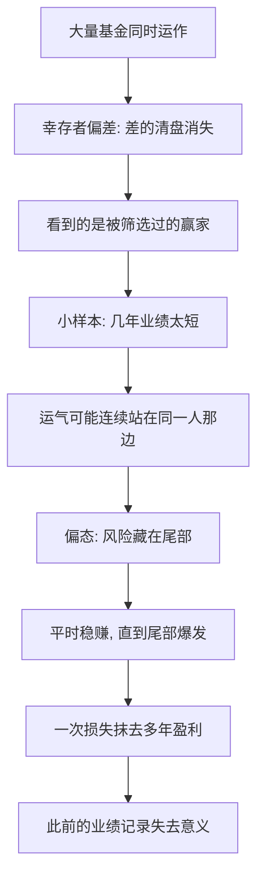

# 07｜连续赚钱的基金经理，是高手还是运气好？

> 我们该如何判断一个投资人，到底是靠能力，还是靠运气？

---

## 一、先说结论

塔勒布认为：**短期内，几乎无法区分。**

一个基金经理连续几年跑赢市场，我们能确定他是高手吗？不能。因为我们同时踩中了三个陷阱：

- **幸存者偏差**：表现差的基金早就清盘消失了，你根本看不到；
- **小样本**：几年的业绩在统计上太短，噪音可能压倒信号；
- **偏态**：有些策略平时稳赚，代价是把毁灭性风险藏在了后面。

所以他给出的思路是：看长期、看风险调整后的表现、看**他是不是在玩俄罗斯轮盘**——即用“看起来很小”的概率去赌“一旦发生就致命”的损失。

一句话：**没爆仓，不等于安全；连续赚钱，不等于有能力。**

---

## 二、我们先理解一个问题

每年，财经媒体都会发布基金收益率排行榜。

排在榜首的那只基金，会被加上各种头衔：明星基金、顶级经理、年度黑马。销售拿着它去拉客户，基民追着它买入，仿佛找到了财富密码。

然后呢？

如果你真的去追踪这些“年度冠军”，会发现一个反复出现的现象：**它们中的很多，在接下来的一两年里表现平平，甚至明显落后。**

问题来了：

> 如果这个人真的有超凡的投资能力，为什么夺冠之后就不灵了？
> 如果他的能力是假的，那他之前那一年，到底是怎么赢的？

这个矛盾，正是塔勒布要我们直面的一类问题。它的答案，比“他是不是高手”复杂得多。

---

## 三、作者到底提出了什么观点？

塔勒布的核心判断是：**在投资这种结果受随机性主导的领域，短期的业绩记录几乎无法证明能力。**

他给出的是一个“三重陷阱”的结构：

**第一重，幸存者偏差。** 我们能看到的是“活下来的基金”。那些业绩差、规模萎缩、被迫清盘的基金，直接从名单里消失了。于是我们看到的样本，本身就是被筛选过的——它们平均而言比真实情况更亮眼。

**第二重，小样本。** 即使不考虑幸存者偏差，一个人三五年的业绩也太短。每年跑赢一点，累积起来看着不错，但这完全可能是运气在连续几年都恰好站他那边。

**第三重，偏态。** 这是最隐蔽的一层。有些策略的风险不是均匀分布的：**平时赚小钱、看起来很稳，但藏着一个“极小概率、极大损失”的尾部。** 这类策略可以在很长时间里表现得无懈可击，直到某一天，把之前所有的盈利一次性抹掉。

塔勒布因此把“从没亏过”当作一个**警觉信号**，而不是能力证明。他要问的不是“他赚了多少”，而是：

- 他为了赚这些钱，承担了多少风险？
- 这些风险是均匀的，还是藏着一次致命的尾部？
- 他的记录够不够长，长到能把运气和本事分开？

---

## 四、把这个观点翻译成人话

我们先用一个不太严谨但直观的比喻。

假设有 100 只基金。第一年，一半涨、一半跌。第二年，涨的那一半里又有一半接着涨……以此类推。几轮之后，总会剩下几只“从未跌过”的基金——它们会被冠以“长胜将军”的名号。

但你回头看，这 100 只基金的投资方法可能完全一样。**区别只在于，随机性恰好把这几个名字留了下来。**

这就是“幸存者偏差”在基金世界的版本：**不是强者活下来了，而是活下来的被当成了强者。**

现在再加上“偏态”这一层。

设想一种策略：每个交易日赚一点点，几乎天天小赚，偶尔大赚。你会看到一条平滑向上的曲线，基金经理会告诉你“风险很低、波动很小”。可这条曲线的背后，可能是一个“百年一遇就会亏掉全部”的赌注。

**你看到的“稳”，是幸存期间的样子；你看到的“赚”，是还没到尾部之前的样子。**

所以判断基金经理的真正难点，不是“他赚没赚钱”，而是：

> **他的收益，是用多大的风险换来的？以及，他有没有一个还没触发的致命开关？**

---

## 五、为什么会这样？

把三重陷阱合并起来看，逻辑链是这样的：

关键在于 **E → G** 这一段。

**小样本**决定了你无法用几年数据判断能力；**偏态**决定了即使你判断对了“他一直在赚”，也不代表他安全。

而两者叠加会产生一种特别危险的错觉：**一个人越是长期稳定地赚钱，我们越倾向于相信他有能力——恰恰在他可能积累了最大尾部风险的时候。**

这也是塔勒布说“没爆仓不等于安全”的原因。爆仓是一次性的事件，你不知道它什么时候来；在它来之前，所有证据都在说“他很稳”。

---

## 六、举一个现实生活中的例子

来看“基金排行榜的年度冠军”。

某年，一只基金以惊人的收益率登顶。基金经理上了杂志封面，路演一场接一场。投资人蜂拥而入，规模迅速膨胀。

如果我们冷静分析，会发现几件事：

**第一，榜单本身就是幸存者偏差的产物。** 排行榜只列出还存在的基金。那些同年亏得很惨、甚至已经清盘的，早已不在名册上。我们看到的“第一”，是在一群被筛过的人里选出的第一。

**第二，他的策略可能承担了被隐藏的风险。** 也许他重仓了某个当时特别热的板块，也许他用了高杠杆，也许他做的是“平时稳赚、极端行情巨亏”的结构性策略。这些在夺冠那年都看不出来——**因为尾部还没来。**

**第三，也是最能说明问题的一点：很多冠军在次年表现平平。**

这不是巧合，也未必是“他变弱了”。

- 一部分原因是**均值回归**：冠军那一年里含有大量运气成分，运气不会每年都来，所以下一年回落到平均水平是自然现象。
- 另一部分原因是**他承担的风险终于显形**：极端策略的收益不可持续，迟早要还。

所以，一位基金经理若想知道自己是不是靠能力，最该做的是问一个问题：

> **跟我用同样策略的人里，有多少人已经爆仓了？如果换个运气，我还会不会是今天这个“冠军”？**

塔勒布想让我们看到的，正是这种“把镜头拉远”的动作：**不要盯着那条冠军曲线，要看那些没被画进图里的失败者。**

---

## 七、回到书中重新理解

现在回看塔勒布对“投资高手”的态度，就清楚多了。

他不是简单地说“基金经理都是骗子”，而是在提出一个更严格的评价标准：**判断一个人有没有能力，必须同时考虑他承受的风险和记录的样本长度。**

他会强调“风险调整后的收益”：赚 20%，如果承担的是可控风险，和赚 20%、但承担的是“可能归零”的风险，完全是两回事。**只看收益率，就像只看一个人的体重却不看身高。**

而他最在意的，是那个“俄罗斯轮盘”的问题：**有些人不是靠能力赢，而是靠玩一个“大部分时候没事、偶尔致命”的游戏，暂时还没输而已。** 这类人的记录可以非常漂亮，漂亮到你无法从结果上区分他和大高手。

后面会专门展开俄罗斯轮盘，也会讲“先求生存”。但它们的种子，都是在这里埋下的：**在随机的世界里，评价一个人，不能只看他赢了多少，还要看他把自己暴露在什么风险之下。**

---

## 八、这个观点背后还有什么？

**第一，风险调整指标是重要工具。** 比如业内常用的夏普比率（Sharpe ratio），衡量的是“每承担一单位波动换来多少收益”。它比单看收益率更合理。但它也有局限：它依赖历史数据，而历史数据恰恰可能低估尾部风险。

**第二，业绩比较要看基准。** 一个人赚钱，可能只是因为整个市场都在涨。真正有意义的问题是：**他比同类基准多赚了吗？** 否则你只是“买了个市场”，却付了主动管理的费用。

**第三，“隐性尾部风险”是最难识别的。** 卖出期权、高杠杆、重仓单一资产——这些策略在顺风期都极其好看，风险只在逆境里暴露。识别它们需要对策略结构有理解，而不能只看曲线。

**第四，能力在理论上可以存在。** 塔勒布提醒的是“难以识别”，不是“不存在”。主动管理能否持续创造超额收益，是金融学界长期争论的问题，关于“有效市场”与“超额收益（alpha）”的讨论就属此类。

---

## 九、这个观点有问题吗？

有，而且这里要特别谨慎，因为塔勒布的观点带有很强的“矫正性夸张”。

**第一，“看长期”有时不现实。** 一个人的职业生涯、一只能存续的基金，都可能不够长。要求“足够长的样本”，实践上可能永远无法执行。

**第二，风险调整指标本身不完美。** 夏普比率对“平滑型”策略（尾部风险高但日常波动小）会给出误导性的高评价。它并不能自动识别黑天鹅。

**第三，均值回归不是必然规律。** 冠军次年表现平平，可能因为运气回归，也可能因为规模膨胀、策略拥挤、市场环境变化。**把每个回落都解释成“均值回归”，本身就是一种事后归因。**

**第四，这个观点可能让人过度否定主动能力。** 现实中确实存在长期跑赢的投资者；把他们都归为“运气”或“还没爆仓”，是一种难以证伪的强立场——这恰恰是批评者常指出的问题。

**第五，“没爆仓不等于安全”这话也要反过来看。** 永远不冒险的人当然不会爆仓，但也不会获得任何收益。**关键不是“不承担风险”，而是“承担自己看得懂、且不会致命的那些风险”。**

**所以更准确的说法是**：塔勒布提供了一个极有价值的怀疑框架——短期业绩不能证明能力，风险必须被看见。但“是否真有高手”不能靠一句“都是运气”下判决，需要结合样本、风险结构和领域特性具体分析。

---

## 十、今天再看这个观点

以下部分是基于塔勒布思想的现代延伸，不是他在书里的原话。

塔勒布写这本书的时候，主要针对对冲基金和交易员。而今天，这套分析框架几乎可以直接搬到任何“被排行榜追捧”的场景。

看资管行业：基金营销越来越会讲故事，“近一年收益率”被放在最显眼的位置，而“最大回撤”“策略容量”“隐性杠杆”被藏在角落。近年一些高杠杆或集中持仓的产品在极端行情中出现大幅回撤，正是“尾部风险显形”的现实版本。

看更广的场景：创业者连续几轮融资成功就被称为“连续创业者”，主播连续几个月涨粉就被总结出“爆款公式”，公司连续几个季度增长就被贴上“高成长”标签。**它们都同时踩着小样本、幸存者偏差和偏态三个坑。**

对个人投资者来说，塔勒布式的纪律大致是：

- 别只看收益率，先看它承担了什么风险；
- 别只看上榜的人，想想榜外消失的人；
- 别因为“从没出事”就放松警惕，问问那个致命开关在哪里。

**这可能不会让你赚得更快，但可能让你活得更久。**

---

## 十一、这一篇真正应该记住什么？

1. **短期业绩无法区分能力与运气。** 基金经理连续赚钱，可能只是几年里运气恰好站在他那边。

2. **榜单本身就是幸存者偏差的产物。** 你只看到活下来的赢家，看不到同样方法却失败的沉默者。

3. **收益必须和风险一起看。** 赚 20% 背后的风险是可控还是致命，决定了这个 20% 的意义。

4. **“没爆仓”不等于安全。** 有些策略平时稳赚，代价是把毁灭性风险藏在了尾部。

5. **看长期、看基准、看策略结构。** 这比“看他赚了多少”更接近真相。

---

## 十二、留一个问题

> 如果你崇拜的那位“长胜将军”，
> 只是同行里还没轮到爆仓的那一个——
> 你要怎么才能知道这一点？

---

**下一篇**：基金经理的故事里，藏着一个更大的问题：为什么我们对“平均而言没问题”的东西，总是如此放心？为什么那些极少发生、却足以改变一切的事，会被我们的直觉自动过滤掉？

下一篇我们就来拆开这个问题——**为什么稀有事件被我们严重低估？**
