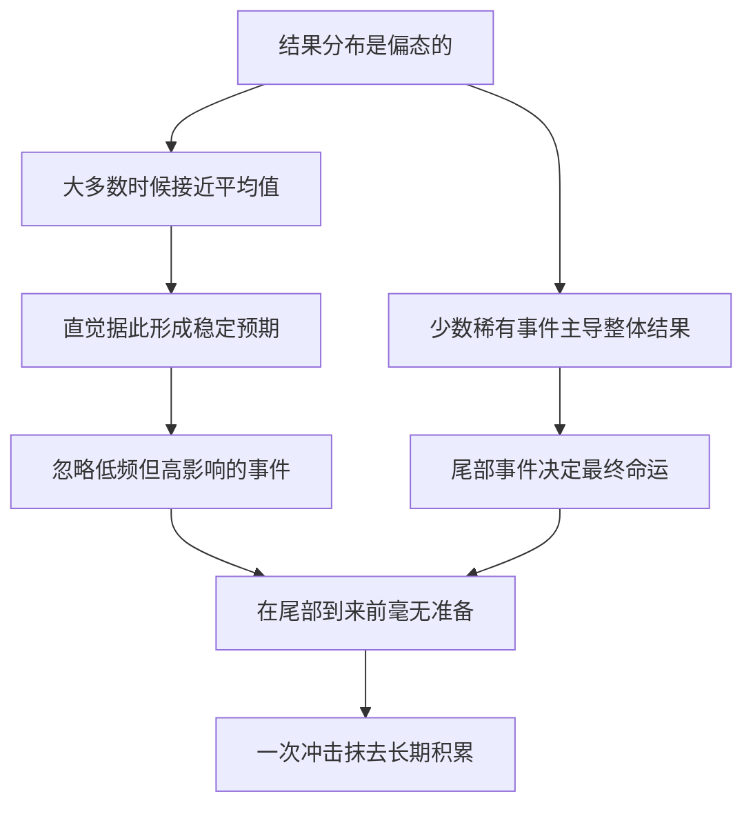

# 08｜为什么稀有事件被我们严重低估？

> 我们为什么总是忽略那些极少发生、却足以改变一切的事？

---

## 一、先说结论

塔勒布的核心点是：**我们的直觉按“平均情况”思考，而现实往往由“尾部”决定。**

他说，大量常见事件加起来，可能都比不上少数稀有事件的影响。这不是文学夸张，而是一种结构性的差异：

- 一次极端行情，可以抹掉多年平稳收益；
- 一次大流行，可以改写整个行业；
- 一次黑天鹅，可以让“平均而言很安全”的东西瞬间归零。

我们的直觉为什么看不见这些？因为它被训练成关注“典型情况”，而稀有事件恰恰不典型。

塔勒布用“偏态”和“非线性”来说明这件事。**看懂它，是理解后面所有风险管理问题的前提。**

---

## 二、我们先理解一个问题

先看两个游戏：

> **游戏 A**：抛一枚公平硬币。正面赚 1 元，反面亏 1 元。
> **游戏 B**：99% 的概率赚 1 元，1% 的概率亏 100 元。

如果只看前 99 次，你会觉得哪个游戏更好？

显然选 B——它几乎次次都赢。

但如果让你玩 1000 次呢？

游戏 A 的期望收益接近零。游戏 B 的期望收益大致是 0.99 × 1 − 0.01 × 100 = −0.01 元。**也就是说，游戏 B 长期是亏的。**

问题来了：

> **一个长期亏钱的游戏，为什么在 99 次里看起来像个稳赚的买卖？**

这正是本文的核心。它揭示了我们直觉的一个根本缺陷：**我们知道怎么读“平均”，却几乎不会读“稀有”。**

---

## 三、作者到底提出了什么观点？

塔勒布用两个概念来解释这件事：**偏态**和**非线性**。

**偏态**：结果不是对称分布的。有些游戏的结果大致均匀，比如抛硬币；有些游戏则被少数极端事件主导——平时风平浪静，偶尔惊涛骇浪。后一种是“偏态”的。

**非线性**：整体不等于部分之和的简单相加。少数事件的影响，可能不成比例地大于大量常见事件的总和。

塔勒布由此得出一个关键判断：**在偏态的世界里，“平均情况”是一个极具误导性的指标。**

- 一个策略平均每年赚 8%，听起来很好；
- 但如果它在某一年会亏掉 80%，那么这个“平均”对你毫无意义。

他还特别强调稀有事件的**不对称性**：

- **正面稀有事件**：极小概率、巨大收益，比如一笔小投入换来大突破。这类事件你希望多有几次。
- **负面稀有事件**：极小概率、毁灭性损失，比如爆仓、破产。这类事件一次就够你出局。

**你对待它们的正确姿势，不该是一样的。**

---

## 四、把这个观点翻译成人话

我们用“平均水深”来打个比方。

一条河平均水深 1 米。你会不会直接走过去？

如果这条河大部分地方只有 20 厘米深，但某几处有 10 米深的暗坑，“平均 1 米”就完全骗了你——**你会在最不起眼的地方淹死。**

现实中很多“平均值”就是这样算出来的：

- 一个投资组合“过去十年年化收益 10%”——但如果它靠的是杠杆和尾部风险，这 10% 是“还没遇到坑”的 10%。
- 一家公司“平均每年利润增长 15%”——但如果它某一年会因一次危机巨亏，那个平均值只描述了过去，不保证未来。
- 一座城市“平均每十年一次大洪水”——但洪水不会按平均值来，可能连着两年来。

塔勒布想让我们练成的直觉是：

> **不要问“通常会发生什么”，要问“最坏会发生什么，以及它会不会让我出局”。**

大多数时候，世界确实“正常运转”，这是我们能活到今天的理由。但代价是：**我们对“正常”习以为常，对“异常”毫无准备。**

---

## 五、为什么会这样？

关键在于 **C → D** 这一步。

直觉是通过“经验”形成的。在偏态的世界里，你大多数时候经历的都是“平均值附近”的事，于是你的经验告诉你：“世界很稳定。”稀有事件之所以稀有，恰恰是因为**在你积累经验的那段时间里，它可能从未发生过。**

这就形成了一个残酷的结构：

- 越是没发生过的稀有事件，你越不认为它会发生；
- 而你越不认为它会发生，它真的到来时你越没有准备。

塔勒布因此说：**稀有事件最大的危险，不是它发生，而是它在你毫无防备时发生。**

---

## 六、举一个现实生活中的例子

来看“买保险”和“卖保险”。

**买保险的人**，每年支付一笔确定的、小额的保费。他买到的是什么？是一份承诺：如果那个稀有坏事件发生——火灾、车祸、重病——保险公司会承担损失。

从纯粹的概率期望看，买保险常常是“亏”的：保险公司要覆盖成本和利润，所以保费通常高于平均赔付。**如果只看平均值，你不该买保险。**

那人们为什么还买？因为**平均值不是关键，尾部才是**。火灾发生的概率极低，可一旦发生，后果是你无法独自承受的。买保险买的不是“划算”，而是“不被一次稀有事件击垮”。

**卖保险的人**（或者说承担风险的一方），逻辑正好相反。他每年收取稳定的小额保费，看起来是一台永动的赚钱机器。十年里，他可能赚得盆满钵满，收入曲线平滑得令人羡慕。

然后，一场大灾来了。

这场大灾可能多年才遇到一次。但一次赔付，就可能超过此前十年保费的总和。**他赚了十年的“平均数”，却在一次“尾部”里全部还回去，甚至破产。**

同样是面对稀有坏事件，两者的处境完全不同：

| | 买保险 | 卖保险 |
|---|---|---|
| 日常现金流 | 小额确定支出 | 小额稳定收入 |
| 稀有坏事件发生时 | 获得赔付，被保护 | 巨额赔付，可能出局 |
| 本质 | 用确定的成本，买下尾部风险 | 用承受尾部风险，换确定收入 |
| 危险点 | 成本长期累积、看似“不划算” | 平时极稳，直到一次归零 |

塔勒布想让你看到的，正是这个不对称：**卖保险的“稳定盈利”，本质是一个“卖尾部风险”的生意。** 它可以在很长时间里看起来很安全——因为在尾部到来之前，所有证据都指向“没问题”。

而现实中，很多“稳赚不赔”的策略，本质上就是某种形式的“卖保险”：平时收小钱，偶尔担大险。**你看不见风险，不代表风险不存在。**

---

## 七、回到书中重新理解

现在回看塔勒布做交易员时的一个著名偏好，就说得通了。

他倾向于构造“正面偏态”的头寸：**亏损非常有限，收益理论上有很大空间。** 这类头寸平时可能一直在亏一点点——像交保费一样——但一旦稀有事件发生，收益会远远覆盖之前的成本。

这与“卖保险”式的策略正好相反。后者是“平时稳赚，偶尔巨亏”，前者是“平时小亏，偶尔大赚”。

塔勒布不是不知道前者“平均下来可能不划算”，他只是更在意一件事：**能不能一直留在牌桌上。** 因为一旦出局，后面的所有机会都与你无关了。

这也是本书后半部分的核心线索：

- **俄罗斯轮盘**：讲的就是用巨大风险去换取看似稳定收益的人。
- **先求生存**：讲的是为什么“活下来”永远比“赚更多”更重要。

而它们的理论起点，都在这里——**理解偏态与非对称，理解“平均”为什么会骗人。**

---

## 八、这个观点背后还有什么？

**第一，期望值不能单独使用。** 数学上的期望值把“概率 × 后果”平均起来，但这会掩盖分布的形态。一个期望值为正的游戏，如果包含“归零”的可能，就不该全仓参与——因为这涉及**生存**，而不只是数学。

**第二，中位数、众数和期望值可能完全分离。** 在一个偏态分布里，“最常见的结果”可能很好，但“总体结果”由尾部决定。这正是“平均”最具欺骗性的地方。

**第三，不对称性的方向很重要。** 正面稀有事件（可能的巨大收益）值得主动暴露，负面稀有事件（可能的毁灭）必须尽力规避或对冲。**同样是“稀有”，处理方式却可能完全相反。**

**第四，它指向“凸性”这个更深的主题。** 塔勒布后来在别的著作里会大量讨论收益对冲击的不对称反应。这里先记住一个直觉：**同样一次下跌，落在不同的结构上，后果可能完全不同。** 关键是你站在哪一侧。

---

## 九、这个观点有问题吗？

有，而且是本书争议最集中的地方之一。

**第一，稀有事件的定义本身就是模糊的。** “多稀有算稀有”“多严重算尾部”，没有统一标准。如果什么都能被解释成“潜在的尾部风险”，这个框架就变得难以证伪。

**第二，过度恐惧尾部会错失大量机会。** 如果一个人因为担心极端风险而拒绝一切有波动的投资，他可能一辈子只拿到极低的回报。**风险不是要消灭，而是要管理。** 塔勒布自己的策略，本质上也是在为不确定性定价。

**第三，“卖保险”并不总是错的。** 保险公司之所以能长期存在，是因为它们通过分散、定价和资本缓冲，把一个个独立的风险组合成了可控的业务。真正的危险不是“承担尾部风险”本身，而是**在没意识到、没定价、没资本缓冲的情况下承担它。**

**第四，幸存者偏差会放大这个论点。** 我们看到“卖保险”的人爆仓，却没看到大量正常经营、几十年没出事的机构。**用极端案例论证“这种策略必然危险”，同样是一种选择性观察。**

**第五，“尾部不可预测”可能导致无所作为。** 如果稀有事件无法预测、也无法防范，那人还能做什么？更建设性的说法是：**你无法预测具体事件，但可以调整自己对事件的暴露程度。**

**所以更准确的说法是**：塔勒布准确地指出了“平均值思维”在偏态世界里的危险，但“稀有事件决定一切”是一种强调而非定论；关键在于分辨**哪些尾部该躲、哪些尾部该迎**，以及**你是否有能力承受它。**

---

## 十、今天再看这个观点

以下部分是基于塔勒布思想的现代延伸，不是他在书里的原话。

塔勒布写这本书的时候，主要针对金融市场。而“黑天鹅”这个词，后来在更多领域被反复使用——值得注意的是，这些使用大多已经超出了本书的原始语境。

看金融：2008 年全球金融危机、某些高杠杆产品的爆仓，都是“尾部显形”的案例。看公共卫生：一场大流行让“平均而言很安全”的供应链、商业模式瞬间失效。看气候：极端天气的频率与强度变化，正在把“百年一遇”变成更常见的语言。看网络安全：一次重大数据泄露，可能超过多年安全投入的总和。

**这些事件的共同点，不是“无法预防”，而是“在它发生之前，长期被平均数掩盖”。**

对个人来说，塔勒布式的应用可能很朴素：

- 给意外留一笔应急资金，哪怕它长期来看“收益率低”；
- 不把全部身家押在单一资产、单一收入上；
- 在顺境时问一句——如果明天出现最坏情况，我还能不能留在牌桌上？

**这不是悲观主义，而是承认：我们真正要保护的，不是某一次收益的最大化，而是继续参与游戏的资格。**

---

## 十一、这一篇真正应该记住什么？

1. **直觉按“平均情况”思考，但结果可能由“尾部”决定。** 在偏态的世界里，平均值最具欺骗性。

2. **稀有事件的影响可能不成比例地大。** 少数极端事件，可能超过大量常见事件影响的总和。

3. **正面与负面的稀有事件处理方式不同。** 前者值得主动暴露，后者必须规避或对冲——不对称是核心。

4. **“平均而言安全”的东西，可能在某一天归零。** 平稳的曲线只描述过去，不保证未来。

5. **真正的目标不是收益最大化，而是不被一次尾部事件出局。** 先能留在牌桌上，才谈得上以后。

---

## 十二、留一个问题

> 如果有一件事，一百次里有九十九次让你安然无恙，
> 但第一百次会让你失去一切——
> 你现在做的那些“稳赚”的决定里，有多少其实是这种游戏？

---

**下一篇**：我们已经看到，稀有事件会骗过直觉，历史经验也可能骗过我们。那么一个更根本的问题就浮现了：我们凭什么相信“过去一直如此”，就意味着“未来也会如此”？

下一篇我们就来拆开这个问题——**“过去一直如此”，为什么不能证明未来？**
