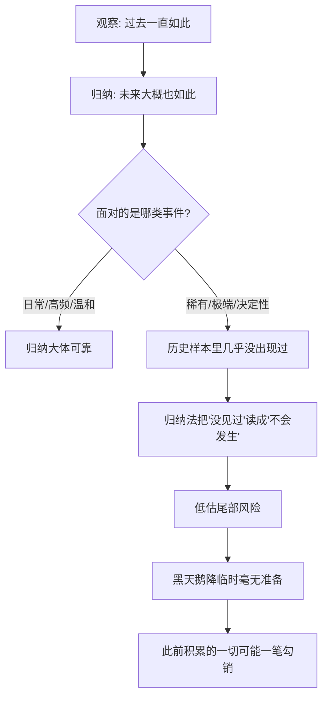

# 09｜“过去一直如此”，为什么不能证明未来？

> 既然历史一再重复，我们凭什么不能从过去推断未来？

---

## 一、先说结论

我们所有的判断，几乎都建立在一句话上："过去一直这样，所以以后大概也这样。"

太阳每天升起，于是我们相信明天它还会升起；市场过去二十年一直在涨，于是我们相信它还会涨；一个人连续十年没出过事，于是我们相信他可靠。塔勒布要泼的冷水是：**这种"从过去推断未来"的推理，在逻辑上从未被真正证明过。** 再多的白天鹅，也不能证明下一只不是黑的。

这不是说经验没用，而是说经验有边界。而最危险的，恰恰是那些发生在边界之外、又足以决定生死的事件。

---

## 二、我们先理解一个问题

请先看一个推理：

> 前提一：我见过的第一只天鹅是白的。
> 前提二：我见过的第二只天鹅是白的。
> ……
> 前提一千：我见过的第一千只天鹅是白的。
> 结论：所有的天鹅都是白的。

这个推理有什么问题？

直觉上，好像没什么问题——见过越多，结论越可靠。但从逻辑上讲，这里有一个隐藏的跳跃：**无论你观察了多少只白天鹅，你都只是观察了"有限的、已发生的"，却得出了"全部的、包括未来的"结论。** 从"我见过的"跳到"所有的"，这一步并没有逻辑上的许可证。

哲学家休谟（David Hume）在十八世纪把这个问题讲得最清楚：**我们从经验中得到的，只是"过去如此"；要把它推成"未来也如此"，还需要一个额外的前提——"未来会像过去一样"。而这个前提本身，恰恰无法用经验来证明**，因为任何试图证明它的经验，又得依赖"过去如此所以未来如此"，陷入循环。

于是问题来了：我们凭什么还能相信明天太阳会升起？

---

## 三、作者到底提出了什么观点？

塔勒布并没有声称自己是第一个发现这个问题的人。他很明确地把这份功劳归给休谟：**"归纳问题"（problem of induction）不是他发明的，是哲学史上早就存在的裂缝。**

塔勒布真正想做的，是把这个哲学问题拖进现实，尤其是拖进金融市场和风险决策里。他的核心判断是：

**我们依赖历史经验来估计风险，可历史恰恰很少重复最关键的稀有事件。**

换句话说，归纳推理在"日常的、重复的、温和的"场景里大体好用——天鹅确实大多是白的，太阳确实每天升起。但在"稀有的、极端的、决定生死的"场景里，归纳法会系统性地失灵。因为这类事件在历史样本里出现次数太少，甚至从未出现过；归纳法从"没见过"直接得出"不会发生"，而黑天鹅恰恰就是那个"从未见过却真实降临"的东西。

塔勒布还借助了科学哲学家波普尔（Karl Popper）的思路：**真正科学的命题不是"可以被证实"，而是"可以被证伪"。** "所有天鹅都是白的"永远无法被证实（你无法看完全部天鹅），却可以被一只黑天鹅瞬间证伪。所以，与其不断积累"支持性证据"来自我感觉良好，不如主动去寻找"能推翻我"的证据。

对塔勒布来说，对归纳法的过度自信，是"随机漫步者"最大的错觉。

---

## 四、把这个观点翻译成人话

我们用最朴素的语言再说一遍。

"过去一直如此"能给你的，是一份**历史记录**，不是一份**未来保证书**。

打个比方：你翻遍了一栋楼的每一层，确认没有火灾。这证明的是"过去和现在没火灾"，不能证明"下一分钟不会起火"。你观察的次数再多，也只是把"过去没起火"这个事实堆得更厚，而不是把"未来不会起火"这条逻辑链补上。

但这不意味着我们该放弃经验。塔勒布的态度其实相当克制：**经验是必要的，但它给的是概率，不是确定性。** 你可以在"没有更好的信息"时依赖它，但你不该把"历史从未发生"等同于"它不可能发生"。

真正要改变的习惯是：**从"过去没发生过，所以不用担心"，改成"过去没发生过，所以我可能低估了它"。**

---

## 五、为什么会这样？

把归纳法的这个盲区拆开，大概是这样一个结构：

关键在于中间那个分岔。归纳法的可靠性，取决于它所面对的事件类型。

对于**高频、重复、波动温和**的事件（如日升日落、日常通勤），历史样本足够多，稀有事件的影响被平均掉，归纳推理大体可用。

但对于**稀有、极端、一旦发生就改变全局**的事件（如金融危机、系统性崩溃、黑天鹅），历史样本里要么从没出现，要么只出现过极少几次。归纳法在这里会犯一个致命错误：**它把"样本中没有"当成了"概率为零"。** 而现实中，样本中没有，只说明它稀少，不说明它不存在。

更深一层的原因在于：**人类的心智不擅长处理"从未发生过的事"。** 我们只能对见过的东西建立直觉，对没见过的，大脑默认它"不重要"甚至"不存在"。归纳法正好把这个直觉错误，包装成了一套看起来很严谨的推理。

---

## 六、举一个现实生活中的例子

塔勒布自己经常用火鸡来讲这件事。

**一只火鸡，从出生起就被精心喂养。第 1 天，有食物；第 2 天，有食物；……第 1000 天，依然有食物。**

每一天，这只火鸡都在为它的"经验"增加一条证据：**人类对我很好。** 观察次数越多，它对这个结论就越有信心。它甚至可能总结出一套"规律"：每天上午九点，食物会准时出现；喂食者的脚步声，是好消息的预兆。

到第 1000 天，这只火鸡掌握的样本量已经非常可观。按照归纳法，它对第 1001 天的预期应该是：食物照旧。

而第 1001 天，是感恩节。

火鸡的悲剧不在于它观察得不够多，恰恰相反——**它观察得越多、样本越充分，它对"人类对我很好"这个错误结论就越自信。** 而在它最自信的那一刻，它遭遇了整个样本里从未出现过的那个事件。

这正是塔勒布想说的：**归纳法的证据越充分，有时反而让人越脆弱。** 因为充分的反复，会让人误以为"没有坏消息"等于"不会出现坏消息"，从而彻底放弃对黑天鹅的防备。火鸡在感恩节前的每一天，都是幸福的；它的问题，只是不知道自己在哪一天。

---

## 七、回到书中重新理解

现在再回头看塔勒布为何如此强调"稀有事件"和"黑天鹅"，逻辑就接上了。

他并不是在做一个空洞的哲学思辨。他关心的是一个非常实际的后果：**如果你用"过去从未发生"来估计风险，你就会在真正的极端事件面前毫无准备。** 而极端事件往往不是"多损失一点"，而是"直接出局"。

这也解释了塔勒布为什么推崇怀疑主义，却反对虚无主义。他不是要你说"一切都是未知、什么都别信"，而是要你在依赖经验的同时，清醒地知道经验的适用范围：**经验适合处理常规，不适合替极端事件背书。**

同时，这也回扣了"幸存者偏差"：我们之所以觉得"过去一直如此"，往往是因为没能经历极端事件的人，已经不在样本里了。历史是幸存者写下的历史，它先天缺少那些"被淘汰者"的记录——于是归纳法面对的历史，本身就是一份被筛过的、过于温和的样本。

---

## 八、这个观点背后还有什么？

有几个隐含前提值得单独拎出来。

**第一，它区分了"逻辑证明"和"实践信心"。** 休谟指出归纳无法被逻辑证明，但我们依然可以在生活中保持信心，因为放弃归纳的代价更大。承认"逻辑上不成立"和"实践中仍然要用"，这两件事并不矛盾。

**第二，它把风险管理的重点从"概率"转向了"后果"。** 既然稀有事发生的概率无法从历史里可靠估计，那就不要纠结"它多大概率发生"，而要问"如果它发生，我还能不能活"。这正是塔勒布后期思想的雏形。

**第三，归纳问题和黑天鹅是同一枚硬币的两面。** 归纳问题讲的是"为什么过去推不出未来"，黑天鹅讲的是"过去推不出的那一类事件长什么样"。前者是逻辑裂缝，后者是裂缝里钻出来的东西。

**第四，它给"证伪"留了位置。** 塔勒布更愿意听"什么情况下我会错"，而不是"我为什么对"。因为前者能帮你避雷，后者只会让你更自信。

---

## 九、这个观点有问题吗？

有，而且这里需要格外平衡，因为塔勒布常常被误读成"经验无用论"。

**第一，归纳问题在逻辑上成立，但在实践中几乎无法被绕过。** 我们做任何事——过马路、吃药、坐飞机——都隐含地依赖"过去如此，未来大概也如此"。如果因为逻辑上无法证明就拒绝一切归纳，人类将无法行动。休谟本人也承认，习惯让我们自然地相信归纳，这不是错误，而是人性。

**第二，塔勒布常常被批评"过度强调不可知"。** 一些学者认为，虽然极端事件难以预测，但并非所有领域都如此。在物理、工程、医学等有稳定机制的领域，归纳推理的有效性是经过长期检验的，不能一句"归纳不可靠"就全盘否定。

**第三，如何界定"稀有事件"本身就有主观性。** 一件事算不算"黑天鹅"，往往要事后才知道。事前你说"这可能发生"，别人会说你危言耸听；事后你说"我早提醒过"，又难以验证。这种事后性，让塔勒布的论证很难被严格检验。

**第四，它可能诱发"行动瘫痪"。** 如果一切都可能被黑天鹅推翻，那人是不是什么都不该做？塔勒布的回答其实是否定的——他的落点不是瘫痪，而是"先求生存"。但这个区分如果没讲清楚，很容易被理解成消极。

**所以更准确的说法是**：休谟的归纳问题揭示了逻辑上的真实裂缝，塔勒布则把它转化成一种风险意识——不是要你放弃经验，而是别让经验替你保证未来。

---

## 十、今天再看这个观点

以下部分是基于塔勒布思想的现代延伸，不是他在书里的原话。

在今天，"过去一直如此"这种推理有了更精致的包装，也更容易骗人。

**看机器学习与数据模型。** 现代预测系统大量依赖历史数据训练，本质上仍是归纳法的高级形式。如果训练数据里从未出现过某种极端情形，模型通常不会报警，反而会给出很高的置信度——这正是"火鸡"的算法版本。数据和模型越自信，越需要对"数据里没有的东西"保持警觉。

**看"长期主义"的误用。** 过去几十年市场长期上涨，于是很多人把"长期持有一定赢"当成了规律。这可能大体成立，但它的前提是"你能活到长期"。一次中途的极端事件，就足以让"长期"和你无关。

**看个人经验与职业判断。** 一个人在同一行业干了二十年，经验极其丰富。但正因为如此，他可能对"这二十年没出现过、但恰好正在酝酿"的某个变化毫无敏感。老手的归纳样本最厚，有时盲区也最大。

塔勒布在这里给的不是答案，而是一种姿势：**对已发生的事保持谦虚，对未发生的事保持敬畏。**

---

## 十一、这一篇真正应该记住什么？

1. **归纳在逻辑上无法被完全证明。** 从"我观察到的有限样本"跳向"全部和未来"，这一步没有逻辑许可证。

2. **休谟指出了裂缝，塔勒布把它带进了现实。** 问题不在于"能不能归纳"，而在于"什么时候归纳会失灵"。

3. **黑天鹅住在归纳法的盲区里。** 越是从未出现的事件，越无法被历史样本估计，也越容易被误判为"不可能"。

4. **经验有边界，但不是没用。** 它在常规场景里有效，在极端场景里会系统性低估风险——要分清用在哪。

5. **火鸡的教训是：样本越充分，有时越自信，也越脆弱。** 别让"没发生过"替"不会发生"背书。

---

## 十二、留一个问题

> 如果你赖以判断未来的全部证据，都来自"过去"，
> 那么你凭什么确定，自己不是第 1000 天的火鸡？
> 你上一次认真设想"如果过去不适用了会怎样"，是什么时候？

---

**下一篇**：归纳法的裂缝还不只是"判断会错"，它更可怕的一面在于——有些错误一旦发生，就再也没有下一次。这不是统计上多输一次的代价，而是直接出局。塔勒布用一把左轮手枪，把这件事讲得让人后背发凉。

下一篇我们来看——**为什么"从没输过"最危险？**
