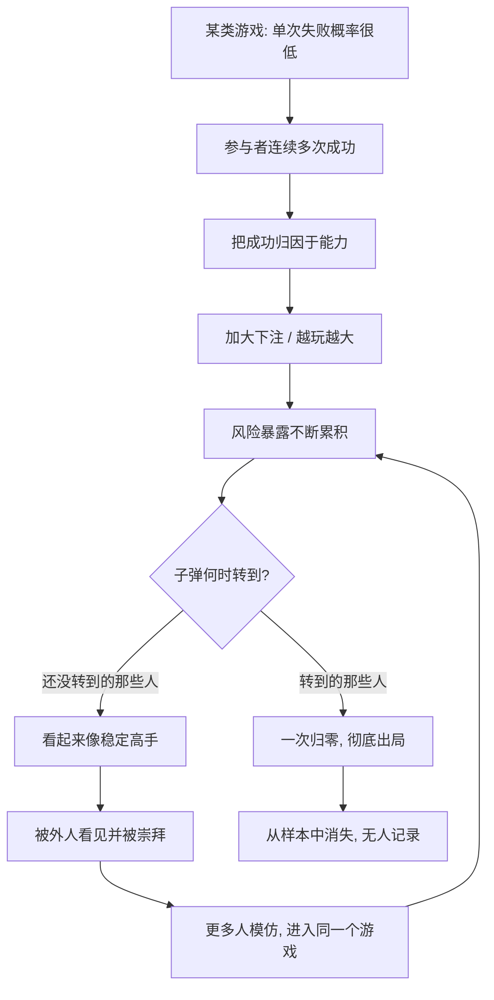

# 10｜俄罗斯轮盘：为什么“从没输过”最危险？

> 为什么一个人连续成功，反而可能意味着巨大的风险？

---

## 一、先说结论

我们习惯把"从没输过"当作能力和可靠的证据。塔勒布却提醒：**你得先问一句——他玩的是什么游戏。**

如果一个人连续成功，可能有两种完全不同的解释。一种是他的水平确实高；另一种是他一直在玩一种"平时没事、出事就彻底完蛋"的游戏，只是那颗子弹恰好还没转到他面前。后一种游戏，塔勒布用"俄罗斯轮盘"来比喻。

它的可怕之处不在于输的概率低，而在于**输一次的代价是全部**：小概率的毁灭性事件，会在一瞬间抹掉此前所有的胜利。所以"从没输过"不但不能证明安全，反而可能是最危险的信号。

---

## 二、我们先理解一个问题

先做一个思想实验。

假设有人请你玩一局俄罗斯轮盘：一把左轮手枪有六个弹巢，只放一颗子弹，旋转弹巢后对着自己的头扣一次扳机。如果没响，你赢 1000 万。

这个游戏的期望收益算下来是正的，很多人会心动。但塔勒布要问一个更根本的问题：

> 就算你赢了一次、两次、三次，你愿意一直玩下去吗？

答案显然是不。因为这不是"多赢几次还是少赢几次"的问题，而是"你迟早会死"的问题。**只要玩的次数足够多，子弹迟早会转到你的位置。** 前面所有的胜利，都会被最后一声枪响一次性抹平。

所以问题来了：如果一个游戏里，赢很多次和死一次是绑定在一起的，那么"赢了多少次"这个数字，还有意义吗？

---

## 三、作者到底提出了什么观点？

塔勒布用俄罗斯轮盘提出的核心判断是：**收益和风险有时是不对称的，而在不对称的游戏里，期望值会骗人。**

传统的决策思维会让你算期望值：如果期望收益是正的，就值得玩。但在俄罗斯轮盘里，期望值再高也没用，因为一旦输，你没有"继续玩"的资格了。塔勒布由此区分了两类风险：

- **可承受的风险**：输了只是损失一部分，你还能留在牌桌上，还能重来。
- **不可承受的风险**：输了就出局，可能是破产、是信用崩塌、是彻底离场。

他的第二个判断更尖锐：**当有人"从没输过"，我们要警惕他是不是在玩俄罗斯轮盘，而不是急着崇拜他。**

因为这种游戏的收益曲线非常迷惑人：在子弹转出来之前，它看起来和"稳定盈利"一模一样，甚至更好。所以玩俄罗斯轮盘的人，往往在出事前被当成高手；而真正稳健的人，因为收益不那么亮眼，反而被嫌弃。这就是幸存者偏差在风险领域最残忍的形态——**你看到的所有赢家，都是还没轮到子弹的人。**

塔勒布还强调一个词：**非线性**。损失不是均匀分布的。平时的小赚小亏是线性的，但那个毁灭性事件是非线性的——它把前面所有积累，用一次跳跃全部归零。

---

## 四、把这个观点翻译成人话

用最简单的话说：**关键不是"你赢了没有"，而是"你输一次会不会完"。**

我们可以用一个比喻理解。

偷东西的人，可能偷了一百次都没被抓。每一次成功，都在他心里增加一条"我手法很好"的证据。他越来越自信，动作越来越大。直到某一次被抓——而且这一抓，可能把他的整个人生搭进去。

在他被抓之前，他和一个"老实工作、稳步攒钱"的人站在一起，谁看起来更成功？大概率是那个小偷，因为他"从没失手过"，收益还高。

但塔勒布会告诉你：**这不是能力差距，这是两个人玩的游戏不同。** 一个人玩的是"可以输很多次"的游戏，另一个人玩的是"输一次就结束"的游戏。而问题的麻烦在于——**在出事之前，这两种人的战绩长得一模一样。**

所以遇到"从没输过"的人，别先问"他做对了什么"，先问"他最多输得起几次"。如果答案是"一次都输不起"，那他之前赢多少次，都只是在排队等那颗子弹。

---

## 五、为什么会这样？

把俄罗斯轮盘的逻辑拆开，关键在"收益与风险的不对称"：

这张图里最关键的两条是 **G → I** 和 **H → J**。

**G → I** 说明：还没被子弹打到的人，会带着漂亮的战绩出现在公众视野里，被当成榜样。**H → J** 说明：已经被打倒的人，从记录里消失了，没人再提起他们。我们观察到的"从没输过"的群体，是这两条路径筛选后的结果——**它天然只包含幸存者。**

再看中间的循环 **K → E**：当幸存者被当成榜样，就会有更多人加入同一个游戏。参与的人越多，在子弹转出来之前，看起来"从未出事"的人也越多。于是这个游戏显得越安全、越成功，风险暴露反而被堆得越高。这就是塔勒布说的：**危险不是来自单次概率，而是来自反复暴露。**

一句总结：**概率低不等于可以忽略，因为当"次数足够多"乘以"后果足够重"时，前者会被后者彻底压过。**

---

## 六、举一个现实生活中的例子

想一想**闯红灯和酒驾一直没出事**这件事。

一个司机，赶时间就闯几个红灯，或者偶尔酒后开车。第一次没事，第二次没事，第十次还是没事。他甚至可能在心里建立了一套判断：那段路没摄像头、那个时间点没交警、我反应快、我心里有数。

每一次"没出事"，都在给他增加一点"安全"的错觉。慢慢地，闯红灯变成习惯，酒驾变成"看情况"，风险的门槛一次次被踩低。

从表面看，他"从没输过"：没有罚单、没有事故、没有损失。他可能还觉得自己车技比那些小心翼翼的人更好。

但真实情况是：**他赌的不是"这次会不会被抓"，而是"这辈子会不会出事"。** 前面每一次平安通过，并没有让他更安全，只是把他推向那个必然到来的概率转角。而出事那一次，往往不是"被罚款"这种可承受的后果，而是车毁人亡——**一次就结束，没有第二次机会。**

这里真正值得注意的，是那句最容易被误解的自我安慰："我开了这么多年都没事。"

这句话在统计上毫无意义。它不是安全证明，只是"子弹还没轮到"的个人版本。真正理性的司机不会问"过去有没有出事"，而会问"如果出事，会是什么后果，我承担得起吗"。

塔勒布想让我们学会的，就是这种换位：**从盯着"发生的概率"，转向盯着"发生后的代价"。**

---

## 七、回到书中重新理解

现在再回头看塔勒布对"风险"的执着，就清楚多了。

他反复强调风险，不是因为胆小，而是因为他看透了一件事：**在随机性面前，活下去比赢得多重要得多。** 一个玩俄罗斯轮盘的人，哪怕前面赢了一百次，他最终的结局也是确定的——只要他继续玩。所以"赢"这个字，在这种游戏里根本没有意义，因为赢的收益是暂时的，输的代价是永久的。

这也解释了塔勒布为什么对"高杠杆""赌一把""毕其功于一役"如此警惕。这些行为的共同点，就是把"可承受的损失"变成了"不可承受的损失"：赌对了风光无限，赌错了万劫不复。而在随机世界里，你不可能永远赌对——所以只要这个游戏继续，结局就已经写好了。

同时，这一篇也为后面"先求生存"的主题埋下了伏笔：**如果一次失败就能让你出局，那么所有关于"期望收益"的计算都失去了前提。** 因为期望值算的是"平均而言会怎样"，可你只有一条命、一次人生，你无法用无数次平行世界来平均掉一次毁灭。这正是塔勒布所说的"生存"优先于"收益"。

---

## 八、这个观点背后还有什么？

有几个隐含前提值得单独拎出来。

**第一，它区分了"概率"和"暴露"。** 单次出事概率再低，如果反复暴露、且后果不可逆，累计风险也会变得致命。评价风险不能只看单次概率，还要看次数和后果。

**第二，它揭示了"从没输过"的两种来源。** 一种是真的有能力且没玩危险游戏；另一种是运气尚未用尽、或者已经出局的人不在样本里。外人很难分辨，所以对"从未失败"应保持警惕而非崇拜。

**第三，它把"风险控制"从技巧问题变成了生存问题。** 不是"如何赢得更多"，而是"如何保证自己不下牌桌"。这个视角的转换，是塔勒布整个思想体系的枢纽之一。

**第四，"玩不玩这个游戏"本身就是一个决策。** 塔勒布认为，很多时候聪明的做法不是"在这个游戏里赢"，而是"根本不进这个游戏"。拒绝参与，也是一种胜利。

---

## 九、这个观点有问题吗？

有，而且这里同样需要保持平衡。

**第一，"俄罗斯轮盘"是一个被刻意放大的极端比喻。** 现实中大多数风险并非"必死"或"零损失"二选一，而是介于两者之间：损失可能很痛，但还能恢复。把一切有风险的行为都比作俄罗斯轮盘，会让人过度恐惧，错失许多"承担适度风险、换取合理回报"的机会。

**第二，"从没输过"未必都是坏事。** 在一些结果与能力高度相关的领域（如外科手术、飞行、精密制造），长期零事故确实可能来自严格的流程和真实的能力，而不是运气。此时把"从没输过"一律当成危险信号，是一种误判。

**第三，"后果不可承受"的边界是主观的。** 什么算"出局"、什么是"毁灭性"，因人而异。对一个人是灭顶之灾，对另一个人可能只是挫折。塔勒布的判断标准偏保守，未必适合所有人。

**第四，事前的识别极其困难。** 我们往往只有在子弹转出来之后，才认出"哦，原来那是俄罗斯轮盘"。事前如何区分"稳健的高胜率"和"危险的俄罗斯轮盘"，塔勒布并没有给出可操作的严格方法，这一点常被批评。

**所以更准确的说法是**：塔勒布提供的是风险意识而非禁令。它的价值在于提醒我们关注"失败的后果是否可逆"，而不是要求我们拒绝一切风险。

---

## 十、今天再看这个观点

以下部分是基于塔勒布思想的现代延伸，不是他在书里的原话。

在塔勒布写书之后的这些年，俄罗斯轮盘的变体反而越来越常见，因为它们常常被新技术和新话术包装。

**看高杠杆投资与合约交易。** "从没爆过仓"是很多高杠杆玩家的口头禅。但高杠杆的本质，就是把"可承受的日常波动"变成了"可能直接归零的风险"。在归零发生之前，他的账户曲线可能非常漂亮——这正是最危险的地方。

**看创业与商业扩张。** 靠不断借新还旧、靠极致压榨现金流来维持的公司，可能在很长时间里看起来增长迅猛。但它的每一次"成功"都在累积暴露，直到某次外部冲击让整条资金链断裂。所谓"突然崩塌"，往往在很久以前就埋好了。

**看被包装成"稳健"的结构性产品。** 一些产品宣称"长期稳定收益、回撤很小"，但如果它的收益来源本身就依赖"某件极端事件不发生"，那它的稳定性只是表象。平静期越长，人们越容易忘记它的尾部风险。

塔勒布的提醒在今天依然锋利：**不要被一段漂亮的战绩说服，先问这段战绩背后藏着什么代价。** 尤其在一切都显得"从没输过"的时候。

---

## 十一、这一篇真正应该记住什么？

1. **"从没输过"有两种可能：真本事，或运气还没用完。** 外人往往无法分辨，所以要警惕而不是崇拜。

2. **毁灭性风险不能用期望值来评估。** 一旦输的概率对应"出局"，再高的期望收益也失去意义。

3. **概率低不等于可以忽略。** 低概率乘以高次数、高后果，累计起来就是必然。

4. **评价风险要看后果是否可逆。** 是可承受的挫折，还是不可承受的终局，这比概率数字更重要。

5. **活下去优先于赢。** 保证自己始终不下牌桌，是参与任何长期游戏的隐含前提。

---

## 十二、留一个问题

> 回头看看你正在"从没出过事"的那件事——
> 它是你真的有本事，还是你只是还没轮到那颗子弹？
> 如果它出一次事，你还能不能站起来，继续玩下去？

---

**下一篇**：既然归纳会失灵、俄罗斯轮盘会致命，那我们最该怀疑的，其实是那些总能用自信语气告诉你"一切尽在掌握"的人。他们用复杂的模型和术语，把不确定性藏得干干净净。

下一篇我们就来拆开这个问题——**为什么专家预测不可靠？**
