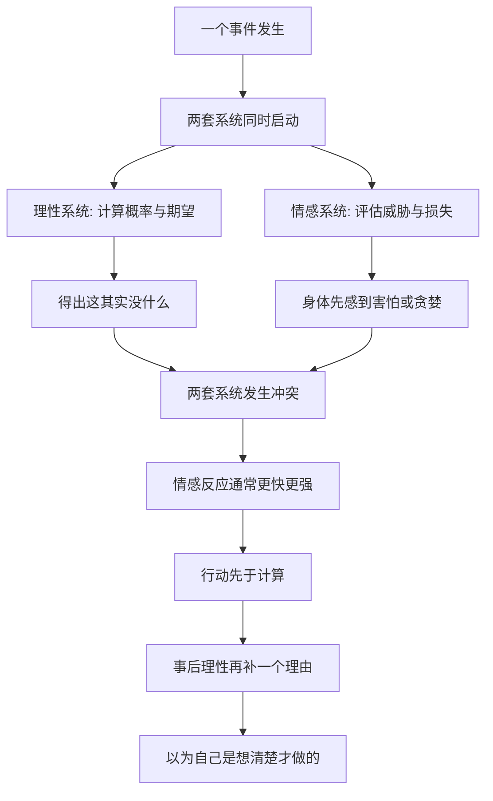

# 12｜为什么理性懂概率，情感还是会出错？

> 为什么我们"知道"概率，却依然做出错误的反应？

---

## 一、先说结论

塔勒布认为，人不是一台会算概率的机器，而是"理性"和"情感"两套系统同时在运行。理智可以告诉你，坐飞机的风险远比开车低；但情感只记得新闻里那架坠落的飞机。于是出现一种割裂：你嘴上说出的概率，和你身体做出的反应，往往像两个人。

塔勒布结合心理学指出，即使一个人理论上完全明白概率，情感仍然会被短期波动、损失和比较牵着走。所以真正的概率素养，不只是"会算"，更是"能承受"——能承受短期的不舒服，能承受账面的亏损，能在心慌的时候选择不行动。

---

## 二、我们先理解一个问题

先问一个可能有点刺的问题：

> 如果"懂概率"真的有用，那为什么很多精算师、医生、统计学家，在自己遇到风险时，反应和普通人没什么两样？

他们当然知道数字。但知道数字，和在被吓到的那一刻保持冷静，是两件不同的事。

换句话说，我们身上似乎有两个频道：一个频道负责"计算"，另一个频道负责"反应"。它们可以同时收到同一件事，却得出完全不同的结论。真正让人出错的，往往不是不会算，而是**反应先于计算，并且压过了计算**。

那么问题来了：这两个频道，到底是谁在开车？

---

## 三、作者到底提出了什么观点？

塔勒布的说法可以概括成一句：**人是被情感驱动的动物，理性更像是一个事后解释者。**

他借用了心理学里的一个基本发现：人的思维大致可以分成两套系统，一套快速、直觉、情绪化，另一套缓慢、费力、偏逻辑。一些研究表明，我们日常的绝大多数判断，其实是第一套系统先做完，第二套系统再补上理由。也就是说，"理性"经常不是决策者，而是辩护律师。

塔勒布尤其强调两点。

第一，**理性"知道"和情感"反应"是分离的。** 你可以百分之百相信某个概率，但当损失真的落到你头上，身体的反应不会因为你会算就消失。

第二，**损失和收益在情感上并不对称。** 一些研究表明，同样金额的损失带来的痛苦，往往大于同等金额的收益带来的快乐。这意味着，一个在期望值上完全划算的赌局，也可能让你痛苦到无法执行。塔勒布把这种不对称，视为理解人类决策的关键。

所以在他看来，光有概率知识是不够的。一个人可能算得很对，却依然在恐惧或贪婪到来时做出最差的动作。

---

## 四、把这个观点翻译成人话

用一句话说：**你知道的，和你能承受的，是两码事。**

打个比方。理性像公司里那个会做报表的 CEO，情感像那个管着现金流的财务。CEO 说，这个项目长期期望为正，值得投。财务说，不行，这个月账上就是少了钱，我睡不着。

CEO 讲的是长期平均，财务感受的是当下这一笔。而人脑在处理风险时，更像那个财务——账面上少一块钱带来的刺痛，会盖过"长期来看会赚回来"的安慰。

这解释了一个常见的困境：很多道理我们明明都懂，却还是做不到。不是因为我们虚伪，而是因为**懂道理的是理性，做决定的常常是情感**。让你戒烟的是理智，让你点上一根的，是此刻的焦虑。

塔勒布想说的是：承认这一点，比假装自己是纯理性的人更诚实。

---

## 五、为什么会这样？

把这条链条拆开，大概是这样的：

关键在 **H** 这一步：情感系统的反应更快，也更"响"。

从进化的角度看，这并不奇怪。在远古环境里，快速反应比精确计算更保命——看见影子先躲，哪怕十次里九次是误判，也比慢慢算概率要安全。情绪是身体的预警系统，它不追求准确，只追求快。代价就是，它在面对现代社会的抽象风险（概率、长期、统计）时，经常拉响错误的警报。

而损失和收益的不对称，进一步放大了这种偏差。对同样大小的得失，身体给出的信号强度不同：损失那边更刺耳。于是我们会为了回避损失，做出在概率上并不划算的选择——该持有的卖掉，该耐心的提前行动。

---

## 六、举一个现实生活中的例子

坐飞机和开车，是这件事最好的例子。

几乎人人都"知道"一个事实：按每公里或每小时的统计，坐飞机比开车安全得多。这个结论并不需要高深知识，任何一个看过统计的人都能接受。

但如果让你现在带着家人，选飞机还是自己开车出门，很多人的身体会给出和理性不一致的答案。一想到飞机，脑子里浮现的是坠机的画面、失事的新闻、无法掌控的高空；一想到开车，反而是熟悉的、日常的、可以自己握方向盘的感觉。

于是行为上，很多人宁愿选择统计上更危险的开车，也要回避感觉上更可怕的飞机。

注意，这不是因为他们不会算。他们算得出来，只是**在恐惧面前，算出来的那个数字根本不占优势**。飞机失事是低概率、高冲击、被媒体反复放大的事件；开车出事是高频、但被我们习以为常的事件。情感系统对前者的反应强度，远远超过它在统计上的真实权重。

塔勒布要我们看到的，正是这种落差：概率知识躺在理性那边，行为却由情感这边决定。而真正的考验，不是你能不能说出"飞机更安全"，而是当登机口摆在你面前时，你能不能不被那个画面牵着走。

---

## 七、回到书中重新理解

理解了"两套系统"，塔勒布在书里的很多观点就串起来了。

他是一个交易员，天天面对的是钱在数字上的涨落。对他来说，最大的敌人往往不是市场，而是自己的情绪。一次恐慌中的卖出，一次不甘心的加注，都可能在几秒钟里毁掉几个月的研究。所以他反复强调，光有对概率的理解不够，还得有对情绪的约束。

这也解释了，为什么他那么看重"能否承受"这件事。在他的框架里，一个人的能力不只是判断得准，还包括在判断正确时能不能扛住短期的不利，在判断错误时能不能及时承认、不出更大的错。**会算，是知识；能扛，是纪律。** 后者往往更难，也更值钱。

这一层理解，也为他后面谈"少看、少动"埋下伏笔：如果情感会被短期波动轻易点燃，那么减少波动的输入、降低行动的频率，本身就是一种保护。

---

## 八、这个观点背后还有什么？

有几个前提值得单独拎出来。

**第一，这不是说情感是纯粹的坏事。** 一些研究（包括对脑损伤患者的研究）提示，完全丧失情绪感受的人，反而会在日常决策上陷入瘫痪——因为没有情感提供"哪个更重要"的权重，理性也无从选择。所以塔勒布的意思不是"消灭情绪"，而是"别让情绪独自开车"。

**第二，它区分了"知识"和"素养"。** 会背概率公式是知识，能在压力和恐惧下不做出破坏性动作，才是素养。塔勒布关注的始终是后者。

**第三，它把风险从"外部世界"扩展到了"内部世界"。** 传统的风险讨论关注市场、事件、对手；塔勒布提醒，你自己也是风险的一部分。你的恐惧、贪婪、不甘心，同样是能让你出局的因素。

**第四，它是一种概率上的现实主义。** 承认人是情感动物，不是悲观，而是为了在设计自己的行为时留出余量——不做那些需要超常冷静才能执行的决定。

---

## 九、这个观点有问题吗？

有，而且这里需要谨慎。

**第一，"两套系统"是一种简化模型，不是大脑的精确解剖。** 一些心理学家用这个框架来解释大量现象，但学界对它的边界和机制一直存在不同看法。把它当成严格的心智结构，可能过度简化了真实情况。

**第二，情绪并非总是拖后腿。** 在时间紧迫、信息不全的场景里，直觉和情绪往往能给出比慢推理更好的结果。塔勒布强调情绪的破坏性，是因为他站在"需要长期理性决策"的立场上；换一个场景，结论可能不同。

**第三，"能承受"这件事很难教，也很难衡量。** 一个人是真的镇定，还是只是还没遇到足够大的冲击？这几乎无法事前验证。把"承受力"作为核心素养，有道理，但也有些难以操作。

**第四，存在事后解释的嫌疑。** 当一个人做对了，我们会说他"情绪稳定"；做错了，就说他"被情绪左右"。这种评价方式很容易变成看结果说话，反而不符合塔勒布自己反对的"唯结果论"。

**所以更准确的说法是**：塔勒布提醒我们，理性知识不足以保证正确行为，情感在决策中的分量常被低估；但"情感全是敌人"同样是过度简化，关键可能在于两套系统怎么配合，而不是谁消灭谁。

---

## 十、今天再看这个观点

以下部分是两套系统与损失厌恶思想的现代延伸，不是塔勒布的原话。

今天的金融和产品设计，已经大量利用了这个洞察。自动定投、默认扣款、封闭期、冷静期，这些机制的共同点，都是**不指望人靠意志力战胜情感，而是提前把决定和环境固化下来**。与其在暴跌的夜里劝自己不要卖，不如在平静的时候就设定好规则。

在个人生活里，这个观点同样有用。想少刷手机的人，靠"下决心"往往失败，因为决心属于理性，刷手机的冲动属于情感；但把手机放到另一个房间，就是承认两者的力量差距，用环境替情感降温。想坚持锻炼的人，与其每天说服自己，不如固定时间、固定路线，把决定变成不需要情绪的默认动作。

换句话说，现代的做法不是把情感训练成理性，而是**承认情感很强大，然后设计一个不让它轻易掌权的生活结构**。

---

## 十一、这一篇真正应该记住什么？

1. **理性懂概率，情感管反应。** 知道一件事和面对它时做出正确反应，是两种不同的能力，不能相互替代。

2. **损失比收益更"响"。** 同等大小的亏损带来的痛苦通常大于收益带来的快乐，所以期望值划算的事，执行起来也可能被情绪否决。

3. **情绪不是缺陷，是快速预警。** 它有进化上的用途，只是在面对抽象概率和长期问题时容易误报。

4. **真正的概率素养包含承受力。** 会算只是入门，能在不舒服的时候不做出破坏性动作，才是关键。

5. **别靠意志力对抗情绪，靠结构。** 提前设好规则和环境，比临场说服自己更可靠。

---

## 十二、留一个问题

> 如果你已经知道某个决定在长期是对的，
> 但它会在短期内让你痛苦、让你怀疑自己——
> 你会选择相信自己的计算，还是相信自己的感受？

---

**下一篇**：情绪一旦被点燃，就需要燃料。而现代社会最稳定的燃料之一，就是源源不断的信息。为什么我们看得越多，反而判断越差？

下一篇我们就来拆开这个问题——**为什么每天看新闻会让你更糟？**
