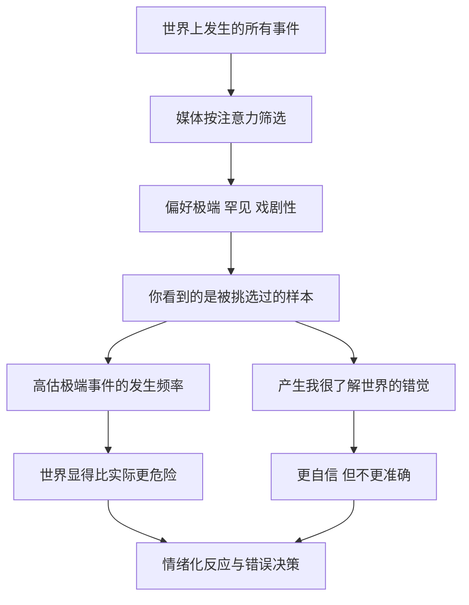

# 13｜为什么每天看新闻会让你更糟？

> 信息越多，判断为什么反而越差？

---

## 一、先说结论

塔勒布对新闻的态度近乎敌意：他认为新闻大多是噪音，而不是信号。媒体的运作方式决定了它偏好戏剧性、极端和罕见的事件——因为平常的事没人看。长期浸在其中，我们会系统性地高估极端事件发生的概率，把世界看得比实际更危险、更动荡。

更麻烦的是，信息越多，人往往越自信，却不一定越准确。塔勒布主张大幅减少信息摄入，只保留真正重要的信号——那些能改变你长期判断的东西。

---

## 二、我们先理解一个问题

先问两个问题。

第一，和十年前相比，你每天接收的信息多了多少？答案大概是几十倍。

第二，和你接收的信息量相比，你对世界的判断准确了多少？这个问题就不好回答了。

如果信息真的等于认知，这两条曲线应该一起上升。但现实往往不是。信息涨了十倍，判断力未必跟着涨。这就说明，"看到更多"和"懂得更多"之间，并没有想象中那么强的联系。

那么，多出来的那部分信息，到底给了我们什么？它让我们更了解世界，还是只是让我们更忙、更慌？

---

## 三、作者到底提出了什么观点？

塔勒布在这里做了一个很关键的区分：**新闻、信息、信号，是三样东西。**

新闻，是媒体为了抓住注意力而筛选出来的内容。它的标准不是"重要"，而是"有看点"。信息，是客观发生的事实。信号，则是真正能改变你决策的东西。三者之间不能划等号——绝大多数新闻，既不是完整的信号，也不足以称作可靠的信息。

塔勒布认为，长期消费新闻会造成两个后果。

一是**扭曲概率感**。因为极端、罕见、戏剧性的事件被反复报道，我们的大脑会把"经常看到"误当成"经常发生"，于是高估了灾难、冲突、崩盘这类事情的概率，把世界看成一个比实际上更危险的地方。

二是**制造"我很了解世界"的错觉**。信息流让人产生一种持续被更新、被掌握的感觉，判断时更自信，却不因此更正确。塔勒布的说法是，这些内容更像是娱乐，而不是认知工具。

所以他的结论很直接：大部分新闻不值得看；要看，也只保留极少数真正重要的信号。

---

## 四、把这个观点翻译成人话

新闻像一份菜单，厨师（媒体）知道什么菜最吸引人，于是把最辣、最刺激、最罕见的菜端到最前面。你吃得越多，不代表你营养越均衡，只代表你的口味被训练得越来越重。

而且，新闻给你的多半是"印象"，不是"统计"。你看到十起坠机报道，不代表坠机变多了，只代表坠机更能上头条。你把看到的东西当成世界的全貌，就自然会高估极端事件的分量。

这里还有一个更隐蔽的机制：**新闻擅长告诉你"发生了什么"，却几乎从不告诉你"这有多常见"。** 一起事故、一次暴涨、一场冲突，被讲得像世界即将改变；但它的真实频率是多少、占总体多大比重，没人会补一句。缺少分母的信息，就是最容易骗人的信息。

所以塔勒布说，看新闻的成本不是时间，而是**你的注意力和你的判断被悄悄带偏**。

---

## 五、为什么会这样？

把这条链条拆开：

关键在 **B** 和 **D** 这两步：你接收到的不是世界本身，而是一个经过注意力逻辑筛选后的样本。

这个筛选机制为什么会必然存在？因为免费新闻靠注意力变现。媒体必须争夺你的眼球，而最能抓住眼球的，永远是最极端、最情绪化的内容。日常的、平稳的、正常的部分，几乎不会被报道。于是我们长期置身于一个被放大镜挑出来的世界里，却误以为自己在看全景。

更微妙的是，这条链条末端还有一个正反馈：看得越多，情绪被触发的次数越多，动作越多；动作越多，又越想去"看看最新情况"，于是循环加剧。

---

## 六、举一个现实生活中的例子

每天都刷行情、盯盘的人，是这件事的典型。

他开盘前看隔夜消息，盘中看快讯、看分析师解读、看群里讨论，收盘后还要复盘财经节目。他接触的"信息"比一个每月只看一次报表的人多出几百倍。

结果呢？他更容易被一条突发消息吓到卖出，也更容易被一个所谓的利好追高买入。他对每一条新闻都做出了反应，而这些反应里，真正基于重要信息的只是极少数。他以为自己掌握了市场，实际上是被市场的噪音推着走。

而且，每多看一条"专家预测"，他就多一分确定感——尽管他的账户表现并没有因此变好。这说明，信息流给他的主要是**自信**，而不是**准确**。

对这个人来说，真正有信息量的东西可能就那么几条：我持有的逻辑是否还成立？价格相对于价值是否还合理？其余绝大多数所谓的"消息"，都只是情绪燃料。

---

## 七、回到书中重新理解

塔勒布本人是做交易的，却刻意不让自己浸泡在新闻里。他把这看作一种生存策略：在一个充满随机波动的世界里，每多看一条消息，就多一次被噪音误伤的机会。

他关注的不是"有没有最新消息"，而是"这件事是否从根本上改变了长期判断"。如果答案是否定的，那么看它就是一种负收益的行为——占用了注意力，还提高了出错概率。

这也解释了他一个反直觉的主张：信息不是越多越好，而是要筛选。对大多数人来说，缺的从来不是信息，而是**过滤信息的能力**。在信息稀缺的年代，多看是优势；在信息泛滥的年代，少看反而可能是优势。

---

## 八、这个观点背后还有什么？

有几个层次值得展开。

**第一，注意力是稀缺资源。** 你关注什么，很大程度上决定了你能想什么。信息消费看似免费，实则在消耗你最宝贵的认知带宽。

**第二，事件可见性和事件频率是两回事。** 一件事被报道得多，不代表它发生得多。混淆这两者，是我们概率感被扭曲的主要原因之一。

**第三，信息只有能改变行动时才有价值。** 一条消息如果无法改变你的任何决定，那它对你的唯一作用就是拨动情绪。从这个角度看，大量新闻消费其实是在主动给自己制造情绪波动。

**第四，它和"信息茧房"是同一个问题的两面。** 筛选不仅发生在媒体那端，也发生在算法那端，最终结果是每个人看到的世界都不一样，而且都被放大了。

---

## 九、这个观点有问题吗？

有，而且这里必须平衡，不能一概而论。

**第一，信息对很多职业是不可或缺的，甚至是工作本身。** 医生要跟踪最新研究，记者要了解正在发生的事，政策制定者、危机管理者、风险控制人员都需要大量、及时的信息。对他们说"少看新闻"，等于让他们失职。塔勒布的主张，更适用于"信息本来就是别人塞给你、而你并不需要据它行动"的场景。

**第二，信息有预警和公共价值。** 了解突发事件、公共政策、社会变化，不只是个人选择，也关系到安全和公民责任。完全隔绝信息，可能让人脱离现实。

**第三，信息还有社交功能。** 知道周围发生了什么，是与人交流、融入群体的基础。把信息摄入降到极低，代价可能不只是认知上的。

**第四，"信息节食"很容易滑向另一个极端。** 如果它以"我只看我想看的"为名，就可能变成拒绝事实、闭目塞听。这和塔勒布反对的"用信息制造错觉"其实是一体两面。

**所以更准确的说法是**：问题不在于信息本身，而在于信息是不是你需要的、是不是能改变你的行动。要区分"需要知道"和"只是被吸引"，而不是笼统地反对一切信息。

---

## 十、今天再看这个观点

以下部分是塔勒布信息观在当代环境的延伸，不是他在书里的原话。

今天的信息环境，比他写作的年代更极端。算法以停留时长为目标，不断投喂最能引发情绪的内容；24 小时新闻循环和短视频，把"刷新"变成了默认动作；推送会主动找上门，你甚至不需要选择去看。结果是，被噪音包围从一种可能，变成了一种默认状态。

一些研究者讨论过"信息过载"与决策质量、情绪状态之间的关系，结论并不完全一致，但一个被反复提到的现象是：被动地、持续地接收碎片信息，容易带来焦虑和注意力涣散，却未必带来更深的理解。

对个人来说，可操作的也许不是彻底隔绝，而是主动选择少数可靠来源，并给信息设置边界——比如固定时段查看、限定来源、在需要专注时断开推送。核心不是"少知道"，而是"知道什么是值得知道的"。

---

## 十一、这一篇真正应该记住什么？

1. **新闻是筛选过的样本，不是世界的全貌。** 你看到的，是媒体挑出来给你看的那一小部分事件。

2. **看得多会让人更自信，但不一定更准确。** 信息流带来的常常是确定的错觉，而不是更好的判断。

3. **极端事件被反复报道，会扭曲我们对概率的感知。** 常见程度和报道频率是两回事。

4. **信息只有能改变决策时才有价值。** 否则它只是消耗注意力、拨动情绪。

5. **目标不是知道一切，而是知道什么值得知道。** 会过滤信息，是信息过剩时代的关键能力。

---

## 十二、留一个问题

> 如果你今天读到的一切新闻，明天都不会改变你的任何一个决定——
> 那么这些新闻，究竟是在帮你了解世界，
> 还是在借你的注意力，赚它自己的钱？

---

**下一篇**：信息不只是影响判断，它还会悄悄影响我们对自己的评价。人一旦开始和别人比，幸福和风险就可能同时失控。

下一篇我们就来拆开这个问题——**嫉妒与幸福：我们为什么总跟别人比？**
