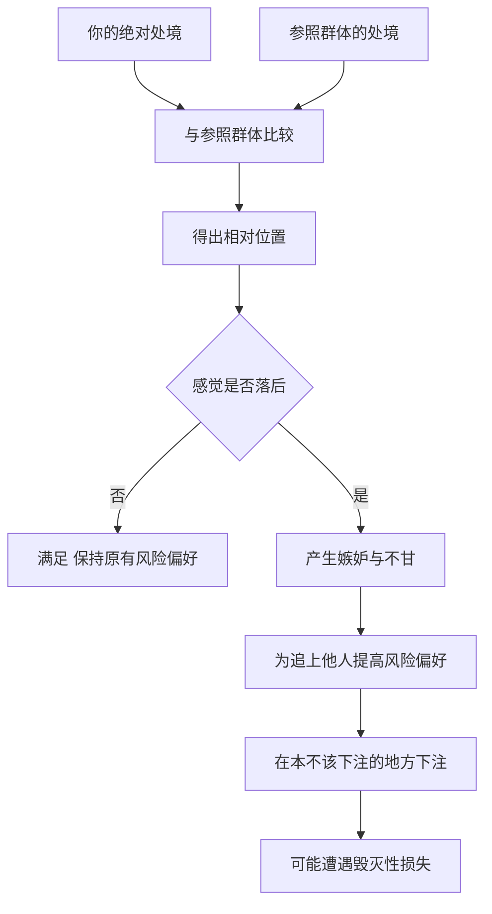

# 14｜嫉妒与幸福：我们为什么总跟别人比？

> 为什么我们越比较，越不幸福，也越容易做错决定？

---

## 一、先说结论

塔勒布指出，幸福很大程度上不取决于你拥有多少，而取决于你在跟谁比。参照群体一变，同样的生活，感受可以天差地别。

更危险的是，嫉妒不只是让人不开心，它还会改变人的风险偏好——为了"不输给别人"，人会去冒那些单独看来根本不该冒的险。在被随机性支配的世界里，嫉妒是最昂贵的情绪之一：它让你付出的不只是心情，还有判断力。

---

## 二、我们先理解一个问题

先做两个思想实验。

第一，如果你的收入不变，但你身边所有人的收入都变成了你现在的一半，你会更幸福吗？

第二，反过来，如果你身边所有人都比你富一倍，你会更痛苦吗？

客观上，你的房子、车子、存款一分没变，变的是参照系。但多数人的答案会发生翻转。这说明，幸福感的标尺，常常不在你自己手里，而在你和别人的比较里。

再把这个问题推进一步：如果比较会影响感受，那么它会不会也影响行为？一个觉得"被落下"的人，会做出和"自认为过得不错"的人一样的选择吗？这就不只是心情问题了。

---

## 三、作者到底提出了什么观点？

塔勒布提到，幸福感与期望和参照点密切相关。人的满足不是由绝对水平直接决定的，而是由"我相对于同类人处在什么位置"决定的。他把"邻居变富"这类现象看得很重：如果身边的人突然赚了大钱，即使你的生活毫无变化，你也会感觉自己被比下去了。

更进一步，他认为嫉妒会直接扭曲风险行为。当一个人看到同伴在某个高风险的地方赚了钱，他会产生一种强烈的不甘："凭什么不是我？"于是他也去下注——不是为了变得更富，而是为了不再落后。

塔勒布把这种由嫉妒驱动的下注，视为随机世界里最典型、也最危险的错误之一。因为在充满运气的环境里，总有幸运儿出现。如果每看到一个走运的人就要追上去，你就会不断把自己暴露在越来越大的风险中。

所以他的态度是：缩小参照群体，降低对他人的关注，不只是为了心情，更是一种风险控制。

---

## 四、把这个观点翻译成人话

可以用一个粗糙的公式来理解：**幸福，约等于你拥有的，除以你期望的。** 而"你期望的"很大一部分，来自你身边的人。

这解释了一个日常悖论：为什么生活越来越好，人却未必更快乐。因为绝对值在涨，参照点也在涨，有时甚至涨得更快。你换了车，同事换了更好的车；你买了两居，同学晒出了三居。分子在动，分母也在动，比例未必改善。

嫉妒真正可怕的地方，不在于它让你不爽，而在于它会偷偷改变你愿意承担的风险。一个本可以安稳生活的人，因为朋友在牛市里赚了钱，开始加杠杆；这不是理性的判断，而是情绪的补偿。

塔勒布想提醒的是：当你发现自己在说"我也要"的时候，最好先问一句，这个决定是算出来的，还是气出来的。

---

## 五、为什么会这样？

这条链条大致是这样的：

关键在于 **C → G → H** 这一段：参照点先动摇了情绪，情绪再改写了风险偏好。

为什么人如此在意相对位置？一些进化视角的解释是：在小型群体里，相对地位直接关系到资源和生存机会，所以人对"排位"天生敏感。这套机制在过去是有用的，但在今天却容易失灵——因为现代社会的参照群体被极大地放大了，从几十个人扩展到了全网所有人。

再加上一个偏差：你看到的永远是别人展示出来的部分。你拿自己的全部日常，去比别人的高光时刻，这场比较从信息基础上就是不公平的。

---

## 六、举一个现实生活中的例子

比如一场同学会。

几年没见，有人创业融资，有人换了大房子，有人在朋友圈晒出海外旅行。你本来对自己的生活挺满意，但一圈聊下来，心里开始发紧：好像只有自己在原地踏步。

回家路上，你开始重新审视自己的一切：是不是太保守了？是不是错过了什么？接下来几个月，你可能做出一些平时不会做的决定——把积蓄投进一个听来的项目，或者为了"看起来不落后"而超前消费。注意，你的客观处境并没有变，变的是参照点。而参照点的变化，直接改变了你愿意承担的风险。

更隐蔽的是朋友圈。它是一场精心剪辑的比赛，每个人都只展示高光的、顺利的、体面的那一面。你拿自己的日常，去比别人的精选，这场比较从一开始就是不公平的。

用塔勒布的眼光看，你嫉妒的对象，可能只是幸存者偏差下的一个剪影——你看到了他赚钱的那一面，却看不到他承担的风险、看不到同样做法却失败的人，也看不到他背后的焦虑。参照点本身就是失真的，比较的结论自然也不可靠。

---

## 七、回到书中重新理解

塔勒布为什么这么在乎嫉妒？因为他关注的核心问题是"什么能让人出局"。在他的框架里，毁灭性的错误往往不是来自复杂的计算失误，而是来自情绪——尤其是那种"别人都有，我也要有"的情绪。

他反复强调，随机性世界里总会不断冒出运气好的人。如果每看到一个人走运就要去追赶，你就会持续地加码，直到某一次运气不再站在你这边。真正危险的，不是别人赚了多少，而是**你把别人的运气，当成了自己的标准**。

所以在他的生活哲学里，降低对他人的关注、缩小参照群体，同时具有两重作用：一是保护心情，二是约束风险。这也和他在全书里反复强调的"先求生存"一脉相承——嫉妒会让你去赌那些本可以不必赌的东西。

---

## 八、这个观点背后还有什么？

有几个前提值得展开。

**第一，社会比较本身是一种中性机制。** 一些心理学家提出，人在缺乏客观标准时，会通过与他人比较来评估自己。这不是缺点，而是认知的默认方式。塔勒布反对的不是比较，而是让比较的结果主导决策。

**第二，进化视角解释了它的顽固。** 在小型群体里，相对地位关乎资源和繁衍机会。这种敏感刻在我们的本能里，不会因为"道理上想通"就消失。

**第三，可见性偏差让比较失真。** 你看到的参照对象，是被展示和筛选过的，不是完整的人。比较的信息基础本身就是扭曲的。

**第四，参照点有"棘轮效应"。** 期望一旦抬高，就很难回落。于是满足感必须靠不断加码才能维持，这本身就是一个越来越难持续的游戏。

---

## 九、这个观点有问题吗？

有，而且这里需要平衡，不能一味否定比较。

**第一，社会比较不全是坏事。** 它能提供激励、学习对象和合作的参照。看到别人做到了，会让人相信这件事可行，从而推动自己成长。完全不比较，可能连方向都找不到。

**第二，嫉妒具有双重性。** 一些讨论把"良性嫉妒"和"恶性嫉妒"区分开来：前者以他人为榜样、提升自己；后者则希望别人失败，或盲目追赶。问题不在比较本身，而在比较之后做了什么。

**第三，绝对水平同样重要。** 塔勒布强调相对比较，但对于处于贫困、缺乏基本保障的人来说，绝对处境的改善是第一位的。不能用"别跟人比"来淡化真实的现实困难。

**第四，完全脱离社会比较几乎不可能。** 人是社会性动物，合理的追求不是不看别人，而是不让别人的位置替你做决定。

**所以更准确的说法是**：比较是本能，无法也不必彻底消除；关键在于把它变成参照和动力，而不是变成风险的来源。

---

## 十、今天再看这个观点

以下部分是社会比较机制在社交媒体时代的现代延伸，不是塔勒布的原话。

社交媒体把这个机制放大到了极致。以前你的参照群体是邻居、同事和同学，数量有限，生活半径有限；现在你面对的，是一个被算法挑选出来的、全球范围的"高光集锦"。比较的频率和密度，都远远超过塔勒布写作的年代。

一些研究者讨论过"社交媒体使用与主观幸福感的关系"，结论并不完全一致，有人认为影响很小，有人发现存在相关性。但一个被反复提到的机制是：被动地浏览他人展示的生活，容易引发向上的社会比较，进而影响情绪和自我评价。

对个人来说，可操作的方向或许有两个：一是主动管理信息源，减少那些持续引发比较的内容；二是把比较的坐标，从"别人有什么"换回"我自己要什么"。前者调整输入，后者调整参照点。

---

## 十一、这一篇真正应该记住什么？

1. **幸福取决于参照点，而不是绝对拥有量。** 同样的生活，换一个比较对象，感受可能完全不同。

2. **身边人变富，即使你不变，也会影响你的感受。** 相对位置的变化，足以改变满足感。

3. **嫉妒的危险不只在情绪，它还会推高你的风险偏好。** 很多错误的冒险，是为了不落后，而不是为了更好。

4. **你嫉妒的对象，往往只是被展示出来的剪影。** 你看到高光，看不到风险和代价，也看不到沉默的失败者。

5. **比较是本能，关键是不让别人的位置替你做决定。** 把比较当参照，而不是当标准。

---

## 十二、留一个问题

> 如果把你所有的比较对象，都换成十年前的自己，
> 你会不会发现，你其实已经走了很远——
> 只是你从来没有往那个方向看过？

---

**下一篇**：就算你管住了嫉妒，还有一关要过。每天的涨跌、每天的数字，本身就在不断给你反馈，逼你对噪音做出反应。

下一篇我们就来拆开这个问题——**噪音与信号：如何不被随机波动牵着走？**
