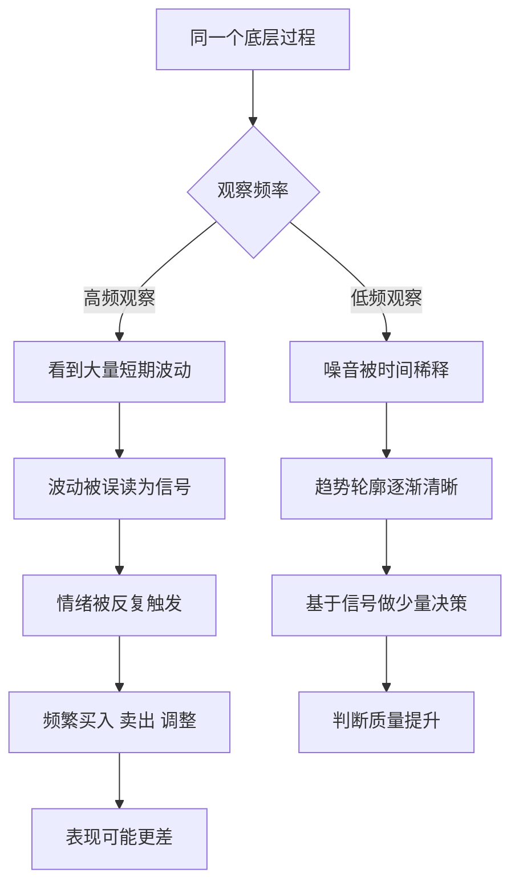

# 15｜噪音与信号：如何不被随机波动牵着走？

> 面对每天的涨跌、涨落、好消息坏消息，我们该相信什么？

---

## 一、先说结论

塔勒布强调，短期数据里大部分是噪音，只有拉长时间，信号才可能浮现。同一套底层过程，你看得越频繁，它看起来就越波动、越"有事发生"。

而频繁的查看和频繁的行动往往是连在一起的：你看到的波动越多，就越容易做出反应，而这些反应多数只是在回应噪音。降低观察频率、拉长时间尺度，是提升判断力最便宜也最有效的方法之一。

---

## 二、我们先理解一个问题

想象一枚公平的硬币，正面和反面各一半。

如果你一年只看一次结果，它一年就"发生"一次，平淡无奇。

如果你每分钟看一次，一年你会看到几十万次结果——其中一定会反复出现连续好几次正面、连续好几次反面，看起来跌宕起伏，好像有什么规律正在形成。

但硬币没有变，概率没有变，变的只是你看它的频率。

那么问题来了：当你说"最近情况很糟"的时候，你看到的到底是真实的变化，还是只是观察频率制造出来的幻觉？如果是后者，那你接下来为它做出的调整，又有多少是必要的？

---

## 三、作者到底提出了什么观点？

塔勒布的核心工具之一，就是区分噪音和信号。噪音是随机波动，不携带关于长期趋势的信息；信号才是真正能改变你判断的东西。他的判断很直接：在大多数短期数据里，噪音的占比高得惊人。

由此他得出一个反直觉的结论：**查看得越勤，你接收到的噪音越多，做出过度反应的概率越高。** 频繁观察不仅不会带来更准确的理解，反而会制造更多的情绪和更多的动作。

要提升判断质量，一个直接的办法就是降低观察频率，让噪音在更长的时间尺度上被稀释掉。信号是慢的，噪音是快的；你用多快的频率去看，决定了你看到的主要是哪一个。

塔勒布提醒的是：很多时候我们以为自己在"跟踪进展"，其实只是在给自己制造做出多余决定的机会。

---

## 四、把这个观点翻译成人话

信号像远处的山，噪音像眼前的雾。你站得越近、看得越频繁，看到的雾就越多；退远一点、看得慢一点，山的轮廓才显出来。

再换个比喻：你在收音机上找电台，频道附近的杂音一直响。你越是频繁地微调，听到的杂音越多，反而更难听清那首歌。正确的做法往往是停下来，让它响一会儿，再判断哪个是电台、哪个是干扰。

所以"少看"不是懒惰，而是一种过滤。你减少的不是信息本身，而是噪音的比例。真正的问题从来不是"看得够不够多"，而是"看到的东西里，有多少值得当真"。

塔勒布想说的是：**不是看得越多越聪明，而是看得越少、越久，越可能看清。**

---

## 五、为什么会这样？

把两种观察频率放在一起对比：

关键的分叉在 **B** 这一步：同样的世界，同样的过程，只因为观察频率不同，就分裂成两条完全不同的路径。

从统计上看，这并不神秘。样本越小、时间越短，随机波动占的比重就越大。一段很短的数据，几乎可以呈现出任何形状；而时间拉长，趋势才有机会从噪音里透出来。换句话说，**波动幅度本身，和观察窗口的长度是反着来的。**

从心理上看，频繁反馈会持续给情绪提供素材。数字一涨一跌，人就容易感到"必须做点什么"。而多数情况下，什么都不做才是对的——可"不做"没有反馈，很难带来成就感。

---

## 六、举一个现实生活中的例子

体重是这件事最日常的例子。

人的体重每天都在波动，受饮水、盐分、进食、排便、激素周期等因素影响，一天之内差个一两公斤很正常。这些波动几乎都是噪音，和脂肪有没有真的变化关系不大。

如果你每天早上都称一次，你会经历无数个"怎么又胖了"的早晨和"终于瘦了"的早晨。心情跟着数字上上下下，甚至可能因为某天数字变差而开始极端节食，又因为某天数字变好而放松暴食。这些反应，全都是对噪音的反应。

但如果你改成每周固定时间称一次，或者干脆看一个月、三个月的趋势，那些日常波动就被平滑掉了，你看到的才是真正在发生的变化——是在稳步下降、停滞，还是回升。

同样的身体，同样的数据，只因为观察频率不同，呈现出的"故事"完全不同。你会因此得到完全不同的情绪，做出完全不同的决定。塔勒布的原则在这里表现得最清楚：**拉长时间尺度，噪音会自动退场。**

---

## 七、回到书中重新理解

塔勒布本人是交易员，他的很多习惯都建立在这个认识上。他倾向于减少盯盘，用更长的时间尺度评估自己的判断，因为短期的价格波动里几乎全是噪音。

这也呼应了他对"专业人士"的警惕：一个每天都要对业绩做出解释的投资者，会被迫对噪音做出反应，久而久之，行为就变形了。他把这看作一种结构性陷阱——不是能力问题，而是观察频率本身在逼你犯错。

理解了噪音与信号，也就能理解他为什么主张"少动"。在很多随机性强的领域，不动不是消极，而是拒绝被噪音牵着走。这是一条贯穿全书的线：把有限的注意力和行动，留给真正重要的信号。

---

## 八、这个观点背后还有什么？

有几个层次值得展开。

**第一，时间尺度的选择本身就是一种判断力。** 你用什么尺度看世界，很大程度上决定了你看到什么。用分钟看，你看到的是噪音；用年看，你看到的是趋势。

**第二，反馈频率会塑造行为。** 频繁的反馈强化了"必须回应"的冲动，而很多长期正确的事，恰恰需要在不看反馈的情况下坚持。

**第三，噪音和信号不是标签，而是比例。** 现实中的大多数数据，都是"信号里混着噪音"，区别只在于比例高低。问题不是找到纯净的信号，而是提高信号在总量里的占比。

**第四，它和情绪管理是连体的。** 你无法只靠意志力不被波动影响，但你可以通过减少查看，减少被影响的机会。降低观察频率，本质上是在源头上减少情绪输入。

---

## 九、这个观点有问题吗？

有，而且这里必须平衡，不能把"少看长期"当成万能公式。

**第一，并不是所有领域都适合低频观察。** 医疗监护、飞行安全、风控系统，都需要实时监控，频率低了会错过危险信号。对这类场景，"少看"是危险的。

**第二，"长期"也可能被滥用。** 有时候短期波动正是问题的早期信号，一味说"看长期"，可能掩盖真实的恶化，变成拖延和逃避的借口。

**第三，噪音和信号事前往往难以区分。** 事后我们很容易说某个波动是噪音，但事前，你并不知道哪个小变化会演变成大趋势。每一个大趋势，最初都长得像噪音——这是这个观点自身无法回避的困难。

**第四，对专业交易者来说，某些高频信息确实包含信号。** "少看"更适合稳定的长期判断，而不是所有决策场景。

**所以更准确的说法是**：观察频率应该和你的目标、时间尺度、以及这件事的波动特性相匹配，而不是一律"越低越好"。关键是让频率服务于目标，而不是被数据的可得性牵着走。

---

## 十、今天再看这个观点

以下部分是噪音与信号思想在实时数据时代的延伸，不是塔勒布的原话。

今天，实时数据无处不在：每天的基金净值、随时更新的销售数据、手机上的健康指标、社交媒体上的即时反馈。过去你只能在月末或年末看到结果，现在一切都在实时刷新。这意味着我们面对的噪音，比塔勒布写作的年代多得多，过度反应的机会也同样多。

一个可操作的现代做法，是**给不同的目标设定不同的观察频率**。需要长期判断的事——投资、健康、学习——刻意降低查看频率，只看阶段性趋势；需要即时响应的事——安全、服务、故障——则保持高频。让频率跟着事情的规律走，而不是跟着数据的推送走。

核心不是"眼不见为净"，而是承认：你看到什么，取决于你多久看一次。这个选择权，其实一直在你手里。

---

## 十一、这一篇真正应该记住什么？

1. **短期数据里大部分是噪音，长期才可能含信号。** 时间是过滤噪音最有效的工具。

2. **同一套数据，看得越频繁，看起来越波动。** 波动幅度和观察窗口的长度是反着来的。

3. **频繁反馈会诱发过度反应。** 很多动作不是出于判断，而是出于"我得做点什么"的冲动。

4. **降低观察频率，是过滤噪音最直接的方法。** 你看得越少，被噪音牵动的机会越少。

5. **观察频率应该服务于目标。** 长期的事看趋势，需要即时响应的事才看实时，不要被数据的可得性决定。

---

## 十二、留一个问题

> 如果你把自己每天查看的那些数字，改成只看年终总结——
> 你过去一年里的那些焦虑、调整和后悔，
> 有多少其实根本不会发生？

---

**下一篇**：看懂了噪音，你就会发现一个更根本的问题：收益可以有很多次，但出局只需要一次。为什么"活下来"这件事，比"赚得多"更值得优先考虑？

下一篇我们就来拆开这个问题——**为什么"活下来"比"赚得多"更重要？**
