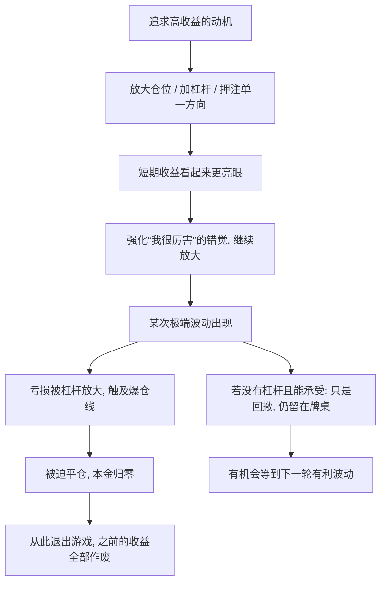

# 16｜为什么“活下来”比“赚得多”更重要？

> 为什么追求高收益可能是致命的，而生存才是第一位？

---

## 一、先说结论

塔勒布在这本书里反复敲打同一根钉子：**在充满随机性的世界里，理性的第一目标不是把收益最大化，而是确保自己不会被迫离场。**

原因很简单：损失是不对称的。亏掉 50%，需要再赚 100% 才能回到原点；而一次足以让你出局的损失——爆仓、破产、被迫清算——会把此前所有的盈利一次性抹平。期望值算得再漂亮，只要包含“归零”这个后果，它就不再是一笔好买卖。

所以塔勒布的排序很清楚：先活下来，再谈赢。收益是可选项，生存是必需品。

---

## 二、我们先理解一个问题

请比较两个策略。

策略 A：大部分时间里稳定盈利，一年可能赚 30%，但每隔若干年就有一次小概率的毁灭性亏损，一旦发生便血本无归。

策略 B：收益平平，一年可能只有 8%，但无论发生什么都几乎不会亏到出局。

如果只看“期望收益”，A 很可能更高。很多人会选 A。

但请再想一层：当那一次毁灭性亏损发生时，A 的玩家还有资格继续玩吗？如果没有，那么他此前积累的所有“平均优势”，都只是一段没有下文的故事。

这里藏着一个容易被忽略的问题：**一个能让你发财的策略，和一个能让你一直玩下去的策略，是同一回事吗？**

---

## 三、作者到底提出了什么观点？

塔勒布的观点可以概括成一句话：**在结果受随机性支配、且存在“出局”可能的场景里，生存是一个硬约束，而不是一个可以拿来交换收益的变量。**

他认为，大多数人算的是“期望收益”——把每种结果的收益乘以概率再加总。这个算法本身没错，但它隐含一个危险假设：你可以反复参与、损失可以承受、游戏永远继续。可现实中，有些损失是不可逆的：爆仓的账户不会自己长回来，破产的公司不会再来一次，失去健康和时间的人无法回到起点。

塔勒布把这类情形和俄罗斯轮盘联系在一起：奖金很诱人，但当你听到空枪的那一刻，游戏就结束了。他说的从来不是“不要冒险”，而是：**不要冒那种一旦失败就无法翻身的风险。** 收益可以慢慢赚，出局的代价却是终结性的。

换句话说，他用“生存”给“收益”上了一把锁：任何可能让我离场的策略，无论期望值多高，都要先被排除，然后再在剩下的策略里谈收益。

---

## 四、把这个观点翻译成人话

用一句大白话：**先保证自己不会被赶下牌桌。**

设想你带着 100 万进场。第一年亏了 50%，账上剩 50 万。第二年你必须赚 100%，才能回到 100 万——不是赚 50%，是赚 100%。亏损越深，回本所需的涨幅就越不成比例。这就是“不对称”：跌下去容易，爬上来难。

而“出局”比“回本”更狠。回本至少你还坐在桌上；出局意味着连参与的资格都没有了。

很多人把投资、职业、创业理解成“谁在某一年赚得多”。塔勒布提醒我们换一个问法：**谁能在游戏里待得足够久？** 因为只有在场的人，才有机会等到有利的那次随机性；而离场的人，之后发生什么都与他无关。

再想一层：为什么“留在牌桌上”本身就有价值？因为随机性是一台不断开出结果的机器。只要你还握着筹码，就始终保留着被好运砸中的可能;一旦你把筹码全部押上又输光，这台机器之后所有的好消息，都与你无关了。

---

## 五、为什么会这样？

把这条逻辑链拆开看：

关键在 **F → G → H** 这一段：不是“这次亏得比较多”，而是“再也没有下一次”。

数学上，这是“乘法过程”和“加法过程”的区别。稳定的小收益是加法；一次归零则是乘法——任何数乘以零，都是零。你可以连续十年做得很好，只要第十一年出现一次 −100%，整个序列的终值就是 0。

塔勒布还指出，我们对这种风险天然不敏感，因为它不常发生。可正是“不常发生、一旦发生就不可逆”这件事，决定了长期结果。

---

## 六、举一个现实生活中的例子

假设有个人手里有 10 万元，看到某种加密资产“趋势很好”，于是开了 10 倍杠杆做多。

价格上涨 5%，他的账户浮盈约 50%，也就是账面多了 5 万。他很兴奋：照这个速度，一个月就能翻倍。于是他不但没有减仓，反而在回调时又补了一笔，杠杆维持在高位。

然后价格在一个平常的夜里下跌了 10%。对现货持有者来说，这只是一次回调，跌 10% 而已，不卖就不算真亏。但对一个 10 倍杠杆的多头来说，10% 的反向波动意味着本金基本被打光——系统会强制平仓。他想“再等一等，说不定会涨回来”，可他没有等的机会了，仓位已经被清算。

第二天价格真的反弹了。旁观的人会说“你看，果然会涨回来”。只有他自己知道，那轮反弹跟他已经没有关系——他在最低点出局，账户归零，之前那次 5% 的浮盈也一起消失了。

这个例子里最关键的一点不是“他看错了方向”，恰恰相反：**即使后来方向是对的，出局的人也已经无法受益。** 决定结局的不是那 10 块钱的涨跌，而是那个 10 倍杠杆——它把一次普通波动，变成了终结性事件。

---

## 七、回到书中重新理解

现在再看塔勒布对“风险”的执着，就能理解它为什么是整本书的落点之一。

书的开头讲运气、讲概率盲，中间讲归纳、讲稀有事件，到最后都在指向同一个实践结论：**既然未来无法预测，那么真正可控的，就是“让自己不要被一次意外打死”。**

这也是他和很多“追求高收益”的投资者最根本的分歧。多数人问的是“这笔投资能赚多少”，他先问“这笔投资最坏会怎样，我能不能承受，我还能不能继续玩下去”。

他的立场不是保守，而是一种优先级：**收益是可选项，生存是必需品。** 只有当生存得到保障，之前所有关于概率和运气的讨论才有落地的意义——因为那些讨论的对象，是一个还留在牌桌上的人。

---

## 八、这个观点背后还有什么？

第一，**“期望值”并不是错的，只是需要附加约束。** 数学上追求期望收益没有毛病，问题在于许多真实游戏里存在“破产”这个吸收态：一旦进入，就永远出不来。此时最大期望值策略反而可能是最差策略。

第二，**后世学者用“遍历性”来给这个直觉提供形式化支持。** 现代的一些研究者（如 Ole Peters 等人）区分“集合平均”和“时间平均”：把一个策略同时发给一万个人，与让一个人把这个策略重复一万次，结果可能完全不同。因为这个区分属于后续研究，不是塔勒布在本书里的原话，但不难看出它与塔勒布的生存观一脉相承。

第三，**它与“下注比例”的思想有关。** 凯利公式一类的思路提醒人们，问题不只是“押哪边”，还有“押多少”——押得太重，即使胜率占优，也可能因为一次连败而破产。

第四，**它重新定义了“聪明”。** 在塔勒布看来，聪明不是“每次都赢”，而是“赢得起、也输得起，并且一直留在场上”。

---

## 九、这个观点有问题吗？

有，需要客观地看。

第一，**“生存优先”如果做到极端，会变成什么都不做。** 完全规避风险的人确实不会出局，但也几乎不会获得任何收益。塔勒布自己也不是零风险，他反对的是“可能致命的风险”，而不是所有风险。把“先活下来”读成“别冒险”，是彻底的误读。

第二，**“致命”的边界因人而异。** 对一个有稳定收入、无负债的年轻人，一次亏损和一次创业失败可能并不致命；对一个靠这笔钱养老的人，同样的损失就是灾难。所以“先活下来”必须结合个人处境，没有统一标准。

第三，**过度强调生存，可能抑制必要的探索。** 人类很多重大突破，靠的正是承担失败风险。如果人人都以“不出局”为最高准则，可能没人去尝试那些高不确定性的路径。这说明它是一条决策原则，而不是人生的全部。

第四，**塔勒布自己的立场也受到批评。** 一些学者认为，他对高杠杆和复杂金融的批判虽然有其道理，但容易滑向“一切都是泡沫”的判断；也有观点指出，他所推崇的“不爆仓”策略，在长期低波动环境里会显得过于保守、收益落后，考验的是人的耐心。

所以更平衡的说法是：**生存是入场券，不是终点。** 先把“永远不会被迫离场”这条底线划好，再在其之上合理地承担风险、追求收益。

---

## 十、今天再看这个观点

以下部分是“生存优先”思想在现代场景中的延伸，不是塔勒布在本书里的原话。

个人理财里，这条原则几乎可以直接落地：留出应急资金、控制负债、不拿生活必需的钱去赌高波动资产。这些做法听起来平淡，却正是“避免出局”在普通人层面的版本。

职业选择上也是同理。一个人如果把所有筹码押在单一技能、单一公司、单一行业上，短期可能上升很快，但一旦行业剧变，就等于职业层面的“满仓加杠杆”。保留可迁移的能力、维持一定的现金缓冲，是在给自己留牌桌。

塔勒布在后来的作品中进一步把这个思路发展成“杠铃策略”：绝大部分资源放在极安全的地方，用小部分去博取高赔率的机会——注意，这是他在后续著作中的展开，并非本书原话。它和“先活下来”是同一个逻辑的两个方向。

再看 2008 年金融危机、长期资本管理公司（LTCM）的崩塌，以及形形色色的爆仓事件，它们的共同点往往是：策略的期望收益看上去非常漂亮，但仓位里藏着一个“如果发生就完蛋”的情景。事后大家才明白，问题从来不是“概率有多小”，而是“后果有多重”。

---

## 十一、这一篇真正应该记住什么？

1. **亏损是不对称的。** 亏 50% 需要赚 100% 才回本，亏损越深，回本越难，这不是心态问题，是数学。

2. **“出局”和“回撤”是两件事。** 回撤还可以等回来，出局意味着从此与你无关；要优先防的是后者。

3. **期望值高，不等于值得做。** 只要策略包含归零的可能，漂亮的期望值就可能只是诱饵。

4. **留下来的价值被严重低估。** 只要还在牌桌上，你就保留了等到有利随机性的资格，这本身就是一种收益。

5. **生存优先不是不冒险。** 它要求的是先划出不可承受的底线，再在这条线之上合理下注。

---

## 十二、留一个问题

> 如果你的收益曲线里藏着一个“一旦发生就归零”的小概率，
> 无论它多小——
> 你会继续吗？你凭什么确信自己不是那个倒霉的人？

---

**下一篇**：先活下来，是对自己下的判断。可当我们转过身去看别人——看那个赚了钱的、那个手术成功的、那个升了职的——我们又容易犯另一种错误：只看结果，不问过程。这就引出了下一个问题——**运气还是能力：我们该如何评价成功与失败？**
