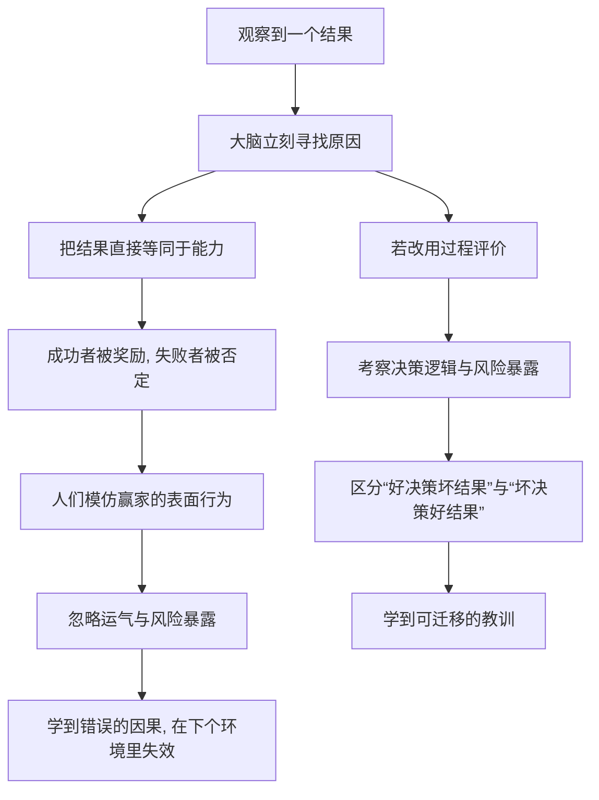

# 17｜运气还是能力：我们该如何评价成功与失败？

> 既然运气无处不在，我们该如何看待自己和他人的成败？

---

## 一、先说结论

塔勒布的主张是：**评价一个人，要看过程和风险暴露，而不只是结果。** 因为结果里混着运气——同一套决策，在不同的运气下会得到不同的结局。给“幸运的傻瓜”掌声、给“倒霉的高手”嘲笑，都是对随机性的误读。

一个更诚实的标准，是问“他在什么样的风险下、按什么逻辑做出的决定”，而不是只盯着那个已经发生的结果。成功不自动等于高明，失败也不自动等于无能。

---

## 二、我们先理解一个问题

两位外科医生。

医生甲主刀一百台手术，成功率 95%；医生乙主刀一百台，成功率 80%。谁更厉害？

直觉会说甲。但如果告诉你：甲做的都是常规、低风险手术，病人本身状态良好；乙接手的大多是危重、高风险病例，很多是别的医生不敢接的烫手山芋。这时候你还会那么肯定吗？

问题来了：**我们究竟是在评价医生的技术，还是在评价他病人的运气？** 一个只看成功率的人，会把“站在风暴中心”误判成“手艺不行”。

---

## 三、作者到底提出了什么观点？

塔勒布认为，**结果不等于能力**，尤其在随机性强的领域。一次成功可能是好决策碰上了好运，一次失败也可能是好决策碰上了坏运气。只用结果打分，等于把运气也算进了对人的评价里。

他给出的思路是“替代历史”：想象同一个人、同一套决策逻辑，在一千个平行世界里重复一遍，结果会怎样。如果多数世界里他都活得不错，那说明他有真本事；如果只是恰好在这一个世界里赢了，那更可能是运气。

所以他主张，评价应基于过程与风险暴露：他承担了什么风险？他的决策逻辑在长期是否站得住？他是否在玩一种“这次赢了、下次可能全没了”的游戏？这些问题，比“他这次赚没赚到”更接近真相。

---

## 四、把这个观点翻译成人话

用一句大白话：**别急着用结果给人发奖状或贴标签。**

一次考试考得好，可能是复习到位，也可能是题型恰好都会；一次项目做成，可能是方案好，也可能是竞争对手临时出局。结果只是一个点，过程却是一整条线。只看点，你很容易把偶然当成必然。

更麻烦的是，结果还会反过来塑造我们的判断：赢了的人，我们会自动去找他“做对了什么”；输了的人，我们会自动去找他“哪里不行”。同一种行为，在赢家身上叫“坚持”，在输家身上叫“固执”——差别只是结局，而不是逻辑。

塔勒布想让我们慢一步：**先问过程，再看结果。** 不是不给结果权重，而是不要把单次结果当成全部证据。

---

## 五、为什么会这样？

这种判断方式背后有一条很固定的心理路径：

关键在 C：我们处理不了“结果里混着运气”这种模糊状态，于是干脆把它简化成“赢了等于行，输了等于不行”。这种简化在远古其实是有用的——快速判断谁能带来好处、谁该被避开。但在随机性主导的现代场景里，它开始系统性地误导我们。

塔勒布提醒的正是这个惯性：**结果是最容易看到的，却不一定是最有信息量的。**

---

## 六、举一个现实生活中的例子

回到那两位外科医生。

医生甲每年被评成“手术成功率最高的专家”，锦旗挂满墙。医生乙的成功率排在后面，甚至偶尔被质疑“是不是技术不行”。

可如果去看他们每天排的手术：甲接的多是风险可控的常规病例，术前评估良好，术后恢复顺利；乙常年被叫去处理别的医院转来的疑难危重病人，很多病人送来时已在生死边缘。乙的成功率低，不是因为他手笨，而是因为他站在风暴最猛的地方。

如果医院只按成功率发奖金、评职称，会发生什么？理性的医生会开始挑简单的病人做，把高风险的推给别人——**用结果评价，最终会奖励“躲避风险”，惩罚“承担风险”。**

这就是结果偏误的现实代价：它不只是评价不准，还会扭曲人的行为，让整个系统避开那些难的、真正需要技术的事。

---

## 七、回到书中重新理解

现在再看塔勒布对“幸运的傻瓜”和“替代历史”的执着，就能明白它们其实是同一件事的两面。

“幸运的傻瓜”说的是：一个人赚了钱，不代表他做对了。因为在他的成功里，运气可能占了大头。

“替代历史”提供的正是评价工具：不要只问“他这次赢了吗”，而要问“用他这套做法，在多数可能的世界里他还能赢吗”。

塔勒布用这套标准，既是在评价别人，也是在提醒自己。他认为，一个真正理解随机性的人，对成功会保持审慎，对失败会保持宽容——因为他知道，同一套正确的逻辑，也可能因为运气不好而暂时失败。这不是软弱，而是对概率的尊重。

---

## 八、这个观点背后还有什么？

第一，**它触及一个古老的哲学问题：道德运气。** 一些哲学家（如伯纳德·威廉姆斯、托马斯·内格尔）讨论过：如果两个人的行为完全相同，只是一个成功、一个失败，我们是否应该给他们不同的道德评价？塔勒布的“看过程”其实和这个问题同源，只是他用概率与风险的语言来表达。

第二，**它区分了“决策质量”和“结果质量”。** 好的决策可能带来坏结果，坏的决策也可能侥幸成功。混淆二者，就无法从经验里学到东西。

第三，**它对奖惩制度有直接含义。** 如果只看结果，就会鼓励赌博式行为：赌赢了算英雄，赌输了换个地方重来。而一个关注过程与风险暴露的制度，才可能奖励真正稳健的判断。

第四，**它要求一种罕见的能力：在坏结果面前仍然坚持正确的逻辑。** 这很难，因为人天生需要即时反馈。塔勒布承认，这种坚持本身就是一种稀缺品质。

---

## 九、这个观点有问题吗？

有，而且值得认真对待。

第一，**过程往往比结果更难观察。** 结果摆在明面上，决策逻辑却只有当事人知道，而且人很容易在事后美化自己的动机。这样一来，“看过程”就可能变成“听故事”，反而给了失败者辩解的借口。

第二，**完全脱离结果的过程评价有风险。** 如果一个人长期、反复地失败，即使每次都能给出漂亮的理由，我们也有理由怀疑他的过程本身有问题。结果不是唯一的证据，但长期结果仍有相当的信息量。

第三，**在有些领域，结果就是能力。** 下棋、编程、开飞机这类反馈快、随机性小的领域，长期结果和能力高度相关。“结果偏误”的适用范围需要判断，不能无条件套用。

第四，**只看过程也可能被滥用。** 在组织里，“我努力了、我逻辑对了，只是运气不好”很容易成为推卸责任的挡箭牌。所以更严谨的做法是：**同时看过程、风险暴露和足够长的结果序列**，而不是简单地选一边站。

塔勒布自己也承认，你几乎无法向一个幸运的人证明他只是幸运。这说明“看过程”是一种必要的矫正，但并不能提供一个完美的评分表。

---

## 十、今天再看这个观点

以下部分是这一思想的现代延伸，不是塔勒布在本书里的原话。

在决策研究领域，安妮·杜克在《对赌》中把这类现象称为“resulting”（以结果论英雄），主张用“决策质量”而非“单次结果”来复盘——这是对同一问题的另一种通俗表达。

企业管理里，单纯用 KPI 结果考核，容易催生“做数据、挑容易的活”；一些组织因此引入过程指标、风险指标和行为准则，试图把“怎么做到的”纳入评价。

投资领域更是如此：一个基金某年收益最高，可能只是因为它承担了最大的尾部风险；要判断它是不是“好”，需要看它在极端行情下会怎样、仓位是不是在赌命。

对个人来说，这套思路最实用的地方在复盘：不要因为一次失败就否定自己的方法，也不要因为一次成功就确信自己找到了规律。先问一句——**这次结果里，有多少是我能控制的？**

---

## 十一、这一篇真正应该记住什么？

1. **结果里混着运气。** 同一套决策，在不同的随机环境下会得到不同结局，不要用一个结果给人下定论。

2. **优先评价过程与风险暴露。** 他承担了什么风险、按什么逻辑下注，比“这次赢没赢”更接近能力的真相。

3. **对成功审慎，对失败宽容。** 成功可能只是幸运，失败可能只是倒霉；两头都需要给运气留出位置。

4. **长期结果仍有信息量。** 看过程不是完全无视结果，而是要避免用单次结果做过度推断。

5. **这套标准也要用在自己身上。** 赢了别急着归功自己，输了也别急着否定自己——先分辨哪些是运气，哪些是选择。

---

## 十二、留一个问题

> 如果评价别人的时候你知道要看过程，
> 那评价自己的时候——
> 你为什么还是只用那一次结果，来给自己判刑？

---

**下一篇**：光知道“要看过程、别被结果绑架”还不够，因为现实里的结果照样会让我们暴怒、焦虑、失落——知道道理和保持平静，是两回事。两千年前的古人也面对同样的问题，他们给出了一套至今仍然管用的心理工具——**斯多葛主义：塔勒布为什么推崇古人的智慧？**
