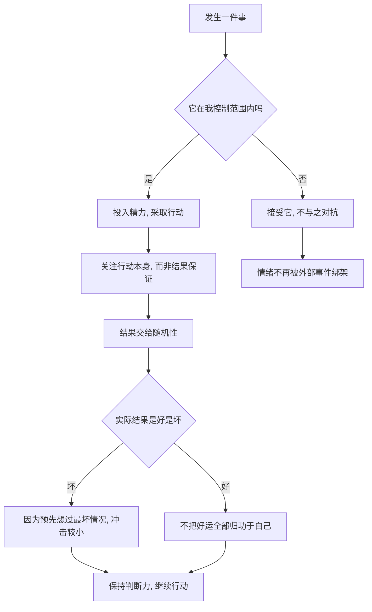

# 18｜斯多葛主义：塔勒布为什么推崇古人的智慧？

> 两千年前的斯多葛哲学，能帮我们应对现代的不确定性吗？

---

## 一、先说结论

塔勒布推崇斯多葛哲学，不是因为怀旧，而是因为它有用。**斯多葛的核心是分清“可控”与“不可控”：把精力放在自己能决定的事情上，平静接受自己决定不了的结果。**

它还用一个特别的练习来给情绪降温——预先设想最坏的情况。先在心里接受损失，真实的损失就难以击垮你。对塔勒布来说，这套古老的训练恰好是针对随机性最实用的心理工具：既然结果无法控制，那就控制自己面对结果的方式。

---

## 二、我们先理解一个问题

想象一个工作日的早晨。

你提前出门，路上却堵死了。你能控制什么？路况、别人的驾驶、天气、红绿灯，都不在你的掌控之内。你能控制的，只有自己的判断和反应：是继续焦躁地按喇叭，还是打开一段音频，接受这段时间。

问题在于：我们明明知道堵车不可控，为什么还是要为它生气？**我们的大部分情绪，其实是花在了自己根本无法改变的事情上。**

这个疑问，正是斯多葛哲学两千年前就认真回答过的。

---

## 三、作者到底提出了什么观点？

塔勒布赞赏的是一种斯多葛式的生活态度。它的核心不是“压抑情绪”，而是“调整判断”。

斯多葛哲学（尤其是爱比克泰德的《手册》）有一个著名的意思：**困扰我们的往往不是事情本身，而是我们对事情的看法。** 同一场暴雨，有人烦躁，有人觉得凉快；让情绪不同的不是雨，是评价。既然评价在自己手里，情绪也就没那么被动。

塔勒布把这一点接了过来。他认为，在随机性主导的世界里，人最容易犯的错，就是为那些自己控制不了的事情过度操心：预判市场、担心黑天鹅、愤怒于别人运气好。这些消耗既不改变结果，又损害判断。相反，把注意力收回到可控范围——自己的行为、仓位、习惯、态度——才能真正改善处境。

他还欣赏斯多葛的另一半：**主动预想最坏情况。** 斯多葛派有一种“预先设想灾祸”的练习，先在心里把失去财产、健康、亲人演练一遍，不是为了悲观，而是为了在它真的发生时，不至于被情绪淹没。塔勒布发现，这与交易员管理风险有相通之处：先把最坏的结果想在前面，情绪的冲击就会小得多。

---

## 四、把这个观点翻译成人话

用堵车这件事来理解就够清楚了。

堵在路上时，有两套想法。

第一套是：“怎么又堵了？前面到底怎么回事？今天肯定迟到了，完了完了。”——思考的对象全是自己控制不了的东西，越想越急，心跳加快，一整个上午都被毁掉。

第二套是：“路况我改变不了。我现在能做的，是给会议发条信息，然后把这段时间用来听点东西或者休息。”——注意力落在可控的动作上，情绪很快就稳下来。

两种人面对的是同一场堵车，结果却完全不同。

斯多葛不是在教人“认命”，更不是“别生气，忍着”。它是在教人**把情绪的力气用对地方**：既然控制不了堵车，就没必要为它愤怒；而既然能控制自己的反应，那就把功夫下在这里。塔勒布看中的正是这种“省下来”的能量——它不被浪费在不可控的事上，而是留在真正能派上用场的地方。

---

## 五、为什么会这样？

用一张图看斯多葛的运作方式：

关键在于 B 这个分岔。人的痛苦常常来自“想控制不可控的东西”：想让市场涨、想让别人喜欢自己、想保证每件事都成功。斯多葛把这道题重新做了一遍——先分类，再决定情绪该放在哪一点上。

塔勒布认为，这与随机性的现实是匹配的：结果本就有一大部分不由你决定，为一个不由你决定的结果而剧烈起伏，等于把自己的情绪交给了随机数发生器。

---

## 六、举一个现实生活中的例子

再说堵车，但这次看情绪是怎么一步步失控的。

你出门晚了十分钟，上路发现前方追尾，整条路缓慢挪动。第一分钟你还能忍；第五分钟你开始频繁看时间；第十分钟你开始想象迟到的后果：老板会怎么想、这个季度考核会不会受影响、都怪昨晚没早睡……情绪像滚雪球一样大起来。

可这些想象里，没有一条能让车流快一秒钟。你愤怒的对象是追尾的司机、是红灯、是这座城市——全是不可控的。真正可控的只有三件事：给相关的人发消息说明情况、调整今天的安排、决定自己要不要在这段时间里保持平静。

当一个人意识到“我确实改变不了堵车”，情绪不是变得更糟，反而往往松下来。因为那种焦躁的本质，是“我必须做点什么却什么都做不了”的无力感；一旦承认了不可控，无力感就失去了对象。斯多葛做的，正是帮你早点完成这个承认。

---

## 七、回到书中重新理解

塔勒布为什么在讲随机性的书里，专门给情绪和心态留出位置？

因为前面所有的讨论，最后都要落到一个具体的人身上：一个知道自己无法预测未来、又必须继续做决定的人。这个人最大的敌人，往往不是外部的随机性，而是自己内心的过度反应。

他观察到，人在面对随机结果时，容易被两种东西击垮：一是坏结果带来的痛苦，二是好结果带来的膨胀。斯多葛刚好对治这两样：对坏结果，用“这事我控制不了”来降温；对好结果，用“这里面有运气”来收敛。

所以斯多葛在塔勒布的体系里不是点缀，而是闭环。对概率和随机的认知解决“该怎么想”，斯多葛解决“想到了之后，能不能稳得住”。少了后者，前者就只是纸上谈兵。

---

## 八、这个观点背后还有什么？

第一，**斯多葛有一个具体的练习：预想最坏情况。** 塞内加等人主张，在顺境时就设想可能的失去，反复演练，好让真正的打击到来时，自己已经“心理上先受过一次”。这和现代人做风险预案、买保险，在情绪层面是同一类动作。

第二，**它与“保留条款”的智慧有关。** 斯多葛派在做事时会加上一句“如果命运允许”的意思：我全力去做，但结果不由我单方面决定。这样，努力不减少，执念却减少了。

第三，**它对现代心理治疗有过直接影响。** 学界普遍认为，认知行为疗法（CBT）的许多思路可以追溯到斯多葛哲学——识别并修正那些导致痛苦的自动化想法，和爱比克泰德说的“困扰来自看法”高度呼应。

第四，**塔勒布在后续作品里更系统地谈到塞内加。** 在《反脆弱》等书中，他把斯多葛的“承受损失、又从损失中受益”进一步展开——需要注意，这属于他后来的发展，并非本书原话。

---

## 九、这个观点有问题吗？

有，需要区分真斯多葛和被误读的斯多葛。

第一，**它容易被误解为消极和认命。** “接受不可控”听起来像是“那就什么都别做了”。但真正的斯多葛并不排斥行动，它只是不把行动的价值绑定在结果上。把“接受”读成“躺平”，是常见的曲解。

第二，**“可控与不可控”的界线并不总是清晰。** 很多时候结果是自己努力和外部环境共同作用的产物，很难干净地切开。过分强调二分，可能让人回避自己其实能影响的部分，或者反过来把过多责任揽到自己身上。

第三，**有人批评它压抑正当情绪。** 丧亲之痛、遭遇不公时的愤怒，都是正常的；如果一个哲学要求你“平静接受一切”，就可能变得冷漠，甚至成为不敢反抗的借口。斯多葛派内部的答案倾向于“情绪可以存在，但不要被它支配”，可这条界线在实际操作中很难把握。

第四，**它带有一定的资源前提。** 一个基本生活有保障的人，更容易“接受不可控的结果”；而对处境艰难的人来说，这套话术容易被用来劝人认命。这一点批评在当代讨论中经常出现，值得警惕。

更平衡的看法是：斯多葛是一套**训练注意力和情绪方向的工具**，而不是一套替现实辩护的教条。用得好，它让人更稳、更清醒；用得偏，它可能变成冷漠或顺从。

---

## 十、今天再看这个观点

以下部分是斯多葛思想在现代场景中的延伸，不是塔勒布在本书里的原话。

心理学和教育领域，今天流行的正念、情绪调节训练、韧性培养，很多都能和斯多葛对上号：先觉察情绪，再检验引发情绪的想法，最后把注意力移回可行动的部分。

风险管理领域也一样。买保险、做压力测试、留应急金，这些动作在理性层面是风险控制，在心理层面就是“预想最坏情况”的现代版——提前接受，事到临头就不慌。

对个人来说，一个很实际的用法是“情绪记账”：当自己因为某件事难受时，先问一句“这件事在我控制范围内吗”。如果在，就去行动；如果不在，就训练自己把注意力收回来。这个方法简单到近乎朴素，却正是斯多葛两千年来最想传递的东西。

值得提醒的是，现代人面对的信息环境比古人嘈杂得多，持续刷到的坏消息会不断制造“我必须反应”的错觉。在这种环境里，斯多葛的“分清可控与不可控”反而比古代更有价值——它帮助你决定，哪些焦虑根本不值得接入。

---

## 十一、这一篇真正应该记住什么？

1. **区分可控与不可控。** 精力应该花在能改变的事上，而不是为改变不了的事消耗情绪。

2. **困扰来自看法，不只是事情。** 同一件事，不同的解释会带来不同的情绪，而解释是可以训练的。

3. **预想最坏情况能降低冲击。** 提前在心里接受损失，真实发生时就不容易被击垮。

4. **斯多葛不等于压抑或认命。** 它要求的是稳住情绪后继续行动，而不是放弃行动。

5. **它是工具，不是教条。** 用它的标准去分担责任、管理情绪，而不是为现实辩护或苛责自己。

---

## 十二、留一个问题

> 如果一件让你愤怒或焦虑的事，
> 你诚实地问自己“它在我控制之内吗”，
> 答案常常是“不在”——
> 那你为什么还愿意为它，付出今天整整一天的情绪？

---

**下一篇**：到这里，我们已经把“为什么看不见运气、为什么算不清概率、为什么情绪会失控、为什么必须先生存”这些碎片一块块拼了起来。剩下的最后一个问题，也是整本书最后要交还给读者的：知道这一切之后——**在一个随机的世界里，我们究竟该如何生活？**
