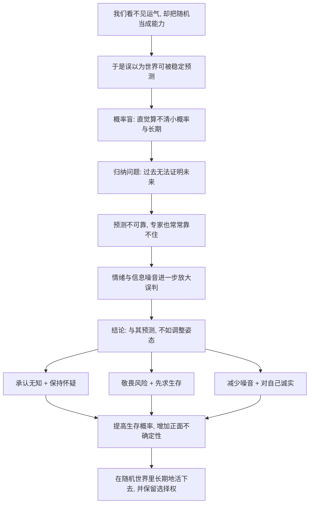

# 19｜在一个随机的世界里，我们该如何生活？

> 如果努力未必有回报、运气又无法控制，我们究竟该怎么活？

---

## 一、先说结论

塔勒布给出的不是一套保证成功的方案，而是一种姿态：**承认运气、保持怀疑、敬畏风险、先求生存、减少噪音、对自己诚实。**

他并不认为努力无用——恰恰相反，努力很重要，但努力要用对地方：用在提高自己“活下来”的概率上，用在增加自己遇到正面不确定性的机会上，而不是把所有筹码押在一次“赌一把”上。世界是随机的，这一点无法改变；能改变的是我们站在随机性里的姿势。

---

## 二、我们先理解一个问题

如果你已经接受了前面所有的结论——成功里有运气、概率难以直觉、过去不能证明未来、情绪会骗人、一次致命损失可以抹掉一切——那么一个很自然的问题就冒出来了：

> 既然如此，我为什么还要努力？反正结果不由我决定。

这个问题很容易滑向两种极端。一种是虚无：“既然都是运气，那我躺平算了。”另一种是加倍下注：“既然结果不确定，那我就赌一把大的，赢了翻身。”

塔勒布对这两种都不同意。他想说的其实是第三种可能：**既然你控制不了结果，那就去控制那些能提高你胜算、又不至于让你出局的事情。** 这个空间，比想象中大得多。

---

## 三、作者到底提出了什么观点？

塔勒布在书里给出的，是一组彼此关联的态度，而不是一条成功公式。

第一，**承认无知。** 我们知道的远比自以为的少，尤其是在预测未来这件事上。承认无知不是自卑，而是减少犯错的起点。

第二，**保持怀疑。** 对确定性的宣称保持警惕，无论它来自专家、模型还是自己的直觉。怀疑主义不是反对一切，而是不轻易把可能性当成事实。

第三，**敬畏风险，先求生存。** 收益可以慢慢来，出局却不可逆。先保证自己不会被迫离场。

第四，**减少噪音。** 大部分新闻、行情、情绪化的信息只是噪音。看得越频繁，越容易被随机波动牵着走。

第五，**对自己诚实。** 赢了别急着归功自己，输了也别急着否定自己；分得清哪些是运气，哪些是选择。

至于努力，塔勒布的定位很明确：**努力不是用来锁定结果的，而是用来改变概率分布的。** 你无法保证这一次成功，但你可以通过积累技能、控制风险、保留选择权，让自己在长期更可能活得好，也更可能碰到好运气。

---

## 四、把这个观点翻译成人话

一句话：**别把人生当成一次豪赌，把它当成一场要玩很久的游戏。**

既然你要玩很久，那么第一件要做的事，就是给自己留安全垫。

安全垫的意思是：即使最坏的情况发生，你也不会被直接淘汰。个人理财上，它是应急资金、是可控的负债、是不把全部身家押在一个标的上；职业选择上，它是可迁移的能力、是多元化的人脉、是即使失业也能撑一段时间的储备。

有了安全垫，你才敢在该行动的时候行动——因为它把“失败”从“出局”降级成了“受伤”。而一个不会被一次失败打死的人，才真正拥有长期参与随机游戏的资格。

这就是塔勒布式的生活姿态：不是躲避不确定性，而是在确保不死的条件下，主动去接触那些可能带来意外收获的机会。**谨慎和进取并不矛盾，它们能被同一条底线统一起来。**

---

## 五、为什么会这样？

把全书的线索串起来看，最后一篇的位置就清楚了：

这条链的终点不是“算出未来”，而是“调整姿势”。因为整本书的论证指向同一个判断：未来无法被稳定预测，所以任何依赖精确预测的生活方式都很脆弱。反过来，不依赖预测、只依赖“不被打死加上保留机会”的生活方式，反而更能在长期存活并受益。

塔勒布想要的，正是这种从“预测世界”到“经营自己”的转向。

---

## 六、举一个现实生活中的例子

设想一个刚工作没几年的人，面前有两条路。

第一条：去一家处于风口、薪水很高的新兴公司，把全部精力投入进去，押上所有时间去赌它上市，甚至借钱参与员工认购。成了，一步登天；败了，可能连基本生活都受影响。

第二条：同样去这家公司，但做几件事——保留一笔能覆盖六个月开支的应急资金，不为此借高息的钱，同时维持自己能带走的专业能力，不定期更新简历与行业关系。

第二条路并不会让他“少努力”，反而可能让他更敢投入，因为他知道自己输得起。如果公司成了，他一样受益；如果公司倒了，他不至于被迫接受任何一个最差的选择——他可以慢慢找，而不是慌不择路。

这就是安全垫的作用：它不改变运气的分布，但改变了运气不好时你的下场。**它把“只能赢”变成“输得起”，而输得起的人，往往反而走得更远。**

---

## 七、回到书中重新理解

现在可以理解，为什么塔勒布在全书结尾并没有给出一个让人安心的答案。

因为任何“照着做就能成功”的清单，本身就违背了他整本书的论点——如果世界真有稳定的成功公式，运气就不会那么重要了。所以他能给的，只能是姿态：谦逊、怀疑、克制、生存优先。

这看起来不够解渴，但它有一个好处：**它不依赖于你是否预测准确。** 无论未来发生什么，一个保持怀疑、留有安全垫、控制风险、情绪稳定的人，都不会是第一个被淘汰的。

塔勒布所谓的“与随机性共处”，不是战胜随机，而是学会在不确定中不被打败，并保留等到好运气的资格。这一点，贯穿了从这本书开头到最后的每一条线索。

---

## 八、这个观点背后还有什么？

第一，**怀疑主义的传统。** 塔勒布的态度并非凭空而来，它接续的是休谟等人对归纳法的质疑，以及更古老的怀疑论传统。承认“我不知道”，是这套生活方式的哲学底座。

第二，**“选择权”的价值。** 在不确定的世界里，一个保留了大量可选项的人，往往比一个把路走死的人更安全。这不是塔勒布书中原话的术语，但与他“保留在牌桌上”的思想高度一致。

第三，**他在后续作品里把这一思路发展成“反脆弱”。** 不只是承受波动，还希望从波动中获得好处。这属于他后来著作的延伸，不是本书内容，但能帮助理解他的整体思路。

第四，**它强调纪律胜过聪明。** 减少查看频率、控制下注规模、坚持原则——这些做法都不依赖天赋，依赖的是自控。塔勒布真正的门槛，不是智商，是能不能忍住。

---

## 九、这个观点有问题吗？

有，而且这些批评值得正面回应。

第一，**它有明显的资源前提。** “留安全垫”对收入尚可的人可行，但对很多没有余裕的人来说，周旋的空间本就很小。一套生活方式如果只在有缓冲的人群中才可执行，它的普适性就要打折扣。

第二，**过度怀疑可能导致行动瘫痪。** 如果什么都不信、什么都不敢下注，人就无法前进。塔勒布整体上偏防守，但人生许多阶段确实需要主动出击，需要承担失败。

第三，**它难以被验证。** 一个终身保持谦逊和保守的人，从不会爆仓，但也就无法证明这些准则带来了什么；反过来，冒进成功的人常常被当作榜样。这套哲学的收益，往往是“没有发生的灾难”，很难被看见。

第四，**塔勒布本人也是这套思想的样本。** 一些评论者指出，他自己的成功路径同样有时代与运气的成分。这不一定是反驳，但提醒我们：即使是最懂随机性的人，也不能完全跳出随机性。

所以更平衡的看法是：这套姿态不是“正确答案”，而是**在承认不确定性前提下，一种风险较低的默认设置**。它可以被个人处境调整，而不是一条必须遵守的铁律。

---

## 十、今天再看这个观点

以下部分是塔勒布思想在当下的延伸，不是他在本书里的原话。

在个人层面，这套思路已经变成很多人的实际做法：保持应急储蓄、控制负债、不把职业身份全押在单一公司、持续学习可迁移的技能。这些都不是什么惊人的人生建议，但它们的共同点，是让人“输得起”。

在职业与创业层面，越来越多人强调“保留选项”：做小成本试验、快速试错、避免一次性押上全部。这其实和塔勒布的逻辑一致——用可承受的小损失，去换取不设上限的潜在收益。

在信息层面，减少噪音的实践比以往更重要。算法会持续推送让人焦虑和激动的短期消息，而塔勒布的建议——降低查看频率、拉长时间尺度——在今天的价值可能比写书时更高。

有一个重要的提醒是：承认运气并不等于放弃努力。真正从这本书里能拿走的东西，恰恰是一种**更聪明、更诚实的努力**——承认自己可能失败，但仍然把工夫花在能提高生存概率的地方。

---

## 十一、这一篇真正应该记住什么？

1. **努力改变的是概率，不是保证。** 你无法确保某一次成功，但可以通过选择和积累，改变长期的结果分布。

2. **先留安全垫，再谈冒险。** 保留缓冲、控制风险、别把全部身家押在一次结果上，这是长期参与游戏的前提。

3. **减少噪音，拉长时间尺度。** 少看那些只会制造情绪、不提供真正信号的东西，判断力才有空间生长。

4. **对自己诚实，是唯一可持续的归因方式。** 分清运气与选择，既不因运气好而自负，也不因运气差而自毁。

5. **与随机性共处，而不是战胜它。** 目标是活下来、保留选择权，并等到好运气敲门的时候还在场。

---

## 十二、留一个问题

> 如果没有人能替你验证这套生活方式是否“最优”，
> 也没有人能保证努力一定有回报——
> 那么，你愿意用什么样的姿态，去面对那个你控制不了的未来？

---

回到这本书开头的那个问题：**我们为什么看不见运气？** 一路走来，我们看了概率盲、看了归纳法的边界、看了情绪与噪音如何扰乱判断，也看了生存为何比收益更优先。塔勒布没有许诺一个确定的答案，他做的只是把一面镜子递过来——让我们看清自己的渺小，也看清在渺小之中仍然能做出的选择。

如果这一路的解读有唯一的目的，那不是让你记住塔勒布说了什么，而是让你以后在面对一个成功、一次失败、一个诱人的高收益机会时，能多停顿一秒，多问一句“这里面有多少是运气，最坏会怎样”。至于最终该怎样生活，没有人能替你回答——**这本书的价值，不在于给出答案，而在于让你开始用自己的方式，去和随机性相处。**
