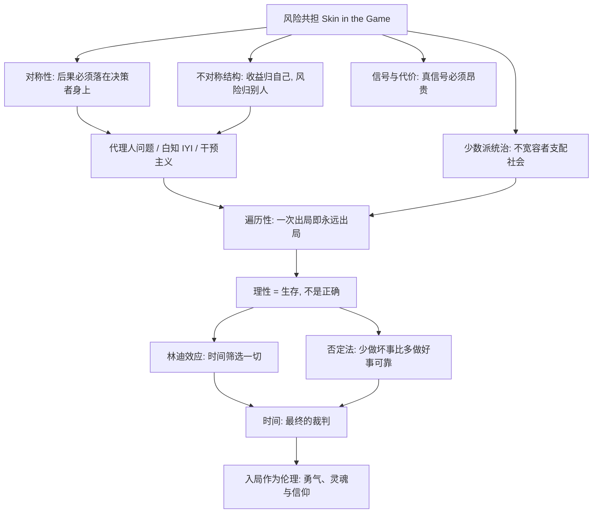

# 00｜系列拆解与目录

> 《非对称风险》（Skin in the Game）深度解读系列的总目录与知识地图。

## 系列简介

《非对称风险》是纳西姆·尼古拉斯·塔勒布「不确定性」系列的第五本，也是他自称「最想写的一本」。这本书要回答的问题只有一个，却足够扎穿现代社会的大半层皮：**当一个做决定的人不必为决定的后果付出代价时，世界会发生什么？**

塔勒布的核心主张是「风险共担」（skin in the game）：任何有效的知识、道德、市场乃至信仰，都必须建立在「利益与后果的对称」之上。拿别人的钱冒险的银行家、替别人规划战争的智库、只写评论不持仓的股评家——他们都站在不对称结构的「赢面」一侧，而代价被悄悄转移给了沉默的多数人。

这本书之所以值得读，是因为它不只批判，还提供了一套判断人与系统的实用工具：少数派统治、遍历性、林迪效应、否定法，以及「时间才是最终裁判」的生存哲学。本系列不按原书章节机械拆分，而是按「概念入门 → 不对称的代价 → 不对称如何支配社会 → 时间与理性 → 入局作为伦理」五段递进，拆成 15 篇，每篇只讲清一个问题。

## 全书核心问题

| 层次 | 核心问题 |
|---|---|
| 概念层 | 什么是风险共担？为什么对称性是一条古老而硬核的规则？ |
| 机制层 | 风险是如何被转移的？代理人、白知、干预者怎样让别人替自己买单？ |
| 社会层 | 为什么一个不宽容的少数派能支配多数？为什么真实信号必须付出代价？ |
| 认知层 | 遍历性、林迪效应、否定法分别告诉我们什么？什么才是真正的理性？ |
| 意义层 | 为什么勇气无法伪装？为什么连神也必须「入局」？谁在替整个世界承担风险？ |

## 全书知识地图

## 全系列目录

### 第一部分：入场——什么是风险共担

#### 01｜什么是「风险共担」，为什么它是理解一切的钥匙？

核心问题：塔勒布反复强调的 skin in the game 到底指什么？
核心观点：判断一个人、一套理论、一个制度是否可信，先看做决定的人是否亲自承担后果；风险共担是知识、伦理与市场的共同地基。
理解难度：★★☆☆☆
关键词：风险共担、对称性、责任、入场券

---

#### 02｜汉谟拉比法典为什么要建筑师为倒塌的房子偿命？

核心问题：为什么古人早就懂得让设计者承担后果？
核心观点：从汉谟拉比法典到罗马工程师站在桥下，对称责任是人类最古老的制度智慧；让造房子的人睡进房子里，比任何质检都有效。
理解难度：★★☆☆☆
关键词：汉谟拉比法典、对称责任、银律、制度设计

---

#### 03｜「赢了我分钱，输了你买单」是怎么回事？

核心问题：金融体系如何把风险偷偷转嫁给纳税人？
核心观点：以鲍勃·鲁宾交易为代表的奖金—救助结构，让收益私有化、损失社会化；尾部风险转移是现代不对称的重灾区。
理解难度：★★★☆☆
关键词：尾部风险、道德风险、银行家、救助

---

### 第二部分：当决策不用承担后果

#### 04｜代理人问题：为什么替别人做决定最危险？

核心问题：为什么把决策外包给「专业的人」反而常常出事？
核心观点：当代理人的报酬与委托人的结果脱钩，系统就会奖励表演而非结果；利益一致是最便宜的监管。
理解难度：★★★☆☆
关键词：代理人、激励、利益一致、委托

---

#### 05｜什么是「白知」，为什么高知反而看不懂现实？

核心问题：塔勒布所说的 IYI（Intellectual Yet Idiot）错在哪里？
核心观点：白知的问题不是无知，而是在不承担后果的位置上给真实的行动者开处方；理论与现实之间隔着一层风险。
理解难度：★★★☆☆
关键词：白知、IYI、知识与行动、离地性

---

#### 06｜干预主义的陷阱：为什么把风险转嫁给别人最可疑？

核心问题：为什么「为了你好」的干预常常留下烂摊子？
核心观点：替别人点燃冲突却不必承担战火的干预者，把尾部风险外包给了当地人；正义的外衣下往往藏着不对称。
理解难度：★★★☆☆
关键词：干预主义、外交、后果外化、正义幻觉

---

### 第三部分：不对称如何支配社会

#### 07｜为什么一个不宽容的少数派能统治温顺的多数？

核心问题：为什么市场上的饮料大多是犹太洁食认证的？
核心观点：当少数派的偏好看不可妥协而多数派无所谓时，少数派赢；社会规则常常由最不肯让步的人写下。
理解难度：★★★☆☆
关键词：少数派统治、不对称偏好、不宽容、市场结果

---

#### 08｜为什么选外科医生要选最不像医生的那个？

核心问题：为什么塔勒布说外表光鲜反而可能是坏信号？
核心观点：在真实筛选起作用的地方，活下来的人不需要修饰信号；过度精致的包装往往是在补偿实力的不足。
理解难度：★★☆☆☆
关键词：信号、筛选、反直觉、真实能力

---

### 第四部分：时间、生存与理性

#### 09｜遍历性：为什么「平均安全」会要你的命？

核心问题：为什么一百个人各玩一次俄罗斯轮盘和一个人玩一百次完全不同？
核心观点：集合概率与时间概率是两回事；只要存在出局风险，重复博弈会把这个风险放大成必然，先活下来才谈得上策略。
理解难度：★★★★☆
关键词：遍历性、集合概率、时间概率、出局风险

---

#### 10｜塔勒布的理性观：为什么「活下去」才是最高理性？

核心问题：为什么塔勒布说评判理性的标准是生存而非正确？
核心观点：信念是否「科学」不重要，它能否让持有者在重复博弈中活下来才重要；许多看似迷信的规则是被时间筛选出的生存策略。
理解难度：★★★★☆
关键词：理性、生存、信念与行动、启示性规则

---

#### 11｜林迪效应：为什么活得越久越可能继续活下去？

核心问题：为什么一本流传了两千年的书大概率还能再传两千年？
核心观点：对会消亡的事物，每多活一天就离终点近一天；对经时间筛选的事物，每多活一天预期寿命反而更长——时间是最好的审判官。
理解难度：★★★☆☆
关键词：林迪效应、时间筛选、脆弱与反脆弱、经典

---

#### 12｜否定法：为什么知道「不该做什么」比「该做什么」更可靠？

核心问题：为什么塔勒布认为智慧和神性都要用否定来定义？
核心观点：我们对「什么是错的」远比「什么是对的」确定；戒烟带来的收益胜过多数保健秘方，减法比加法更经得起时间。
理解难度：★★★☆☆
关键词：否定法、via negativa、减法、医源性伤害

---

### 第五部分：入局作为一种伦理

#### 13｜勇气为什么是唯一无法伪装的德性？

核心问题：为什么赞美勇气的人不一定有勇，而付出代价的人才算数？
核心观点：勇气是把代价写在身体上的德性，无法用语言伪造；空谈的美德没有入局，公民资格要用风险来证明。
理解难度：★★☆☆☆
关键词：勇气、德性、代价、言行一致

---

#### 14｜为什么连神也必须「入局」？

核心问题：塔勒布为什么说耶稣必须是人、必须受苦，基督教才成立？
核心观点：一个不必流血的神没有资格要求人类承受苦难；连神学都需要 skin in the game，道成肉身是信仰的入场券。
理解难度：★★★★☆
关键词：道成肉身、神学与代价、信仰、古希腊诸神

---

#### 15｜谁在为整个世界承担最大的风险？

核心问题：如果没有任何人为系统承担尾部风险，世界会变成什么样？
核心观点：风险不会消失只会转移，最终总要有人兜底——这个人可能是你；时间是最后的清算者，入局是每个自由人的默认设置。
理解难度：★★★☆☆
关键词：系统性风险、时间的裁判、自由与代价、收束

---

## 推荐阅读顺序

**主线顺序**：01 → 15，按认知难度分五段。

- **第一段（01–03）**：先建立「风险共担 = 对称性」的直觉，认识不对称结构的经典形态。
- **第二段（04–06）**：看清代理人、白知与干预者如何让收益私有化、风险社会化。
- **第三段（07–08）**：理解不对称如何反过来支配社会规则与信号系统。
- **第四段（09–12）**：进入全书最难也最精彩的部分——遍历性、理性观、林迪效应与否定法。
- **第五段（13–15）**：把风险共担还原为一种伦理与存在方式，收束全系列。

**不同读者的入口**：

- 想抓骨架：01 → 03 → 09 → 10 → 15。
- 对金融与社会批判感兴趣：03 → 04 → 05 → 06。
- 对概率与认知感兴趣：09 → 10 → 11 → 12。
- 练习批判阅读：每篇第九节「这个观点有问题吗？」集中呈现了观点的边界与争议。

## 全系列状态

全系列共 **15 篇**，已全部写完。
