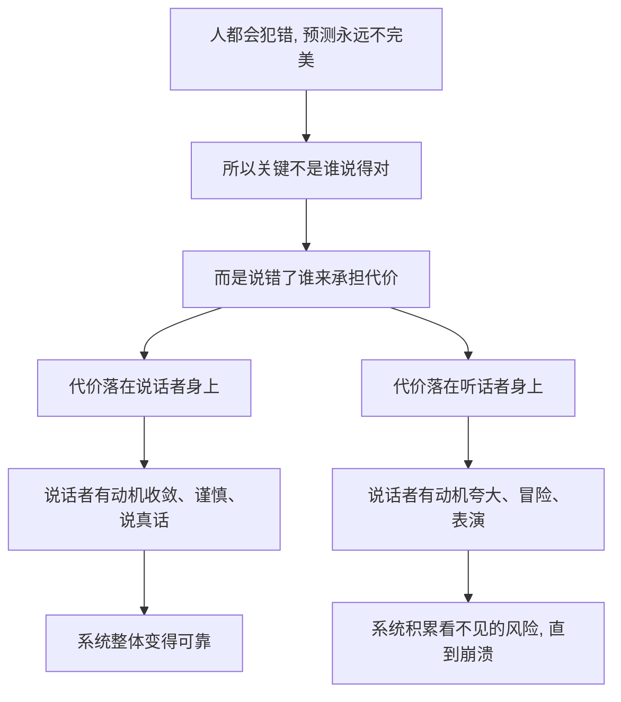

# 01｜什么是「风险共担」，为什么它是理解一切的钥匙？

> 本文要解决的问题：塔勒布在《非对称风险》里反复强调的 skin in the game 到底指什么，为什么他认为它是判断一切人与制度的试金石？

---

## 一、先说结论

「风险共担」的意思是：一个人做出了决定，就要亲自承担这个决定的后果——尤其是最坏的那部分后果。塔勒布认为，这不是一条道德口号，而是知识、伦理、市场乃至信仰能够运转的共同地基。判断一个建议值不值得听、一个专家值不值得信、一个制度合不合理，第一步不是看他说得多漂亮，而是看：如果错了，代价落在谁身上。落在提建议的人自己身上，他的话才有分量；落在别人身上，他多半只是在表演。

## 二、我们先理解一个问题

先想象一个场景。

两个人同时告诉你「这趟航班很安全，放心飞」。一个人是航空公司聘请的安全顾问，飞机坠毁了他顶多失去一份合同；另一个人是这架航班的机长，飞机坠毁了他和你一起死。

同样一句话，你愿意信谁？

答案几乎是本能的。可奇怪的是，一旦场景换成金融评论、政策建议、管理咨询，人们就突然忘记了这个直觉：大量不必为后果负责的人，正在给必须承担后果的人开处方。塔勒布写这本书，就是要把这个被遗忘的直觉重新焊回我们的大脑。

## 三、作者到底提出了什么观点？

塔勒布认为，skin in the game——直译是「把皮肤押进游戏里」，意译是「亲自入局、共担风险」——是区分「真东西」和「表演」的第一道筛子。

他的原话里有一个反复出现的句式：别告诉我你怎么想，告诉我你的持仓。一个人预测股市会涨，说得再有逻辑，不如打开他的账户看看他买了没有。买了，他的判断里至少有「真金白银的责任」做担保；没买，他只是在用语言下注，而语言是免费的。

在塔勒布看来，世界上的人分成两类：一类是「收益和风险对称」的人——赚了归自己，亏了也归自己；另一类是「不对称结构里的寄生者」——赚了归自己，亏了归别人。后者是这本书要追击的猎物。

## 四、把这个观点翻译成人话

用一句大白话说：**谁吹牛，谁买单。**

再换一个说法：风险共担就是「说这话的人，得和听这话的人坐同一条船」。

船沉了一起沉，他的建议才值得听。如果他的建议只负责把你送上船，自己却站在岸上挥手，那你最好对他挥的每一面旗都保持警惕。

生活中我们其实一直在用这个标准，只是没有意识到。孩子不吃某种食物，妈妈说「我自己先尝一口」，孩子才敢吃——这就是最古老的 skin in the game。反过来，一个推销员把理财产品吹得天花乱坠，你问他「你自己买了多少」，他支支吾吾——你的怀疑也是皮肤在报警。

## 五、为什么会这样？

塔勒布的推理链条是这样的：

他的前提很朴素：没有人是全知的，错误不可避免。既然如此，一个好的系统不应该追求「让聪明人永远说对」——这是做不到的——而应该追求「让说错的人付出代价」。代价会自动完成三件事：让说话者谨慎，让表演者退出，让幸存下来的判断更接近真实。

风险共担因此不是一种道德洁癖，而是一种**纠错机制**。它不靠人的善意，靠人的怕疼。

## 六、举一个现实生活中的例子

打开电视或短视频，你能看到无数股市评论员。他们预测走势时口若悬河，预测错了也没什么成本——观众换台，他明天换个话题继续。塔勒布说，这类人的意见没有 skin in the game：他赚的是注意力的钱，不是判断力的钱。

再看基金经理。这个岗位确实有入局——但要看入局的方式。如果他的收入主要来自管理费，规模越大收得越多，那么他最理性的策略不是「帮客户赚最多的钱」，而是「把盘子做最大、把波动做平庸」：跑赢大盘未必暴富，跑输大盘却不会被清算。他的皮肤押进去了，但押的方向和你想的不一样。

塔勒布真正认可的是那种古典交易员：用自己的钱下注，爆仓了自己破产。市场上敢长期这么玩还活下来的人，说的话才真正值得记笔记。

## 七、回到书中重新理解

现在我们再看塔勒布反复强调的那句话，就清楚多了：「不要告诉我你的观点是什么，给我看你的投资组合。」

他不是在说「观点不重要」，而是在说：**没有经过代价过滤的观点，只是噪音。** 一个系统（市场、舆论、学术圈）如果长期允许无代价地输出观点，噪音就会淹没信号，最后连说真话的人也会被挤出去——因为他的谨慎会显得「不够自信」，而自信的骗子永远比诚实的谨慎者更会演讲。

所以这本书的英文名 Skin in the Game 其实直译过来就是：你得亲自在游戏里，且游戏输了你会疼。

## 八、这个观点背后还有什么？

风险共担背后藏着三个更深的前提。

第一，塔勒布预设了**人的有限性**：没有人拥有足够的知识可以豁免后果检验。这意味着他不相信「最聪明的人来替大家做决定」这种模式——这正是他后面批判「白知」的伏笔。

第二，风险共担连接着一条非常古老的伦理传统。「己所不欲，勿施于人」这条银律，本质上就是对称性要求：你不愿承受的代价，也不要转嫁给别人。塔勒布把它从道德训诫升级成了系统工程的约束条件。

第三，也是最容易被忽略的：风险共担定义了**什么叫「真」**。在塔勒布的世界里，一个信念的真伪不只靠逻辑证明，还靠「持有者愿不愿意为它付出代价」来检验。嘴上的信念和身体押注的信念，是两种完全不同的东西。

## 九、这个观点有问题吗？

有说服力的地方很明显：把后果和责任绑定，确实是最便宜、最自动的纠错机制，几乎所有出过大事故的领域——金融、医疗、工程——事后复盘都会发现「做决定的人不用负责」这个病灶。

但它也有边界。第一，很多决策的后果根本无法由决策者个人承担：核威慑、大流行病政策、货币政策，代价天然是社会性的，「让总统为战争偿命」在现代政治里无法落地。第二，过度强调入局可能排斥专业知识——流行病学家不必感染病毒才有发言权，法官不必坐过牢才能量刑。风险共担能过滤表演，却过滤不了「真诚但错误的自信」：押上全部身家的赌徒和深思熟虑的学者，皮肤都在游戏里，可水平天差地别。第三，塔勒布的标准对「建议」很有效，对「善意的公共讨论」可能过于苛刻——公民议论外交政策并不需要先上战场。

所以更准确的读法是：风险共担是**必要条件式的过滤器**——没有它，话语廉价；但光有它，也不保证正确。

## 十、今天再看这个观点

以下部分是基于作者思想的现代延伸，不是作者原话。

放到今天，「不对称」几乎没有缩小反而扩大了。社交媒体让「零成本表达」达到历史峰值：任何人都可以对疫情、战争、市场发表断言，错了删掉就好。算法奖励的是情绪强度，不是判断准确率——这是一个系统性去掉了 skin in the game 的舆论市场。

AI 时代又多了一层新问题：当 AI 开始替人做诊断建议、投资建议、法律建议时，「谁为错误负责」变得前所未有地模糊。模型开发者、部署者、使用者之间的责任链条还在打官司阶段。用塔勒布的尺子量一量：一个不会为自己的输出付出任何代价的智能体，它的「观点」按定义就是噪音——这与它说得多流利无关。

## 十一、这一篇真正应该记住什么？

1. 风险共担 = 做决定的人亲自承担决定的后果，尤其是最坏的后果。
2. 判断话语可信度的第一筛子不是逻辑，而是「说错了谁疼」。
3. 不对称结构的特征是收益私有化、损失社会化——这本书要追猎的就是这种结构。
4. 风险共担的本质不是道德，是纠错机制：它用「怕疼」代替「善意」来维持系统诚实。
5. 它是必要的过滤器，但不保证正确——押上身家的赌徒也可能只是赌徒。

## 十二、留一个问题

下一次你在网上看到一条信誓旦旦的断言——关于股市、关于疫情、关于某场遥远的战争——不妨先问一句：如果他说错了，他会失去什么？如果答案是「什么都不会失去」，那你该给他的话打几折？

而一个更根本的问题是：那些把代价转嫁出去的机制，究竟是怎么运作的？两千多年前，美索不达米亚的立法者就给出了人类最早的答案——而且相当血腥。下一篇我们去看汉谟拉比法典。
