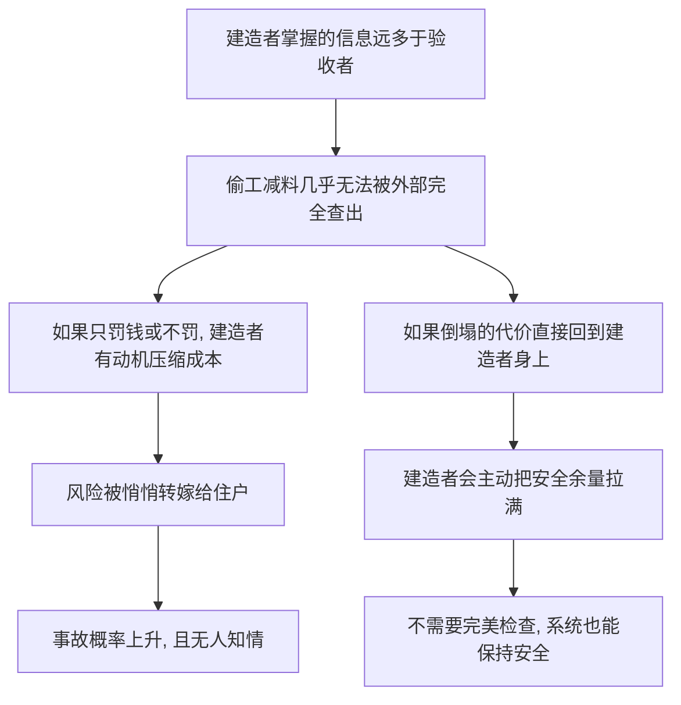

# 02｜汉谟拉比法典为什么要建筑师为倒塌的房子偿命？

> 一句话说明本文要解决的问题：为什么将近四千年前的立法者，要把「造塌了房子」写成死罪——让设计者亲自承担后果，凭什么被当作制度设计的第一条公理？

---

## 一、先说结论

古人很早就明白一件事：检验一个建造者手艺的最好办法，不是检查他的图纸，而是让他为房子的倒塌付出代价。汉谟拉比法典用最极端的方式把「决策」和「后果」焊在一起：你造的房子压死了人，就用你或你儿子的命来抵。塔勒布认为，这不是野蛮，而是人类最早的「风险共担」制度——它把安全责任从「事后质检」变成了一种提前内置于建造者身体里的东西。让造房子的人睡进房子里，比任何第三方检查都有效。

## 二、我们先理解一个问题

先想一个今天的问题。

你买了一套新房，验收单上盖了十几个章：监理章、质检章、验收章。每一个盖章的人领的是一份工资；房子十年后要是出了问题，他早就不知道在哪了。

那么问题来了：这一整套现代质检体系，和「让建筑师本人为倒塌的房子偿命」比起来，哪个对建造者的约束更强？

直觉上你可能觉得现代体系更文明、更精细。但请注意一个细节：所有盖章的人，都没有把自己的命运押进这栋楼里。将近四千年前的立法者盯着的，正是这个细节。

## 三、作者到底提出了什么观点？

塔勒布在《非对称风险》里把汉谟拉比法典放在全书开头，不是偶然。他想说明：「对称性」不是某个现代学究的发明，而是人类最古老的制度智慧。

历史上，汉谟拉比法典（约公元前 1754 年颁布于巴比伦）中有这样一组条款：第 229 条规定，建筑师为人造房，若房屋倒塌压死房主，建筑师应被处死；第 230 条更进一步，若压死的是房主的儿子，则要处死建筑师的儿子；其后几条则规定了财产损失的赔偿与重建义务。

塔勒布认为，这组条款的核心不是「罚得重」，而是「对称」：你制造的尾部风险，最终回到你自己身上。他把这条原则与「银律」——己所不欲，勿施于人——连在一起：你不愿承受的毁灭，就不要通过你的手转嫁给陌生人。

## 四、把这个观点翻译成人话

大白话就是：**你埋的雷，炸了先炸你。**

换到今天的话说：制度设计者不能「只画图、不住房」。一张图纸签出去，签名背后那个人的命运，必须和图纸的使用者绑在一起。

这个原则听起来残酷，但逻辑极其简单：世界上没有任何检查能穷尽所有偷工减料的方式，唯一有效的办法，是让偷工减料的代价自动回到动手的人身上。检查是别人替你担心；对称责任是你自己提心吊胆。前者会松懈，后者不会。

## 五、为什么会这样？

塔勒布（以及更早的立法者们）的推理链条大致是：

关键在第一步：信息不对称。造房子的人永远比看房子的人更清楚哪里偷了工、哪里减了料。外部检查只能看到表面，内部人才知道雷埋在哪。既然如此，制度的重点就不该放在「把检查做得更细」上——那是一场注定输掉的猫鼠游戏——而该放在「让埋雷者自己坐在雷上」上。

对称责任因此是一种「用怕疼代替检查」的制度设计。它假设人性不变，然后让人性替制度干活。

## 六、举一个现实生活中的例子

先看汉谟拉比法典第 229 到 233 条具体怎么运作：房子塌了压死房主，建筑师偿命；压死房主的儿子，由建筑师的儿子偿命；压死奴隶或砸坏财物，建筑师照价赔偿并出资重建。请注意「儿子偿命」这一条——以今天的伦理看它不可接受，但它的制度意图很清楚：让代价沉重到没有任何建造者敢心存侥幸，沉重到无法被利润抵消。

类似的逻辑在古罗马也有一个著名传统：据说拱桥的工程师在拆除脚手架时，必须亲自站在桥拱之下——如果拱垮了，第一个被压死的就是设计者本人。需要说明的是，这个故事的真实性在史学界有争议，一些学者认为它更接近后人总结的传说而非可考的法令；但它流传之广恰恰说明，「让工程师站在自己的作品下面」这种制度想象，在人类历史上反复出现、深入人心。

现代社会其实也保留着这个逻辑的温和版本。以中国的建筑行业为例，2014 年起推行建筑工程质量终身责任制：建设、勘察、设计、施工、监理五方主体的项目负责人，要对工程在设计使用年限内的质量承担责任——退休、跳槽都不豁免。图纸上的签名不是形式，是一张终身有效的「入局证明」。

## 七、回到书中重新理解

现在再看塔勒布为什么把一部近四千年前的法典放在全书开头，意图就清楚了。

他要打破一个现代幻觉：以为「责任对称」是某种需要论证的高级理念。恰恰相反，它是人类文明的出厂设置——在没有质检局、没有监理公司、没有保险精算的年代，立法者能想到的最朴素的公平就是：谁制造风险，谁吞下风险。

塔勒布认为，汉谟拉比真正了不起的地方在于理解了一件事：对「罕见但致命」的尾部风险，任何概率性的监管都会失效。你不可能检查每一根梁，但你可以让造梁的人知道——梁断了，他完蛋。尾部风险的唯一解药，是把尾部风险还给制造它的人。

## 八、这个观点背后还有什么？

第一，它背后是「银律」而非「金律」。金律说「你想别人怎么对你，你就怎么对别人」；银律说「己所不欲，勿施于人」。塔勒布认为银律更可靠，因为它是对称的、可执行的：你不想被倒塌的房子压死，就不要造会塌的房子给别人住。

第二，它预设了「后果是最好的老师」。制度不需要教会建筑师道德，只需要让他的神经末梢连着房子的命运。

第三，它暗含一个警告：当一个社会里「制造风险的人」和「承受风险的人」开始分离，文明的倒车就开始了。这句话是整部书的引线。

## 九、这个观点有问题吗？

它最有说服力的地方在于：用一条规则替代了无穷无尽的检查，而且这条规则天然对齐了人性——没人拿自己的命开玩笑。

但争议同样明显。第一，「儿子偿命」暴露了同态复仇式对称的伦理硬伤：建筑师的儿子没有造房子，却承担了后果——这恰恰制造了新的不对称。一些法制史学者认为，这类条款的意义更多是威慑性宣示，未必对应真实的执行频率。第二，对称责任对「故意偷工」有效，对「能力不足的诚实错误」却可能过度惩罚——超出当时抗震标准的地震塌了房子，也算建筑师偿命吗？风险因果链在现代工程里远比古代复杂，责任归属需要精算而非复仇。第三，还存在过度简化的问题：把所有风险都压回个人会抑制创新——如果每个工程师都背着「出事偿命」的威慑，最理性的选择是不造任何新东西。现代制度用有限责任、职业保险折中处理这个矛盾，这既是进步，也埋下了新的隐患。

所以更准确的读法是：对称责任解决的是「动机」问题，不解决「能力」和「因果归属」问题。它是最古老的地基，但不是整座大厦。

## 十、今天再看这个观点

以下部分是基于作者思想的现代延伸，不是作者原话。

今天的现实是：我们没有废除对称责任，而是把它稀释了。工程领域的终身责任制、医师执照的追责机制、上市公司的签字审计，都是汉谟拉比逻辑的现代残片——它们存在，但被包裹在层层叠叠的程序里，威慑力远不如「站在桥拱下」那样直给。

同时出现了一个反向运动：在金融、互联网、公共政策这些新领域，决策者离后果越来越远。写代码的人不为算法的社会后果负责，评级机构不为错误评级买单，制定政策的人不在政策后果里生活。用汉谟拉比的尺子量：现代社会在「低风险高可见度」的领域过度对称，在「高风险低可见度」的领域严重不对称。

## 十一、这一篇真正应该记住什么？

1. 汉谟拉比法典的核心不是残酷，是对称：谁制造尾部风险，谁吞下尾部风险。
2. 对称责任的制度逻辑：信息在内部人手里，外部检查永远滞后，只有让决策者「坐在雷上」才可靠。
3. 从罗马桥拱下的工程师到现代监理终身制，这条原则以不同强度贯穿了整部制度史。
4. 它有边界：不解决诚实错误与因果归属，过度使用还会抑制创新。
5. 真正要警惕的信号是：一个领域里「制造风险的人」和「承受风险的人」正在分离。

## 十二、留一个问题

如果汉谟拉比的逻辑是对的，那么请想想：一个从金融体系里拿走上亿奖金、危机爆发后却由纳税人买单的银行家，在法典的尺度上应该怎么算？

更值得追问的是：现代金融体系是怎么把这条四千年前的古训整个反过来用的——让赢的人分钱、输的人买单？这笔交易的具体结构，下一篇拆开看。
