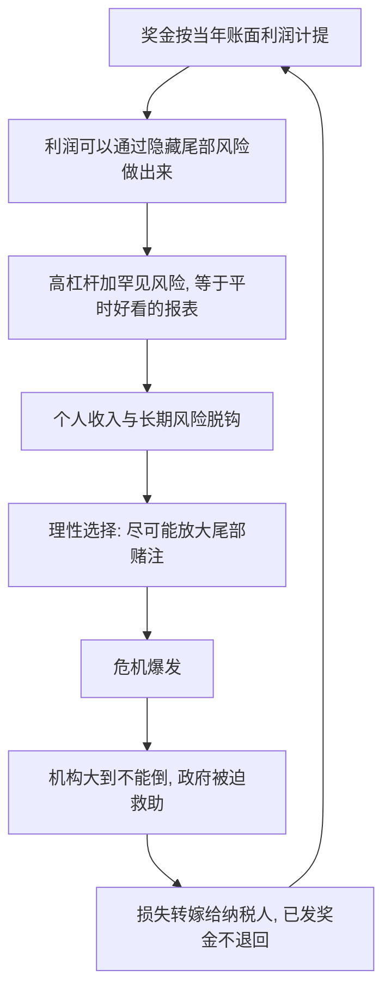

# 03｜「赢了我分钱，输了你买单」是怎么回事？

> 一句话说明本文要解决的问题：为什么塔勒布说现代金融体系最恶劣的发明，是一套让银行家「赚钱归自己、爆仓归纳税人」的结构——这笔交易到底是怎么做成的？

---

## 一、先说结论

「赢了我分钱，输了你买单」指的是一种不对称结构：金融从业者在行情好时用高杠杆博取利润并按比例提成，行情崩盘时损失却由公司、股东、政府乃至纳税人吸收。塔勒布把这套结构称为「鲍勃·鲁宾交易」——收益私有化，损失社会化。它的可怕之处不在于个别银行家贪婪，而在于制度允许尾部风险被系统性地转移给从不参与分红的人。

## 二、我们先理解一个问题

假设有人邀你合伙开赌场，合同规则如下：

赢了，利润他分走一大块；输了，欠下的赌债记在你名下。

你会签这个合同吗？显然不会。可塔勒布指出，现代金融体系里大量岗位的实际合同，本质上就是这样写的——只是换了一套体面的术语：奖金、期权、有限责任、系统重要性、紧急救助。

合同的字面变了，风险的去向没变。

## 三、作者到底提出了什么观点？

塔勒布在书中反复使用一个例子：鲍勃·鲁宾。鲁宾曾任美国财政部长，后进入花旗集团担任高管。历史上，1999 到 2009 年间他从花旗获得的薪酬总额约为 1.2 亿美元；2008 年金融危机爆发，花旗濒临破产，最终由美国政府以数百亿美元的注资和资产担保托底——账单由纳税人支付，而鲁宾已落袋的奖金一分钱不用退。

塔勒布把这个结构命名为「鲍勃·鲁宾交易」：用别人的钱押注尾部风险，赌赢了按年份分奖金，赌输了拍拍手离开。他认为这是现代不对称结构里最典型的形态——不靠欺诈，而是靠制度设计合法完成的财富转移。

## 四、把这个观点翻译成人话

大白话：**赌场荷官按营业额抽成，赌场烧了他不负责。**

再准确一点：这门生意的本质是「卖掉一份你没有资格卖的保险」。银行家用高杠杆赌小概率事件不发生，每一年「不发生」都算他的业绩，奖金照发；等到小概率事件真的发生——它总会发生——窟窿归全社会。

所以他卖的不是理财产品，是一张「末日彩票」：正面他收钱，反面你付钱。

## 五、为什么会这样？

这个结构为什么能稳定运转？塔勒布的拆解大致是：

链条的关键在两个环节。第一是**计奖口径**：奖金按年度利润发放，而「隐藏的尾部风险」能让短期利润显得非常好看——就像一台没装刹车的车，下坡时速度表特别漂亮。第二是**大到不能倒**：一旦机构规模足够大、牵连足够广，它事实上绑架了政府的信用——危机时政府别无选择，只能救。两个环节咬合在一起，就构成了一台自动运转的转移机：收益向上流向个人，风险向下流向公众。

塔勒布强调，这套机制不需要任何人违法。它是被激励结构自动生产出来的——这才是最难治的地方。

## 六、举一个现实生活中的例子

先看「鲍勃·鲁宾交易」的全貌。历史事实是：鲁宾 1999 年离开财政部长职位后加入花旗，职位性质偏顾问，不承担具体交易决策；此后近十年间，花旗大举扩张与住房抵押贷款相关的风险敞口。2008 年危机爆发，花旗股价跌去九成以上，政府注入约 450 亿美元救助资金并为其数千亿美元资产提供担保。鲁宾于 2009 年辞职，他从花旗带走的约 1.2 亿美元收入，没有任何机制可以追回。需要说明的是，一些评论者认为把花旗的灾难归罪于鲁宾个人有失公允——他并非日常经营决策者；但塔勒布的靶子从来不是某个人，而是「巨额奖金加事后免责」这个结构本身。

再看奖金环节。2008 年——华尔街最惨的一年——据纽约州审计长的统计，华尔街证券公司发放的奖金总额仍接近 190 亿美元，其中不少机构当年正在接受政府救助。也就是说，亏损的是股东和纳税人，分红的机器却没有停。

这两个事实拼在一起，「收益私有化、损失社会化」就不再是一句口号，而是一张可以核对的资产负债表。

## 七、回到书中重新理解

回到塔勒布的原话，他对这件事的判断比「贪婪」严厉得多：他认为这是一种**文明级别的腐蚀**。

上一篇讲过，汉谟拉比的逻辑是「谁制造尾部风险，谁吞下尾部风险」。金融体系做的恰恰是反向操作：用「有限责任」「奖金不可追回」「大而不能倒」三层外衣，把尾部风险从制造者身上剥下来，转贴到纳税人身上。塔勒布认为这比犯罪更恶劣——犯罪会被惩罚，而这个结构在当时的规则下几乎完全合法。

他还指出一个隐蔽后果：只要这种结构存在，「隐藏尾部风险」就是理性策略，整个系统会自发积累看不见的风险，直到某一次崩盘集中清算。危机不是意外，是结构的利息。

## 八、这个观点背后还有什么？

第一，背后是**道德风险**这个经济学概念：当一个人的损失被保险或救助覆盖时，他会承担比合理水平更高的风险。塔勒布的贡献是把道德风险从「事后批评」变成「事前诊断工具」：看一个系统健不健康，先问风险转移的方向。

第二，它解释了为什么「监管」经常失效：监管是对着「行为」写的，而这套结构的问题在「激励」。只要奖金—救助的管道还在，堵掉一种金融产品，聪明人会发明下一种。

第三，它埋了一条更深的线：风险转移之所以能成功，靠的是决策者和承担者之间的代理结构——有人替你管钱、替你决策、替你冒险。这条线通向本书另一个核心概念。

## 九、这个观点有问题吗？

塔勒布的批判极有穿透力：2008 年之后「追责为何如此之难」的全民困惑，用他的框架一句话就能解释——结构合法地隔离了责任和后果。

但它也有可以质疑的地方。第一，把危机归因于奖金结构可能过度简化：一些经济学家认为，2008 年的根源更多是评级体系失效、监管套利、全球储蓄过剩等系统性因素，银行家自己同样误判了风险——如果真是「精心设计的收割」，他们不该让自己的机构也濒临破产。第二，「大到不能倒」并非纯粹的阴谋设计，它部分来自金融体系高度关联的客观现实——救不救都不对称，不救可能损失更大。第三，关于鲁宾个人的责任，学界和业界存在不同解释：他的角色更接近顾问而非操盘手，拿他当结构的名字带有修辞色彩。第四，塔勒布开的药方——让风险制造者共担后果——在实操上很难设计：追回奖金的法律机制、区分「运气」与「造假」的举证，都是真实世界里的硬骨头。

所以更准确的读法是：塔勒布的诊断（不对称结构必然积累风险）很强，归因（一切都是结构而非误判）偏单因，处方（恢复对称）方向正确但落地困难。

## 十、今天再看这个观点

以下部分是基于作者思想的现代延伸，不是作者原话。

2008 年之后，监管确实补了一些课：奖金递延发放、追回条款、高管薪酬延期支付、压力测试、更高的资本金要求。这些都可以理解为「把对称性往制度里缝回去一点」的尝试。

但用塔勒布的尺子量，不对称并未消失，只是换了场地：高收益私募、加密金融，以及「大到不能倒」的升级版——「太关联而不能倒」。每当一个新金融物种长成，它都会重新发明一遍「奖金先行、风险后置」的结构。更值得警惕的是，这个结构正在向金融之外扩散：平台经济里，增长期的利润归公司，系统性风险归社会——同一张药方，换个病历还在开。

## 十一、这一篇真正应该记住什么？

1. 「鲍勃·鲁宾交易」等于收益私有化加损失社会化，靠奖金制度和救助预期合法运转。
2. 尾部风险转移的两个机关：按年度利润计奖、大到不能倒。
3. 这个结构不需要坏人，激励会自动生产它；所以修监管不如修激励。
4. 诊断很硬，归因偏单因，处方方向对但难落地。
5. 检验任何金融安排，先问一句：尾部风险最后落在谁身上？

## 十二、留一个问题

把「赢了我分钱，输了你买单」拆开看，你会发现它依赖一个前提：有人替另一些人管钱、管决策、管风险——钱的主人不在场。

那么问题来了：为什么「替别人做决定」这件事本身，就是现代世界最大的风险源之一？下一篇我们进入代理人问题。
