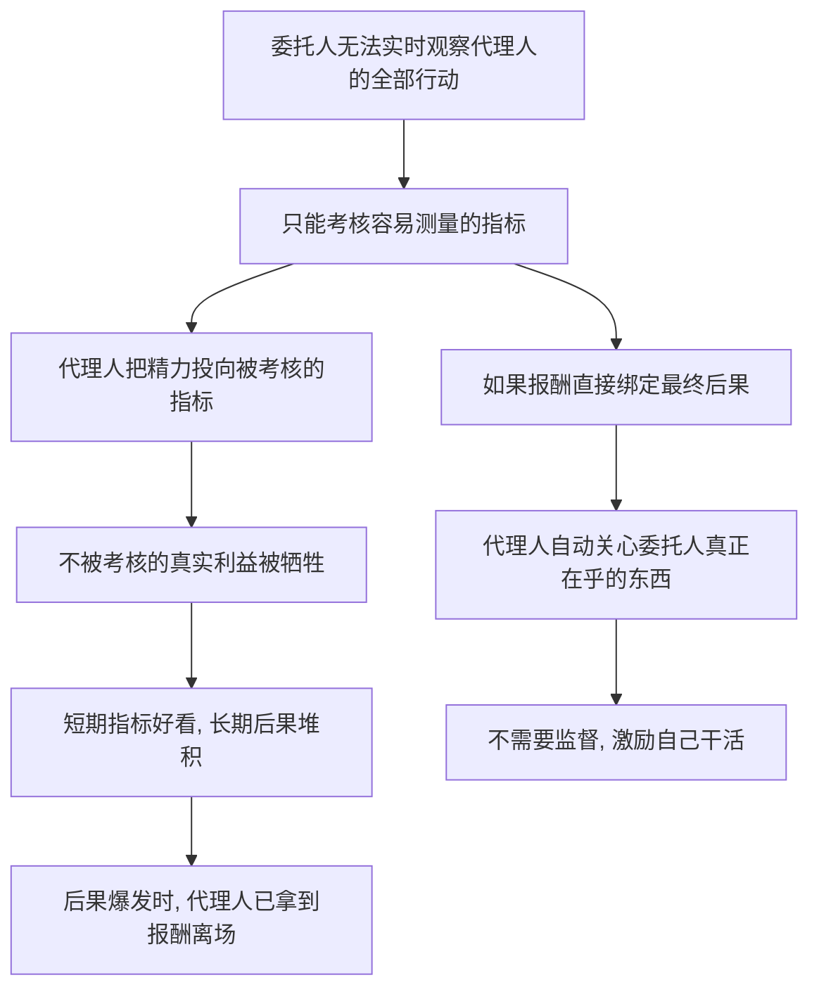

# 04｜代理人问题：为什么替别人做决定最危险？

> 一句话说明本文要解决的问题：为什么塔勒布认为，把决策外包给「专业的人」，是现代世界最普遍也最被低估的不对称结构——代理人到底错在哪？

---

## 一、先说结论

代理人问题的核心是：当一个人替另一个人做决定，而前者不承担决定的后果时，他的行为会系统性地偏离委托人的利益——而且偏离方向永远是「对自己有利」。塔勒布认为，这不是个别的职业道德问题，而是结构问题：只要报酬和结果脱钩，系统就会奖励表演而非结果。利益一致是最便宜的监管；缺了它，再多的监督都是在给不对称打补丁。

## 二、我们先理解一个问题

想象你要卖房子，请了一位中介。

你的利益：卖出尽可能高的价格，为此多花两周等一个更好的买家是值得的。中介的利益：每单抽固定佣金，早成交一天，他就能去接下一单。

现在问题来了：当一个买家出价略低但可以立刻签约时，中介会建议你怎么做？

你的理性算盘和他的理性算盘，在这一刻指向了相反方向。而他掌握信息、掌握话术、掌握谈判现场——你只有一个「相信他专业」的姿势。这就是代理人问题最小的、也最日常的标本。

## 三、作者到底提出了什么观点？

塔勒布认为，现代社会把大量决策外包给了代理人——基金经理替你投资、职业经理人替你经营公司、顾问替你出方案、官员替你制定政策——而几乎所有代理关系都共享同一个结构性缺陷：**代理人的收入取决于「让委托人满意的过程」，不取决于「委托人最终的后果」。**

他进一步指出，代理人问题的危害随层级放大：一个房产中介可能坑你几万块，一个职业经理人可能把一家百年企业的长期健康换成自己任期内的股价，一个政策代理人可能把整个社会的风险换成自己任内的平稳。

塔勒布的结论很硬：任何「我决策、你承担」的位置，迟早会被自利填满——区别只在于填进来的是贪婪还是平庸。

## 四、把这个观点翻译成人话

大白话：**孩子哭不哭不重要，保姆的考核表漂亮就行。**

再展开一点：代理人问题不是「代理人都是坏人」，而是「好人在错位的激励下也会做坏事」。一个完全正直的中介，当他每天面对十次「劝业主降价」和「帮业主死扛」的选择，每次前者都让他更快拿到佣金时——他的建议会一点点漂移，连他自己都察觉不到。

所以问题的根源不在人，在结构：报酬的方向，就是注意力的方向。

## 五、为什么会这样？

为什么报酬一脱钩，行为就必然漂移？逻辑链条如下：

链条的第一步是信息问题：委托人永远看不全代理人在做什么，于是只能考核「可测量的东西」——成交量、季度利润、论文数量。第二步是人性问题：代理人理性地把所有力气用在被考核的指标上。第三步是时间问题：指标是短期的，后果是长期的，等后果出现时代理人早已离场。

塔勒布认为，这三步是结构性的，换谁坐上去都一样。因此治理代理人问题只有两条硬路：要么把后果接回代理人身上（让他入局），要么干脆消灭代理层（让决策者自己干）。中间路线——加强监督——在他看来只是在给不对称结构贴创可贴。

## 六、举一个现实生活中的例子

先看房产中介。经济学研究（《魔鬼经济学》里引用过一个经典统计）发现过一个耐人寻味的现象：中介卖自己的房子时，挂牌时间平均比卖客户的房子长约十天，最终成交价也更高。为什么？因为卖自己的房子，多等十天换来的溢价全归自己；卖客户的房子，多等十天只多几百块佣金，却占用了他接下一单的时间。同一批人、同一套专业技能，只因为「后果归谁」不同，行为就完全不同——这就是代理人问题的教科书式标本。

再看职业经理人。一家上市公司聘请职业经理人经营，股东的长期利益是公司在十年、二十年后的健康；经理的考核却往往挂在季度利润和任期内股价上。理性的经理于是学会了「修剪未来」：砍掉十年后才见效的研发、透支品牌换当期促销、用财务技巧把利润熨平——报表漂亮、期权兑现、任期结束，留下一家「季报很好看、年报在流血」的公司。没有人违法，每一步都「符合程序」，损害却真实发生了。

## 七、回到书中重新理解

现在再看塔勒布对代理人的批判，会发现他真正在意的不是「代理人坏」，而是**代理层天然是不对称的培养皿**。

上一篇讲的金融转移术，能运转的前提正是代理结构：钱的主人不亲自下场，操盘的手和承担后果的人分离。塔勒布在书中把代理人问题和风险转移连成一条因果链——先有「替别人做决定」的位置，才有「把代价转给别人」的空间。位置生产行为，不是人品生产行为。

所以他给的判别法极其简单：看一个人的意见可不可信，先看他是不是代理人；看一个制度安不安全，先数它有几层「决策与后果分离」的结构。

## 八、这个观点背后还有什么？

第一，背后是一个更老的经济学谱系：委托—代理理论。关于这一问题，学界有不同侧重——主流经济学把它视为「信息加激励」的技术问题，可以通过合同设计缓解；塔勒布则更激进，他认为只要代理层存在，不对称就永远堵不完，真正可靠的只有「入局」和「撤销代理」。

第二，它解释了为什么「专业」有时是负资产：专业给了代理人更高的信息壁垒，让委托人更难监督——专业越深，委托人被关得越远。

第三，它暗含一个组织设计原则：层级越多，决策与后果分离的环节越多，系统性风险越大。扁平不只是效率问题，还是责任问题。

## 九、这个观点有问题吗？

它的说服力很强：从房产中介到公司治理，「报酬方向决定注意力方向」几乎每次都能对上号，而且「利益一致」确实是比监督便宜得多的机制。

但批评也不少。第一，它有过度简化之嫌：代理问题并非无解，声誉机制、竞业约束、长期递延薪酬、法律上的信义义务都在真实世界里部分有效——一些学者认为，把代理人描绘成「必然自利」低估了制度修补的空间。第二，它低估了代理存在的理由：分工是现代文明的引擎，「消灭代理层」等于消灭专业化——你不可能亲自给自己做心脏手术。第三，利益绑定本身也有副作用：让经理持股可能诱发更隐蔽的报表操纵，让中介按房价分成可能推高交易成本——绑定的设计比绑定的口号难得多。第四，塔勒布的框架对「代理人蓄意自利」解释力强，对「代理人真诚但能力不足」的情形几乎不说话，而后者在现实中可能更常见。

所以更准确的读法是：代理人问题是一个「衰减器」而非「开关」——入局能大幅减少偏离，但不能归零；消灭代理能根除偏离，但代价是放弃分工。真实世界的解永远在两者之间权衡。

## 十、今天再看这个观点

以下部分是基于作者思想的现代延伸，不是作者原话。

今天，代理层正在以新的形态扩张。推荐算法替用户决定「看什么」、理财顾问替客户决定「买什么」、智能助手开始替人做具体决策——每一层便利都在加深「决策与后果的分离」。算法代理人的不对称比人类代理人更彻底：它连「怕追责」的神经末梢都没有。

同时，「让代理人入局」的实验也在发生：创始人持股、医生随访责任制、基金经理强制跟投、咨询费与结果挂钩的对赌条款。这些尝试的共同点是承认塔勒布的前提——与其监督代理人，不如重接他的后果线。但到目前为止，这些都还是补丁级的修补，离「利益一致成为默认设置」还很远。

## 十一、这一篇真正应该记住什么？

1. 代理人问题等于决策者与后果承担者分离，偏离方向永远朝代理人有利的方向。
2. 根源在结构不在人品：考核什么就得到什么，报酬的方向就是注意力的方向。
3. 治理只有两条硬路：让代理人入局，或撤销代理层；监督只是创可贴。
4. 代理有存在的理由，完全消灭等于放弃分工——真实解是权衡而非口号。
5. 判断一个人可不可信，先问：他在这个位置上，是代理人还是当事人？

## 十二、留一个问题

代理人问题解释了「替别人做决定」为什么会出事。但还有一类人比代理人更隐蔽：他们不替你做决定，却热衷于告诉你「应该怎么活、世界应该怎么管」——不承担后果，却自信满满地开处方。

塔勒布给这类人起了一个名字：「白知」（Intellectual Yet Idiot）。下一篇我们看，为什么他认为高学历恰恰是这类症状的高发区。
