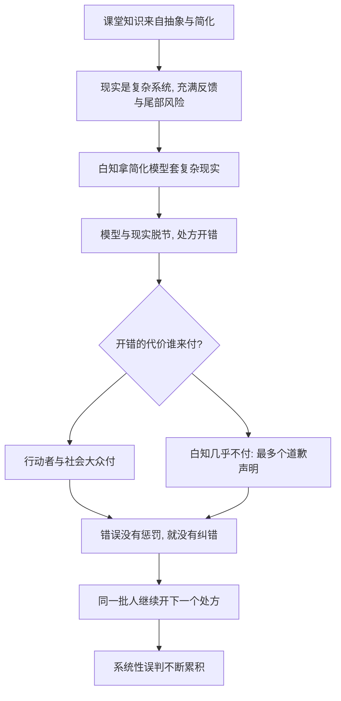

# 05｜什么是「白知」，为什么高知反而看不懂现实？

> 本文要解决的问题：塔勒布所说的 IYI（有知识的白痴）到底错在哪里，为什么受过良好教育的人反而常常看不懂真实世界？

---

## 一、先说结论

「白知」是塔勒布造的一个词，英文叫 Intellectual Yet Idiot，直译是「有知识的白痴」：一个人学历很高、引经据典、谈吐优雅，但对现实世界的判断却系统性地糟糕。塔勒布认为，白知的问题不在于无知——他们的知识量往往惊人——而在于他们坐在一个**不承担后果的位置上，给必须承担后果的人开处方**。理论和现实之间隔着的不是智力，而是一层风险。没有经过代价检验的知识，只是纸面知识；白知的愚蠢，是结构性造成的愚蠢。

## 二、我们先理解一个问题

先想象一个场景。

你开了一家小餐馆，经营困难。两个人来给你出主意：一个是商学院教授，发过几十篇关于餐饮企业管理的论文，自己一天餐馆也没开过；另一个是街对面开了四十年面馆的老太太，没读过多少书，但经历过三次经济衰退、两次疫情，店还活着。

你愿意听谁的？

多数人本能地会选老太太——至少会让她的话占更大的权重。可奇怪的是，一旦场景放大到宏观经济、教育改革、公共卫生，人们就开始崇拜前者：让从没在市场中押过一分钱的人教企业家怎么活，让从没承担过后果的人教全社会怎么做。塔勒布发明「白知」这个词，就是要描述这种错位的权威。

## 三、作者到底提出了什么观点？

塔勒布认为，IYI 不是「聪明反被聪明误」的个案，而是一类人，有清晰的识别特征：

第一，他们把现实当成课堂习题。复杂系统在他们眼里是可以套用模型的对象，只看得懂一阶效应，看不懂二阶、三阶的连锁反应。

第二，他们用书本判断世界，而不是用世界检验书本。塔勒布的原话大致是：白知「分不清真实与抽象，搞不懂为什么会有人不按模型行事」。

第三，也是最关键的，他们**从不为自己的判断下注**。预测错了，写篇文章反思一下就算交差；处方开砸了，代价由别人付。塔勒布认为，一个人知识再多，只要没有入局，他的判断就没有经过现实这台机器的碾压，可靠性存疑。

在塔勒布看来，真正的知识有一个源头：试错加代价。厨师的手艺是被烫伤和差评磨出来的，交易员的眼光是被爆仓和盈利磨出来的——而白知的「知识」绕过了这道工序。

## 四、把这个观点翻译成人话

用一句大白话说：**会做题，不等于会做事。**

白知就像一个只读过《游泳教程》的人，站在岸上点评泳姿。他说得头头是道，动作要领一条不落，可他自己从来没下过水。你问他为什么不下去，他说：我的工作是研究，不是游泳。

这话单听没错。问题在于，岸上的人如果错判了水流的危险，呛水的是水里的人，不是他。

生活中我们有更糙的说法：站着说话不腰疼。塔勒布做的，是把这句俗话升级成了一套诊断工具：一个人离地越远、离后果越远，他嘴里吐出来的话就越要打折扣——与他的学位、口才、头衔无关。

## 五、为什么会这样？

塔勒布的推理链条是这样的：

这套机制的根源有两层。

第一层是**筛选错位**。教育系统筛选的是「在封闭问题里答对」的能力：题目有标准答案，答错扣几分，仅此而已。而现实世界是开放问题：没有标准答案，答错可能出局。两种能力相关，但绝不是一回事。一个系统如果把前者当成后者的凭证，就会批量生产「纸上很强、落地很弱」的权威。

第二层是**反馈缺失**。风险共担之所以是纠错机制，靠的是「疼」。白知的问题不是不聪明，而是收不到疼的信号——模型错了，他不用赔钱；政策砸了，他不用搬家。没有疼，就没有校准，错误会理直气壮地复利下去。

## 六、举一个现实生活中的例子

先看吃饭这件事。

过去几十年，专业营养学界开出的官方食谱翻了好几次车。历史上，营养学界曾长期推荐用人造黄油替代天然黄油，理由是饱和脂肪有害——这是写进多国膳食指南的专业意见。后来的研究发现，人造黄油里的反式脂肪对心血管的危害比黄油更大。处方开错了几十年，买单的是按指南吃饭的普通人。

再看意大利祖母的家常菜。她的菜谱没有引用任何文献，橄榄油、番茄、应季蔬菜、适量红酒，怎么做全凭手感。但塔勒布认为，这套方案经过了几代人的「时间筛选」：吃下去出问题的人没有机会把菜谱传下来，传下来的菜谱本身就是生存证据。营养学家的模型可能被一次研究推翻，祖母的菜谱已经被几百年的重复博弈检验过。这不是说祖母永远对，而是说：**有代价压在上面的知识，和没有代价压在上面的知识，含金量不同。**

再看预测。2016 年是精英预测的灾难之年。历史事实是：英国脱欧公投前，主流民调、智库、财经媒体几乎一致预测留欧派获胜，结果脱欧派胜出；同年美国总统大选，绝大多数民调模型与媒体评论员认为希拉里·克林顿胜算极高，结果唐纳德·特朗普当选。这是集体性的、跨机构的翻车。

更值得玩味的是事后。预测错得离谱的评论员们，没有一个人因此失去工作、赔掉身家或被行业除名。他们写了几篇「我们为什么错了」的检讨，然后继续预测下一场选举。塔勒布会说：这就是典型的白知结构——**错误的成本是零，所以错误可以无限续杯。**

## 七、回到书中重新理解

现在再看塔勒布给 IYI 画的像，就清楚多了。他在书中写道，白知「搞不清一阶逻辑与二阶效应的区别」「从未在风险中做过决定」「把复杂当成高级的托词」。

要注意的是，塔勒布批判的不是知识本身，而是**无代价的处方权**。他自己受过极好的教育，精通数学、多种语言和古典文献——他不是反智，他是反对「学位自动兑换成对现实的发言权」。在他的体系里，知识的合法性来源只有一个：持有者愿不愿意、有没有为它付出过代价。

所以「白知」这个词的真正锋芒不在于嘲笑蠢人，而在于揭示一种制度漏洞：我们的社会给「会说话的人」发放了过量的信用，却没有要求他们为信用兑付任何东西。

## 八、这个观点背后还有什么？

白知批判背后藏着三个更深的东西。

第一，是两种知识的区分。古希腊人早就分过：episteme（书本知识、可言传的理论）和 phronesis（实践智慧、只能在做事中获得的判断力）。塔勒布认为现代社会系统性地高估前者、贬低后者，而真实世界恰恰由后者主宰。祖母赢营养学家的原因，不是祖母更聪明，是她的知识类型更靠近现实。

第二，是「离地性」这个概念。白知的愚蠢不是天生的，是位置造成的：一个人离后果越远，他的判断就越飘。这意味着白知是一种**位置病**——把同一个聪明人放进必须自己买单的位置，他的判断会迅速变得接地气。

第三，白知是通往下一层的入口。给本国企业家开错处方，代价还相对可控；如果这群不担后果的人，把处方开到别国的土地上——替别人设计战争、革命和国家重建——会发生什么？这就是干预主义的问题，也是塔勒布炮火最猛的地方。

## 九、这个观点有问题吗？

有说服力的地方很扎实：专家预测的记录确实糟糕。一些学者的研究——如心理学家菲利普·泰特洛克对数百名专家数十年预测记录的追踪——显示，在复杂政治经济问题上，专家的长期预测准确率并不比普通人的粗略判断高明多少。而「不担后果就没有纠错」这个机制，几乎在所有出过大事故的领域都能得到验证。

但争议也不小。

第一，「白知」的定义太滑。它没有可检验的边界，几乎可以用来攻击任何塔勒布不同意的知识分子，批评者认为这让概念带上了人身攻击的色彩——谁是白知，最后由塔勒布说了算。

第二，可能过度贬低专业知识。流行病学、工程学、基础医学里有大量经得起检验的知识，并不能用「你没下过水所以闭嘴」一概打发。新冠疫情中，恰恰是「离地」的实验室科学家拿出了疫苗——纸上知识有时候真能救命。

第三，祖母的菜谱也不是免死金牌。传统饮食经过时间筛选，说的是「吃了没有立刻死人」，但一些传统习惯——高盐腌制、反复油炸——的慢性伤害，恰恰需要现代研究才能识别。时间筛选能排除急性毒药，未必能排除慢性毒药。

第四，预测翻车可能有别的解释：政治预测本身是被预测对象会读、会反应的混沌系统，难度天然极高。把一切归咎于「离地」，可能简化了问题。关于专家为何屡屡失准，学界存在不同解释，塔勒布的「无代价处方」是其中一种，不是唯一一种。

## 十、今天再看这个观点

以下部分是基于作者思想的现代延伸，不是作者原话。

放到今天，「白知问题」不是缓解了，而是放大了。社交媒体给每个人发了一张免费的评论员执照：任何人都可以对战争、疫情、经济发表断言，预测错了删掉帖子就好。这是一个把「离地性」工业化的系统——塔勒布批判的智库评论员，至少还有同行评议这道弱约束，而流量时代的意见生产连这道约束都没有。

AI 则把这个矛盾推到了极端。一个大语言模型拥有人类历史上最大的「书本知识量」和精确为零的后果承担：它开错处方不会疼，给错建议不会赔。用塔勒布的尺子量，AI 是终极形态的 IYI——知识满分，入局零分。这不意味着 AI 的建议一概不能听，而是提醒我们：听一个没有皮肤在游戏里的智能体的建议时，折扣率该由你来定，因为代价由你来付。

## 十一、这一篇真正应该记住什么？

1. 白知（IYI）= 有知识的白痴：问题不是无知，而是在不担后果的位置上给行动者开处方。
2. 理论与现实之间隔着一层风险；没有经过代价检验的知识是纸面知识。
3. 教育系统筛选的是「答对题」的能力，现实要求的是「活下去」的能力——两者相关但不同。
4. 没有疼就没有校准：错误的成本为零时，错误可以无限续杯。
5. 白知是一种位置病，不是智力病——离地性造就愚蠢，入局能部分治愈它。

## 十二、留一个问题

下一次你听一位专家——经济学家、营养学家、政治评论员——给出斩钉截铁的建议时，不妨多问一句：如果他的建议错了，他本人会失去什么？如果答案是「什么都不会失去」，你该怎么给他的权威打折？

而如果把这个问题再放大一级：当不担后果的人不止给本国人开处方，而是替别的国家决定战争与革命——把火点到别人的国土上，自己却隔岸观火——会发生什么？下一篇我们去看塔勒布炮火最集中的目标：干预主义者。
