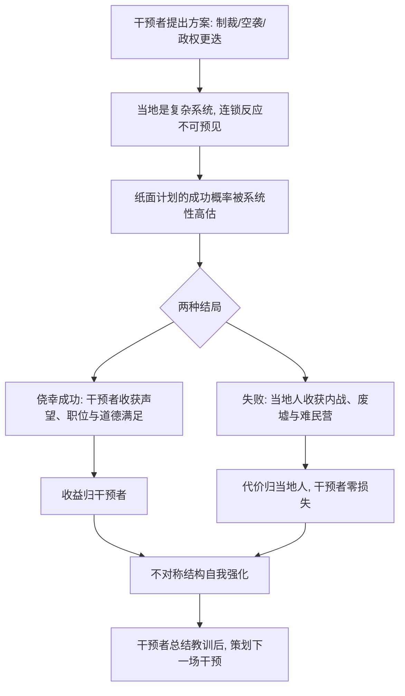

# 06｜干预主义的陷阱：为什么把风险转嫁给别人最可疑？

> 本文要解决的问题：为什么那些打着「为了你好」旗号的干预，常常在别人的土地上留下收拾不了的烂摊子？

---

## 一、先说结论

塔勒布认为，干预主义者是「白知」的行动版：他们替别人点燃冲突、设计革命、规划重建，自己却不必承担战火。这种结构的要害在于**尾部风险的外包**——干预成功了，声望和道德满足归干预者；干预失败了，内战和废墟归当地人。正义的外衣下，往往藏着一笔不对称的账。判断一场干预可不可信，塔勒布给的尺子很粗暴：如果失败了，提议干预的人要付出什么代价？答案是零，那么这场干预多半值得怀疑。

## 二、我们先理解一个问题

先想象一个场景。

你隔壁住着一户人家，夫妻俩天天吵架。你看不下去，冲进去主持正义：替他俩定规矩、分家产、摔了几件家具、甚至替他们打了对方一顿。然后你拍拍手回自己家睡觉了——他们家满地的碎玻璃、撕破的脸、回不去的婚姻，全部由他们自己收拾。

你主持正义的成本是零，他们承担的成本是全部。

荒唐吗？可这正是塔勒布眼中现代国际干预的基本结构：决定干预的人住在安全的远方——智库的报告、议会的投票、电视上的义愤，全都发生在炮弹落不到的地方；而承担后果的人，住在废墟里。「为了你好」是这个世界上最便宜的口号，因为说好话不要钱，而听话的人可能要付命。

## 三、作者到底提出了什么观点？

塔勒布对干预主义的批判有几个层次。

第一，他指认了一种结构性错位：**点火的人不负责救火**。主张军事干预的学者、记者、政客，无论干预结果如何，个人处境几乎不受影响；而干预地区的普通人，要承受政权垮台后的全部连锁反应——权力真空、教派仇杀、经济崩溃。收益与风险的分配是彻底不对称的。

第二，他给「干预资格」立了一条血淋淋的门槛。塔勒布在书中表达过这样的意思：一个人只有愿意把自己的孩子送上战场，才有资格谈论战争。这不是残忍，而是对称性检验——你的信念如果真的那么正义，你应该愿意为它押上你最珍贵的东西。押不上，说明你的正义感只是口头消费。

第三，他把干预主义与风险共担直接挂钩：干涉他国内政而不承担后果，是「用别人的血来实践自己的道德」。在塔勒布的分类学里，这和拿客户的钱豪赌的银行家是同一物种——不对称结构里的寄生者，只是猎场不同。

## 四、把这个观点翻译成人话

用一句大白话说：**谁点火，谁得留下来扑火；点完就走的，多半是纵火犯。**

再换一个说法：「为了你好」这句话本身什么也证明不了，真正的问题是——如果这个「好」没兑现，你赔不赔？

生活中这个直觉其实很常见。亲戚劝你「这房子闭眼买，肯定涨」，你问他买亏了补不补差价，他立刻改口「投资嘛，总是有风险的」。医生自己绝不做的手术方案，却劝病人「值得试试」。干预主义者干的是同一件事，只是规模放大到了一个国家：他们推销的是一个国家的命运，收的却是自己口袋里的声望。

## 五、为什么会这样？

塔勒布描绘的机制是这样的：

为什么这种结构能持续运转？有三个原因。

第一，**道德语言的免费性**。以「保护平民」「推广民主」为名的干预，占据了道德高地，质疑者先要背负「冷血」的嫌疑。用高尚的目的做包装，是掩盖不对称最便宜的办法。

第二，**复杂系统不可远程操作**。一个国家的部落结构、教派恩怨、经济生态，是几百年长出来的混沌网络。坐在万里之外会议室里的人，拿到的信息是简报级别的，做出的决定却是生死级别的——信息不对称叠加风险不对称，错判几乎是必然。

第三，**失败没有反噬机制**。市场会清算做错交易的交易员，时间会淘汰盖危楼的建筑师，可干预错了的政客和智库学者，最重的惩罚不过是写一份反思报告。没有清算，就没有学习；没有学习，同一种错误会换个地名重演。

## 六、举一个现实生活中的例子

先看国际层面。2011 年，北约以「保护平民」的名义对利比亚发动军事干预，帮助反对派推翻了卡扎菲政权。这是历史事实：干预本身在军事上迅速成功，但随后利比亚陷入长期内战——政权真空被民兵组织、部族武装和极端势力瓜分，国家分裂成东西两个政府，甚至出现了公开的人口买卖市场。十多年过去，利比亚至今没有恢复成一个正常运转的国家。

而那些当年在报刊上、议会里力主干预的人呢？没有人为此负责。没有政客下台，没有学者退出公共讨论，没有人赔偿利比亚人一分钱。塔勒布会说：这就是「尾部风险外包」的教科书——干预者拿走了「做了正确的事」的道德红利，把最坏的可能性整个打包，寄给了的黎波里的街头。

再看一个温和得多的例子：城市设计。上世纪大量自上而下的城市规划，设计师按照图纸上的美学与效率原则，建起了整齐划一的高层住宅区。结果很多这样的小区变成了犯罪高发、社区感全无的水泥森林——历史事实表明，二十世纪中后期欧美多座大型公共住宅区因彻底失败而被炸毁拆除。关键在于：设计师从来不住自己设计的小区。他收完设计费去住独栋洋房，居民却要在反人性的动线和无人维护的电梯里住三十年。批评者简·雅各布斯早就指出过这个病灶：规划师的权利建立在对结果的豁免之上。

这两个例子的结构一模一样：**设计者离场，居住者埋单。**

## 七、回到书中重新理解

现在再看塔勒布的立场，就清楚他不是「和平主义者」那么简单。他的规则是：**干预的资格要用风险来购买。**

如果你认为某场干预正义到必须发动，那么请把你自己的东西押进去——你的孩子、你的财产、你的声誉。押进去了，你的主张至少经过了对称性检验；押不进去，你的正义感只是成本为零的情绪消费。

反过来说，塔勒布也不是主张永远袖手旁观。他反对的是「无代价的干预」，不是一切介入。维和人员自己在场、援助者自己扎根当地、商人把身家投进重建——这些是有入局的介入，性质完全不同。区分标准始终只有一条：最坏的结果来了，你疼不疼？

## 八、这个观点背后还有什么？

干预主义批判背后，藏着三层更深的东西。

第一，**责任梯度原则**。在塔勒布的体系里，发言权应该按「离后果的远近」分配：住在废墟里的人对废墟最有发言权，住在安全会议室里的人最没有。这几乎是对现代专家治理的颠覆——现代制度恰恰是反过来的：离后果最远的人（总部、首都、智库）拥有最大的决定权。

第二，**正义幻觉的解剖**。塔勒布认为，道德修辞是掩盖不对称的最佳迷彩。一笔账如果摆在桌面上——我赚声望，你担风险——没人会签；但只要套上「人道主义」「历史责任」的外衣，同一笔账就能通过议会表决。识别不对称的第一步，是学会把道德语言翻译回利益结构。

第三，这是对「白知」批判的落地。上一篇里，白知的处方还开在本国的课堂和报刊上；这一篇里，处方开到了别人的国土上。同样的离地性，代价的计量单位从「错误」升级成了「人命」。塔勒布的怒火之所以在这一章最旺，是因为这是不对称结构里代价最悬殊的一种。

## 九、这个观点有问题吗？

有说服力的地方相当硬：利比亚、伊拉克的案例摆在眼前，干预者零代价、当地人全盘埋单的结构清晰得近乎残酷。「点火者不负责救火」确实戳中了现代干预机制的病灶。

但争议同样不小。

第一，**不干预也有代价**。1994 年卢旺达大屠杀期间，国际社会选择了不干预，八十万人死于屠刀之下。不干预主义者同样零代价——他们也没有为不作为负责。批评者会问：如果「不担后果就别说话」适用于干预派，是否也该适用于旁观派？「不做决定」本身也是一种决定，同样有尾部风险。

第二，干预记录并非全黑。一些学者认为，二战后的马歇尔计划、对波斯尼亚战事的介入等，都算得上干预取得正效果的案例；关于干预主义的整体成败账，学界存在不同解释，很难一句话盖棺。

第三，塔勒布的标准在现实政治里无法操作化。「让孩子上战场才配谈战争」是震撼人心的修辞，但现代国家是代议制，总统和议员不可能亲自参战——按这个标准，任何军事决策都不合法，包括必要的自卫与人道救援。

第四，可能过度简化了动机。并非所有干预主张都是道德表演：有些倡议者真诚相信不行动的代价更大，有些干预确实由当地民众的呼救推动。把一切干预都归入「寄生结构」，可能误伤那些真正两难中的人道主义者。

所以更准确的读法是：塔勒布的尺子能量出不对称，但量不出全部真相——它告诉你「该怀疑什么」，不能替你回答「该怎么做」。

## 十、今天再看这个观点

以下部分是基于作者思想的现代延伸，不是作者原话。

无人机和远程精确打击技术，把干预者的代价压到了历史新低：操作员在内华达的空调房里执行任务，下班后开车回家吃晚饭。战争对干预一方来说，正变得像一场电子游戏——而风险不对称达到了人类战争史上的峰值。

社交媒体又制造了一种新型干预：键盘干预主义。转发某国革命的口号、给远方的冲突选边站队、用标签施压他国政府——表达者的成本为零，被鼓动者付出的是真实的人生。按塔勒布的框架，这是把「道德消费」做到了零边际成本的时代。

还有一个延伸是国际援助产业。大量援助项目的设计者按「项目完成率」而非「当地长期结果」领功，项目烂尾的代价由受援社区承担。同样的结构，换了一身慈善的外衣。

## 十一、这一篇真正应该记住什么？

1. 干预主义者 = 白知的行动版：替别人点火，自己不担战火。
2. 核心病灶是尾部风险外包：声望归干预者，废墟归当地人。
3. 「为了你好」什么也证明不了；要问的是：如果没兑现，你赔不赔？
4. 干预的资格要用风险来购买——不押上自己最珍贵的东西，就别替别人决定命运。
5. 塔勒布的尺子量得出不对称，量不出全部真相：不干预同样有代价，两难不会因一把尺子消失。

## 十二、留一个问题

下一次你看到一场以「正义」「人道」「责任」为名的行动倡议时——无论来自政府、媒体还是你身边热情的朋友——不妨先算一笔账：如果事情搞砸了，代价的账单会寄到谁家？如果收件人不是倡议者本人，这份正义要打几折？

而不对称的魔力还不止于此。它不光能把风险转嫁给别人，还能反过来书写规则本身——为什么美国超市里绝大多数饮料，都印着一种只有百分之二人口真正需要的认证标志？下一篇我们去看塔勒布最精妙的一个发现：少数派统治。
